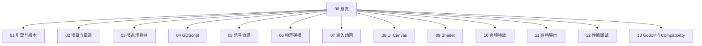

# Godot 学习 · 知识总览

Godot 引擎系统学习笔记（Godot **4.x**，兼顾你当前项目 **4.4.1 + GL Compatibility**）。  
风格对齐本库其它模块：可口述、可查阅、带对照表与易错点。

查题见 [[14-题单总索引]]。

## 知识地图

| 节点 | 内容 |
| --- | --- |
| [[01-引擎定位与版本选型]] | 开源、2D/3D、版本锁定、与 Unity/UE 对比 |
| [[02-编辑器与项目结构]] | 场景/脚本/资源约定、Autoload、godot 缓存 |
| [[03-节点与场景树]] | Node 树、实例化、生命周期、组、唯一名 |
| [[04-GDScript基础]] | 类型、await、类名、静态类型、与 C# |
| [[05-信号资源与数据流]] | signal、Resource、.tres/.tscn、依赖 |
| [[06-物理与碰撞2D]] | CharacterBody2D、Area、层掩码、移动平台 |
| [[07-输入系统与动画]] | InputMap、AnimationPlayer、Tween |
| [[08-UI与Canvas层]] | Control、CanvasLayer、锚点、主题 |
| [[09-着色器入门]] | canvas_item、Compatibility 限制、屏幕特效 |
| [[10-音频对象池与特效]] | AudioStreamPlayer、对象池、特效场景 |
| [[11-存档加密与多平台导出]] | user://、加密、Windows/mac/Android/Web |
| [[12-性能调试与常见坑]] | Profiler、卡顿、白屏、信号报错 |
| [[13-Godot4迁移与Compatibility]] | 3→4、渲染后端、导出必须同版本 |
| [[14-题单总索引]] | 题目对照 |

## 建议顺序

1. 01 → 02 → 03（建立心智模型）  
2. 04 → 05 → 06 → 07（能做出可玩原型）  
3. 08 → 09 → 10（表现力）  
4. 11 → 12 → 13（上线与排障）  
5. 查漏：[[14-题单总索引]]  

## 与本库其它模块

- 对比「引擎选型 / 内存 / 并发」时可联想到 [[../JVM/00-知识总览|JVM]]、[[../Go基础/00-知识总览|Go基础]]，但 Godot 侧重**场景树 + 帧循环**，不是 JVM 那套。  
- 项目实战仓库：`primordialKalpa`（玄黄劫纪）可作为案例对照。
