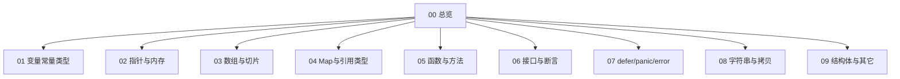

# Go 基础 · 知识总览

Go 语言基础面试专题（详细口述版）。查题见 [[10-题单总索引]]。  
与 [[../Java基础/00-知识总览|Java基础]] 中「Java vs Go」互补。

## 知识地图

| 节点 | 内容 |
| --- | --- |
| [[01-变量常量与基础类型]] | :=、缺省值、rune/byte、常量、枚举、空结构体 |
| [[02-指针与内存]] | 指针意义、栈堆、返回局部指针、选择器解引用、私有成员 |
| [[03-数组与切片]] | 异同、扩容、传参、nil/空、append、make |
| [[04-Map与引用类型]] | get、无序、扩容、nil、set、值不可寻址 |
| [[05-函数方法与闭包]] | 闭包、多返回、init、T/*T 方法集、无默认参数 |
| [[06-接口与类型断言]] | 接口实现、断言是否拷贝 |
| [[07-defer-panic-error]] | defer 顺序/快照/循环、panic/recover、异常 |
| [[08-字符串与拷贝]] | 深浅拷贝、string↔[]byte、零拷贝、中文翻转 |
| [[09-结构体语法与其它]] | tag、struct 比较、switch、Java 对比等 |
| [[10-题单总索引]] | 题目对照 |

## 建议顺序

1. 01 → 02 → 03 → 04（数据与内存）  
2. 05 → 06 → 07（函数与错误模型）  
3. 08 → 09 → 10  
