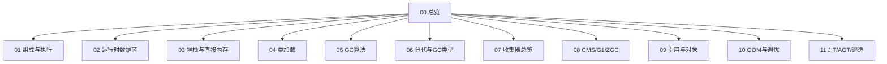

# JVM · 知识总览

Java 虚拟机面试专题（**加厚口述版**）：内存、类加载、GC、收集器、排查、JIT。

查题：[[12-题单总索引]]  
类加载亦可对照 [[../Java基础/11-类加载与双亲委派|Java基础·类加载]]。

## 知识地图

## 建议精读顺序（面试权重）

1. **[[02-运行时数据区]] → [[03-堆栈与直接内存]]**（必问）  
2. **[[05-GC基础与算法]] → [[06-分代与GC类型]] → [[08-CMS-G1-ZGC详解]]**（区分度）  
3. [[04-类加载与双亲委派]] → [[10-OOM泄漏与调优排查]]  
4. [[09-引用与对象创建存储]] → [[11-JIT-AOT与逃逸分析]]  

## 节点一览

| 节点 | 你会讲到 |
| --- | --- |
| [[01-组成与执行流程]] | JVM/跨平台/架构图/混合执行 |
| [[02-运行时数据区]] | PC/栈帧/堆分代/元空间/常量池 |
| [[03-堆栈与直接内存]] | 堆栈对比、Xss、局部变量安全、直接内存、TLAB/PLAB |
| [[04-类加载与双亲委派]] | 委派、链接三步、时机、JPMS、并发初始化 |
| [[05-GC基础与算法]] | Roots、三大算法、三色、写屏障、卡表 |
| [[06-分代与GC类型]] | 分代假说、Eden/S0/S1、Young/Full/Mixed 触发 |
| [[07-垃圾收集器总览]] | 收集器矩阵、组合限制、RSet、G1 vs CMS |
| [[08-CMS-G1-ZGC详解]] | CMS 阶段与 CMF、G1 Region 流程、ZGC |
| [[09-引用与对象创建存储]] | 四引用、对象头、new 全过程 |
| [[10-OOM泄漏与调优排查]] | OOM 类型、泄漏、dump、CPU、参数与工具 |
| [[11-JIT-AOT与逃逸分析]] | 热点、Code Cache、AOT、逃逸三优化 |
| [[12-题单总索引]] | 题单对照 |
