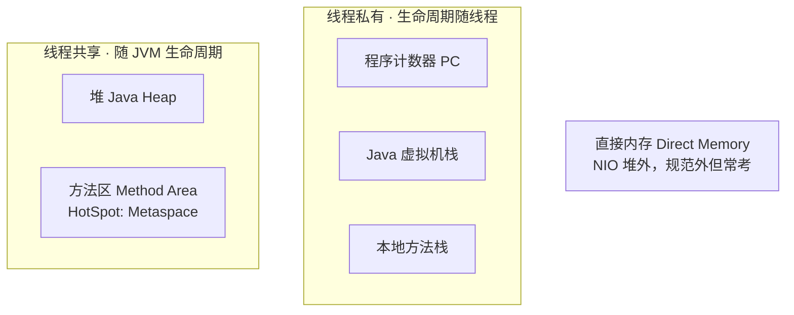
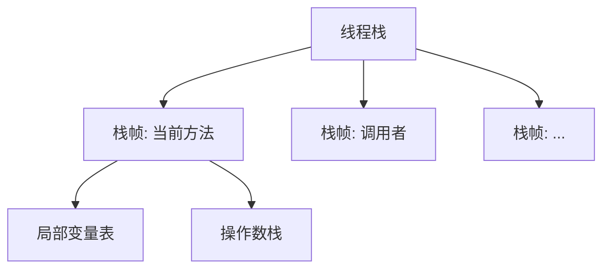
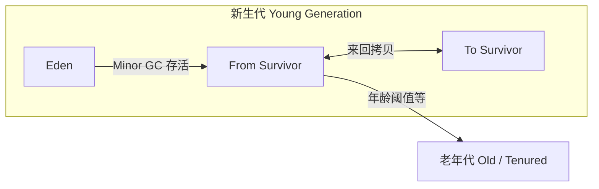
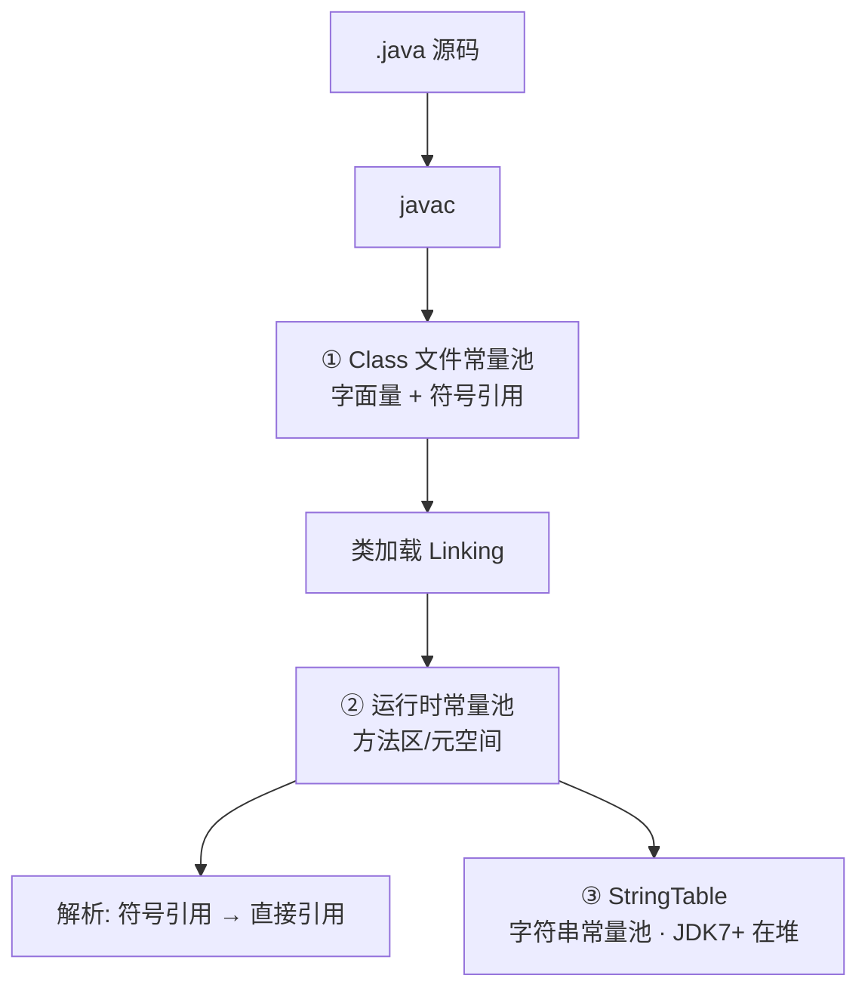

# 02 · 运行时数据区（详解）

> 目标：每一块「存什么、线程私有还是共享、会不会 OOM、和 GC 关系」都能展开。

---

## 总览图



---

## 面试题

### Q1. 详细介绍 JVM 内存区域划分

按「私有三件套 + 共享两件套 + 直接内存」讲，并各举一个溢出例子。

| 区域               | 共享  | 内容               | 异常                |
| ---------------- | --- | ---------------- | ----------------- |
| PC Register程序计数器 | 私有  | 字节码行号            | 不会 OOM            |
| 虚拟机栈             | 私有  | 栈帧               | SOE / OOM         |
| 本地方法栈            | 私有  | native 帧         | 同左                |
| 堆                | 共享  | 对象/数组            | heap space OOM    |
| 方法区/元空间          | 共享  | 类元数据、运行时常量池等     | Metaspace OOM     |
| 直接内存             | OS  | DirectByteBuffer | Direct buffer OOM |

---

### Q2. 程序计数器是什么？为何私有？为何不会 OOM？

**是什么：** 当前线程执行的字节码指令地址指示器。执行本地方法时，规范里 PC 值无定义（undefined）。

**为何私有：**  
CPU 核心在多个线程间切换。每个线程必须有自己的「程序位置」，否则切换回来不知道执行哪条指令——类似 CPU 的 IP 寄存器，但是**线程级**的。

**为何不会 OOM：**  
规范明确它是一块较小的内存空间，只存一个地址/关联值，不动态扩展成无界结构，**唯一规定不抛 OutOfMemoryError 的区域**。

java虚拟机对于多线程是通过线程轮流切换并且分配线程执行时间。
在任何的 一个时间点上，一个处理器只会处理执行一个线程，如果当前被执行的这个线程 它所分配的执行时间用完了【挂起】。
处理器会切换到另外的一个线程上来进行 执行。并且这个线程的执行时间用完了，接着处理器就会又来执行被挂起的这个 线程。 
那么现在有一个问题就是，当前处理器如何能够知道，对于这个被挂起的线 程，它上一次执行到了哪里？那么这时就需要从程序计数器中来回去到当前的这 个线程他上一次执行的行号，然后接着继续向下执行。
程序计数器是JVM规范中唯一一个没有规定出现OOM的区域，所以这个空间也 不会进行GC。

---

### Q3. 虚拟机栈详解？栈帧里有什么？为何私有？

每个线程一个栈；每次方法调用压入一个 **栈帧 Frame**，返回则弹出。

**栈帧组成：**

| 部分 | 作用 |
| --- | --- |
| 局部变量表 | 存放 this、方法参数、局部变量（基本类型或引用） |
| 操作数栈 | 字节码运算的「计算器」工作区 |
| 动态链接 | 指向运行时常量池中该方法的引用，支撑多态调用 |
| 返回地址 | 方法正常/异常退出后回到哪 |



**为何私有：** 调用栈、局部变量天然是线程执行上下文；若共享，A 线程的局部变量会被 B 看见/改写，完全无法编程。

**StackOverflowError：** 栈深度超过限制（无限递归、`-Xss` 太小）。  
**OutOfMemoryError：** 栈可动态扩展时无法申请更多内存；或创建线程时无法分配栈（表现为无法创建线程）。

---

### Q4. 本地方法栈？和虚拟机栈关系？

为 `native` 方法服务。HotSpot 常把 Java 栈与本地方法栈**合体实现**，面试说「逻辑上分开、HotSpot 可能合并」即可。同样线程私有。

比如线程的方法就是经典的Native方法
public native void start(); // Thread类start() private native void setPriority(int newPriority); public static native void sleep(long millis) throws InterruptedException;

---

### Q5. 详细介绍 Java 堆

**地位：** JVM 里最大的一块，垃圾回收主战场；几乎所有对象实例、数组在此分配（优化除外）。那些new出来的对象都是放到这里的。
java堆的内部呢根据分代模型分为年轻代和老年代（比例为1：2）两个部分，其中年轻代又分为三个部分（eden，s0，s1（这里的s0和s1统称为survivor）（此处占比为8：1：1））

**分代（经典 HotSpot）：**



| 区 | 角色 |
| --- | --- |
| Eden | 新对象优先分配（配合 TLAB） |
| Survivor ×2 | 复制算法的 From/To，始终空闲一个 |
| Old | 长期存活、大对象、动态年龄晋升高龄对象 |

**参数：** `-Xms` 初始堆，`-Xmx` 最大堆；常设相等减少运行时伸缩。年轻代比例 `-Xmn` 或 SurvivorRatio 等。

**G1 视角：** 物理上是等大 Region，逻辑上仍有年轻/老年代 Region，见 [[08-CMS-G1-ZGC详解]]。

**线程共享含义：** 任何线程 new 出的对象，其它线程只要拿到引用就能访问——所以需要 `synchronized`/并发工具保证安全。
#### 分代收集的设计目的

不同区域对象存活时长差异巨大：

新生代对象死亡率极高，使用**复制算法**回收，效率高、碎片少；

老年代对象存活率高、回收频率低，使用**标记清除 / 标记整理算法**。

分代就是为了**针对不同生命周期对象使用最合适的 GC 算法，提升整体回收效率、降低 STW 停顿时间**。

---

### Q6. 方法区详解？永久代 vs 元空间？

**方法区是 JVM 规范中的逻辑区域**，存放：

- 类型信息（类名、修饰符、父类、接口）  
- 字段与方法信息  
- 运行时常量池  
- 静态变量（随版本存放细节有变化）  
- 即时编译相关数据等  

**HotSpot 实现史：**

| 时期    | 实现                         | 问题/改进                                           |
| ----- | -------------------------- | ----------------------------------------------- |
| ≤JDK7 | **永久代 PermGen**（在堆一侧管理）    | `-XX:MaxPermSize` 难估；字符串池曾在此；易 PermGen OOM      |
| JDK7  | 字符串常量池迁到**堆**              | 减轻永久代压力                                         |
| JDK8+ | **元空间 Metaspace**（本地/直接内存） | 类元数据在本地内存；默认几乎只受机器内存限制，可用 `MaxMetaspaceSize` 封顶 |

**为什么移除永久代、引入元空间？（高频）**

1. Perm 大小难调：太小易 OOM，太大浪费  
2. 永久代 GC 与 Full GC 耦合，卸载类复杂，调优痛苦  
3. 字符串池已在堆，永久代「名不副实」  
4. 元空间用本地内存，加载大量类时更弹性；有利于类卸载与不同收集器协作  

**方法区会 OOM 吗？**  
会。`OutOfMemoryError: Metaspace` —— 动态代理/CGLIB 狂生成类、热部署 ClassLoader 泄漏、大量 JSP 等。

---

### Q7. 什么是常量池？（分层讲清）

面试最怕答成「有一个常量池」。正确答法是分清 **三个不同层级的池**，再说清各自放哪、何时产生、和 `intern` / 解析的关系。

#### 0）一分钟口述

> 常量池至少分三层：  
> ① **Class 文件常量池**（`.class` 里的静态表）；  
> ② **运行时常量池**（类加载后进方法区/元空间的运行时结构，符号引用可在此解析成直接引用）；  
> ③ **字符串常量池 StringTable**（专门驻留字符串，**JDK7+ 在堆里**）。  
> 另外还有字面量进池、`String.intern()`、动态常量（`CONSTANT_Dynamic`）等细节。别把「方法区」和「字符串池在堆」混在一起。



---

#### 1）Class 文件常量池（Constant Pool）

- **是什么：** `.class` 文件开头附近的一张表（`cp_info`），由编译器生成，**只读、随 class 文件走**。  
- **装什么：**
  - **字面量：** 数字常量、字符串字面量、`final` 编译期常量等  
  - **符号引用：** 类/接口全限定名、字段名与描述符、方法名与描述符（还没变成内存地址）  
- **常见项类型（记几类即可）：** `CONSTANT_Utf8`、`Integer/Float/Long/Double`、`Class`、`String`、`Fieldref/Methodref/InterfaceMethodref`、`NameAndType`、`MethodHandle`、`MethodType`、`Dynamic`/`InvokeDynamic`  
- **作用：** 字节码里大量用**常量池索引**引用这些信息（省空间、支撑链接与反射）。  
- **怎么看：** `javap -v Xxx.class` 的 `Constant pool:` 段。

**易错：** Class 文件常量池 ≠ 运行时已经解析好的地址；它还是「名字级别」的引用。

---

#### 2）运行时常量池（Runtime Constant Pool）

- **是什么：** 每个类型在加载后，把 Class 文件常量池**搬进方法区**形成的**运行时结构**（HotSpot 实现落在元空间一侧的类元数据相关区域；口述说「方法区里的运行时常量池」即可）。  
- **和 Class 池的关系：** 内容对应，但运行时可被 **解析（Resolution）**：符号引用 → 直接引用（指针/句柄/偏移）。解析可懒做（首次使用时）。  
- **可动态扩展的点：** 例如字符串 `intern` 会与字符串池交互；JDK7+ 的动态语言/`invokedynamic` 相关常量也可在运行期挂钩。  
- **生命周期：** 随类型卸载而回收（类卸载条件苛刻：无实例、ClassLoader 可回收等）。

**和「解析」一句话：**  
> 编译留下符号；链接/解析变成直接能调用/访问的引用——舞台就在运行时常量池。

详见 [[04-类加载与双亲委派]] 的解析阶段。

---

#### 3）字符串常量池（String Pool / StringTable）

这是面试单独高频的一条，**不要和运行时常量池划等号**，它是**专门给 String 用的驻留表**。

| 维度 | 说明 |
| --- | --- |
| 结构 | 本质是 **Hashtable 一类**（HotSpot 称 StringTable），key 为字符串内容 |
| 位置 | **JDK6 及更早：** 多在永久代；**JDK7+：在堆**（减轻 Perm 压力，也可被 GC） |
| 谁进池 | 字面量 `"abc"` 通常在类加载/首次使用时进入；`new String("abc")` **对象在堆**，字面量 `"abc"` 仍可能已在池中 |
| `intern()` | 若池中已有相等内容则返回池中引用，否则把当前字符串（或其拷贝，版本细节）放入池并返回池引用 |
| 参数 | `-XX:StringTableSize=` 可调表大小（过大浪费，过小冲突多） |

**经典对比口述：**

```text
String s1 = "a";              // 字面量 → 通常指向池中对象
String s2 = new String("a");  // 堆上新对象；"a" 字面量仍在池
String s3 = s2.intern();      // 返回池中那份 → s1 == s3 常为 true
s1 == s2                      // false（池 vs 堆新对象）
```

更多细节见 [[../Java基础/04-String|String 篇]]。

---

#### 4）三者对照（答题用表）

| | Class 文件常量池 | 运行时常量池 | 字符串常量池 |
| --- | --- | --- | --- |
| 何时有 | 编译期写入 `.class` | 类加载后 | 运行期维护 |
| 在哪 | class 文件字节 | 方法区（元空间） | **JDK7+ 堆** |
| 内容 | 字面量 + 符号引用 | 运行时版本 + 可解析 | 驻留的 String |
| 可变？ | 文件级固定 | 可解析/动态常量 | 可 intern 新增 |
| 典型考点 | `javap`、符号引用 | 解析、动态链接 | intern、`==`、位置变迁 |

---

#### 5）和栈帧「动态链接」的关系（加分）

每个栈帧有**动态链接**：指向运行时常量池中当前方法的引用，调用指令（`invoke*`）据此找到目标方法，支撑多态（虚方法表等）。  
所以「常量池」不只是存字符串——它是**整个类型符号世界与运行时链接的枢纽**。

---

#### 6）常见追问速答

| 追问 | 答 |
| --- | --- |
| 常量池在堆还是方法区？ | **先反问哪一种**；字符串池 JDK7+ 在堆；运行时常量池在方法区；Class 文件常量池在磁盘 class 里 |
| 为什么字符串池迁到堆？ | 永久代难调、易 OOM；堆可 GC、弹性更好 |
| intern 一定新建吗？ | 池中已有则直接返回已有引用 |
| 和包装类常量池？ | `Integer` 等有**缓存池**（如 -128~127），那是另一套，别叫「字符串常量池」 |

**口述收束：**  
> 我按三层讲：文件常量池是编译产物；运行时常量池是方法区里可解析的运行时表；字符串常量池是堆里的 String 驻留表。面试官要深挖我再展开 intern 或解析。

---

## 关联

- [[03-堆栈与直接内存]] · [[06-分代与GC类型]] · [[04-类加载与双亲委派]] · [[../Java基础/04-String|String]]
