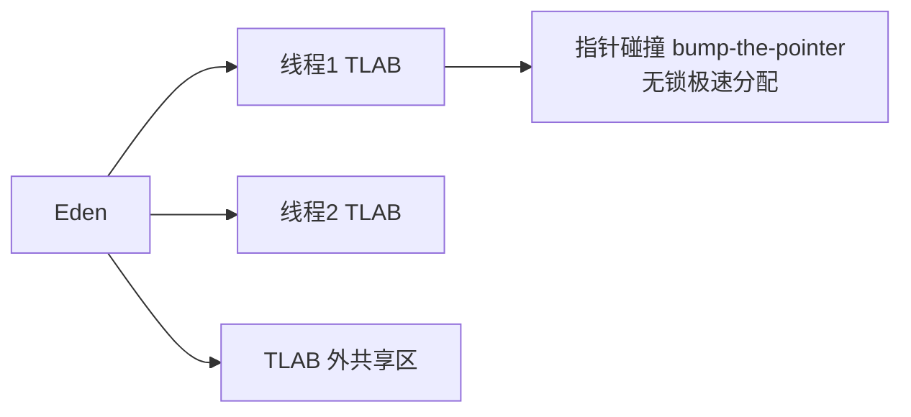

# 03 · 堆、栈与直接内存（详解）

---

## 面试题

### Q1. 堆和栈的区别（完整对比）

| 维度 | 虚拟机栈 | 堆 |
| --- | --- | --- |
| 内容 | 栈帧、局部变量槽、操作数中间值 | 对象实例、数组 |
| 可见性 | 线程私有 | 线程共享 |
| 分配释放 | 调用/返回自动压弹，速度极快 | 需分配器+GC，相对复杂 |
| 大小 | `-Xss`，通常 MB 级/线程 | `-Xmx`，常 GB 级 |
| 溢出 | StackOverflowError；扩展失败 OOM | Java heap space 等 |
| GC | 不当「垃圾堆」扫；但是 **GC Root 来源** | GC 主战场 |
| 性能问题 | 过深调用、过多线程 | 泄漏、碎片、晋升失败 |

**关系一句话：** 栈上局部变量里的**引用**指向堆上对象；方法结束引用没了，对象才可能变成垃圾。

---

### Q2. 栈内存越大越好吗？

**绝对不是。**
一般栈内存分配1024k，并不是越多越好，栈帧内存越大，可活动的线程就会越少。

设每个线程栈 1MB，2000 线程 ≈ 2GB **仅栈**。再加大 `-Xss`：

- 可创建线程数下降  
- 更容易把物理内存打满，表现为无法创建线程的 OOM  

栈太小：深递归、复杂框架调用链 → SOE。  

**实践：** 默认通常够用；无限递归要改代码；线程爆炸要线程池限流，而不是先加 `-Xss`。
- **SOE = StackOverflowError 栈溢出错误**
- **OOM = OutOfMemoryError 内存溢出错误**

一句话区分本质：
**SOE：栈的容量没超标，但是栈帧堆太多，把栈自己的空间撑爆了；OOM：JVM 向系统申请不到额外内存资源**

---

### Q3. 方法内局部变量是否线程安全？（分层答）

**情形 A — 安全：**  
局部基本类型；或局部引用指向的对象**不发布**到其它线程（无逃逸），仅本方法用完即弃。每线程栈帧独立。

**情形 B — 不安全：**  
把局部对象存进静态 Map、交给线程池、做成成员被并发访问——对象在堆上被共享，局部变量「引用本身」在栈上并不能保护对象内部状态。

**情形 C — 看起来局部其实共享：**  
`SimpleDateFormat` 做成方法内 new 则安全；若放静态则危险。

结合逃逸分析：JIT 若证明不逃逸，还可能栈分配/标量替换，更无并发问题。

---

### Q4. 垃圾回收是否涉及栈内存？

**回收动作：** GC **不负责「回收栈空间」**——栈帧弹出即释放。  

**根扫描：** GC 会扫描栈上引用作为 **GC Roots**，标记堆里还活着的对象。  

所以：GC「用到」栈上的根，但不「收集」栈。

---

### Q5. 直接内存（堆外）详解

**是什么：** 通过 `ByteBuffer.allocateDirect` 等向 OS 申请的堆外内存，不在 Java 堆内，不直接吃 `-Xmx`。

**为何用：** 减少「堆内缓冲 ↔ 内核」拷贝（零拷贝场景）；Netty 等高性能网络大量使用。

**管理与回收：**

- Java 侧有 `DirectByteBuffer` 小对象指向堆外  
- 堆外真正释放常靠 GC 回收该 Buffer 后 Cleaner/弱引用机制触发  
- 若堆很小导致 DirectByteBuffer 迟迟不回收，可能出现「堆很空但 Direct OOM」——可调堆或显式限制、或用池化  

**限制：** `-XX:MaxDirectMemorySize`（未设时常默认与堆最大值类似，视版本）。  

**排查：** Native Memory Tracking（NMT）、Netty 泄漏检测、看 DirectBuffer 数量。
Java 中的直接内存(Direct Memory)是由操作系统分配的内存区域,它不受JVM堆内存管理限制(是堆外内存)。直接内存是通过 java.nio 包中的 ByteBuffer.allocateDirect()方法分配的,它可以绕过JVM垃圾回收机制,直接与本地系统内存交互。

直接内存：并不属于JVM中的内存结构，不由JVM进行管理，是虚拟机的系统内存，常见于NIO操作时，用于数据缓冲区，它分配回收成本较高，但读写性能高

由NIO库通过ByteBuffer直接分配的内存,

直接内存的大小不受堆内存限制，但是会受到本机内存的限制

---

### Q6. TLAB 详解

**TLAB = Thread Local Allocation Buffer**

多线程同时在 Eden `new` 会竞争。解决：每个线程预先在 Eden「切一小块私有地」。

- 小对象优先 TLAB 分配  
- TLAB 耗尽再申请新块（可能触发慢路径）  
- 大对象可能绕过 TLAB  
- 浪费：TLAB 剩余空间可能暂时闲置，JVM 有填充/调整策略  

面试金句：**堆是共享的，但分配可以是线程本地的。**

---

### Q7. PLAB 是什么？

**Promotion Local Allocation Buffer：** 对象**晋升到老年代**（或目标空间）时的线程本地分配缓冲，减少多线程同时晋升时的原子竞争。与 TLAB 思想一致，阶段不同（分配 vs 晋升）。Parallel 系列收集器语境常提。

---

## 关联

- [[02-运行时数据区]] · [[09-引用与对象创建存储]] · [[11-JIT-AOT与逃逸分析]]
