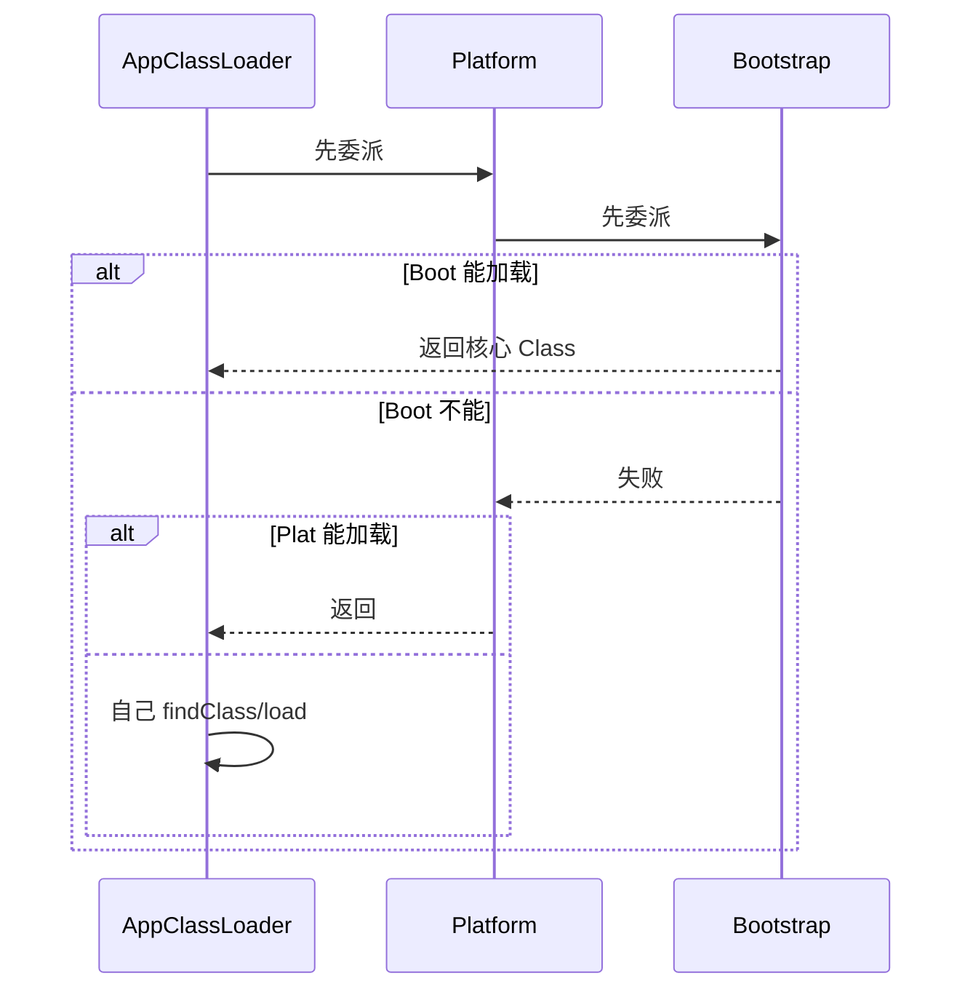

# 04 · 类加载与双亲委派（详解）

---

## 面试题

### Q1. 什么是类加载器？有哪些？职责如何分？

**ClassLoader** 负责：根据二进制名找到 class 字节流 → 调用底层定义成 JVM 内部的 `Class` 对象。

| 加载器 | 典型加载内容 | 备注 |
| --- | --- | --- |
| Bootstrap ClassLoader（启动类加载器） | `JAVA_HOME` 核心库 / `java.base` 等 | **C++** 实现，Java 里 `getClassLoader()` 为 `null` |
| Platform ClassLoader（平台；原 Extension 扩展类加载器） | 平台扩展模块；旧版常对应 `jre/lib/ext` | JDK9+ 由 Ext 更名为 Platform |
| Application / System（应用/系统类加载器） | 应用 classpath / 模块路径 | 业务类默认由此加载 |
| 自定义 ClassLoader | 插件、热部署、隔离、打破委派等 | 通常重写 `findClass`；慎改 `loadClass` |

**源：** 文件、JAR、网络、内存生成（动态代理）。

**口述别混：** 「扩展类加载器」是 JDK8 及以前的叫法；现在面试说 Platform 并提一句「以前叫 Ext」即可。种类题与本题合并，不必另开一题。

---

### Q2. 双亲委派模型：流程、优点、为何采用、如何打破？

#### 流程

代码直觉：`loadClass` 先 `parent.loadClass`，失败再 `findClass`。

#### 优点 / JVM 为何采用

1. **安全：** 保证 `java.lang.*` 由启动类加载器加载，恶意同名类无法抢先替换  
2. **唯一性：** 避免核心类出现多份，保证类型体系稳定（Class 相等要同一加载器）  
3. **层级共享：** 上层类对所有子加载器可见，基础库只加载一次  

#### 打破场景（必会举）

| 场景 | 做法 |
| --- | --- |
| JDBC SPI | 用线程上下文类加载器 TCCL 加载实现 |
| Tomcat | WebApp 加载器优先加载自己的类，隔离应用 |
| 热部署 | 丢弃旧 ClassLoader，新加载器加载新字节码 |
| OSGi | 网状委派，按模块依赖 |

---

### Q3. 类加载全过程？链接阶段具体做什么？

#### 加载

1. 通过全限定名获取二进制字节流  
2. 将静态存储结构转为方法区运行时结构  
3. 在堆上生成 `Class` 对象作入口  

#### 链接 · 验证

文件格式是否魔数/版本合法；语义是否矛盾；字节码是否安全（栈溢出分析等）；符号引用是否能解析。失败抛 `VerifyError` 等。

#### 链接 · 准备

为**类变量（static）**分配内存并设**默认零值**（0/null/false）。  
注意：这里一般还不是赋源码里的 `= 123`；赋值发生在初始化 `<clinit>`。  
例外：编译期常量 `static final int X = 123` 可能在编译期已入库，准备阶段即可见。

#### 链接 · 解析

常量池**符号引用 → 直接引用**（指针/句柄）。可懒解析。涉及类、字段、方法、接口方法等。

#### 初始化

执行 `<clinit>`：按源码顺序合并静态字段赋值与 static 块；**父类 `<clinit>` 先于子类**；JVM 保证线程安全（见下）。

---

### Q4. 类的加载/初始化时机？

**主动使用才初始化**（常见）：

- new、反射创建  
- 读写**非常量**静态字段  
- 调用静态方法  
- 作为启动主类  
- MethodHandle 解析结果  

**被动不会初始化本类：**

- 子类引用父类静态字段 → 只初始化父类  
- 定义数组 `MyClass[]`  
- 引用编译期常量（已折叠进调用类常量池）  

「加载」可能早于「初始化」；面试问时机通常指**初始化触发**。

---

### Q5. 多线程同时加载/初始化同一类？

对**同一个 Class** 的初始化，JVM 用锁保证：

- 只有一个线程执行 `<clinit>`  
- 其它线程等待  
- 完成后其它线程直接使用已初始化类  

不会出现静态块被两个线程交错执行一半。  
不同 ClassLoader 加载「同名类」会得到**不同 Class 对象**，那是另一话题（隔离）。

---

### Q6. Java 9 JPMS 对类加载的影响？

1. **模块路径** vs 传统 classpath  
2. `module-info.java` 声明 `requires` / `exports` / `opens`  
3. **强封装**：默认不能反射深入 JDK 内部（非法反射告警/失败）  
4. 平台自身模块化，启动类加载器逻辑仍在，但可见性规则更严  

迁移老项目：加 `--add-opens` 是权宜之计，长期应改模块声明或去掉非法反射。

## 关联

- [[../Java基础/11-类加载与双亲委派|基础篇]] · [[01-组成与执行流程]] · [[10-OOM泄漏与调优排查]]
