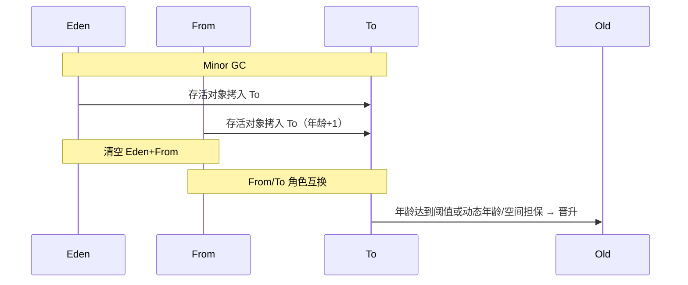

# 06 · 分代与 GC 类型（详解）

---

## 面试题

### Q1. 为什么要把堆分成新生代和老年代？

基于**弱分代假说（Weak Generational Hypothesis）**：

1. 绝大多数对象很快变得不可达  
2. 熬过多次 GC 的对象，更可能继续存活很久  

因此：

| 代 | 对象特点 | 算法偏好 | 收集频率 |
| --- | --- | --- | --- |
| 新生代 | 朝生夕死，存活率低 | **复制**，只搬少数存活 | 高（Minor GC） |
| 老年代 | 存活率高、体积大 | **标记-清除/整理**，避免狂拷 | 低 |

若整堆每次都复制：老对象来回拷成本爆炸。若整堆都整理：年轻对象太多划不来。分代是性价比最优工程折中。

---

### Q2. 为什么新生代是 Eden + S0 + S1？

复制算法至少需要「from / to」两块空间。HotSpot 采用：

- **Eden（大）：** 新对象主分配区  
- **Survivor0 / Survivor1（小）：** 存活对象来回拷贝，**始终空出一个 To**  

**默认比例**常 8:1:1，使 Eden 更大、分配吞吐更高；Survivor 太小会频繁晋升（过早晋升），太大浪费。

**大对象：** 可能直接进老年代（`-XX:PretenureSizeThreshold` 等，串行/ParNew 相关），避免 Eden↔Survivor 来回拷。

---

### Q3. Minor / Young、Old、Mixed、Full GC 区别？

| 名称 | 回收范围 | 备注 |
| --- | --- | --- |
| **Minor GC / Young GC** | 新生代 | 很频繁；停顿通常较短但仍 STW |
| **Major / Old GC** | 老年代 | 说法混乱；CMS 并发阶段常称老年代收集 |
| **Mixed GC** | G1：年轻代 Region + **部分**老 Region | G1 减少 Full 的关键 |
| **Full GC** | 整堆（常含元空间）压缩式停顿 | 最贵；应尽量少 |

答题时声明：「不同收集器术语略有出入，我按 HotSpot 常见用法说。」

---

### Q4. 什么条件触发 Young GC？

**直接原因：Eden 放不下新对象（含 TLAB 申请失败走慢路径后仍不够）。**

流程直觉：`new` → TLAB/Eden 分配失败 → 触发 Young GC → 尝试腾出空间 → 仍不够可能晋升或扩展/失败。

---

### Q5. 什么情况触发 Full GC？（尽量列全）

1. **老年代空间不足**（分配/晋升失败）  
2. **元空间不足**  
3. **显式 `System.gc()`**（可用 `DisableExplicitGC` 忽略）  
4. **晋升失败 Promotion Failed**（Survivor/老年代扛不住）  
5. **空间分配担保失败**（Minor 前预估老年代放不下存活）  
6. **CMS Concurrent Mode Failure / Promotion Failed** → 退化 Full  
7. **G1** 在 to-space exhausted、并发标记周期跟不上等情况下也可能 Full  
8. 堆dump前某些诊断操作等（少见）  

**频繁 Full GC 排查顺序：** 是否泄漏 → 堆是否过小 → 晋升是否过猛（看 GC 日志年龄/老年代增长）→ 换/调收集器。

---

### Q6. 简述分代收集算法（综合一句扩成段）

分代收集 = 把堆按生命周期分代 + 每代用最适合的算法与收集器 + 用写屏障/卡表处理跨代引用。年轻代复制快收；老年代少收、可并发标记；目标是用较少停顿换取整体吞吐或可控延迟。

---

## 关联

- [[05-GC基础与算法]] · [[03-堆栈与直接内存]] · [[08-CMS-G1-ZGC详解]]
