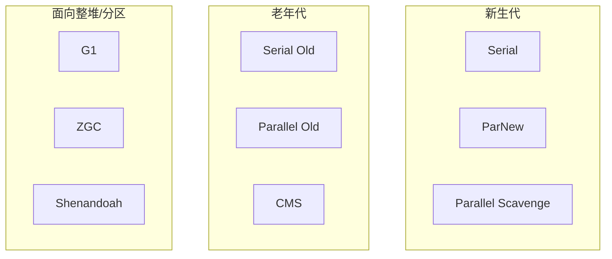

# 07 · 垃圾收集器总览（详解）

---

## 面试题

### Q1. 常见垃圾收集器有哪些？怎么分类记？

| 收集器 | 目标 | 算法直觉 | 线程 |
| --- | --- | --- | --- |
| Serial / Serial Old | 简单客户端 | 复制 / 标记整理 | 单线程 STW |
| ParNew | 配 CMS | 复制 | 多线程 STW |
| Parallel Scavenge / Old | **吞吐量** | 复制 / 标记整理 | 多线程 STW |
| CMS | **低延迟**（老年代） | 标记清除 | 并发标记清除 + 短 STW |
| G1 | 可预测停顿，大堆 | 分区拷贝 | 并发标记 + STW 疏散 |
| ZGC / Shenandoah | **极低延迟** | 并发转移 | 几乎全并发 |

JDK9+ 默认 **G1**；超低延迟场景看 **ZGC**（需版本/平台支持）。

---

### Q2. 为什么有些新生代/老年代收集器不能组合？例如 ParNew 与 Parallel Old？

1. **实现耦合：** 年轻代与老年代收集器要约定如何通知、如何共用卡表/记忆集、如何处理晋升  
2. **目标不一致：** Parallel 系为吞吐调优；CMS 为停顿；硬拼没有工程投入  
3. **HotSpot 历史产品矩阵：** 只维护若干官方组合  

常见合法组合（经典）：

- Serial + Serial Old  
- ParNew + CMS（曾常用）  
- Parallel Scavenge + Parallel Old  
- G1 / ZGC 自成体系  

**ParNew + Parallel Old、Parallel Scavenge + CMS** 等不被支持——面试答「JVM 未实现该组合，且工作机制不匹配」。

---

### Q3. 记忆集 / 卡表：CMS vs G1 如何维护？

**问题：** 分区/分代回收时，必须知道「外面谁指向我正在回收的区域」，否则漏标活对象。

| | CMS 时代常见 | G1 |
| --- | --- | --- |
| 结构 | 主要靠 **卡表 Card Table**（覆盖老年代）服务 Young GC | 每 Region 一个 **Remembered Set (RSet)** |
| 粒度 | 卡片（如 512B）脏标记 | 记录指向本 Region 的卡片/引用信息 |
| 维护 | 写屏障标脏卡 | 写屏障更新 RSet（有成本） |
| 目的 | Young GC 扫脏卡而非全老年代 | 任意 Region 回收时只扫相关 RSet |

---

### Q4. 为什么 G1「不维护年轻代到老年代的记忆集」这类问题怎么答？

记忆集的方向是：**为「被回收方」记录谁指向我。**

- 做 **Young GC** 时，回收的是年轻 Region → 需要「谁指向年轻代」（常来自老年代）→ 靠脏卡/RSet 扫这些指针  
- 「年轻 → 老」的指针：在回收年轻代时，会随年轻存活对象一起处理它们的出边；**不是** Young GC 要单独维护的「入边记忆集」那种结构  

所以标准答法：

> G1 的 RSet 记录的是指向本 Region 的引用。Young GC 关心指向年轻代的入边；年轻指向老年代不需要再为 Young GC 单独建一套对称记忆集。老 Region 被选入 CSet 时，靠各自 RSet 保证正确性。

---

### Q5. G1 相对 CMS 的进步？

| 点 | CMS | G1 |
| --- | --- | --- |
| 碎片 | 标记清除，易碎片 | 拷贝疏散，整理好 |
| 停顿 | 低但不预测 | **可设停顿目标** |
| 大堆 | 全老年代并发，压力大 | Region 增量回收 |
| Full GC | CMF 后单线程 Serial Old 极痛 | 尽量 Mixed；Full 也在改进 |
| 默认 | 旧默认曾是 Parallel | JDK9+ 默认 |

代价：写屏障与 RSet 有 CPU/内存开销；小堆未必优于 Parallel。

---

## 关联

- [[08-CMS-G1-ZGC详解]] · [[05-GC基础与算法]] · [[06-分代与GC类型]]
