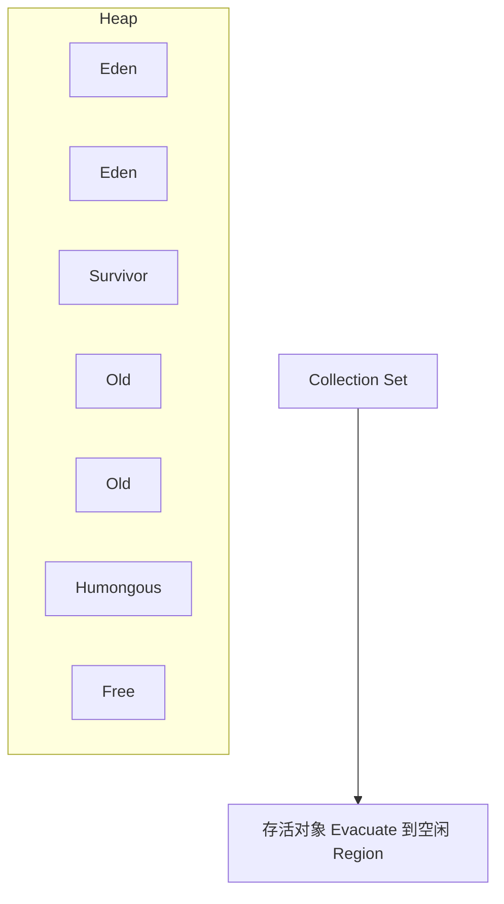

# 08 · CMS / G1 / ZGC（深度）

> GC 面试「深水区」。把流程、失败模式、为何单线程 Full、低延迟收集器讲透。

---

## 一、CMS

### Q1. CMS 垃圾回收流程（逐步）

**定位：** 老年代收集器；目标低停顿；算法标记-清除；与 ParNew 搭配经典。

| 阶段 | STW？ | 做什么 |
| --- | --- | --- |
| 初始标记 Initial Mark | 是 | 标 GC Roots 直接可达的老年代对象，很快 |
| 并发标记 Concurrent Mark | 否 | 跟着引用链遍历，与用户线程并行 |
| 重新标记 Remark | 是 | 修正并发期变动，可能比初始标记稍长 |
| 并发清除 Concurrent Sweep | 否 | 清理未标记对象 |
| （并发重置） | 否 | 重置数据结构 |

**缺点详细说：**

1. **CPU 敏感：** 并发阶段抢核，线程少时影响吞吐  
2. **浮动垃圾：** 并发清期间新垃圾留到下次  
3. **碎片：** 无压缩，可能导致大对象分配失败  
4. **Concurrent Mode Failure** 极痛  

---

### Q2. Concurrent Mode Failure 原因？为何 Full GC 往往单线程？

**CMF 定义：** CMS 并发清理尚未完成（或跟不上），老年代已经无法满足分配/晋升，JVM 不得不中止 CMS，进行一次 **STW 的 Full GC**。

**诱因：**

- 老年代占用过高才触发 CMS（启动太晚）  
- 晋升速度过快  
- 碎片导致连续空间不足（看起来有空闲却分配失败）  

**为何兜底 Full GC「单线程」：**  
HotSpot 中 CMS 失败后的 compacting Full GC 走 **Serial Old（单线程标记-整理）** 路径。大堆上可能停顿数秒到更久——生产事故常见原因。

**应对：**

- 调低 `CMSInitiatingOccupancyFraction` 让 CMS 更早跑  
- 增大老年代；减少短命对象晋升  
- **换 G1/ZGC**（根本方案）  

---

## 二、G1

### Q3. G1 是什么？Region 模型？

**Garbage-First：** 把堆切成等大 **Region**（1～32MB 等比），每个 Region 可扮演 Eden/Survivor/Old/Humongous（大对象占多个连续 Region）。

**Garbage-First 含义：** 优先回收「回收收益最高」（垃圾占比高）的 Region，在用户期望的停顿时间内尽量多收垃圾。

---

### Q4. G1 回收流程（Young + 并发标记 + Mixed）

**Young GC：**  
回收所有年轻 Region；STW；复制存活到 Survivor/Old；维护 RSet。

**并发标记周期（简化）：**

1. 初始标记（可搭 Young GC）  
2. 根分区扫描  
3. 并发标记（SATB）  
4. 再次标记 / 清理  
5. **Mixed GC：** 在 Young 基础上加入部分老 Region（按收益与停顿预算选入 CSet）  

**Evacuate：** STW 把 CSet 内存活对象拷到其它 Region，整体类似复制，顺便整理碎片。

**参数：**

- `-XX:+UseG1GC`  
- `-XX:MaxGCPauseMillis=200`（目标，不保证）  
- `-XX:G1HeapRegionSize`  

---

### Q5. G1 为何能比 CMS「进步」？（结合实现）

1. **停顿可控：** 用停顿预测模型选 CSet 大小  
2. **整理：** 复制疏散减少碎片，降低「有空闲却分配失败」  
3. **增量回收老年代：** Mixed 而不是一次清整老年代  
4. 大堆表现更稳  
5. 失败路径虽仍有 Full GC，但整体比 CMS+SerialOld 组合健康  

---

## 三、ZGC / Shenandoah

### Q6. 了解 ZGC 吗？和 Shenandoah？Java11+ 怎么看？

**ZGC 核心目标：** 停顿时间极短（毫秒级），且**不随堆大小线性暴涨**。

关键思想（概念层）：

- 并发标记、并发转移（relocation）  
- **染色指针 / 读写屏障**（具体实现随版本演进，如分代 ZGC）  
- 应用线程访问对象时通过屏障「自愈」转发  

适合：堆很大（几十 GB+）、延迟敏感（交易、中台网关）。  

**Shenandoah：** 同样低延迟并发压缩，用 Brooks 指针等方案；在部分发行版提供。  

**选型看法：**

| 场景 | 倾向 |
| --- | --- |
| 通用业务、中等堆 | G1 默认够用 |
| 超大堆、极致 P99 | ZGC（压测验证吞吐） |
| 吞吐优先批处理 | Parallel 仍可能胜出 |

升级必须压测：ZGC 用更多内存做着色/转发；CPU 模型也不同。

---

### Q7. CMS 与 G1 并发正确性（再答一版）

| | CMS | G1 |
| --- | --- | --- |
| 漏标对策 | 写屏障 + 增量更新 + Remark | 写屏障 + SATB + 最终标记 |
| 浮动垃圾 | 有 | 有 |
| 用户线程 | 并发阶段继续跑 | 同 |

三色标记细节见 [[05-GC基础与算法]]。

---

## 关联

- [[07-垃圾收集器总览]] · [[06-分代与GC类型]] · [[10-OOM泄漏与调优排查]]
