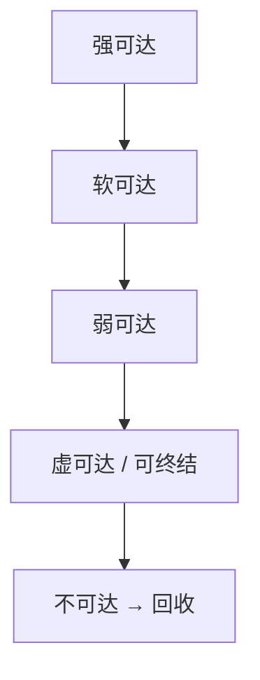
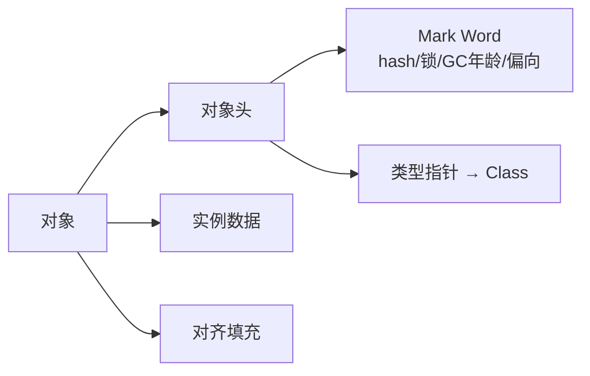

# 09 · 引用与对象创建 / 存储（详解）

---

## 面试题

### Q1. 强、软、弱、虚引用——机制、代码直觉、场景、注意点

| 类型 | 类 | GC 行为 | 场景 | 注意 |
| --- | --- | --- | --- | --- |
| 强 | 默认 | 有强引用绝不收 | 普通对象 | 泄漏根源也是「多余强引用」 |
| 软 | SoftReference | 内存够可留；将 OOM 前可收 | 图片缓存、全文缓存 | 时机不确定；要配合大小限制 |
| 弱 | WeakReference | 下次 GC 几乎必收（弱可达） | WeakHashMap、规范化缓存 | 一次 GC 就没，别当长期缓存 |
| 虚 | PhantomReference | 必须配合 ReferenceQueue；get 总为 null | 堆外内存释放跟踪、终结替代 | 不能访问对象，只收通知 |



**口述：** 引用强度决定「还能不能阻止 GC」。业务缓存优先成熟库（Caffeine）而不是手写软引用。

---

### Q2. 对象在堆里怎么存储？对象头有什么？



- **Mark Word：** 哈希码、分代年龄、锁状态（偏向/轻量/重量）、等  
- **Klass Pointer：** 指向类元数据（开启压缩指针时用 32 位编码）  
- **数组：** 额外 length  
- **对齐：** 8 字节对齐等，影响对象体积  

工具：JOL（Java Object Layout）看实际大小。

---

### Q3. 对象创建过程：字节码 + JVM 内存

**字节码序列（典型）：**

```text
new #Class
dup
invokespecial #init
astore_n   // 或其它使用
```

**JVM 步骤：**

1. 解析类符号，确保类已加载、验证、准备、初始化  
2. **分配内存**  
   - 绝对优先：当前线程 **TLAB** 指针碰撞  
   - TLAB 不足：慢分配，可能直接 Eden/老年代  
   - 堆结构：指针碰撞（整理后）或空闲列表（碎片时）  
3. 内存**零值初始化**（字段默认值）  
4. 设置**对象头**  
5. 执行 `<init>` 构造代码（成员初始化、构造器体）  

**并发分配安全：** TLAB 减少竞争；共享区用 CAS 保证。

**优化：** 逃逸分析 → 标量替换/栈上分配，可能「看不到」真实堆对象。

---

### Q4. 常量池（和对象创建一起答）

创建 `new String("a")` 时字面量 `"a"` 与常量池关系见 [[../Java基础/04-String|String 篇]]；类常量池在加载时进入运行时常量池。

---

## 关联

- [[03-堆栈与直接内存]] · [[11-JIT-AOT与逃逸分析]] · [[02-运行时数据区]]
