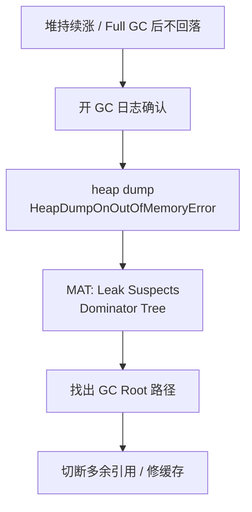

# 10 · OOM、泄漏与调优排查（详解）

---

## 面试题

### Q1. 什么是 OOM？有哪些常见类型？分别什么原因？

**OutOfMemoryError：** 内存申请失败时的 Error。

| 文案/类型 | 区域 | 常见原因 |
| --- | --- | --- |
| Java heap space | 堆 | 泄漏、堆过小、一次加载大数据 |
| GC overhead limit exceeded | 堆 | 98% 时间在 GC 却回收很少（可关该策略） |
| Metaspace | 元空间 | 类加载过多、ClassLoader 泄漏 |
| Direct buffer memory | 直接内存 | NIO/Netty 堆外未释放或限制过小 |
| unable to create new native thread | 本机 | 线程太多、栈太大、进程 ulimit |
| Requested array size exceeds VM limit | 堆 | 非法超大数组长度 |

**方法区会 OOM 吗？** 会，现在表现为 Metaspace。

---

### Q2. 内存泄漏是什么？和 OOM 关系？常见导致原因？

**泄漏：** 生命周期该结束的对象，仍被无用的引用链挂住 → GC 认为存活 → 堆单调上涨 → 最终 OOM。

**不等于 OOM：** 泄漏是病因之一；OOM 也可能是峰值太大、堆设太小。

**常见原因展开：**

1. **静态 Collection** 只 put 不 remove  
2. **缓存** 无上限、无过期  
3. **监听器/Observer** 注册未反注册  
4. **ThreadLocal** 在线程池线程上不 `remove`，value 跟随线程活很久  
5. **连接/流** 未关闭（现代 try-with-resources）  
6. **内部类** 隐式持有 Activity/外部类（移动端经典）  
7. **ClassLoader 泄漏** 热部署后旧 loader 及加载的类无法卸载  

---

### Q3. 内存溢出/泄漏排查思路？如何分析？

内存泄漏的情况
具体表现为HeapAlloc / RSS 持续上升，GC 后也降不下来
本质就是:对象仍可达，GC 收不掉
泄漏最终常导致 OOM；OOM 也可能只是突发峰值

内存溢出 (OOM)
具体表现就是进程被杀、`cannot allocate memory`、容器 OOMKilled
本质也就是瞬时或累计分配超过限制

#### 标准路径



1. 监控：堆使用、GC 次数与停顿、老年代曲线  
2. 对比 Full GC 前后堆是否下来——下不来多半泄漏或元空间  
3. dump 分析：谁占 70%？持有者是谁？  
4. 代码修：弱引用、上限、remove、关资源  
5. 验证：压测看曲线是否平台期  

#### 频繁 Full GC 专项

- 看 GC 日志区分 Young 狂刷还是 Old 满  
- 晋升失败？元空间？显式 System.gc？  
- 先治泄漏与对象分配速率（看 allocation rate），再调参  

---

### Q4. 第三方库泄漏且改不了源码？

1. 升级到修复版本 / 换库  
2. 限制调用频率与缓存规模，外层加防护  
3. 隔离到独立进程，泄漏了可重启（降级）  
4. 字节码增强/Agent 拦截（成本高）  
5. 反馈厂商；法律/合规下的源码替代  

---

### Q5. CPU 飙高排查方案

1. `top` 定位 Java 进程  
2. `top -Hp pid` 看繁忙线程  
3. 线程 id → 十六进制 → `jstack` 找同一 nid  
4. 看堆栈：业务死循环、激烈锁竞争、Hash 碰撞攻击、正则回溯、GC 时间过高（GC 线程）  
5. **async-profiler / Arthas** profiler 出火焰图，比多次 jstack 更准  

---

### Q6. JVM / GC 调优目标与方法？

**目标（常冲突）：**

1. **延迟：** 单次停顿短、P99 可控  
2. **吞吐：** 单位时间用户代码比例高  
3. **容量：** 内存占用可接受  

**方法顺序（重要）：**

1. **先正确：** 修泄漏、降分配（少创建临时对象）  
2. **选收集器：** 通用 G1；低延迟 ZGC；批处理 Parallel  
3. **设堆：** 过大 → 单次 GC 扫更多；过小 → GC 频繁；用压测找甜点  
4. **读 GC 日志** 调区域、停顿目标、并发线程数  
5. **回归压测** 看 TPS 与延迟，禁止只凭感觉调  

---

### Q7. 常用 JVM 参数（分类记）

**堆与栈：**

```text
-Xms4g -Xmx4g
-Xss256k
-Xmn / -XX:NewRatio / -XX:SurvivorRatio
```

**元空间 / 直接内存：**

```text
-XX:MetaspaceSize=256m -XX:MaxMetaspaceSize=512m
-XX:MaxDirectMemorySize=1g
```

**GC：**

```text
-XX:+UseG1GC
-XX:MaxGCPauseMillis=200
-XX:+UseZGC          # 视 JDK
```

**排查：**

```text
-XX:+HeapDumpOnOutOfMemoryError
-XX:HeapDumpPath=/path
-Xlog:gc*:file=gc.log:time,uptime,level,tags
```

---

### Q8. 常用分析工具？

| 工具 | 用途 |
| --- | --- |
| jps/jstat/jstack/jmap/jcmd | 基础诊断 |
| jinfo | 参数 |
| VisualVM | 可视化入门 |
| MAT | dump 泄漏分析 |
| async-profiler | CPU/分配火焰图 |
| Arthas | 线上动态诊断 |
| GCEasy / GCViewer | GC 日志分析 |
| NMT | 本地内存 |

---

### Q9. 如何对 GC 进行调优？（实操清单）

1. 打开详细 GC 日志，跑真实流量压测  
2. 看：Young/Full 频率、停顿分布、晋升量、堆占用  
3. 若停顿长：减小单次回收范围（G1 停顿目标）、或换 ZGC  
4. 若吞吐低：少并发GC抢核、或 Parallel  
5. 若频繁 Young：看 Eden 是否过小、分配是否过猛  
6. 每次只改一两个参数，保留对照  

---

## 关联

- [[08-CMS-G1-ZGC详解]] · [[06-分代与GC类型]] · [[03-堆栈与直接内存]]
