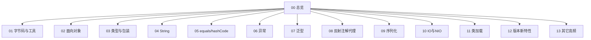

# Java 基础 · 知识总览

面试「Java 基础」全量题库，按知识节点拆分。答案按**可完整口述**加厚（原理、对比、流程图、易错点）。

与 [[../Java集合/00-知识总览|Java集合]]、[[../Java并发/00-知识总览|Java并发]]、[[../计算机网络/00-知识总览|计算机网络]] 并列。

查题用：[[14-题单总索引]]

## 知识地图

| 节点 | 文件 |
| --- | --- |
| Java 特点 / 字节码 / JDK 工具 | [[01-JDK-JRE-JVM与字节码]] |
| OOP | [[02-面向对象]] |
| 基本类型/包装/拆装箱 | [[03-基本类型与包装类]] |
| String 全家桶 | [[04-String]] |
| == / equals / hashCode | [[05-equals与hashCode]] |
| 异常体系 | [[06-异常]] |
| 泛型 | [[07-泛型]] |
| 反射/注解/动态代理/SPI | [[08-反射注解代理与SPI]] |
| 序列化 | [[09-序列化]] |
| IO / BIO NIO AIO | [[10-IO与NIO]] |
| 类加载与双亲委派 | [[11-类加载与双亲委派]] |
| Java8～25 新特性 | [[12-版本新特性]] |
| 其它（拷贝/内部类/乱码/实体类…） | [[13-其它高频题]] |
| 题单总索引 | [[14-题单总索引]] |

## 建议顺序

1. [[01-JDK-JRE-JVM与字节码]]（不再展开 JDK/JRE/JVM 运行时）→ [[02-面向对象]] → [[03-基本类型与包装类]]  
2. [[04-String]] → [[05-equals与hashCode]] → [[06-异常]]  
3. [[07-泛型]] → [[08-反射注解代理与SPI]] → [[09-序列化]]  
4. [[10-IO与NIO]] → [[11-类加载与双亲委派]] → [[12-版本新特性]] → [[13-其它高频题]]  
5. 查漏：[[14-题单总索引]]  
