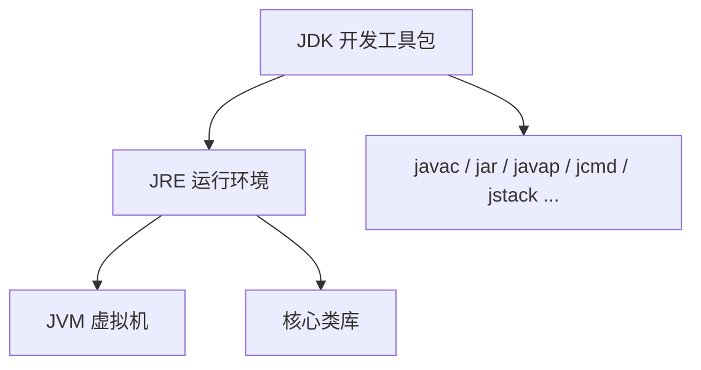
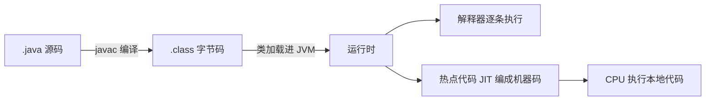
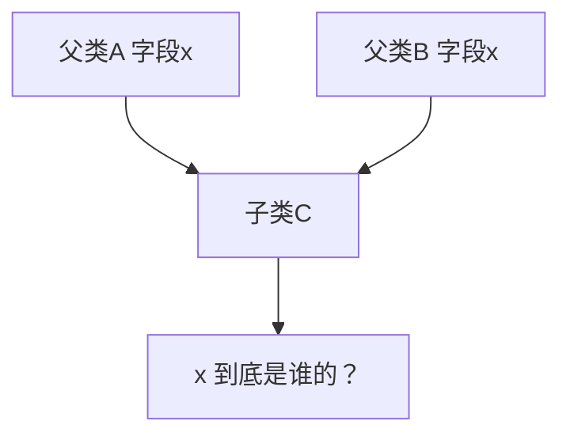

# 01 · Java 特点、字节码与 JDK 工具

> 目标：聚焦 Java 基础入口题里的「语言特点、字节码、工具链」；JDK/JRE/JVM 的运行时部分放到 JVM 专题。

---

## 面试题

### Q1. JDK、JRE、JVM 分别是什么？三者关系是什么？

这题虽然在 JVM 专题里有展开，但在 Java 基础开场题里也很高频，最好会用 **一句话 + 一张图** 讲清。

| 名词 | 是什么 | 主要包含 | 谁会直接用到 |
| --- | --- | --- | --- |
| **JVM** | Java 虚拟机规范的一种实现（最常见是 HotSpot） | 类加载、运行时数据区、执行引擎、GC | 负责真正执行字节码 |
| **JRE** | Java 运行环境 | JVM + 核心类库 + 运行所需文件 | 只运行 Java 程序的人 |
| **JDK** | Java 开发工具包 | JRE + 编译调试打包工具 | 开发、编译、排查的人 |



**怎么答更稳：**

1. `javac` 把 `.java` 编译成 `.class` 字节码  
2. JRE 提供类库和运行环境  
3. JVM 把字节码加载并执行，所以 Java 才能跨平台  

**补充加分：**

- JDK 8 时代经常看到 `jdk` 里套 `jre`；JDK 9+ 模块化后目录结构变了，但概念没变  
- 现在线上机器很多也直接装 JDK，因为排查时要用 `jcmd`、`jstack`、`jmap`  
- JVM 不只跑 Java，Kotlin、Scala、Groovy 也能编译成 class 跑在 JVM 上  

**口述模板：**  
> JDK 是给开发者用的，除了运行环境还带编译调试工具；JRE 是给程序运行用的；JVM 是 JRE 里真正负责加载并执行字节码的虚拟机，所以 Java 才能“一次编译，到处运行”。

---

### Q2. Java 语言的特点？你认为优势是什么？

按「语言特性 → 工程优势 → 生态」三层答，避免只喊口号。

**语言与运行时：**

1. **面向对象**：封装、继承、多态，适合大型协作  
2. **跨平台**：源码 → 字节码 → 各平台 JVM，Write Once, Run Anywhere（实际仍要测，但成本低于原生多平台）  
3. **自动内存管理（GC）**：降低悬空指针、重复释放类错误；代价是 GC 调优与停顿治理  
4. **强类型 + 字节码校验**：很多错误编译期就能发现；类加载时校验有助于安全  
5. **原生多线程与内存模型（JMM）**：并发有规范可依  

**工程与生态优势（面试官更爱听）：**

1. 企业级框架成熟：Spring、中间件客户端、监控体系  
2. 人才与资料多，招人、交接成本相对可控  
3. 性能「够用且可挖」：JIT、逃逸分析、ZGC/G1 等，不是脚本语言量级  
4. 向后兼容相对稳健（也有模块化等破坏性变更，要客观）  

**也可主动提不足（显成熟）：** 语法曾偏冗长（近年 Record/var/模式匹配改善）、启动与内存占用高于 Go 一类、checked exception 有争议。

---

### Q3. 为什么说 Java 是编译与解释并存？完整流水线？



1. **编译期（javac）**：词法语法分析、语义检查、泛型擦除、生成字节码与常量池，**不是**生成 Windows/Linux 专用 exe。  
2. **运行期（JVM）**：  
   - 开始多用 **解释执行**，启动快  
   - 热点方法/循环被探测后，**C1/C2 JIT** 编译成机器码，甚至分层编译、去优化  
3. 所以：对开发者是「编译型语言体验」；对 CPU 是「字节码 + 解释/JIT」。

对比：

- 纯解释（传统早期脚本）：每次都慢  
- 纯 AOT（Go/C）：启动即机器码，但跨平台要分别编译  

---

### Q4. 什么是字节码？好处？怎么查看？

**字节码：** 符合 JVM 规范的中间指令与 class 文件结构（魔数、版本、常量池、方法字节码等）。

**好处：**

1. **平台无关**：同一套 class，Linux/Windows/Mac 各跑自家 JVM  
2. **可校验**：加载时验证，减少非法指令破坏 JVM  
3. **可优化空间**：JIT 可根据运行剖面做内联、逃逸分析等  
4. **语言无关后端**：多种语言瞄准 JVM  

**查看：**

```text
javap -v -p -c YourClass
```

`-c` 看反汇编指令，`-v` 看常量池与细节。面试提到「用 javap 看过」是加分。

---

### Q5. 你使用过哪些 JDK 工具？结合排查说

不要只列名字，用「场景 → 工具 → 看什么」。

| 场景 | 工具 | 看什么 |
| --- | --- | --- |
| 进程在不在 | `jps -lvm` | pid、主类、参数 |
| CPU 高/死锁 | `jstack` / `jcmd Thread.print` | 线程状态、锁等待 |
| 内存涨/泄漏 | `jmap -histo` / heap dump + MAT/VisualVM | 大对象、泄漏路径 |
| GC 频繁 | `jstat -gcutil`、GC 日志 | 各代占用、Full GC 次数 |
| 看参数 | `jinfo` / `jcmd VM.flags` | 是否按预期配置 |
| 字节码 | `javap` | 编译结果是否符合预期 |
| 交互试验 | `jshell`（9+） | 快速验证 API |

生产注意：dump 有停顿与安全规范；优先用低侵入的 `jcmd`。

---

### Q6. Java 和 Go 的区别？和 C++？

**Java vs Go（后端常问）：**

| 维度 | Java | Go |
| --- | --- | --- |
| 类型系统 | 经典 OOP + 接口；泛型历史久（有擦除） | 组合+接口；1.18 才泛型 |
| 并发 | OS 线程 + 线程池 + JUC；虚拟线程（21+）改变格局 | goroutine 极轻 + channel |
| 部署 | 要 JRE/JDK 或 jlink 镜像，包体与启动相对重 | 单静态二进制，容器友好 |
| 错误处理 | 异常 | error 返回值为主 |
| 生态 | 企业业务、庞大框架 | 云原生、K8s 系工具链 |

答题态度：不是谁绝对更好，看场景——复杂领域模型/现有 Java 生态选 Java；网络中间件/CLI/简单部署选 Go 很常见。

**Java vs C++（短答）：**

- 内存：GC vs 手动/智能指针  
- 继承：单继承+接口 vs 多继承  
- 指针：无算术指针；引用语义不同  
- 编译产物：字节码+JVM vs 本地机器码  

---

### Q7. 为什么不支持类的多重继承？接口为何可以多实现？

**类禁多重继承的原因：**

1. **菱形问题**：两个父类有同名属性/实现，子类不知取哪份状态  
2. 初始化顺序、构造调用更复杂  
3. 语言选择简化模型，鼓励 **组合**  



**接口可多实现：**

1. 接口早期主要是方法契约，不携带实例字段（JDK8+ default 方法是行为复用，冲突时编译器强制子类覆盖选择）  
2. 表达「能力叠加」：`implements Readable, Closeable`  
3. 与「多重继承一份对象状态」不是同一类问题  

**既然多继承不行，为何 default 冲突还能解决？**  
子类必须显式 `@Override` 选择/组合调用 `X.super.m()`，冲突是编译期可见的，而不是运行期静默选错字段。

---

## 关联

- JDK / JRE / JVM 运行时关系见 [[../JVM/01-组成与执行流程|JVM·组成与执行流程]]  
- 类加载见 [[11-类加载与双亲委派]]  
- 版本新特性见 [[12-版本新特性]]  
- 返回 [[00-知识总览]]
