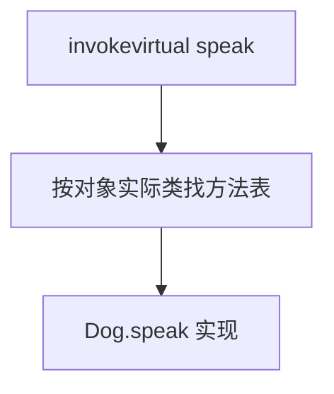
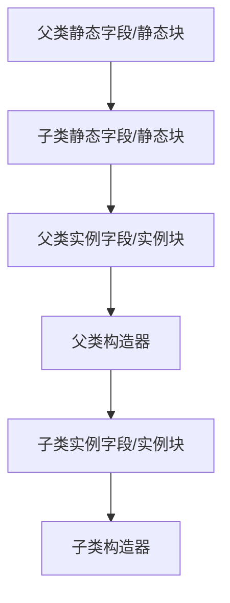

# 02 · 面向对象

> 目标：封装/继承/多态能举例；重载重写、接口抽象类、构造与初始化顺序能画清；结合「组合优于继承」。

---

## 面试题

### Q1. 面向对象和面向过程的区别？你对 OOP 的理解？

**面向过程：** 以步骤为中心，数据与操作分离，典型是「函数 + 全局/参数数据结构」。适合短脚本、算法步骤清晰的场景。

**面向对象：** 以对象为中心，把数据与行为绑在一起，通过消息协作。适合业务复杂、长期演进、多人协作。

| 维度 | 面向过程 | 面向对象 |
| --- | --- | --- |
| 核心 | 过程/函数 | 对象/职责 |
| 复用 | 函数复用 | 封装、继承、组合、多态 |
| 扩展 | 常改流程函数 | 靠加类型/策略，少改旧代码（理想情况） |
| 状态 | 常散落 | 收敛在对象内 |

**理解 OOP 不要只背三大特征，要补一句设计思想：**

- **抽象**：抓住本质，忽略细节  
- **封装**：藏实现，暴露稳定接口  
- **继承/组合**：复用  
- **多态**：同一接口多种实现，调用方依赖抽象  

反例也要会说：滥用继承、上帝类、贫血模型争议——说明你思考过，不是背书。

---

### Q2. 什么是封装？访问修饰符如何配合？

封装 = **隐藏实现 + 控制访问 + 保护不变量**。

例子：账户余额只能通过 `deposit`/`withdraw` 改，方法内校验金额 ≥0，而不是 `public double balance`。

访问修饰符见 Q7。封装还包括：模块边界、包设计、不要随便暴露可变内部集合（应返回不可变视图或拷贝）。

---

### Q3. 什么是继承？有什么坑？

子类继承父类可访问成员，表达 **is-a**。Java **单继承** 类。

**坑：**

1. 继承破坏封装：子类依赖父类内部实现，父类一改子类炸  
2. 继承层次过深难懂  
3. 为复用而继承（其实只是要工具方法）→ 该用静态工具或组合  

**组合优于继承：** 持有一个行为对象（策略），而不是为了复用去 extends。

---

### Q4. 什么是多态？运行时多态如何发生？

多态：同一消息，不同对象不同响应。

**1）编译期多态（重载）：** 编译器根据静态类型和参数列表选方法。  
**2）运行时多态（重写）：** 父类引用指向子类对象，调用重写方法时看 **实际类型**（动态分派）。

```text
Animal a = new Dog();
a.speak(); // 调用 Dog.speak
```



**条件：** 继承/实现关系、方法重写、父类型引用指向子类型实例。  
`static`/`private`/`final` 方法不能形成运行时多态（绑定方式不同）。

---

### Q5. 重载和重写的区别？（细表）

| 维度 | 重载 overload | 重写 override |
| --- | --- | --- |
| 发生位置 | 同一类中（也可父子都有重载） | 子类对父类/接口 |
| 方法名 | 相同 | 相同 |
| 参数列表 | **必须不同** | **必须相同**（兼容） |
| 返回类型 | 可不同 | 基本相同或协变 |
| 访问权限 | 无关 | 不能更窄 |
| 异常 | 无关 | 受检异常不能更宽 |
| 绑定时机 | 编译期 | 运行期（实例方法） |
| 注解 | 无强制 | 建议 `@Override` |

注意：仅返回类型不同 **不构成** 重载。

---

### Q6. 接口和抽象类区别？如何选择？

| 维度 | 抽象类 | 接口 |
| --- | --- | --- |
| 本质 | is-a 模板，可含状态与实现 | can-do 契约，能力组合 |
| 多继承 | 类单继承 | 类可多实现接口 |
| 构造器 | 可以有 | 不能有实例构造给接口本身 |
| 字段 | 各种实例字段 | 基本是常量；JDK8+ 有方法形态变化 |
| 方法 | 抽象+普通 | 抽象；default/static/private(9+) |
| 设计演进 | 改抽象类影响继承树 | 加 default 可谨慎扩展 |

**选择：**

- 要共享代码 + 强相关身份 → 抽象类（或抽象类+接口）  
- 要跨体系能力（可关闭、可比较）→ 接口  
- 现代常：**接口定义能力 + 组合实现**，少用深层抽象类  

---

### Q7. 访问修饰符可见性

| 修饰符 | 同类 | 同包 | 不同包子类 | 其它包 |
| --- | --- | --- | --- | --- |
| private | ✓ | | | |
| 默认 | ✓ | ✓ | | |
| protected | ✓ | ✓ | ✓ | |
| public | ✓ | ✓ | ✓ | ✓ |

`protected`：不同包子类可访问，但「通过父类引用访问子类 protected」有细则，面试提「子类可见」通常够。

---

### Q8. 静态方法 vs 实例方法；静态为何不能直接调非静态？

静态方法属于类，无 `this`，加载后即可用。  
实例方法属于对象，隐含 `this`。

静态方法里直接写实例字段会编译错误——因为不知道是哪个实例的字段。可以 `new` 出对象再调，但往往说明设计不该是 static。

工具方法、工厂方法常用 static；需要多态的行为不要用 static。

---

### Q9. 成员变量 vs 局部变量；为何成员有默认值？

| | 成员（实例/静态） | 局部 |
| --- | --- | --- |
| 生命周期 | 随对象/类 | 随方法调用 |
| 默认值 | 有（0/null/false） | 无，使用前必须赋值 |
| 位置 | 堆 / 元数据区相关 | 栈帧 |

**为何局部无默认值：** 栈帧反复创建，清零有成本；强制初始化可避免「读到上次残留脏值」的隐蔽 bug。  
成员随对象分配时由规范保证默认值，简化「只声明不赋值」的字段。

---

### Q10. 局部变量在栈、成员在堆？基本类型都在栈吗？

更精确：

- **局部变量槽**在栈帧：基本类型局部变量的值、引用类型局部变量的 **引用**  
- **对象实例**在堆；对象里的字段（哪怕是 int）在堆对象布局中  
- 静态字段在方法区/元空间相关（随 HotSpot 版本表述）  

所以「基本类型一定在栈」是错的。

---

### Q11. new 之外如何「得到对象」？引用相等 vs 对象相等？

创建途径：`new`、反射、反序列化、clone、第三方库增强等。  

- 引用相等：`==`  
- 逻辑相等：`equals`（应与业务一致，并配 hashCode）  

---

### Q12. 无构造器能跑吗？构造器特点？能 override 吗？

- 不写则编译器生成 **默认无参构造**；一旦手写了有参且不写无参，外部 `new X()` 可能失败  
- 特点：与类同名、无返回类型、可重载、可 private  
- **不能 override**：不是按实例方法多态那套继承重写；子类定义同签名只是自己的构造器，靠 `super(...)` 调父构造  

构造器第一行通常隐式/显式 `super()`，故 **父类先初始化**。

---

### Q13. 对象初始化顺序（常考）



静态只在类首次初始化时跑一次；每次 `new` 跑实例部分。

---

### Q14. Object 有哪些常用方法？

| 方法 | 作用与注意 |
| --- | --- |
| equals/hashCode | 相等与哈希；一起重写 |
| toString | 日志打印；默认含类名@哈希 |
| getClass | 运行时类型 |
| clone | 浅拷贝居多；要 Cloneable；争议多，常用拷贝构造 |
| wait/notify | 线程协作，必须持有监视器 |
| finalize | 已弃用，不要用 |

---

### Q15. 可变长参数

`method(String... args)` → 编译成数组；只能放最后；与重载共存时可能模糊，慎用。

---

### Q16. PO / VO / BO / DTO / DAO / POJO

| 名称 | 常见职责 |
| --- | --- |
| POJO | 无强制框架绑定的简单对象 |
| PO | 持久化对象，常与表字段对应 |
| DTO | 跨进程/跨层传输，可裁剪字段 |
| VO | 展示层对象 |
| BO | 业务层聚合 |
| DAO | 数据访问接口/实现，不是实体本身 |

团队命名不统一时，讲「分层边界」比抠缩写重要。

---

### Q17. this 和 super 有什么区别？分别能用在哪里？

这题本质在考：**当前对象是谁、父类那份实现怎么拿、构造链怎么走**。

| 关键字 | 指向什么 | 常见用途 |
| --- | --- | --- |
| `this` | 当前对象实例 | 访问当前实例字段/方法；调用本类其它构造器 `this(...)` |
| `super` | 父类那部分对象视角 | 调父类字段/方法；调用父类构造器 `super(...)` |

**典型场景：**

```java
class Person {
    protected String name;
    Person(String name) { this.name = name; }
    String label() { return "Person:" + name; }
}

class Student extends Person {
    private int grade;
    Student(String name, int grade) {
        super(name);      // 调父类构造器
        this.grade = grade; // 当前对象字段
    }
    @Override
    String label() {
        return super.label() + ", grade=" + this.grade;
    }
}
```

**高频规则：**

1. `this(...)` 和 `super(...)` **都必须出现在构造器第一行**  
2. 构造器里二者**不能同时写**，因为第一行只能有一个  
3. 静态方法里不能直接用 `this` / `super`，因为静态方法不依附具体对象  
4. `this.field = field` 是典型的「参数名遮蔽字段名」写法  

**为什么必须第一行？**  
因为对象构造必须先确定「父类部分怎么初始化」或「本类另一个构造器怎么接力」，否则对象状态可能不完整。

**口述模板：**  
> `this` 指当前对象，常用来访问实例成员或调本类构造器；`super` 指父类视角，常用来调父类构造器或被重写前的父类方法。构造器里 `this()` / `super()` 都必须在第一行。

---

### Q18. final 可以修饰什么？分别表示什么？

`final` 在基础面试里很常问，最好按 **类 / 方法 / 变量** 三层回答。

| 修饰对象 | 含义 |
| --- | --- |
| `final class` | 类不能被继承 |
| `final method` | 方法不能被子类重写 |
| `final variable` | 变量只能赋值一次 |

#### 1）修饰类

```java
final class String { ... }
```

- 不能被继承  
- 常用于保证不可变语义、安全边界、避免随意扩展  
- `String`、`Math` 等都是经典例子

#### 2）修饰方法

- 不能被 override  
- 但**可以被继承和调用**  
- 常见用途：不希望子类改掉核心语义；历史上也便于某些优化（现代 JVM 优化不必过度强调）

#### 3）修饰变量

- **基本类型变量**：值不能再改  
- **引用变量**：引用地址不能再指向别处，但**对象内容仍可能变**

```java
final int x = 1;      // x 不能再赋值
final List<String> a = new ArrayList<>();
a.add("ok");          // 可以，改的是对象内容
// a = new ArrayList<>(); // 不行，引用不能变
```

#### 常见追问

| 追问 | 答案 |
| --- | --- |
| `final` 和不可变对象一样吗？ | 不完全一样；`final List` 仍可变 |
| `final` 局部变量必须初始化吗？ | 必须，且之后不能再赋值 |
| `static final` 常量为什么常大写？ | 约定俗成，表示常量语义 |

**口述模板：**  
> `final` 修饰类表示不能继承，修饰方法表示不能重写，修饰变量表示只能赋值一次。要特别说明：`final` 引用不可变，不等于引用指向的对象不可变。

---

### Q19. 什么是 enum？为什么常量集优先用 enum？

`enum` 不是简单语法糖，而是 **一种受限但能力很强的类**，特别适合表达「一组固定、有限、可枚举的取值」。

```java
public enum OrderStatus {
    CREATED("已创建"),
    PAID("已支付"),
    SHIPPED("已发货");

    private final String desc;
    OrderStatus(String desc) { this.desc = desc; }
    public String getDesc() { return desc; }
}
```

#### enum 的特点

1. 取值集合固定，天然表达业务边界  
2. 每个枚举项本质上是该枚举类的一个实例  
3. 可以有字段、方法、构造器，甚至可实现接口  
4. 天然带 `values()`、`valueOf()`，也可配合 `switch`

#### 为什么比 `public static final int` 更好？

| 方案 | 缺点 / 优点 |
| --- | --- |
| `public static final int` | 只是数字常量，类型不安全，可传错值，可读性差 |
| `enum` | 类型安全、语义清晰、可扩展描述信息 |

```java
void handle(OrderStatus status) { ... } // 比 handle(int status) 更稳
```

#### 高频追问

1. **枚举能继承类吗？** 不能显式继承别的类，它本身隐式继承 `java.lang.Enum`  
2. **枚举能实现接口吗？** 可以  
3. **为什么单例常推荐枚举？** 天然防反射/反序列化破坏，写法简洁

**口述模板：**  
> `enum` 适合表示固定取值集合，它本质是类而不是一堆 int 常量，所以更类型安全、可读性更好，还能带字段和行为。业务状态、类型码、策略枚举都很适合用 enum。

---

## 关联

- [[05-equals与hashCode]] · [[08-反射注解代理与SPI]] · [[03-基本类型与包装类]]
