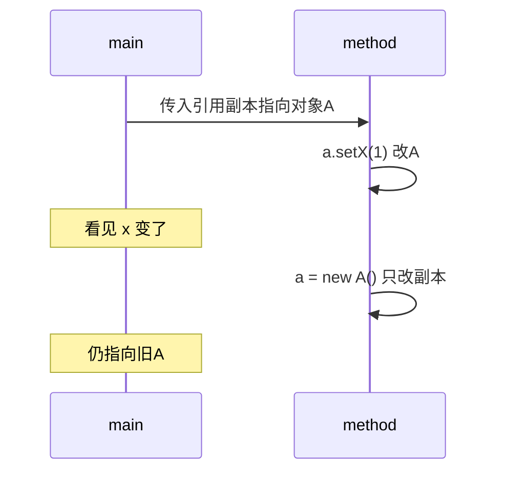

# 03 · 基本类型与包装类

> 目标：八种基本类型、拆装箱陷阱、Integer 缓存、传参模型、BigDecimal 精度讲透。

---

## 面试题

### Q1. 基本数据类型有哪些？各占多少？

| 类型 | 宽度 | 默认值（成员） | 包装类 | 备注 |
| --- | --- | --- | --- | --- |
| byte | 8 bit | 0 | Byte | |
| short | 16 | 0 | Short | |
| int | 32 | 0 | Integer | 整型默认 |
| long | 64 | 0L | Long | 字面量 L |
| float | 32 | 0.0f | Float | IEEE754 |
| double | 64 | 0.0d | Double | 浮点默认 |
| char | 16 | `\u0000` | Character | UTF-16 code unit |
| boolean | JVM 实现相关 | false | Boolean | 规范未强制 1 bit |

局部变量无「默认值」福利，必须赋值后读取。

---

### Q2. 包装类型和基本类型区别？Integer 与 int？

| 维度 | int | Integer |
| --- | --- | --- |
| 类别 | 基本类型 | 引用类型 |
| 可为 null | 否 | 能（表达缺失） |
| 进集合/泛型 | 不能直接 | 可以 |
| `==` | 比值 | 比引用（缓存区间除外表象） |
| 性能 | 无对象头 | 装箱、GC 压力 |

业务金额、需要 null 语义、进集合 → 包装；算密集循环 → 基本类型。

---

### Q3. 自动装箱拆箱原理与坑

编译器把

```text
Integer a = 1;      // Integer.valueOf(1)
int b = a;          // a.intValue()
```

**坑 1：NPE**

```text
Integer a = null;
int b = a; // 拆箱 NPE
```

**坑 2：循环里装箱** 产生大量临时对象。  
**坑 3：`==` 比较包装对象** 见缓存题。

---

### Q4. Integer 缓存池机制（高频）

`Integer.valueOf(int)`：若在 **[-128, 127]**（默认），返回缓存对象；否则 `new Integer`（实现细节随版本，语义是可能新对象）。

```text
Integer a = 127, b = 127; // valueOf，可能 a==b true
Integer c = 128, d = 128; // 常 a==b false
a.equals(b); // 比数值，正确做法
```

上限可用 `-XX:AutoBoxCacheMax` 调整。  
`Boolean`、`Byte`、部分 `Short`/`Long`/`Character` 也有缓存。

---

### Q5. 参数传递：按值还是按引用？

**只有按值。**

- 传 `int`：拷贝值，方法内改不影响实参  
- 传对象：拷贝 **引用的值**（地址副本）  
  - 通过副本调用方法改对象内部 → 外面能看见  
  - 让形参指向新对象 → 外面引用不变  



别说「对象是按引用传递」——精确说是「按引用的值传递」。

---

### Q6. Float/Double 如何判断相等？

二进制浮点有误差，`0.1+0.2 != 0.3` 一类。

```text
Math.abs(a - b) < 1e-6 // 按业务选 epsilon
```

或 `Double.compare`。  
**钱用 BigDecimal**，或整数分计算。

---

### Q7. BigDecimal 是什么？为何精度不丢？怎么用才对？

- 表示任意精度十进制：`unscaledValue` + `scale`  
- 不靠二进制浮点近似表示十进制小数  

**错误：** `new BigDecimal(0.1)` —— 传入的 double 已经脏了。  
**正确：** `new BigDecimal("0.1")` 或 `BigDecimal.valueOf(0.1)`（相对更稳妥的工厂）。  

比较：用 `compareTo`，不用 `equals`（equals 要求 scale 也相同，`1.0` 与 `1.00` equals 可能 false）。  
除法指定精度与舍入模式，否则可能抛 `ArithmeticException`。

---

### Q8. `i++` 线程安全吗？

不是。读改写三步，多线程会丢更新。用 `AtomicInteger`、`synchronized` 或 `LongAdder`。

---

### Q9. 静态变量作用？字符常量 vs 字符串常量？

静态变量：类级共享状态/常量。注意线程安全与测试隔离。  

`'A'`：`char`；`"A"`：`String` 对象，可调字符串方法，常量池可能复用。

---

### Q10. 引用类型包括哪些？包装放哪？

类、接口、数组、枚举等；包装类是类。  
另可谈引用强度：强/软/弱/虚，用于缓存与回收感知。

---

## 关联

- [[04-String]] · [[05-equals与hashCode]] · [[02-面向对象]]
