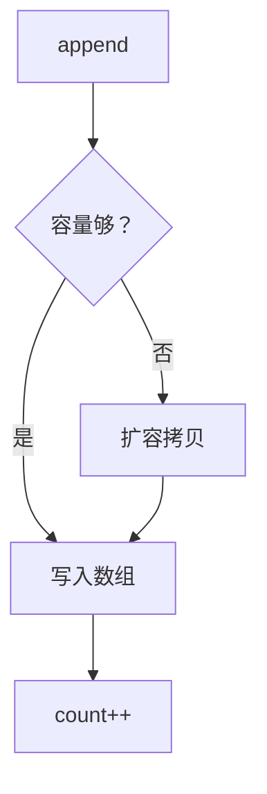

# 04 · String

> 目标：不可变原理、三者对比、常量池与 `new String`、拼接性能、JDK9 compact string 讲透。

---

## 面试题

### Q1. String、StringBuffer、StringBuilder 详细对比

| 维度 | String | StringBuilder | StringBuffer |
| --- | --- | --- | --- |
| 可变 | 不可变 | 可变 | 可变 |
| 线程安全 | 不可变天然安全 | 不安全 | 几乎所有 public 方法 synchronized |
| 场景 | 不变文本、key、少量拼接 | **单线程大量拼接** | 多线程拼接（少见，多用别的同步） |
| 继承 | implements Serializable, Comparable, CharSequence | AbstractStringBuilder | 同左 |

**选型一句：** 不变用 String；拼接入循环用 StringBuilder；别无脑 StringBuffer。

---

### Q2. String 为什么不可变？实现与好处？

**实现层面（概念）：**

- 字符数据存在内部数组（JDK8 `char[]`，JDK9+ `byte[]` + coder）  
- 数组被封装，无对外暴露能改内容的方法；类 `final` 防子类破坏  
- 操作如 `substring`/`replace` 都是 **返回新 String**（部分版本 substring 曾共享数组，后修复泄漏问题）  

**好处：**

1. 可安全共享，含字符串常量池  
2. 作 HashMap key 时 hash 可缓存，不会因内容被改导致丢键  
3. 线程安全共享只读  
4. 安全：网络路径、文件路径、反射类名等不易被篡改  

---

### Q3. StringBuilder 怎么实现的？

继承 `AbstractStringBuilder`：内部 **可扩容字节/字符数组 + count**。

1. `append`：确保容量 → 拷贝字符进数组 → count 增加  
2. 容量不足：扩容（常见 old * 2 + 2 一类策略，以源码为准）→ `Arrays.copyOf`  
3. `toString()`：基于当前内容 `new String(...)`（是否共享数组看版本；语义上得到不可变 String）  

和 ArrayList 一样是「可变数组 + 扩容摊销」。

---

### Q4. 字符串常量池？`intern`？

**常量池：** 存放/复用字符串对象，类加载时的字面量会进入池（JDK7+ 池在堆上是常见说法）。

**`intern()`：**

- 若池中已有内容相等的字符串，返回池中引用  
- 否则把当前字符串放入池并返回其引用  

用途：手动去重极端场景；滥用可能污染池。一般交给字面量机制即可。

---

### Q5. `new String("yupi")` / `new String("abc")` 创建几个对象？

分步想：

1. 字面量 `"yupi"`：若常量池 **没有**，先在池中创建 String（内容 yupi）  
2. `new String(...)`：在 **堆** 上再创建一个 String 对象，构造时通常拷贝内容  

因此：

- 池中原先没有该字面量：**2 个** String 对象（池 1 + 堆 1）  
- 池中已有：`new` 仍创建 **1 个** 堆对象，字面量复用池中已有  

面试常追问：`String s = "a" + "b"` 编译期可能直接优化成 `"ab"` 一个字面量。

---

### Q6. 拼接用 `+` 还是 StringBuilder？

| 场景 | 建议 |
| --- | --- |
| 编译期常量 `"a"+"b"` | 编译器折叠，OK |
| 少量可读拼接 | `+` 可读性好；javac 可能生成 Builder |
| **循环中拼接** | 显式 `StringBuilder`，避免反复创建中间对象（旧实现尤其） |
| 并发拼接 | 别用共享 StringBuilder；用线程封闭或 StringBuffer/别的结构 |

JDK9+ 字符串拼接用 `invokedynamic` 策略，性能好于老版本简单 `+`，但循环里仍推荐 Builder，意图清晰、可控容量。

---

### Q7. String.equals 与 Object.equals

Object 默认比较引用。  
String 重写为长度与内容（按 coder 比较字节/字符）。  
**恒等式：** 先比引用，再比内容，短路径优化。

---

### Q8. 为什么 JDK9 改成 byte[]？

**Compact Strings：**

- 若字符串可用 Latin-1 表示，用 **1 字节/字符** 存，`coder=LATIN1`  
- 否则用 UTF-16，`coder=UTF16`，2 字节/字符  

多数业务文本偏英文/数字/Latin，**内存显著下降**，GC 压力降低。  
对调用方仍是 Unicode 字符语义；`length()`/`charAt` 等负责解释 coder。

---

### Q9. String 为何适合做不可变类典范？与缓存 hash

String 缓存 `hash` 字段：首次 `hashCode()` 计算后写入，后续 O(1)。  
若可变，hash 变了会导致 HashMap 找不到 —— 不可变保证了这件事。

---

## 关联

- [[03-基本类型与包装类]] · [[05-equals与hashCode]] · [[09-序列化]]
