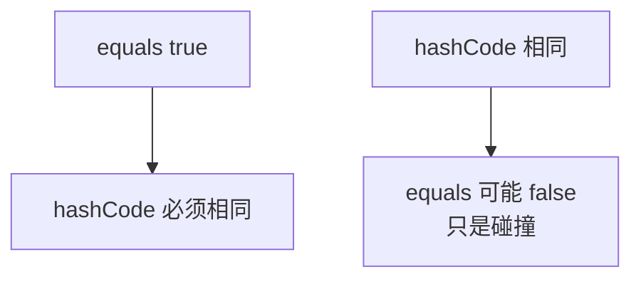

# 05 · equals 与 hashCode

> 目标：`==`/equals/hashCode 约定、重写模板、不可变类设计讲清，并能联系 HashMap。

---

## 面试题

### Q1. `==` 和 `equals` 区别？

| 操作数 | `==` | `equals` |
| --- | --- | --- |
| 基本类型 | 比数值 | 需装箱后调 equals（少这么写） |
| 引用类型 | 是否 **同一对象** | Object 默认同 `==`；可重写为逻辑相等 |

`Integer`/`String` 等已重写 equals 为按内容。  
**空指针：** `a.equals(b)` 若 a 可能 null，用 `Objects.equals(a,b)`。

---

### Q2. hashCode、equals 与 `==` 各自职责？

- `==`：身份（或基本值）  
- `equals`：逻辑相等（业务定义）  
- `hashCode`：整数哈希，供哈希表快速分桶  

HashMap 定位：先 `hashCode` 找桶，再桶内 `equals` 确认。

---

### Q3. hashCode 与 equals 必须遵守的约定（背下来）

1. **自反、对称、传递、一致**（equals 契约）  
2. 同一对象多次 `hashCode` 要一致（除非改了参与计算的状态——所以 key 要不可变）  
3. **equals 为 true ⇒ hashCode 必须相等**  
4. hashCode 相等 ⇒ equals 不一定 true（允许碰撞）  

只重写 equals 不重写 hashCode → 逻辑相等对象进不了同一 HashSet「去重」，或 Map 行为怪异。



---

### Q4. 如何正确重写？举思路

参与字段：决定「相等」的业务字段。  

```text
@Override
public boolean equals(Object o) {
  if (this == o) return true;
  if (!(o instanceof User)) return false; // 或 getClass 视继承策略
  User user = (User) o;
  return Objects.equals(id, user.id);
}

@Override
public int hashCode() {
  return Objects.hash(id);
}
```

继承场景用 `instanceof` 还是 `getClass` 有设计选择；Effective Java 有专章。

---

### Q5. 什么是不可变类？如何设计？

创建后对外不可变。

**步骤：**

1. 类 `final`（或不让子类改行为）  
2. 所有字段 `private final`  
3. 无 setter  
4. 可变成员（Date、List）在构造与 getter 做 **防御性拷贝**  
5. 构造时校验不变量  

好处：线程安全共享、作 Map key 安全、推理简单。

---

### Q6. HashCode 作用再展开

- 分布均匀 → 冲突少 → HashMap 接近 O(1)  
- 计算过慢也不好（String 已缓存）  
- 阿里规范等要求：重写 equals 必须重写 hashCode  

---

## 关联

- [[../Java集合/04-HashMap|HashMap]] · [[04-String]] · [[02-面向对象]]
