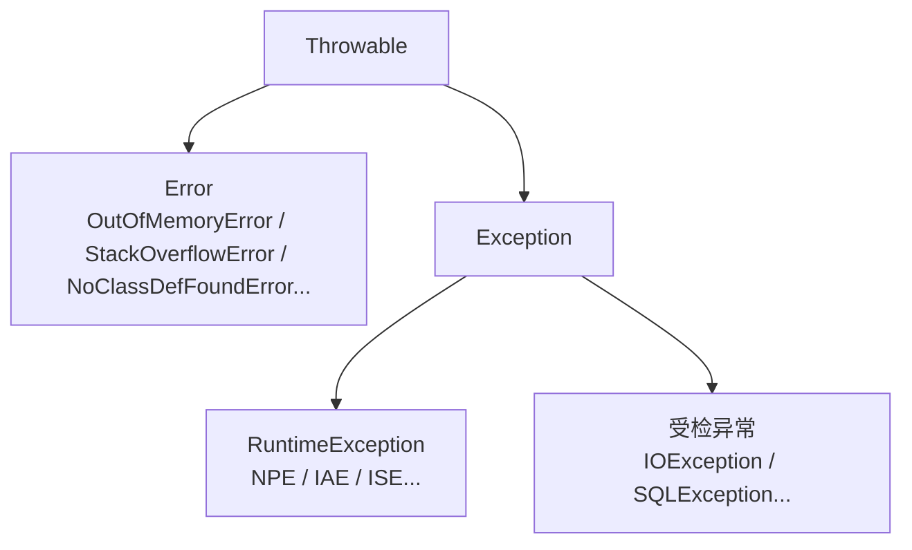
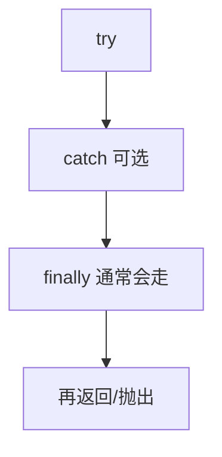

# 06 · 异常

> 目标：体系图、受检/非受检取舍、finally 真相、实践注意事项。

---

## 面试题

### Q1. Exception 和 Error 区别？



| | Exception | Error |
| --- | --- | --- |
| 含义 | 应用可恢复或应显式处理的情况 | JVM/系统级严重问题 |
| 处理 | catch 或向上声明 | 通常不应 catch 后假装恢复 |
| 例子 | 文件不存在、业务非法状态 | 堆耗尽、栈溢出 |

`NoClassDefFoundError` vs `ClassNotFoundException` 常被追问：前者多是编译期有、运行期丢了；后者是主动加载找不到（反射/Class.forName）。

---

### Q2. 受检异常 vs 非受检异常

| | Checked | Unchecked |
| --- | --- | --- |
| 类型 | Exception 且非 RuntimeException | RuntimeException 与 Error |
| 编译器 | 必须 catch 或 throws | 不强制 |
| 设计意图 | 强迫处理可恢复失败（IO/网络） | 编程错误或无法普遍恢复 |

争议：受检异常导致 throws 污染；很多框架包装成 Runtime。面试两边都能说：公共库 API 用受检要谨慎；应用层常用非受检 + 统一异常处理。

---

### Q3. throw 与 throws；处理方式

- `throw new IOException("...")`：抛出实例  
- `throws IOException`：声明方法可能抛出，调用方需处理  

处理策略：

1. 当场恢复（重试、降级）  
2. 转换为领域异常再抛  
3. 记录日志并给用户友好信息（边界层）  
4. try-with-resources 自动关闭资源  

---

### Q4. try-catch-finally；finally 一定执行吗？

**常见保证：** try/catch 结束后，在方法把控制权交回去之前执行 finally（含 return 前）。  

**不一定的情况：**

1. `System.exit`  
2. JVM 崩溃 / 断电  
3. 线程被 `stop`（已废弃）等极端  
4. finally 执行前线程一直死堵在 try  
5. 无限递归导致 StackOverflow，可能来不及  

**坏味道：** finally 里 `return` 会吞掉 try 的返回值甚至异常。用 try-with-resources 关资源更佳。



---

### Q5. 异常使用注意

1. 不空 catch、不只 `e.printStackTrace()` 到生产  
2. 不拿异常做正常分支控制流（慢、难读）  
3. 保留 cause：`new BizException("..", e)`  
4. 日志含上下文（订单号），避免泄密  
5. 边界统一处理（Spring `@ControllerAdvice`）  
6. 优先具体类型  

---

### Q6. final、finally、finalize

| 关键字/方法 | 含义 |
| --- | --- |
| final | 类不可继承；方法不可覆盖；变量一次赋值 |
| finally | 异常结构清理块 |
| finalize | GC 前回调，**已弃用**，执行不确定，用 Cleaner/try-with-resources |

---

### Q7. 什么是 try-with-resources？为什么比 finally 手动关闭更好？

这是 Java 7 引入的资源管理语法，专门解决「文件流、数据库连接、Socket 等资源容易忘记关」的问题。

```java
try (BufferedReader br = Files.newBufferedReader(path)) {
    return br.readLine();
}
```

#### 它做了什么？

- `try (...)` 里声明实现了 `AutoCloseable` 的资源  
- 代码块执行完后，JVM 会自动调用它们的 `close()`  
- 即使中途抛异常，也会自动关闭

#### 为什么优于 finally？

| 写法 | 问题 / 优点 |
| --- | --- |
| `finally` 手动关 | 容易漏关；多资源嵌套啰嗦；异常处理复杂 |
| `try-with-resources` | 写法短；关闭顺序明确；异常信息保留更完整 |

#### 多资源关闭顺序

```java
try (
    InputStream in = ...;
    OutputStream out = ...
) {
    ...
}
```

- 打开顺序：从左到右  
- 关闭顺序：**从右到左**（后开的先关）

#### 异常处理细节（加分）

如果：

1. `try` 代码块抛了主异常  
2. `close()` 又抛了异常

那么：

- `try` 块里的异常是**主异常**
- `close()` 的异常会作为 **suppressed exception** 挂在主异常上

这比 finally 手写时更稳，不容易把真正的业务异常覆盖掉。

#### 和 AutoCloseable / Closeable 的关系

- `AutoCloseable` 是更通用的父接口  
- `Closeable` 继承它，主要用于 I/O，`close()` 抛 `IOException`

**口述模板：**  
> try-with-resources 是 Java 用来自动关闭资源的语法糖，适合文件流、连接、Socket 等。它比 finally 手动关闭更安全，尤其是多资源和异常叠加时，不容易漏关，也不会轻易吞掉主异常。

## 关联

- [[09-序列化]] · [[10-IO与NIO]] · [[13-其它高频题]]
