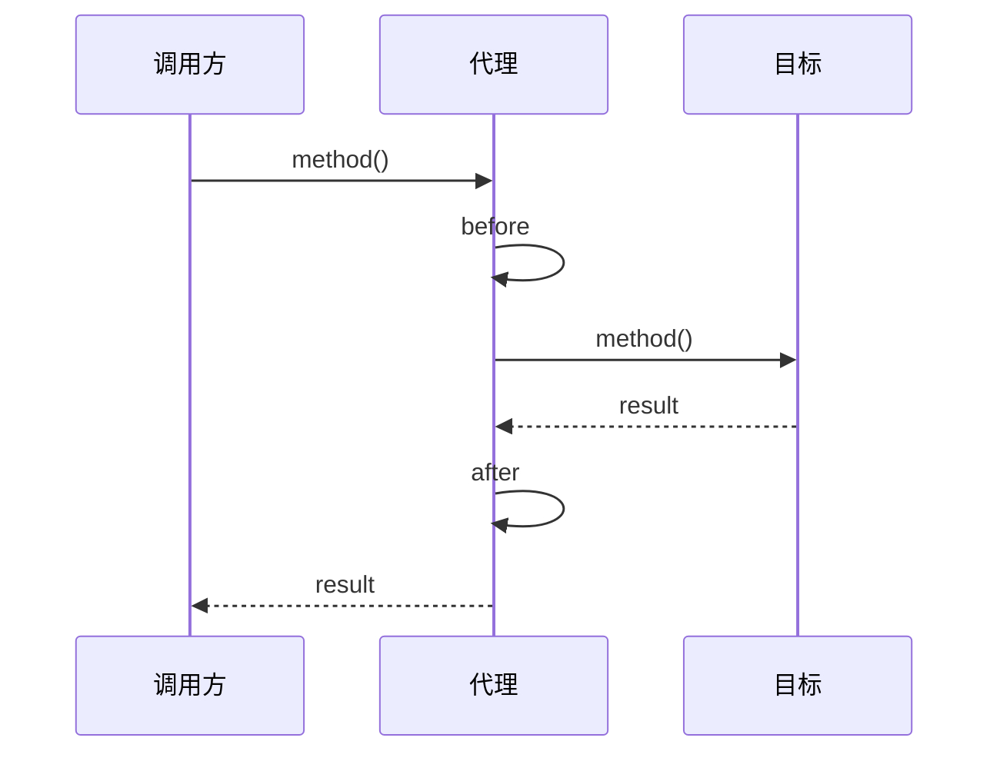

# 08 · 反射、注解、动态代理与 SPI

> 目标：反射流程与代价、注解三阶段解析、JDK/CGLIB 代理对比、SPI 与双亲委派关系。

---

## 面试题

### Q1. 什么是反射？如何获取 Class？如何用？优缺点？场景？

**定义：** 在运行时解析类元数据，动态创建对象、调用方法、访问字段。

**获取 `Class` 对象：**

1. `Class.forName("com.foo.Bar")` —— 会执行初始化（可配置）  
2. `obj.getClass()`  
3. `Bar.class` —— 不会触发同类的初始化（细节：字面量加载）  
4. `classLoader.loadClass(name)` —— 一般不初始化直到首次主动使用  

**典型用法：**

```text
Class<?> c = Class.forName("...");
Object o = c.getDeclaredConstructor().newInstance();
Method m = c.getMethod("run", String.class);
m.invoke(o, "arg");
Field f = c.getDeclaredField("x");
f.setAccessible(true);
f.set(o, 1);
```

**优点：** 框架可插拔、通用组件、与注解配合。  
**缺点：** 性能低于直接调用（可缓存 Method）；编译期检查弱；破坏封装；代码难读；安全限制。

**场景：** Spring IOC/AOP、Jackson、JDBC、测试、热插拔配置。

---

### Q2. 注解是什么？原理？解析方式有几种？

注解是 **元数据**，本身不直接改逻辑（除非被处理器/框架解读）。

**元注解：**

- `@Retention`：SOURCE / CLASS / RUNTIME  
- `@Target`：能标在哪  
- `@Documented` / `@Inherited` 等  

**原理链：** 定义 `@interface` → 编译进 class → （可选）APT 生成代码 → 运行时反射读取 → 框架据此行为。

**三种解析：**

| 方式 | 时机 | 例子 |
| --- | --- | --- |
| 反射 | 运行时 | Spring `@Autowired`、自定义注解扫描 |
| 注解处理器 APT | 编译期 | Lombok、MapStruct、Dagger |
| 字节码增强 | 编译后/加载时 | 某些 Agent、ORM |

---

### Q3. 动态代理是什么？JDK vs CGLIB？

**目的：** 不改目标类源码，在调用前后插入统一逻辑（事务、鉴权、日志、RPC）。



| 维度 | JDK 动态代理 | CGLIB |
| --- | --- | --- |
| 实现 | `Proxy` + `InvocationHandler` | 继承目标类生成子类 |
| 前提 | 必须有 **接口** | 类非 final；方法非 final |
| 调用 | 反射 invoke | FastClass 等优化，一般更快 |
| Spring | 有接口时默认 JDK（可改） | 无接口时 CGLIB |
| 限制 | 只能代理接口方法 | 构造会走子类；final 无解 |

**答题加分：** 静态代理=手写代理类；动态=运行期生成。Java 21+ 有方法句柄等演进，但面试主流仍 JDK/CGLIB。

---

### Q4. SPI 机制？

**约定：**

1. 接口在核心 API  
2. 实现方依赖 API，并在 `META-INF/services/接口全名` 写实现类名  
3. `ServiceLoader.load(接口.class)` 迭代实现  

**例子：** `DriverManager` 加载 JDBC 驱动、日志门面绑定。  

**与双亲委派：** 接口由父加载器加载，实现类往往在应用加载器 → 需 **线程上下文类加载器（TCCL）** 打破委派才能加载实现。这是 SPI「破坏双亲委派」的经典动机。

---

### Q5. synchronized 如何工作？（基础完整版）

- 锁对象：实例方法锁 `this`；静态方法锁 `Class`；块可指定对象  
- 语义：互斥 + 可见性（解锁前写入对下一把锁可见）  
- 可重入：同一线程可再次进入  
- JVM 实现：偏向锁→轻量级→重量级（随版本默认策略变化，21 等对偏向有调整，答题提「锁升级优化」即可）  

深度 AQS/Lock 放到并发专题。

---

## 关联

- [[11-类加载与双亲委派]] · [[07-泛型]] · [[02-面向对象]]
