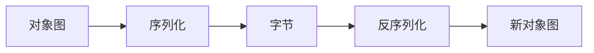

# 09 · 序列化

> 目标：机制、serialVersionUID、transient、静态字段、为何弃用 JDK 原生、安全风险。

---

## 面试题

### Q1. 序列化 / 反序列化是什么？Java 怎么做？

- **序列化：** 内存对象 → 字节流（落盘、缓存、网络）  
- **反序列化：** 字节流 → 对象  

原生：类实现 `Serializable`（标记接口），用 `ObjectOutputStream.writeObject` / `ObjectInputStream.readObject`。

注意：反序列化创建对象 **可不走公有构造**（机制特殊），字段直接恢复。

---

### Q2. Serializable 意义？serialVersionUID？

标记「允许默认序列化」。  

`serialVersionUID`：类的版本指纹。反序列化时流中的 UID 与本地类不一致 → `InvalidClassException`。  

- 不显式声明：编译器按类结构生成，**改个字段就变**，兼容性脆  
- 显式写死：你自己控制兼容演进  

---

### Q3. 为何静态变量不会被序列化？

序列化保存的是 **实例状态**。static 属于类，所有实例共享，不应也不被默认写入对象流。反序列化后静态字段仍是当前 Class 上的值。

---

### Q4. 字段不想序列化？

1. `transient`：跳过；反序列化后为默认值（0/null）  
2. 自定义 `private void writeObject/readObject`  
3. `writeReplace`/`readResolve`（单例、枚举式控制）  

敏感信息（密码）必须 transient 或根本不进对象。

---

### Q5. 局限性？为何不推荐 JDK 自带？安全问题？

**工程问题：**

1. 慢、体积大、CPU 开销高  
2. 难跨语言  
3. 兼容与调试痛苦  
4. 面向对象图深时易意外序列化过多  

**安全问题（重要）：**

反序列化会触发类加载与 `readObject` 逻辑，存在 **gadget 链** 远程代码执行历史漏洞（很多库曾中招）。  
**原则：不要反序列化不可信数据。** 用白名单 ObjectInputFilter（JDK9+）、换 JSON/Protobuf 等。

**替代：** Jackson/Gson（JSON）、Protobuf/Avro、Kryo/Hessian（注意各自安全与兼容）。

---

### Q6. 常见协议对比（简表）

| 协议 | 可读 | 性能 | 跨语言 | 备注 |
| --- | --- | --- | --- | --- |
| Java 原生 | 差 | 差 | 差 | 少用 |
| JSON | 好 | 中 | 好 | HTTP API 主流 |
| Protobuf | 差 | 好 | 好 | 要 schema |

---

## 关联

- [[08-反射注解代理与SPI]] · [[06-异常]] · [[04-String]]
