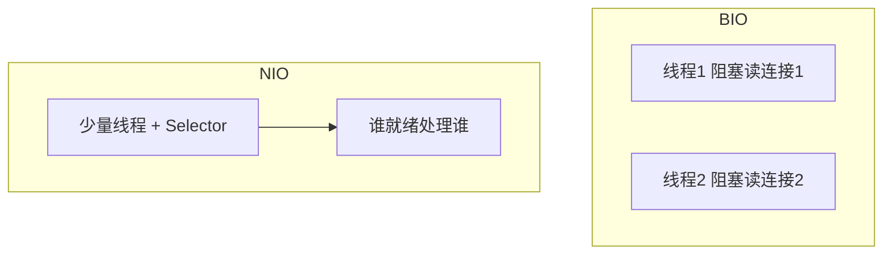
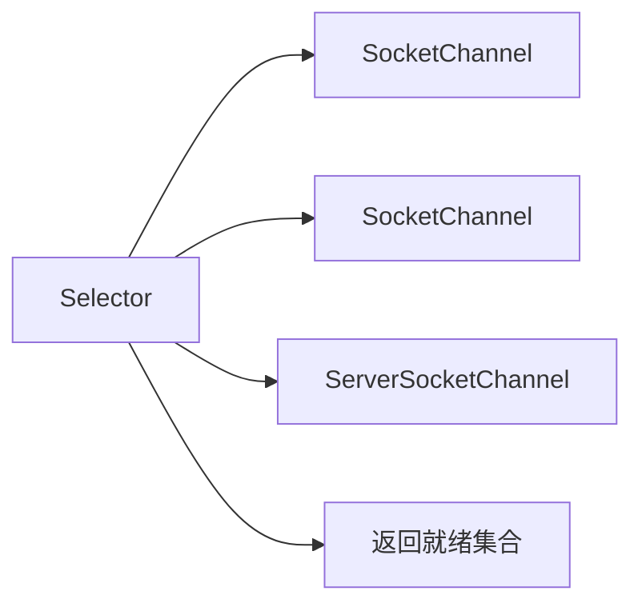

# 10 · IO 与 NIO

> 目标：字节/字符流、BIO/NIO/AIO 模型差异、Channel/Selector 角色、网络编程定位。

---

## 面试题

### Q1. 何为 I/O？Java I/O 流体系？

I/O：进程与外部设备/内核缓冲区交换数据（文件、网络、控制台）。

经典 IO（`java.io`）：

- **字节流：** `InputStream` / `OutputStream` —— 任意二进制  
- **字符流：** `Reader` / `Writer` —— 文本，内含或配合 Charset  

装饰器模式：`BufferedInputStream`、`DataOutputStream` 等层层包装。

---

### Q2. 为何区分字节流与字符流？

字节流按字节处理，不知道字符边界。  
字符流按 Unicode 字符处理，在边界做 **编码/解码**（UTF-8 等）。  

文本用字符流（或明确 Charset 的 NIO/Files API）；图片、zip、protobuf 用字节流。  
若用错误编码读文本 → 乱码（见 [[13-其它高频题]]）。

---

### Q3. BIO、NIO、AIO 是什么？怎么选？

| 模型 | 同步/异步 | 阻塞 | Java 典型 API | 特点 |
| --- | --- | --- | --- | --- |
| **BIO** | 同步 | 阻塞 | `Socket` + 流 `read` | 编程简单；一连接一线程，连接多时崩 |
| **NIO** | 同步 | 可非阻塞 | `Channel` + `Selector` + `Buffer` | 一线程多连接；事件驱动；手写复杂 |
| **AIO** | 异步 | 非阻塞 | `AsynchronousSocketChannel` | 完成后回调；Linux 实现一般，生产多用 Netty 而非裸 AIO |

**选型：** 连接少用 BIO 也行；高并发网络用 **NIO 框架（Netty）**。AIO 概念要会，项目落地少。

---

### Q4. Channel 是什么？

NIO 中与实体（文件、套接字）的连接通道，可读可写（相对流常常单向）。  

常见：`FileChannel`、`SocketChannel`、`ServerSocketChannel`、`DatagramChannel`。  

配合 **Buffer**：数据在 Channel ↔ Buffer 间搬；`flip`/`clear`/`compact` 是高频操作细节。

---

### Q5. Selector 是什么？

多路复用器：把多个 Channel 注册到 Selector，一次 `select()` 查出就绪事件（accept/connect/read/write），单线程可管理大量连接。  

这是 NIO 服务器的核心，也是理解 Netty EventLoop 的基础。

---

### Q6. Java 网络编程指什么？

在应用层用 TCP/UDP API 写客户端/服务端：监听端口、接受连接、读写字节、设计应用协议（长度前缀、HTTP、自定义 RPC）。  

层次：`java.net` 阻塞 → `java.nio` → Netty。  
协议细节见计算机网络篇章。

---

### Q7. 如何调用外部命令？注意什么？

推荐 `ProcessBuilder`：

1. 参数列表传参，**少用**一长串 shell 字符串（防注入）  
2. 消费 stdout/stderr，否则缓冲区满导致死锁  
3. 超时 `destroyForcibly`  
4. 处理平台差异（`cmd.exe` vs `/bin/sh`）  

---

## 关联

- [[../计算机网络/09-代理负载与网络IO|网络IO]] · [[13-其它高频题]] · [[01-JDK-JRE-JVM与字节码]]
