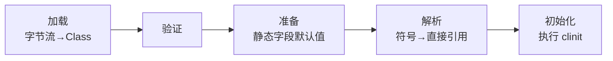
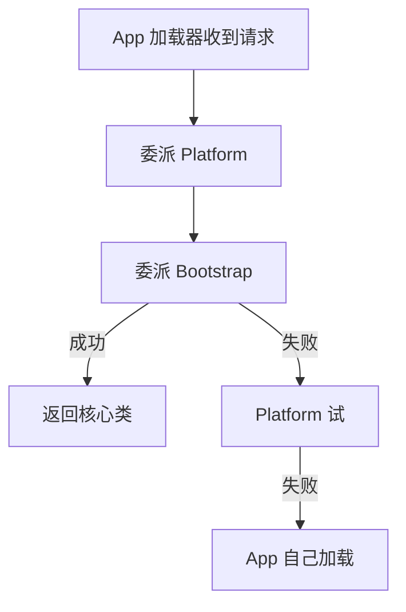

# 11 · 类加载与双亲委派

> 目标：加载-链接-初始化、主动引用、双亲委派动机与打破场景。

---

## 面试题

### Q1. 类加载过程详细说？

整体：**加载 → 链接（验证、准备、解析）→ 初始化**。使用时还有「解析可能延迟」。

**加载：** 全限定名 → 字节流（文件、网络、生成）→ 转运行时结构 → 生成 `Class` 对象。  

**验证：** 文件格式、元数据、字节码、符号引用 —— 保证不危害 JVM。  

**准备：** 为 **静态变量** 分配内存并设 **默认零值**（不是代码里的初始值）；`static final` 编译期常量可能已在常量池入库。  

**解析：** 常量池符号引用变直接引用（类、字段、方法）。  

**初始化：** 执行 `<clinit>`：静态字段赋值语句 + static 块，按源码顺序；父类先于子类初始化。

**主动引用触发初始化（常见）：** new、读/写静态字段（非常量）、调静态方法、反射、主类启动、MethodHandle 等。  
**被动引用不初始化：** 子类引用父类静态字段只初始化父类；数组定义；引用编译期常量等。

---

### Q2. 双亲委派模型？为什么？如何打破？

**流程：** 加载器先让 **父加载器** 尝试；父不能再自己加载。

**层次（概念）：** Bootstrap（JDK 核心）→ Platform/Extension → Application（classpath）。  

**为什么：**

1. 保证 `java.lang.String` 等由启动类加载器加载，**唯一且安全**，防冒牌核心类  
2. 类唯一性：同一类由不同加载器加载视为不同类  

**打破/例外：**

1. **SPI**：JDBC、ServiceLoader 用 TCCL  
2. **热部署/中间件**：Tomcat 每个 WebApp 一加载器，子先加载自己的类  
3. 自定义 `ClassLoader` 重写 `loadClass`（需谨慎）  
4. OSGi 等模块系统  

面试金句：双亲委派保证核心库不被覆盖；SPI/容器场景有意打破。

---

## 关联

- [[01-JDK-JRE-JVM与字节码]] · [[08-反射注解代理与SPI]]
