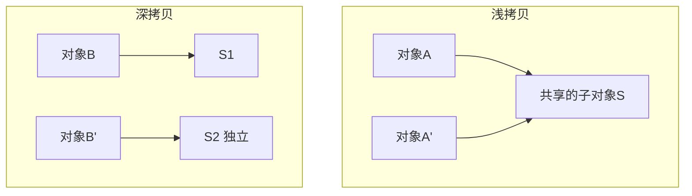

# 13 · 其它高频题

> 拷贝、内部类、乱码、wait/sleep、时间 API、语法糖等补全项，答出「为什么」。

---

## 面试题

### Q1. 浅拷贝 vs 深拷贝（展开）

**浅拷贝：** 新对象，**基本字段复制值**；引用字段复制引用 → 两对象共享堆上可变子对象。  
**深拷贝：** 引用字段也递归复制，使对象图独立。

**实现手段与坑：**

| 手段 | 注意 |
| --- | --- |
| Object.clone | 默认浅；要 Cloneable；检查异常丑；final 字段难处理 |
| 拷贝构造/工厂 | 推荐，意图清晰 |
| 序列化再反序列化 | 深拷贝能用但慢且要 Serializable |
| 第三方库 | 注意循环引用 |

有环时深拷贝要做「已拷贝映射」防无限递归。

---

### Q2. 内部类是什么？为何使用？

| 类型 | 特点 |
| --- | --- |
| 成员内部类 | 持有外部类引用，可访外部实例私有成员 |
| 静态嵌套类 | 无外部实例引用，更像「放在里面的普通类」 |
| 局部内部类 | 方法内 |
| 匿名内部类 | 一次性实现；Lambda 大量替代 |

**作用：** 封装实现细节、逻辑内聚、回调、Builder 等。  
**坑：** 非静态内部类隐式持有外部类 → 内存泄漏（尤其 Android/监听器）；能 static 就 static。

---

### Q3. 乱码为什么出现？怎么系统解决？

乱码 = **写入编码 ≠ 读取编码**（或中间被错误转码）。

链路：源代码编码 → javac → 运行 `file.encoding` → 文件/网络字节 → DB charset → 前端显示。  

**原则：全链路 UTF-8。**  

- 源文件 UTF-8  
- `Content-Type: ...; charset=utf-8`  
- JDBC URL 字符集  
- `new InputStreamReader(in, StandardCharsets.UTF_8)`  
- 不要用依赖默认编码的过时 API  

---

### Q4. wait vs sleep（细）

| 维度 | wait | sleep |
| --- | --- | --- |
| 定义位置 | Object | Thread |
| 释放监视器锁 | **释放** | 不释放 |
| 使用场所 | 必须在 synchronized 同步块/方法 | 任意处 |
| 唤醒 | notify/notifyAll/超时/中断 | 时间到/中断 |
| 用途 | 线程协作、条件等待 | 单纯让出时间片/轮询间隔 |

经典：生产者消费者用 while 判条件 + wait/notify，防虚假唤醒。

---

### Q5. 两次 start()？

线程生命周期：NEW → 一次 start 进入 RUNNABLE → … → TERMINATED。  
再次 `start` → `IllegalThreadStateException`。要再跑任务：提交到线程池或 `new Thread(...)`。

---

### Q6. 栈 vs 队列（数据结构 + Java）

| | 栈 | 队列 |
| --- | --- | --- |
| 语义 | 后进先出 LIFO | 先进先出 FIFO |
| 用途 | 递归/撤销/括号匹配 | 缓冲、BFS、消息 |
| Java | `ArrayDeque` 的 push/pop（别用 Stack 类） | `Queue`/`Deque`/`BlockingQueue` |

---

### Q7. for vs foreach；Iterator

- 传统 for：控制索引，适合 ArrayList 随机访问  
- foreach：可读；集合上基于 Iterator；删除用 `iterator.remove`/`removeIf`  
- Iterator：统一遍历协议；fail-fast 见集合篇  

---

### Q8. Date 还是 LocalDateTime？

推荐 `java.time`：

| 类型 | 用途 |
| --- | --- |
| LocalDate | 日期 |
| LocalDateTime | 本地日期时间（无时区） |
| ZonedDateTime | 带时区 |
| Instant | 时间线上瞬时点，适合存储 UTC |

`Date` 可变、API 差、隐式时区易错。实体类时间字段优先 Instant/LocalDateTime + 明确序列化格式。

---

### Q9. 语法糖有哪些？

编译器翻译的甜头：泛型、拆装箱、增强 for、可变参数、枚举、内部类、switch 字符串、try-with-resources、菱形运算符、Lambda（invokedynamic）等。  
用 `javap` 可看糖「融化」后的样子。

---

### Q10. 引用强度（软弱虚）

| 类型 | 回收时机直觉 | 用途 |
| --- | --- | --- |
| 强引用 | 不回收 | 普通对象 |
| 软引用 | 内存不足倾向回收 | 缓存 |
| 弱引用 | 下次 GC 可能回收 | WeakHashMap、规范化 |
| 虚引用 | 不能通过引用取对象，用于回收跟踪 | 堆外内存释放感知等 |

---

## 关联

- [[02-面向对象]] · [[06-异常]] · [[10-IO与NIO]] · [[04-String]] · [[00-知识总览]]
