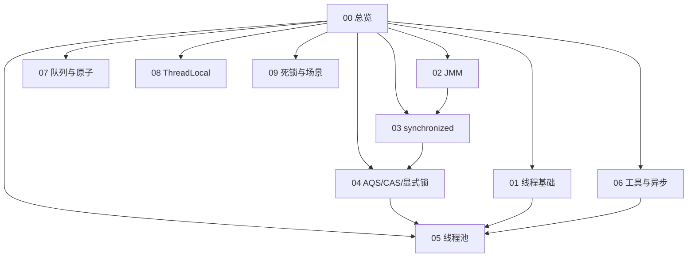

# Java 并发 · 知识总览

秋招 / 面试「Java 并发」专题（**加厚口述版**）：线程、JMM、锁升级、AQS、线程池、工具类、ThreadLocal、场景题。

查题：[[10-题单总索引]]  
集合并发：[[../Java集合/05-ConcurrentHashMap|ConcurrentHashMap]] · [[../Java集合/02-List|CopyOnWriteArrayList]]

## 一分钟心智模型

> **JMM** 规定「何时写对读可见」→ **锁 / CAS** 解决互斥与原子 → **AQS** 把同步器搭成可复用框架 → **线程池** 管线程生命周期与队列背压 → **工具类 / CF** 表达协作与异步编排 → **ThreadLocal** 做线程内上下文（池化必 `remove`）。

## 知识地图

## 建议精读顺序（面试权重）

| 优先级 | 节点 | 为什么 |
| --- | --- | --- |
| P0 | [[02-JMM可见性有序性]] → [[03-synchronized与锁升级]] | 几乎必问，区分度高 |
| P0 | [[04-AQS-CAS与显式锁]] → [[05-线程池与定时调度]] | AQS/线程池是手撕口述重灾区 |
| P1 | [[01-线程基础与通信]] → [[06-并发工具与异步]] | 开场 + 业务协作 |
| P1 | [[08-ThreadLocal专题]] | 泄漏/线程池串请求高频坑 |
| P2 | [[07-阻塞队列与原子类]] → [[09-死锁协作与场景题]] | 选型与场景题 |

## 节点一览

| 节点 | 你会讲到 |
| --- | --- |
| [[01-线程基础与通信]] | 创建方式、六态、同步/安全、通信、协程与虚拟线程、wait/notify |
| [[02-JMM可见性有序性]] | 工作内存、三性、重排、HB、volatile、final、DCL |
| [[03-synchronized与锁升级]] | Mark Word、偏向/轻量/重量、自旋、锁优化、读写锁 |
| [[04-AQS-CAS与显式锁]] | CAS/ABA、AQS 队列、ReentrantLock、StampedLock、原子类/Adder |
| [[05-线程池与定时调度]] | TPE 流程、参数、拒绝、Executors 坑、shutdown、Timer/时间轮 |
| [[06-并发工具与异步]] | Semaphore/Latch/Barrier、CompletableFuture、ForkJoin、顺序控制 |
| [[07-阻塞队列与原子类]] | BlockingQueue 全家桶、Atomic*、LongAdder、安全集合选型 |
| [[08-ThreadLocal专题]] | Map 结构、弱引用泄漏、ITL/TTL、FastThreadLocal、最佳实践 |
| [[09-死锁协作与场景题]] | 死锁四条件、子线程结果、安全集合、数仓 CDC 同步 |
| [[10-题单总索引]] | 63 题对照 |

## 口述开场模板（综合题）

面试官说「讲讲 Java 并发」时可按这条线 90 秒：

1. **问题从哪来：** 共享可变状态 → 可见性 / 原子性 / 有序性（JMM）  
2. **互斥怎么做：** synchronized 锁升级；复杂需求 ReentrantLock / AQS  
3. **无锁怎么做：** CAS、原子类、LongAdder、CHM  
4. **工程怎么用：** 线程池有界队列 + 拒绝策略；Latch/CF 编排；ThreadLocal 必清理  

然后再按对方兴趣下钻一章。
