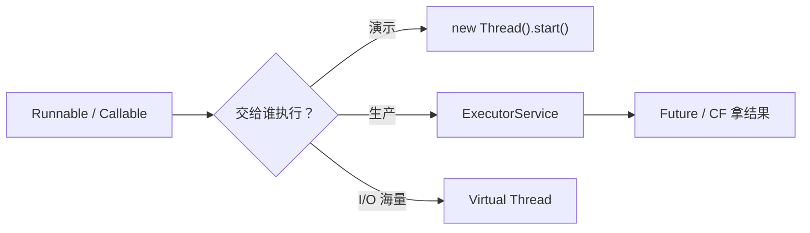
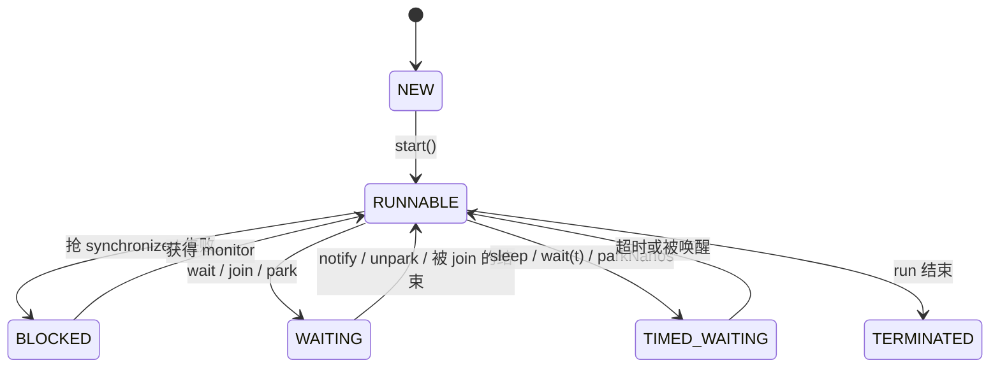
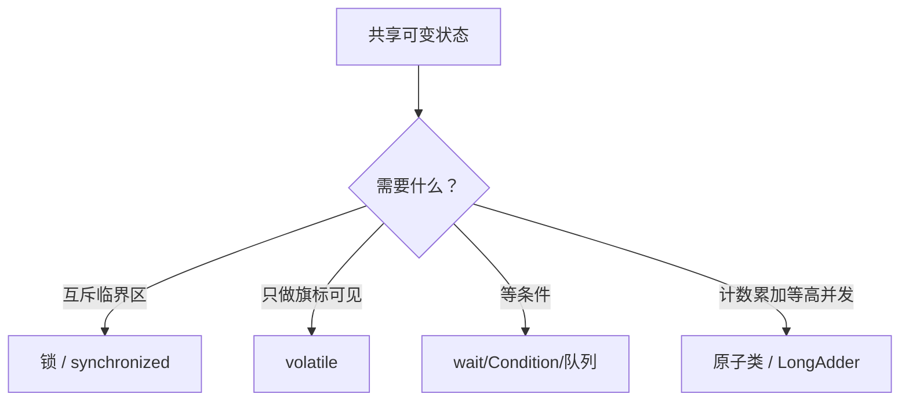
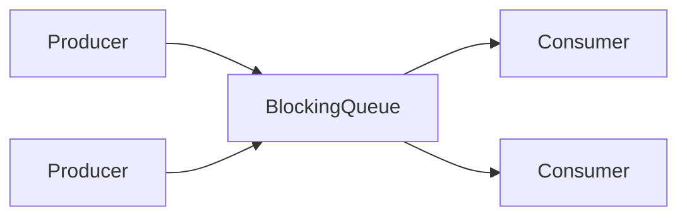
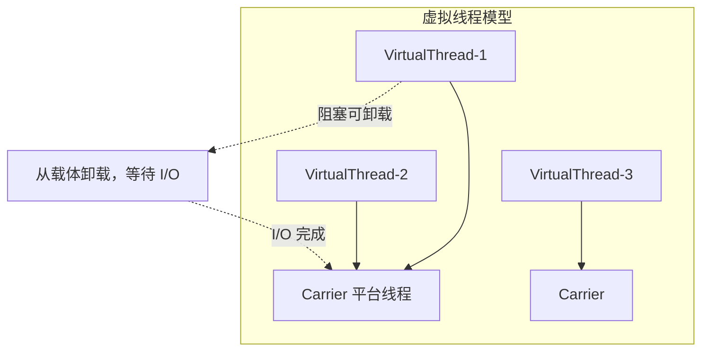
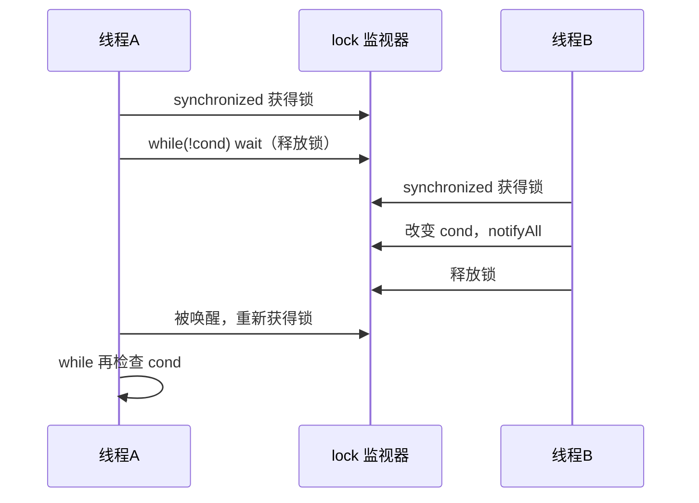

# 01 · 线程基础与通信

> 开场必问：怎么建线程、生命周期、同步 vs 安全、线程怎么协作。  
> 答法模板：**定义 → 分层/对比表 → 图或代码 → 易错点 → 一句话收束**。

---

## 一分钟口述

> Java 并发的入口是「任务怎么跑、线程处在什么态、共享状态怎么同步」。  
> 创建任务优先 `Runnable`/`Callable` + **线程池**，不要业务里到处 `new Thread`；要返回值用 `Future`。  
> 六态里 **BLOCKED 只对应 synchronized 进锁失败**；`park`/`wait` 是 WAITING。  
> 协作优先 **阻塞队列**；`wait` 必须 **while** 防伪唤醒；`interrupt` 是协作取消；`sleep` **不释放锁**。  
> Java 21 的 **Virtual Thread** 适合海量 I/O，不适合 CPU 密集，注意 **pinning**。

---

## 面试题

### Q1. Java 中如何创建多线程？

**定义：**  
「创建多线程」本质是：**定义可执行任务**，再交给 **Thread / 线程池 / 虚拟线程** 去调度执行。面试别只背四种写法，要说清推荐度与坑。

#### 原理分层

| 层次 | 你在做什么 |
| --- | --- |
| 任务抽象 | `Runnable`（无返回）/ `Callable`（有返回、可抛受检异常） |
| 执行载体 | `Thread`（平台线程）或 Virtual Thread |
| 调度与复用 | `ExecutorService` / `ThreadPoolExecutor`（生产默认） |
| 结果回传 | `Future` / `CompletableFuture` |

#### 常见方式对比

| 方式 | 写法要点 | 评价 |
| --- | --- | --- |
| 实现 `Runnable` | `new Thread(r).start()` 或丢线程池 | **首选任务形态**：任务与线程解耦 |
| 实现 `Callable` | `executor.submit(c)` → `Future` | 需要**返回值 / 异常**时用 |
| 继承 `Thread` | 重写 `run()` | 少用：占继承位、难组合 |
| 线程池 | `ThreadPoolExecutor` / `Executors`（慎用工厂默认） | **生产必用**，见 [[05-线程池与定时调度]] |
| 虚拟线程（21+） | `Thread.startVirtualThread` / `newVirtualThreadPerTaskExecutor` | I/O 密集可海量轻量线程 |

```java
// 1) Runnable：无返回
Runnable task = () -> doWork();
new Thread(task, "worker-1").start();          // 演示用
executor.execute(task);                         // 生产用

// 2) Callable + Future：有返回 / 异常
Future<Integer> f = executor.submit(() -> compute());
Integer result = f.get();                       // 阻塞拿结果；异常在 ExecutionException 里

// 3) 虚拟线程（Java 21+）
Thread.startVirtualThread(() -> handleRequest(req));
try (var exec = Executors.newVirtualThreadPerTaskExecutor()) {
  exec.submit(() -> handleRequest(req));
}
```



#### 易错点 / 追问

| 坑 | 说明 |
| --- | --- |
| 调 `run()` 而不是 `start()` | `run()` 在**当前线程同步**执行，**不会**起新线程 |
| 同一 `Thread` 二次 `start()` | 抛 `IllegalThreadStateException` |
| 只会 `new Thread` | 无界创建线程 → OOM / 上下文切换爆炸；应用线程池 |
| `Executors.newFixedThreadPool` 无界队列 | 任务堆积风险，见线程池章 |

**追问：start 和 run 底层差在哪？**  
`start()` 会向 JVM/OS 申请新的执行线索，最终由新线程调用 `run()`；直接 `run()` 只是普通方法调用。

**口述收束：**  
> 生产几乎不裸 `new Thread`，而是把 `Runnable`/`Callable` 丢线程池；要结果用 Future；Java 21 后 I/O 场景再考虑虚拟线程。

---

### Q2. 线程的生命周期在 Java 中是如何定义的？

**定义：**  
Java 用 `Thread.State` 枚举定义 **六种状态**。这是 **JVM 视角** 的状态机，和 OS 的 Running/Ready 并不一一同名（注意：**没有单独的 RUNNING**）。

#### 六态表

| 状态 | 含义 | 典型进入方式 |
| --- | --- | --- |
| **NEW** | 已 `new Thread`，尚未 `start` | 构造完成 |
| **RUNNABLE** | 可运行（含正在跑 + 等 OS 时间片） | `start()`；被唤醒后重新可跑 |
| **BLOCKED** | 等待进入 `synchronized` 监视器锁 | 抢 monitor 失败 |
| **WAITING** | 无限等待 | `Object.wait()`、`LockSupport.park()`、`join()` 无超时 |
| **TIMED_WAITING** | 限时等待 | `sleep`、`wait(t)`、`join(t)`、`parkNanos` |
| **TERMINATED** | 已结束 | `run` 正常返回或抛出未捕获异常 |



#### BLOCKED vs park（高频对比）

| 现象 | `Thread.State` | 原因 |
| --- | --- | --- |
| 卡在 `synchronized` 入口 | **BLOCKED** | 等 monitor，未进入临界区 |
| `ReentrantLock.lock()` 抢不到 | 多为 **WAITING / TIMED_WAITING** | 内部 `LockSupport.park`，**不是** BLOCKED |
| `Object.wait()` | WAITING / TIMED_WAITING | 已释放 monitor，在等待集 |
| `Thread.sleep` | TIMED_WAITING | **仍持有**已拿到的锁 |

**易错点 / 追问**

- `jstack` 里看到 `BLOCKED` → 先怀疑 synchronized 锁竞争；看到 `WAITING` 在 `park` → 可能是显式锁、阻塞队列、CountDownLatch 等。  
- RUNNABLE ≠ 正在用 CPU：可能在跑，也可能在等调度。  
- 虚拟线程在载体上卸载等待时，观测方式与平台线程略有不同（可提「不要只会背六态」）。

**口述收束：**  
> 六态以 JVM 为准；BLOCKED 专指 synchronized 进锁；ReentrantLock 等锁用 park，状态是 WAITING。

---

### Q3. 什么是 Java 中的线程同步？

**定义：**  
**同步（Synchronization）** = 协调多线程对**共享资源**的访问，保证互斥、可见、有序，避免竞态条件（race）。

#### 原理分层（四种手段）

| 层次 | 手段 | 解决什么 |
| --- | --- | --- |
| 互斥 | `synchronized`、`ReentrantLock`、读写锁 | 同时进入临界区的线程数 |
| 协作 | `wait/notify`、Condition、Latch/Barrier | 「等条件满足再继续」 |
| 可见/有序 | `volatile`、final、happens-before | 写对读可见、约束重排 |
| 无锁 | CAS、原子类、部分并发容器 | 用硬件原语减少阻塞 |



#### 同步 vs 异步（别混词）

| 词 | 含义 |
| --- | --- |
| 同步（并发语境） | 多线程协调一致地访问共享状态 |
| 同步调用（调用语境） | 调用方阻塞直到返回 |
| 异步 | 调用立即返回，结果稍后通过回调/Future 拿 |

**易错点：** 「加了 synchronized 就线程安全」——只保护了被锁罩住的那段；复合操作、发布对象、锁对象选错仍可能错。

**口述收束：**  
> 同步是协调共享访问；互斥用锁，协作用条件/队列，可见用 volatile/HB，能无锁则 CAS。

---

### Q4. Java 中的线程安全是什么意思？

**定义（Brian Goetz / 《Java Concurrency in Practice》口径）：**  
当多个线程访问一个类时，**无论运行时环境如何调度、交错**，并且不需要调用方额外同步，这个类都能表现出**正确的行为**——则称该类是线程安全的。

#### 安全级别分层（面试加分）

| 级别 | 含义 | 例子 |
| --- | --- | --- |
| **不可变** | 状态不可变，天生安全 | `String`、不可变集合 |
| **绝对线程安全** | 规范保证任意调用组合都安全（极少） | 理论上的「完全同步类」；实践中别指望 Vector 随便复合调用 |
| **相对线程安全** | 单次操作原子，**复合操作**要额外同步 | `ConcurrentHashMap`：`get/put` 安全，`check-then-act` 要 `putIfAbsent` |
| **线程兼容** | 本身不安全，但可被外部同步正确使用 | `ArrayList` + 外部锁 |
| **线程对立 / 不安全** | 多线程下即使用外锁也难正确，或设计上不打算并发 | 未文档化的非线程安全类、错误共享可变静态 |

```java
// 相对线程安全：单操作 OK，复合仍竞态
if (!map.containsKey(k)) {   // 线程 A、B 都可能通过
  map.put(k, create());      // 可能重复创建 → 用 putIfAbsent / computeIfAbsent
}
```

#### 判断题思路

1. 有没有**共享可变状态**？无 → 往往安全（局部变量、不可变、消息传递）。  
2. 有 → 要么同步/原子化，要么**不共享**（ThreadLocal、每线程一份、Actor）。  
3. 「类标了线程安全」→ 问清是**单方法**还是**不变式跨方法**也保证。

**易错点 / 追问**

- `HashMap` 并发扩容可能死循环/丢数据（JDK7 经典；JDK8 也非线程安全）。  
- `SimpleDateFormat`（旧）线程不安全；用 `DateTimeFormatter` 或 ThreadLocal。  
- 线程安全 ≠ 业务正确：库存超卖还要事务/幂等。

**口述收束：**  
> 线程安全看「任意交错下不变量是否成立」；多数并发容器是相对安全，复合操作要自己同步或用原子 API。

---

### Q5. Java 中线程之间如何进行通信？

**定义：**  
线程通信 = 一个线程把「状态/数据/事件」传递给另一个线程，并（通常）在正确的同步语义下被感知。

#### 机制对比

| 机制 | 场景 | 备注 |
| --- | --- | --- |
| 共享内存 + 锁/条件 | `synchronized` + `wait/notify`；`Lock` + `Condition` | 底层能力，易写错 |
| `volatile` / 原子变量 | 状态旗标、进度可见 | 不适合复杂条件等待 |
| 管道流 | `PipedInputStream/OutputStream` | 少用、易死锁 |
| **阻塞队列** | 生产者-消费者 | **生产首选** |
| 并发工具 | Latch、Barrier、Semaphore、Exchanger | 结构化协作 |
| Future / CF | 异步结果回传 | 编排友好 |
| 中断 | `interrupt` 协作取消 | 见下文协作取消 |

#### 生产者-消费者（必画）



```java
BlockingQueue<Task> q = new ArrayBlockingQueue<>(100);

// 生产者
q.put(task);          // 满则阻塞（背压）

// 消费者
Task t = q.take();    // 空则阻塞
```

**为何队列优于裸 wait/notify：** 队列封装了条件队列、互斥与容量；业务只表达「放/取」，少伪唤醒与锁顺序坑。

**易错点：** 无界队列当通信管道 → 生产者过快 OOM；应用有界队列做背压。

**口述收束：**  
> 通信首选阻塞队列解耦；等齐用 Latch/Barrier；要结果用 Future；旗标可见用 volatile。

---

### Q6. 什么是协程？Java 支持协程吗？

**定义：**  
**协程（Coroutine）** 是用户态可挂起/恢复的轻量执行单元，通常可在**同一 OS 线程**上多路复用，切换成本远低于内核线程。

#### 对比：平台线程 / 虚拟线程 / 传统协程

| 维度 | 平台线程（Platform Thread） | Virtual Thread（Loom） | 语言级协程（如 Kotlin） |
| --- | --- | --- | --- |
| 调度 | OS 调度 | JVM 调度到**载体线程（carrier）** | 编译器/运行库挂起状态机 |
| 语法 | `Thread`/`Runnable` | 仍是线程 API，几乎无 `async/await` | `suspend` / `async` |
| 阻塞 I/O | 卡住 OS 线程 | 多数可**卸载载体**，释放载体去跑别人 | 挂起点显式 |
| 体量 | 重（栈大、数量千级） | 轻（可百万级 I/O 并发） | 轻 |
| CPU 密集 | 适合（有限条并行） | **不适合堆海量**抢同一批核 | 同左，看调度 |



#### Pinning（针钉）要点

- 虚拟线程在 **`synchronized` 临界区** 或 **native 方法** 里阻塞时，可能 **pin** 住载体线程，无法卸载 → 吞吐退化。  
- 长时间占用建议：缩短 synchronized、改用 `ReentrantLock`、避免在 VT 里跑重 CPU。

**Java 现状口述：**

- 传统 Java **没有**一等公民协程语法。  
- **Project Loom → Virtual Thread（21 正式）**：官方给出的「线程形态的轻量并发」，语义接近协程能力，但 API 仍是线程。  
- Quasar 等第三方已过时，面试提一句即可。

**易错点 / 追问**

- 「虚拟线程 = 协程」→ 说「能力接近，模型是线程，不是 Kotlin suspend」。  
- 「上了 VT 万事大吉」→ CPU 密集仍受核数限制；线程局部缓存、TLS、pinning 仍要设计。

**口述收束：**  
> Java 21 虚拟线程让「一请求一线程」在 I/O 下可行；注意载体、pinning，别拿去硬扛 CPU 密集。

---

### Q7. Java 中 Thread.sleep 和 Thread.yield 的区别？

**定义：**  
两者都影响调度，但一个是**定时等待**，一个是**礼貌让出**（且不保证）。

| | `sleep(ms)` | `yield()` |
| --- | --- | --- |
| 作用 | 进入 **TIMED_WAITING** 至少 ms | 提示调度器：愿让出 CPU |
| 是否释放锁 | **不释放**已持有的 monitor / Lock | **不释放** |
| 保证 | 到期后变 RUNNABLE（仍要抢 CPU） | **不保证**真让出，也不保证别人立刻跑 |
| 用途 | 退避、限流、模拟耗时 | 几乎只用于演示 |
| 异常 | 可被中断 → `InterruptedException` | 无 |

```java
synchronized (lock) {
  Thread.sleep(1000); // 坑：睡着期间仍然占着 lock！
}
```

**易错点：** 在持锁时 sleep → 放大锁持有时间，极易拖垮吞吐；持锁等待应用 `wait`/Condition（会释放锁）或立刻出临界区再 sleep。

**口述收束：**  
> sleep 是限时等待且不释放锁；yield 只是提示、无保证；业务协作别靠 yield。

---

### Q8. Java 中 Thread.sleep(0) 的作用是什么？

**定义：**  
规范语义是睡眠 **至少 0 毫秒**；实现上常变成一次**调度点 / 让出时间片**的机会。

#### 原理分层

1. 仍走 sleep 路径，状态上可进入 TIMED_WAITING（极短）。  
2. 效果类似「比 `yield()` 稍有确定性的让步」：触发重新调度，便于同优先级其它线程运行。  
3. **不释放锁**；调用返回后仍可能立刻被调度回来。  
4. 不是公平锁，也不是可靠的「轮转保证」。

**对比**

| API | 可靠协作？ | 释放锁？ |
| --- | --- | --- |
| `sleep(0)` | 否，仅调度提示 | 否 |
| `yield()` | 更弱 | 否 |
| `wait` / Condition / 队列 | 是 | wait 会释放对应 monitor |

**易错点：** 用 `sleep(0)` 做忙等避让或「防止饿死」→ 不可靠；真正协作请用队列与条件变量。

**口述收束：**  
> `sleep(0)` 多半是触发一次调度的小技巧，业务上几乎不依赖；不释放锁。

---

### Q9. Java 中的 wait、notify 和 notifyAll 方法有什么作用？

**定义：**  
三者是 **Object** 监视器方法：在**已持有该对象 monitor** 的前提下，让线程在等待集上休眠或被唤醒，用于**条件协作**。

| 方法 | 作用 |
| --- | --- |
| `wait()` | **释放** monitor，进入等待集；被唤醒后**重新抢锁**再继续 |
| `wait(timeout)` | 限时等待 |
| `notify()` | 唤醒**一个**等待者（选哪个不确定） |
| `notifyAll()` | 唤醒**所有**等待者（大家再抢锁、再判条件） |

#### 必须 while、伪唤醒、notify vs notifyAll

```java
synchronized (lock) {
  while (!condition) {      // 必须 while，禁止 if
    lock.wait();            // 释放锁；醒来后要重新检查条件
  }
  // 条件成立，干活
  // ...
  lock.notifyAll();         // 条件可能影响多类等待者时用 All
}
```

| 概念 | 说明 |
| --- | --- |
| **伪唤醒（spurious wakeup）** | 规范允许未 notify 也从 wait 返回 → 所以必须循环重判条件 |
| **为什么不能 if** | 唤醒后条件可能仍不成立（别人先改了、或伪唤醒） |
| **notify vs notifyAll** | 多种等待条件共用一个锁时，`notify` 可能唤醒「错的人」导致大家都挂；安全默认 **notifyAll**（或改用多个 Condition） |



#### 与 Condition / 队列对比

| 方案 | 优点 |
| --- | --- |
| `wait/notify` | 语言内置，面试必考 |
| `Lock` + `Condition` | 可多条件队列，`signal` 更精确 |
| `BlockingQueue` | 业务最不容易写错 |

**易错点 / 追问**

- 未持锁调用 wait/notify → `IllegalMonitorStateException`。  
- wait 会释放锁；**sleep 不会**——对比题超高频。  
- 中断：`wait` 可抛 `InterruptedException`，要恢复中断状态或向上传播。

**口述收束：**  
> wait/notify 是监视器上的条件协作；wait 必须配 while 防伪唤醒；多条件优先 notifyAll 或 Condition；能用队列就别手写。

---

## 补丁：interrupt 协作式取消（常跟 Q5/Q9 追问）

**定义：** Java 的中断是**协作**：`interrupt()` 置中断标志或打断阻塞，**不会**强制停线程。

| 场景 | 行为 |
| --- | --- |
| 跑在可中断阻塞（`sleep/wait/join/queue.take`…） | 抛 `InterruptedException`，**清除**中断标志 |
| 跑在普通代码 | 仅设标志；需自己 `isInterrupted()` / `Thread.interrupted()` 轮询 |
| 正确姿势 | catch 后要么退出，要么 `Thread.currentThread().interrupt()` **恢复标志** 再向上传 |

```java
try {
  while (!Thread.currentThread().isInterrupted()) {
    Task t = queue.take(); // 可响应中断
    handle(t);
  }
} catch (InterruptedException e) {
  Thread.currentThread().interrupt(); // 恢复标志，便于上层感知
}
```

**口述：** 中断 = 礼貌请求停止；响应中断是线程自己的责任。

---

## 关联

- [[02-JMM可见性有序性]] · [[05-线程池与定时调度]] · [[06-并发工具与异步]] · [[00-知识总览]]
