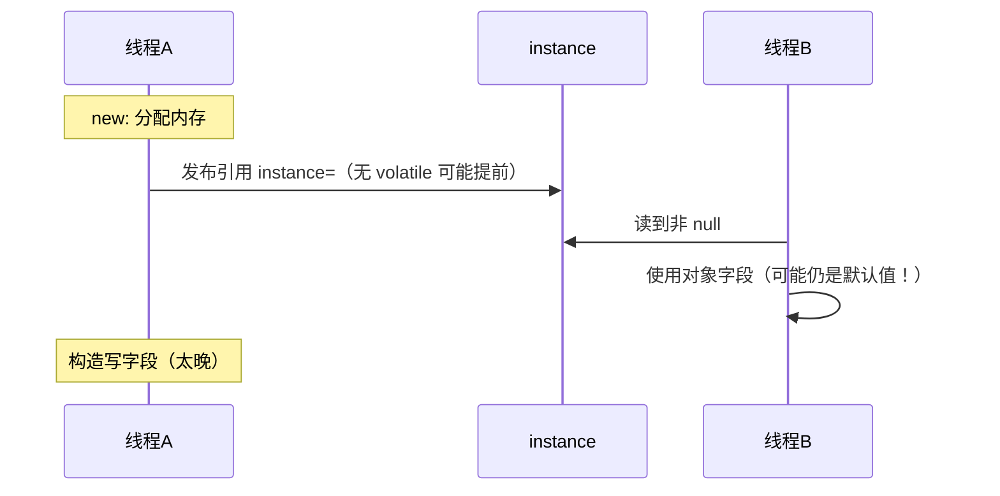
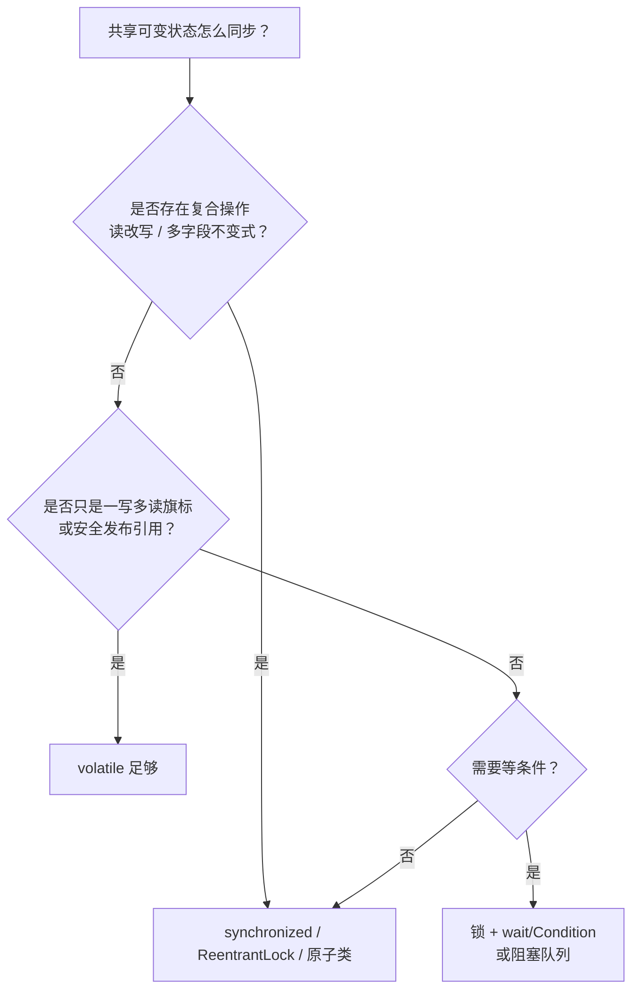
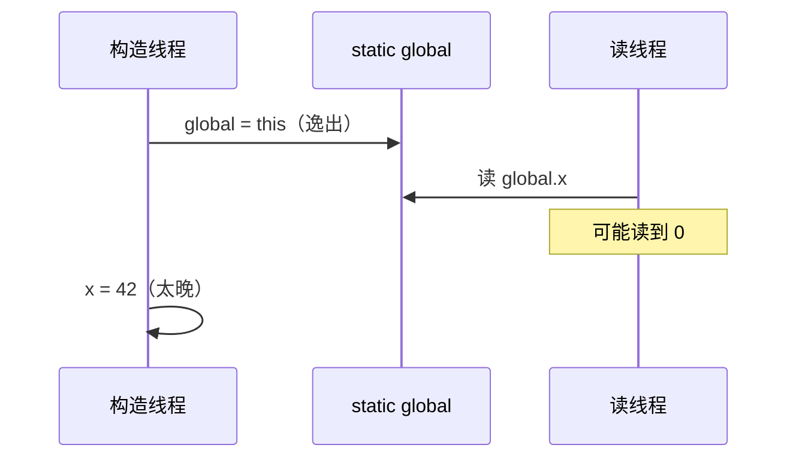

# 02 · JMM、可见性、有序性与 volatile

> 并发地基：不讲 JMM，锁和 volatile 都只能背结论。  
> 答法：**抽象模型 → 三性 → happens-before → volatile/final 选型**。

---

## 一分钟口述

> JMM 是 JVM 规范里关于「多线程如何通过内存看见彼此写」的**抽象规则**，核心契约是 **happens-before**。  
> 工作内存 / 主内存是**教学抽象**，不要和 CPU 缓存、MESI 一一等同。  
> 单线程有 **as-if-serial**；跨线程必须靠 HB（锁、volatile、start/join 等）。  
> `volatile`：可见 + 禁部分重排，**不保证** `i++` 原子；DCL 单例实例字段要 volatile。  
> `final` 有初始化安全，但 **this 逸出** 会破功。选型：旗标用 volatile，临界区/复合操作用锁或原子类。

---

## 面试题

### Q1. 什么是 Java 内存模型（JMM）？

**定义：**  
**JMM（Java Memory Model）** 是《Java Language Specification》中关于多线程内存交互的规范：规定**何时**一个线程的写对另一线程**可见**，以及哪些**重排序**合法。它是**语言/虚拟机层契约**，不是某一款 CPU 的缓存手册。

#### 原理分层

| 层次 | 内容 | 面试怎么说 |
| --- | --- | --- |
| 规范层 | happens-before、volatile/final/锁语义 | **主答这层** |
| 抽象教学图 | 主内存 + 每线程工作内存 | 帮助理解「读不到最新」 |
| 实现层 | 缓存、写缓冲、失效队列、JIT 重排 | 可举例，**别和抽象一一绑死** |
| 硬件层 | MESI、Store Buffer 等 | 加分项，声明「实现细节」 |


- 共享变量逻辑上在**主内存**。  
- 线程通过工作内存中的「副本」操作，再按规则同步回主内存。  
- **工作内存 ≠ 某块固定硬件**；它对应寄存器、CPU 缓存、编译器暂存等可能性的抽象。

#### 易错点 / 追问

| 错法 | 纠正 |
| --- | --- |
| 「JMM = 每个线程一块独立 RAM」 | 是规则抽象，不是物理分区 |
| 「可见性全靠 MESI」 | MESI 是硬件；JMM 还约束编译器重排与何时同步 |
| 只背图不背 HB | 面试官要的是 **happens-before 如何建立可见性** |

**口述收束：**  
> JMM 用 happens-before 定义跨线程可见与有序；工作内存图是抽象，别和硬件缓存混为一谈。

---

### Q2. 什么是 Java 中的原子性、可见性和有序性？

**定义：** 并发正确性常拆成三性；任一被破坏都可能出 bug。

| 性质 | 含义 | 破坏例子 | 常见保障 |
| --- | --- | --- | --- |
| **原子性** | 操作不可分割，中间态对其它线程不可见 | `i++` = 读-改-写三步 | `synchronized`、原子类、CAS |
| **可见性** | 一个线程的写，其它线程能按时看到 | 本地缓存旧值导致死循环读 flag | `volatile`、锁释放/获取、final |
| **有序性** | 观测顺序符合预期（相对 HB） | 重排导致先看到未初始化对象 | `volatile`、锁、HB 规则 |

#### as-if-serial（单线程）vs 多线程

- **as-if-serial：** 编译器/CPU 可重排，但**单线程**执行结果要「像按源代码顺序」。  
- **多线程：** 没有额外同步时，线程 B 可能看到线程 A 的**重排后**的中间态。


**易错点：** 「有序性 = 指令完全不重排」→ 错；是「在 HB 约束下对外表现有序」。

**口述收束：**  
> 单线程靠 as-if-serial；多线程三性都可能破，要用锁/volatile/原子类建立 HB。

---

### Q3. 什么是 Java 中的指令重排？

**定义：**  
编译器、JIT、CPU 为提高吞吐，可在不破坏**单线程语义**的前提下，对指令/读写重排序，或让写延迟对其他核可见。

#### 多线程下的典型危害

1. **构造未完成就发布引用** → 其它线程看见「半初始化」对象（DCL 经典）。  
2. **先写 flag 后写 data 被重排颠倒** → 读者以为数据已就绪。  
3. **循环读非 volatile 旗标** → 优化后可能「永远看不到写」。

#### 约束重排的手段

| 手段 | 作用 |
| --- | --- |
| `volatile` | 在读写处插入内存屏障语义，禁特定重排 |
| `synchronized` / 锁 | 临界区进出建立 HB |
| `final` 字段规则 | 构造内写 final，对正确发布后的读可见 |
| `VarHandle` / Fence | 显式屏障（进阶） |

```text
线程 A:                  线程 B:
  data = 42;               if (ready) {
  ready = true;               use(data);  // ready 非 volatile 时
  }                           // 可能看到 ready=true 但 data 仍是 0
```

**易错点：** 重排不只是「编译器调换两行」，还包括 CPU 乱序执行与存储缓冲区延迟可见。

**口述收束：**  
> 重排服务单线程性能；跨线程必须靠 volatile/锁/final 等规则挡住有害重排。

---

### Q4. 什么是 Java 的 happens-before 规则？

**定义：**  
若 **A happens-before B**，则：

1. A 的结果对 B **可见**；  
2. A 在观测序上**先于** B（A 的动作排在 B 之前）。  

HB 是 JMM 的**核心接口**；面试要能举例子，不要只背名单。

#### 八大规则 + 举例

| # | 规则 | 例子 |
| --- | --- | --- |
| 1 | **程序顺序** | 同线程内 `x=1; y=2;` 中前写 HB 后写 |
| 2 | **监视器锁** | `unlock(m)` HB 后续另一线程 `lock(m)` |
| 3 | **volatile** | 对 `v` 的写 HB 后续对 `v` 的读 |
| 4 | **线程 start** | `t.start()` HB `t` 中第一个动作 |
| 5 | **线程终止** | `t` 中动作 HB 其它线程检测到终止（`join` 返回等） |
| 6 | **中断** | `t.interrupt()` HB `t` 检测到中断 |
| 7 | **终结器** | 构造结束 HB `finalize` 开始（了解） |
| 8 | **传递性** | A HB B 且 B HB C ⇒ A HB C |


```java
// start 规则：主线程赋值 HB 子线程读到
int x = 1;
Thread t = new Thread(() -> System.out.println(x)); // 一定能看到 x==1
t.start();

// join 规则：子线程写 HB 主线程 join 之后读
t.join();
// 此处可见 t 里对共享变量的写入（在正确同步前提下）
```

**用法心法：** 解释「为何加锁/volatile 就安全」→ 因为建立了 HB，写对读可见且有序。

**易错点：** HB 不是运行时「墙钟时间先后」；是**偏序关系**上的可见性保证。

**口述收束：**  
> 背八条规则不如会用：锁的 unlock→lock、volatile 写→读、start/join，再靠传递性把数据写串起来。

---

### Q5. Java 中 volatile 关键字的作用是什么？

**定义：**  
`volatile` 为变量提供 **可见性** 与 **有序性（禁特定重排）**；**不提供**一般复合操作的原子性。

#### 两大作用 + 一不保证

1. **可见性：** 对 volatile 的写，对后续读该变量的线程可见（HB 规则 3）。  
2. **有序性：** 禁止该变量与周围读写的某些重排（实现上体现为内存屏障语义）。  
3. **不保证原子性：** `volatile int i; i++` 仍竞态 → `AtomicInteger` 或加锁。

#### 屏障直觉（可简述，面试加分）

| 场景 | 常见屏障语义（直觉） |
| --- | --- |
| volatile **写** 前 | 约 **StoreStore**：前面的普通写不排到 volatile 写之后 |
| volatile **写** 后 | 约 **StoreLoad**：volatile 写尽快对后续读可见 |
| volatile **读** 后 | 约 **LoadLoad / LoadStore**：后面的读写不排到 volatile 读之前 |

不必背 CPU 指令名；要说清：**写 volatile 像「发布」；读 volatile 像「订阅最新」**。

#### DCL 单例：为何实例字段要 volatile（必写代码）

```java
public class Singleton {
  private static volatile Singleton instance; // 关键：禁止「半初始化」被看到

  public static Singleton get() {
    if (instance == null) {                    // 第一次检查，无锁
      synchronized (Singleton.class) {
        if (instance == null) {                // 第二次检查
          instance = new Singleton();          // new 可能被拆成：分配 → 写字段 → 赋引用
        }                                      // 无 volatile 时，赋引用可能重排到写字段前
      }
    }
    return instance;
  }
}
```



有 `volatile` 后：发布 `instance` 的写与构造内写入建立正确有序，其它线程读到非 null 时，能看见构造完成的字段。

#### 典型适用场景

- 状态旗标：`volatile boolean shutdown`  
- DCL / 安全发布的引用  
- 一写多读的进度、配置快照（值本身原子可读）

#### long / double 非原子：历史问题

- **早期 JMM：** 非 volatile 的 `long`/`double` 允许**非原子的 64 位读写**（拆成两个 32 位），理论上可能读到「撕裂值」。  
- **`volatile long/double`：** 保证单次读/写原子。  
- **现代实践：** 仍建议对共享的 64 位字段用 `volatile` 或原子类；不要依赖「我这台机器碰巧原子」。

**易错点：** 以为 volatile 能替代锁做 `check-then-act`；以为 volatile 写会刷新「整个对象所有字段」（只保证该变量及屏障约束下的有序）。

**口述收束：**  
> volatile 管可见和有序，不管 i++；DCL 的 instance 必须 volatile；64 位共享字段历史上有撕裂风险。

---

### Q6. Volatile 与 Synchronized 的区别是什么？

**定义对比 + 选型决策树。**

| 维度 | volatile | synchronized |
| --- | --- | --- |
| 作用 | 可见 + 禁止部分重排 | **互斥** + 可见 + 有序（临界区） |
| 原子性 | 单次读/写（含 volatile long/double） | 临界区内复合操作可整体原子 |
| 阻塞 | 不阻塞 | 可能阻塞、锁升级 |
| 粒度 | 变量级 | 代码块/方法级 |
| 性能 | 通常更轻 | 竞争高时更重，但语义更强 |

#### 选型决策树



```java
// volatile OK：关机旗标
volatile boolean stopped;
void stop() { stopped = true; }
void run() { while (!stopped) work(); }

// 必须锁/原子：计数
AtomicInteger count = new AtomicInteger();
void inc() { count.incrementAndGet(); }  // 不能只靠 volatile int++
```

**一句话：** 只要可见用 volatile；有竞态更新或临界区用锁/原子类。

**易错点：** 「性能永远 volatile 更好」→ 语义不够时错误比慢更贵；「synchronized 已过时」→ 互斥场景仍是基本功。

**口述收束：**  
> volatile 轻量发布与旗标；synchronized 互斥+可见；复合更新选锁或 CAS。

---

### Q7. Java 中的 final 关键字是否能保证变量的可见性？

**定义：**  
`final` **不是**通用的「可见性关键字」，但 JMM 为 **final 实例字段** 提供了 **初始化安全（construction safety）**：在**正确构造且正确发布**的前提下，其它线程通过该对象引用读取 final 字段，一定能看到构造函数中写入的值。

#### 分情况

| 情形 | 是否有可见性保证 | 说明 |
| --- | --- | --- |
| final 实例字段 + 构造写完 + 安全发布 | **有** | 初始化安全 |
| 构造期 **this 逸出** | **可能无** | 其它线程可能看到默认值 |
| final 引用指向的**可变对象内容** | **不保证内容不变** | `final List` 仍可 `add` |
| 静态 final | 类初始化机制保证 | 类初始化有锁与 HB |
| 普通非 final 字段 | 需 volatile/锁等 | final 规则罩不住 |

#### this 逸出反例

```java
public class Escape {
  private final int x;
  static Escape global;

  public Escape() {
    global = this;          // 逸出：构造未完成就发布 this
    // 其它线程可能同时读 global.x，看到 0（默认值）
    x = 42;                 // 对 final 的写入还没发生完
  }
}
```



**正确姿势：** 构造完成后再发布引用（赋值给静态字段、放入并发容器等）；不要在构造里把 `this` 交给其它线程/注册监听器/启动新线程并默认可见。

**易错点：**

- 「有 final 就线程安全」→ 引用不可变 ≠ 对象图不可变。  
- 「final 替代 volatile」→ 不能保护构造后的可变状态更新。

**口述收束：**  
> final 提供初始化可见性，前提是无 this 逸出且安全发布；不替代锁/volatile 保护可变状态。

---

## 交叉速查

| 问题 | 看哪题 |
| --- | --- |
| 工作内存 vs 硬件 | Q1 |
| as-if-serial | Q2 |
| DCL + volatile | Q5 |
| 八大 HB | Q4 |
| volatile vs synchronized | Q6 |
| final / this 逸出 | Q7 |

---

## 关联

- [[01-线程基础与通信]] · [[03-synchronized与锁升级]] · [[04-AQS-CAS与显式锁]] · [[00-知识总览]]
