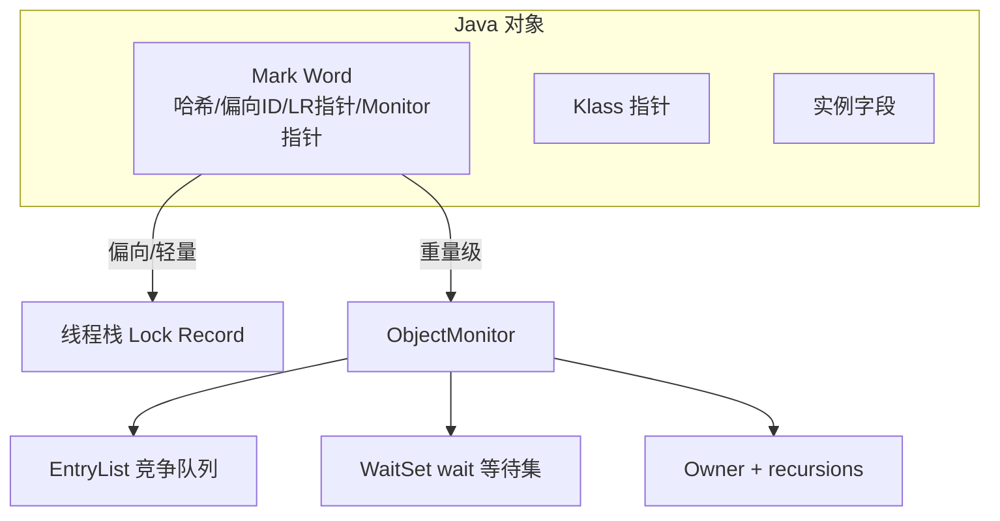
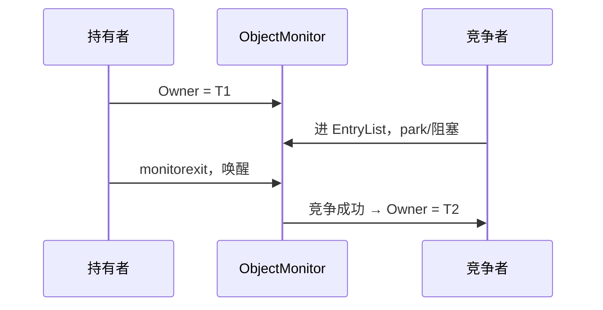
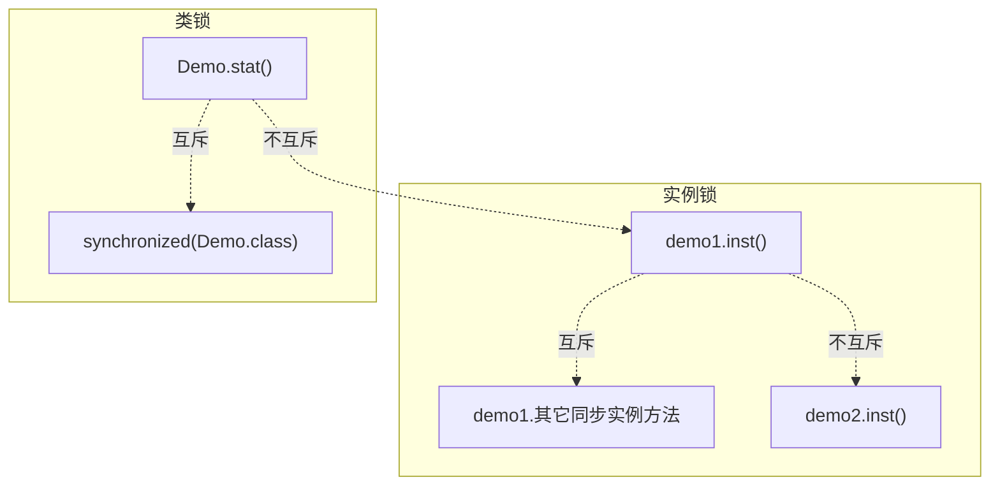
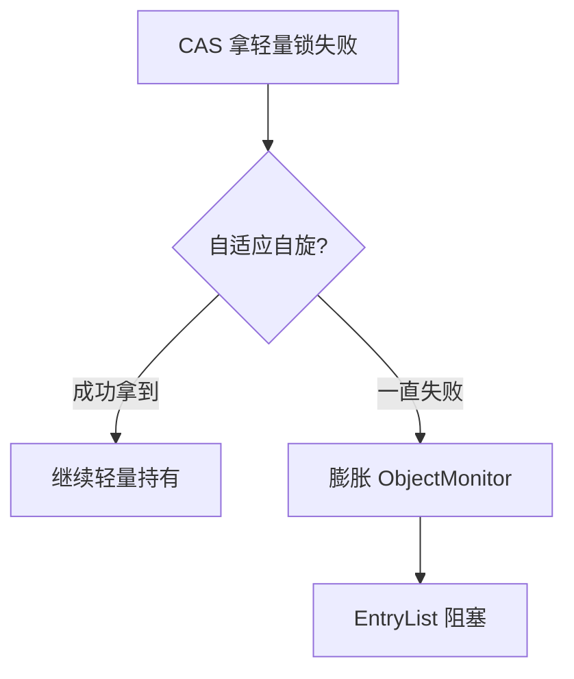
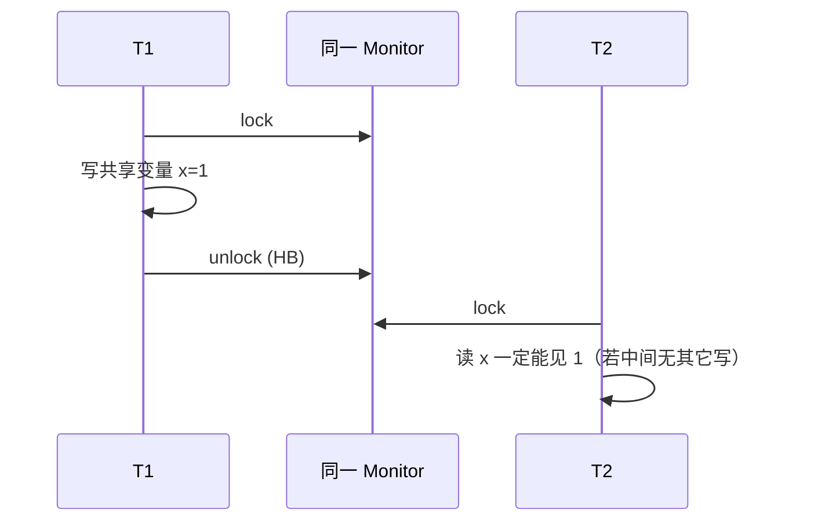
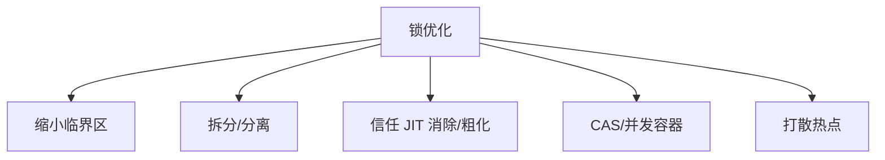
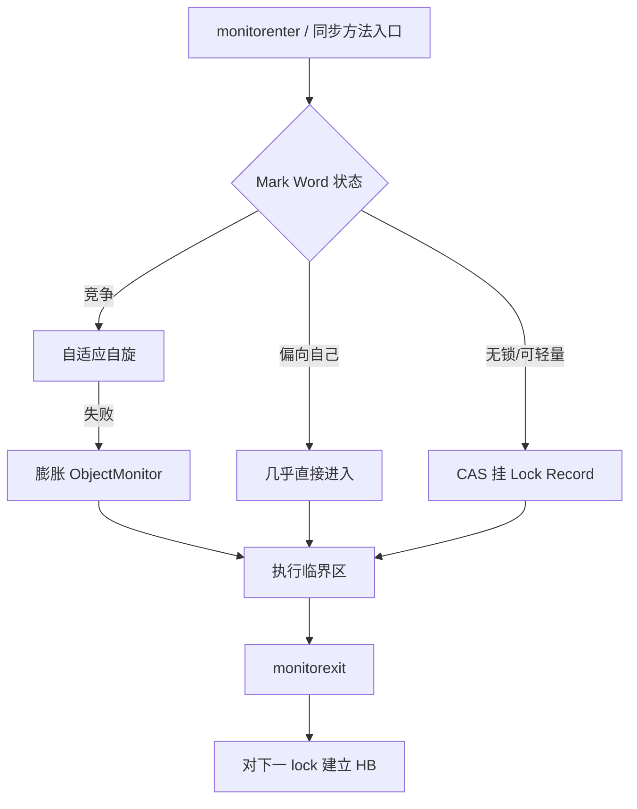

# 03 · synchronized 与锁升级

> 区分度最高的一块：对象头 Mark Word → 偏向 / 轻量 / 重量 → ObjectMonitor → 自旋与 JIT 优化 → 对比 ReentrantLock / 读写锁。  
> 前置：[[02-JMM可见性有序性]]。后续：[[04-AQS-CAS与显式锁]]。

---

## 一、总览口述（1 分钟版）

> synchronized 是 JVM 内置管程锁。字节码上代码块是 `monitorenter`/`monitorexit`，方法带 `ACC_SYNCHRONIZED`。  
> 锁状态写在对象头 **Mark Word**：无锁 → 偏向 → 轻量 → 重量，HotSpot **通常只升不降**。  
> 单线程反复进同一锁走偏向（高版本默认常关）；交替竞争用栈上 Lock Record + CAS；真竞争膨胀成 **ObjectMonitor**，线程进 EntryList 阻塞。  
> 进出 Monitor 建立 happens-before，保证可见与有序。简单互斥用它；要公平、试锁、中断、多 Condition 再用 ReentrantLock。

---

## 面试题

### Q1. Java 的 synchronized 是怎么实现的？

分四层讲：**字节码 → 对象头 Mark Word → 锁升级路径 → 重量级 ObjectMonitor**。

#### 1.1 字节码层

| 写法 | 字节码 / 标志 | 释放保证 |
| --- | --- | --- |
| 同步**代码块** | `monitorenter` / `monitorexit` | 正常路径 + 异常路径各有 `monitorexit`，防泄漏 |
| 同步**方法** | 方法访问标志 `ACC_SYNCHRONIZED` | JVM 隐式进出 Monitor，方法体不一定出现 enter/exit |
| 同步静态方法 | 同上，锁对象是 `Class` | 与实例方法锁对象不同 |

```java
// 代码块 ≈
synchronized (lock) {
  // critical
}
// 编译后伪结构：
// monitorenter lock
// try { critical } finally { monitorexit lock }
```

#### 1.2 对象头与 Mark Word 各状态位

每个 Java 对象：对象头（Mark Word + Klass 指针；数组再加 length）+ 实例数据 + 对齐填充。  
与锁相关的是 **Mark Word**（64 位机常见布局随状态切换）：

| 锁状态 | 锁标志（典型） | Mark Word 主要内容（概念） |
| --- | --- | --- |
| **无锁** | `01`（非偏向） | 哈希码、分代年龄、是否偏向等 |
| **偏向锁** | `01` + 偏向位 | **偏向线程 ID**、epoch、年龄；同线程再进几乎无 CAS |
| **轻量级锁** | `00` | **指向栈上 Lock Record（锁记录）的指针** |
| **重量级锁** | `10` | **指向 ObjectMonitor 的指针** |
| **GC 标记** | `11` | 与 GC 相关，面试少展开 |

要点列表（面试可背）：

1. **同一 Mark Word 槽位复用**：哈希码、偏向线程、轻量指针、Monitor 指针互斥占用。  
2. **偏向锁撤销 / 膨胀时**可能要「身份哈希」固化、epoch 批量撤销等。  
3. **锁标志位**是区分状态的关键；口述时说「Mark Word 里存着锁状态和指向下一层结构的指针」即可。  
4. Klass 指针指向类型元数据，**不直接参与加锁**，但静态同步锁的是 `Class` 对象本身的 Mark Word。



#### 1.3 偏向锁（Biased Locking）

**场景：** 绝大多数时候只有**同一个线程**反复进入同一把锁（单线程模块、许多库内部同步）。

机制：

1. 首次偏向：CAS 把当前线程 ID 写入 Mark Word。  
2. 同线程再进：检查 Mark Word 仍偏向自己 → **几乎零开销**（无 CAS、不阻塞）。  
3. 出现**其它线程**竞争 → **撤销偏向**（可能 STW 批量撤销，或升级为轻量/重量）。

**高版本默认关闭（面试加分）：**

| 点 | 说明 |
| --- | --- |
| JDK 15+ | 偏向锁**默认禁用**（`-XX:+UseBiasedLocking` 已过时/移除趋势） |
| 原因 | 撤销成本、与现代负载不匹配；Virtual Thread / 高并发下收益有限 |
| 面试口径 | 仍要会讲经典四级状态；并补充「生产高版本可能默认无偏向，直接轻量起步」 |

#### 1.4 轻量级锁与锁记录（Lock Record）

**场景：** 两个（少量）线程**交替**进出，竞争不激烈。

过程（概念）：

```text
1. 线程栈帧分配 Lock Record（锁记录），拷贝对象 Mark Word → Displaced Mark Word
2. CAS：期望 Mark Word 仍是拷贝内容 → 改成「指向本 LR 的指针」
3. CAS 成功 → 持有轻量级锁
4. 解锁：CAS 把 Mark Word 换回 Displaced；失败说明期间发生过竞争/膨胀 → 走重量级释放路径
```

| 概念 | 含义 |
| --- | --- |
| **Lock Record** | 栈上结构，记录锁与对象的对应关系 |
| **Displaced Mark Word** | 加锁前 Mark Word 的备份，解锁时写回 |
| **CAS 失败** | 别人已持锁或已膨胀 → 自旋或升级 |

#### 1.5 重量级锁与 ObjectMonitor

真正竞争时膨胀为重量级，Mark Word 指向 **ObjectMonitor**（C++ 层管程）：

| 字段 / 结构 | 作用 |
| --- | --- |
| **Owner** | 当前持有锁的线程 |
| **recursions / count** | 重入次数（synchronized 可重入） |
| **EntryList** | 争抢进入的阻塞线程队列（竞争者） |
| **WaitSet** | 调用 `Object.wait()` 后进入的等待集 |
| **cxq / WaitSet 变体** | 实现细节因版本而异；口述抓「进锁队列 + wait 队列」即可 |

线程抢不到锁 → **OS 级阻塞**（`Thread.State.BLOCKED`）；`wait` → `WAITING`/`TIMED_WAITING`，进 WaitSet，被 `notify` 后还要再争 Owner。



#### 1.6 锁升级总路径


| 阶段 | 适用 | 核心代价 |
| --- | --- | --- |
| 偏向 | 单线程反复 | 极低；撤销贵 |
| 轻量 | 交替、短临界区 | CAS + 栈记录 |
| 重量 | 真竞争 | 用户态↔内核态、阻塞唤醒 |

**口述（约 2 分钟）：**  
> synchronized 本质是对象关联 Monitor。字节码代码块是 monitorenter/exit，方法是 ACC_SYNCHRONIZED。Mark Word 存锁状态：偏向记线程 ID，轻量指向栈上 Lock Record，重量指向 ObjectMonitor（Owner、EntryList、WaitSet）。竞争从低到高升级，HotSpot 为了少走 OS 互斥才分层。高版本偏向常默认关，但仍是经典面试模型。

**追问：**

- Mark Word 里哈希码和偏向能同时存吗？→ **不能同时以「完整身份哈希 + 偏向」常态共存**；需要哈希时常导致偏向撤销等处理。  
- wait/notify 在哪个阶段？→ **重量级 Monitor 的 WaitSet**；轻量/偏向阶段若调用 wait 会先膨胀。

---

### Q2. Synchronized 修饰静态方法和修饰普通方法有什么区别？

锁的是**不同的对象**，互不干扰。

| 修饰 | 锁对象 | 等价写法 |
| --- | --- | --- |
| 普通实例方法 | 当前实例 **`this`** | `synchronized (this) { … }` |
| 静态方法 | 该类的 **`Class` 对象** | `synchronized (Xxx.class) { … }` |
| 同步代码块 | 括号里显式指定的对象 | 任意对象，粒度更灵活 |

```java
class Demo {
  // 锁 this
  public synchronized void inst() { /* ... */ }

  // 锁 Demo.class
  public static synchronized void stat() { /* ... */ }

  public void block() {
    synchronized (Demo.class) { /* 与 stat 互斥 */ }
  }
}
```

要点：

1. **同一实例**上，多个 `synchronized` 实例方法互斥；**不同实例**不互斥。  
2. **静态同步**与「锁 Class」的代码块互斥；与「锁 this」的实例方法**不互斥**。  
3. 子类覆写并加 `synchronized`，锁的是**子类实例 / 子类 Class**，不会自动与父类「合并成一把锁」。  
4. 锁消除/逃逸分析：若 JIT 证明锁对象未逃逸到其它线程，可能**直接去掉同步**（见 Q8）。



**口述：**  
> 实例同步锁 this，静态同步锁 Class。两把锁，所以「静态同步」挡不住「实例同步」并发进临界区，这是常考坑。

**追问：**  
字符串常量 / 装箱缓存对象当锁有什么问题？→ 可能和别的代码**共用同一把锁**，导致意外互斥甚至死锁风险；锁对象应用 **private final** 专用对象。

---

### Q3. Java 中的 synchronized 轻量级锁是否会进行自旋？

**会。** 更准确分层说：

| 阶段 | 与自旋的关系 |
| --- | --- |
| 偏向 | **不靠自旋**；同线程免 CAS，遇竞争走撤销 |
| 轻量级获取 | 主要靠 **CAS** 挂 Lock Record |
| 竞争出现 / 膨胀前后 | JVM 常先让线程 **忙等自旋** 一段时间，期望持有者很快释放 |
| 自旋仍失败 | **膨胀为重量级**，进 EntryList 阻塞 |

- JDK 6 起普遍是**自适应自旋**（见 Q6），不是固定死转 N 次。  
- 「轻量级锁 = 纯自旋锁、永不阻塞」是**错的**：自旋只是过渡，竞争持续仍变重量级。



**易混对照：**

| 说法 | 对不对 |
| --- | --- |
| 「轻量级锁 = 纯自旋，永不阻塞」 | **不对** |
| 「只有重量级才可能自旋」 | 偏片面；膨胀前后都可能自旋 |
| 「偏向锁靠自旋」 | **不对** |

**口述：**  
> 轻量级阶段用 CAS；一旦有竞争，JVM 常先自适应自旋碰运气，还拿不到再膨胀成重量级阻塞。所以「轻量级会不会自旋」——会，而且自旋是为了少上重量级。

**追问：** 自旋一定好吗？→ 临界区很长或核很少时，自旋**空耗 CPU**；自适应就是在「省切换」和「省 CPU」之间按历史调。

---

### Q4. Synchronized 能不能禁止指令重排序？

**能（在锁语义范围内）。**

依据 JMM **监视器锁规则（Monitor Lock Rule）**：

> 对同一把监视器：**unlock happens-before 后续每一次 lock**。

因此：

1. 临界区内的写，对下一个成功进入**同一把锁**的线程**可见**。  
2. 进出临界区会插入必要的**内存屏障**，约束重排**跨越锁边界**。  
3. 这就是「synchronized 既互斥又有可见性」的根基。



注意边界：

| 边界 | 说明 |
| --- | --- |
| 同一监视器 | 只保证**同一把锁**上的 HB；两把不同锁之间无自动顺序 |
| 临界区内部 | 编译器/CPU **仍可重排**，只要不破坏单线程语义与锁的 JMM 约束 |
| vs volatile | volatile 管**变量级**可见/有序；synchronized 管**整段临界区**互斥 + 进出可见有序 |
| DCL | 正确同步可安全发布；无锁 DCL 仍常要 `volatile` 防重排 | 

```java
// 锁释放对下一次获取建立 HB
synchronized (lock) {
  shared = 42; // 写
} // unlock
// 另一线程：
synchronized (lock) {
  int v = shared; // 能看到 42
}
```

**口述：**  
> 能。锁的释放对另一次获取建立 happens-before，相当于禁止「把临界区里的写甩到锁外面被别人先看到」。DCL 除了用 volatile，用正确同步也能安全发布。

**追问：** 两个线程分别锁 A、锁 B 写读同一变量？→ **没有**跨锁的自动 HB，仍可能看不见；必须同锁、volatile，或其它 HB 边。

---

### Q5. 当 synchronized 升级到重量级锁后，所有线程都释放锁了，它还是重量级锁吗？

**多数口径（HotSpot / 面试标准答法）：还是重量级锁，不会降级回偏向或轻量。**

| 点 | 说明 |
| --- | --- |
| 升级路径 | 无锁 → 偏向 → 轻量 → 重量，**单向** |
| 全部释放后 | Mark Word 仍指向 ObjectMonitor（或保持重量级形态） |
| 下次竞争 | 通常直接走重量级路径 |
| 为何不降级 | 降级要处理 Monitor 生命周期、WaitSet、安全性；收益不如「已证明有竞争」继续用重量级清晰 |
| 实现细节 | JVM 可能对空闲 Monitor 做 **deflate / 复用**，但**不要**答成「竞争消失就自动回到偏向锁」 |


易混概念：

| 「锁降级」说法 | 实际指什么 |
| --- | --- |
| synchronized 重量→轻量 | HotSpot **通常不这么干** |
| ReadWriteLock 写→读 | **持锁期间**写降级为读（见 Q9），另一回事 |
| Monitor deflate | JVM 内部回收空闲管程，≠ 状态机退回偏向 |

**口述：**  
> HotSpot 里 synchronized 基本只升不降。膨胀成重量级后，即便暂时没人竞争，下一次通常还按重量级处理，不会退回偏向。

**追问：** 那偏向撤销后还能再偏向吗？→ 某些实现有 **epoch / 批量重偏向**，但是「撤销后再偏向」机制，**不是**重量级降级回偏向。

---

### Q6. 什么是 Java 中的锁自适应自旋？

**自旋：** 拿不到锁时不立刻阻塞，而是循环再试，适合「锁很快会释放」——省去用户态↔内核态切换。

**自适应自旋（Adaptive Spinning，JDK 6+ HotSpot）：**

- 自旋**次数不固定**，由 JVM 根据**该锁近期成功/失败历史**以及**持有者状态**动态调整。  
- 最近自旋容易成功 → 允许多转一会儿。  
- 最近总失败 / 持有者在跑很久 → 少转或不转，尽早阻塞，避免空耗 CPU。

| | 固定自旋 | 自适应自旋 |
| --- | --- | --- |
| 次数 | 写死或全局参数 | 按锁、按历史变化 |
| 高竞争 | 易白白烧 CPU | 更快放弃转阻塞 |
| 低竞争短临界区 | 可能不够灵活 | 常能自旋成功，少切换 |

与 JIT 的 **锁消除 / 锁粗化** 同属 JVM 对 synchronized 的运行时优化家族（Q8）。

```java
// 概念伪代码（非真实 JVM 源码）
int spins = adaptiveSpinsFor(thisMonitor);
for (int i = 0; i < spins; i++) {
  if (tryAcquireLightweightOrOwnerReleased()) return;
}
inflateToHeavyweightAndPark();
```

**口述：**  
> 自适应自旋就是聪明忙等：这把锁最近老能转两圈就拿到，就多转；老失败就别转了，直接阻塞。比固定转 10 次更合理。

**追问：** 自旋和 CAS 重试有何区别？→ CAS 重试是**无锁算法**改内存；自旋是在**等别人放锁**时的忙等策略，常服务于锁膨胀决策。

---

### Q7. Synchronized 和 ReentrantLock 有什么区别？

两者都可重入、都保证互斥与可见（锁语义），差异在**能力、API 与实现底座**：

| 维度 | synchronized | ReentrantLock |
| --- | --- | --- |
| 层次 | JVM 内置关键字 | `java.util.concurrent.locks` API |
| 释放 | **自动**（出临界区 / 异常） | **必须** `unlock`（常用 try/finally） |
| 公平性 | 非公平（内置锁） | 可选 **公平 / 非公平**（默认非公平） |
| 尝试加锁 | 不支持 | `tryLock`、`tryLock(timeout)` |
| 中断 | 等待进锁时**不可响应中断**（阻塞在 monitor） | `lockInterruptibly` |
| 多个条件队列 | 仅 Object 的 wait/notify **一套** | 多个 **Condition** |
| 实现 | Monitor + 锁升级 | 基于 **AQS**（见 [[04-AQS-CAS与显式锁]]） |
| 性能 | JDK6 后优化后通常接近；低竞争都很轻 | 高竞争、要公平/试锁时更灵活；非公平常与 sync 同级 |
| 条件判断 | 适合简单临界区 | 需要高级能力时用 |
| 监控 | `jstack` 等对内置锁信息成熟 | 可用 `getQueueLength` 等 API 观测 |

```java
// ReentrantLock 典型写法
ReentrantLock lock = new ReentrantLock(false); // 非公平
lock.lock();
try {
  // critical
} finally {
  lock.unlock(); // 绝不能漏
}

// 可中断 / 限时
if (lock.tryLock(100, TimeUnit.MILLISECONDS)) {
  try { /* ... */ } finally { lock.unlock(); }
}
```

**选用建议：**

| 场景 | 建议 |
| --- | --- |
| 简单互斥、代码块清晰 | **synchronized**，少出错 |
| tryLock、限时、公平、多条件、可中断 | **ReentrantLock** |
| 读多写少 | 考虑 ReadWriteLock / StampedLock（Q9、下一章） |

**口述：**  
> 都能互斥可重入。synchronized 自动释放、JVM 优化成熟；ReentrantLock 多了公平、试锁、中断、多 Condition，底层是 AQS。能关键字解决就不上显式锁。

**追问：** 性能谁更快？→ **没有绝对答案**；JDK6 后多数基准接近。差别更多在**功能**：需要高级能力才上 ReentrantLock，别为了「看起来高级」滥用。

---

### Q8. 如何优化 Java 中的锁的使用？

按「少持锁、少竞争、能无锁则无锁」讲；并点名 **JIT：锁消除 / 锁粗化**。

#### 8.1 工程侧清单

| 手段 | 做法 | 效果 |
| --- | --- | --- |
| **减小锁范围** | 只包真正共享的读写；耗时 I/O、RPC 挪出临界区 | 缩短持锁时间 |
| **锁拆分** | 一锁拆多锁（不同资源不同锁） | 降低碰撞概率 |
| **锁分离 / 读写分离** | `ReadWriteLock`、读多写少 | 读读并行 |
| **降低锁粒度对象** | 细粒度锁对象，避免锁整个 `this`/大对象 | 减少误互斥 |
| **无锁 / CAS** | 原子类、`ConcurrentHashMap`、Disruptor | 避免阻塞 |
| **避免热锁** | 分段、分片、队列化、ThreadLocal 缓冲再合并 | 打散热点 |
| **合适的锁类型** | 读写/StampedLock 匹配访问模式 | 少无效互斥 |
| **固定加锁顺序** | 多锁场景统一顺序 | 防死锁 |

#### 8.2 JIT：锁消除与锁粗化

| 优化 | 含义 | 条件 / 例子 |
| --- | --- | --- |
| **锁消除（Lock Elimination）** | JIT 通过**逃逸分析**证明锁对象不会被其它线程访问 → **直接删掉同步** | 方法内 `new` 的对象只在本地用，却写了 `synchronized(sb)` |
| **锁粗化（Lock Coarsening）** | 连续多次对**同一锁**的碎同步，合并成一次更大的临界区 | 循环里反复进出同一锁 → 合成一次，减少 enter/exit |

```java
// 锁消除候选：StringBuffer 若未逃逸，JIT 可能去掉其同步
public String gen() {
  StringBuffer sb = new StringBuffer();
  sb.append("a").append("b");
  return sb.toString();
}

// 锁粗化直觉：循环内多次同步 → 可能扩成一次
synchronized (lock) { /* a */ }
synchronized (lock) { /* b */ }
// ≈ 粗化为一次更大的 synchronized
```

#### 8.3 反例（面试加分）

- 在锁内做远程调用 → 持锁时间不可控，易雪崩。  
- 全局一把大锁「先保证正确」→ 扩展时成瓶颈。  
- 过度拆锁却不加锁顺序 → **死锁**。  
- 用 `String intern`、基本类型缓存对象当锁 → 意外共享。



**口述：**  
> 优化三板斧：临界区尽量小、能拆就拆、读多上读写或无锁结构；再信任 JVM 的消除和粗化。热点锁要打散，别在锁里打 RPC。

**追问：** 锁粗化会不会让临界区变大反而更慢？→ 可能；JIT 在「减少进出开销」和「拉长持锁」间权衡，口述点到即可。

---

### Q9. 你了解 Java 中的读写锁吗？

核心接口 **`ReadWriteLock`**，常用实现 **`ReentrantReadWriteLock`**（基于 AQS 共享/独占）。

| 锁 | 规则 |
| --- | --- |
| **读锁（共享）** | 多线程可同时持有读锁 |
| **写锁（独占）** | 写时排斥一切读/写 |
| 互斥关系 | 读-读共享；读-写、写-写互斥 |

#### 9.1 适用与可重入

1. **适用：** 读远多于写（本地缓存视图、配置快照等）。写很频繁时往往不如普通互斥锁。  
2. **可重入：** 读、写均可重入；同一线程要注意升级/降级规则。  
3. **锁降级（支持）：** 持有**写锁**时再获取读锁，然后释放写锁 → 仍持有读锁。  
4. **锁升级（不支持）：** 持有读锁时**不能**直接再拿写锁，会死锁（自己占着读，又等写要清掉所有读）。

#### 9.2 锁降级代码思路

目标：写完数据后，**原子地**从「独占写」转为「共享读」，中间不被其它写插进来改数据。

```java
ReentrantReadWriteLock rw = new ReentrantReadWriteLock();
Lock r = rw.readLock();
Lock w = rw.writeLock();

w.lock();
try {
  // 1. 写临界区：更新共享状态
  data = loadFromDb();
  // 2. 降级：先拿到读锁，再放写锁
  r.lock();
} finally {
  w.unlock(); // 此时仍持有读锁
}
try {
  // 3. 读临界区：安全读刚写入的数据
  use(data);
} finally {
  r.unlock();
}
```


错误示范（升级）：

```java
r.lock();
try {
  if (needRefresh) {
    w.lock(); // 危险：持有读锁再要写锁 → 易自死锁
    try { /* ... */ } finally { w.unlock(); }
  }
} finally {
  r.unlock();
}
```

#### 9.3 写饥饿

| 模式 | 行为 | 风险 |
| --- | --- | --- |
| **非公平**（默认常相关） | 读锁可能不断插队进来 | **写线程饥饿**：写一直等「没有读者」 |
| **公平** | 近似按排队顺序 | 缓解饥饿，但**吞吐下降** |

应对思路：短暂读、避免长读锁；写多时改普通互斥或分段；或评估 **StampedLock** 乐观读（下一章）。

#### 9.4 其它坑与对比

| 坑 | 说明 |
| --- | --- |
| 误升级 | 读锁里尝试写锁 → 死锁 |
| 缓存场景误用 | 读写锁保护的是内存结构；和 DB 一致性是另一回事 |
| 性能预期 | 读临界区极短、核数不多时，RW 锁开销可能反而不如 `synchronized` |
| vs StampedLock | Stamped 有乐观读，吞吐潜力更大，**不可重入**，API 更易用错 |

**口述：**  
> ReadWriteLock 读共享写独占，读多写少能提吞吐。支持写降级到读，不支持读升级到写。非公平时要小心写线程饿死；需要乐观读再考虑 StampedLock。

**追问：** 降级时为什么必须先 `readLock` 再 `writeUnlock`？→ 若先放写再拿读，中间窗口可能被**其它写**插入，破坏「我写完你接着读同一份」的原子意图。

---

## 二、原理串联专题（面试加分）

### 专题 A：一把锁从进入到释放经历什么？



### 专题 B：口述检查清单（30 秒自检）

1. 锁对象是 this 还是 Class？  
2. 当前 JVM 是否还默认偏向？  
3. 竞争形态：单线程 / 交替 / 激烈？对应偏向、轻量、重量  
4. 要不要公平、试锁、中断？→ 考虑 ReentrantLock  
5. 读多写少？→ RW 锁或 StampedLock；注意写饥饿与降级  

### 专题 C：和集合并发的交叉

- `ConcurrentHashMap` JDK8 桶头用 **synchronized**，正是细粒度内置锁（见 [[../Java集合/05-ConcurrentHashMap|ConcurrentHashMap]]）。  
- 桶内短临界区 + 不同桶并行，契合「减小锁范围」。

---

## 关联

- [[02-JMM可见性有序性]] · [[04-AQS-CAS与显式锁]] · [[09-死锁协作与场景题]]  
- 集合侧并发：[[../Java集合/05-ConcurrentHashMap|ConcurrentHashMap]]
