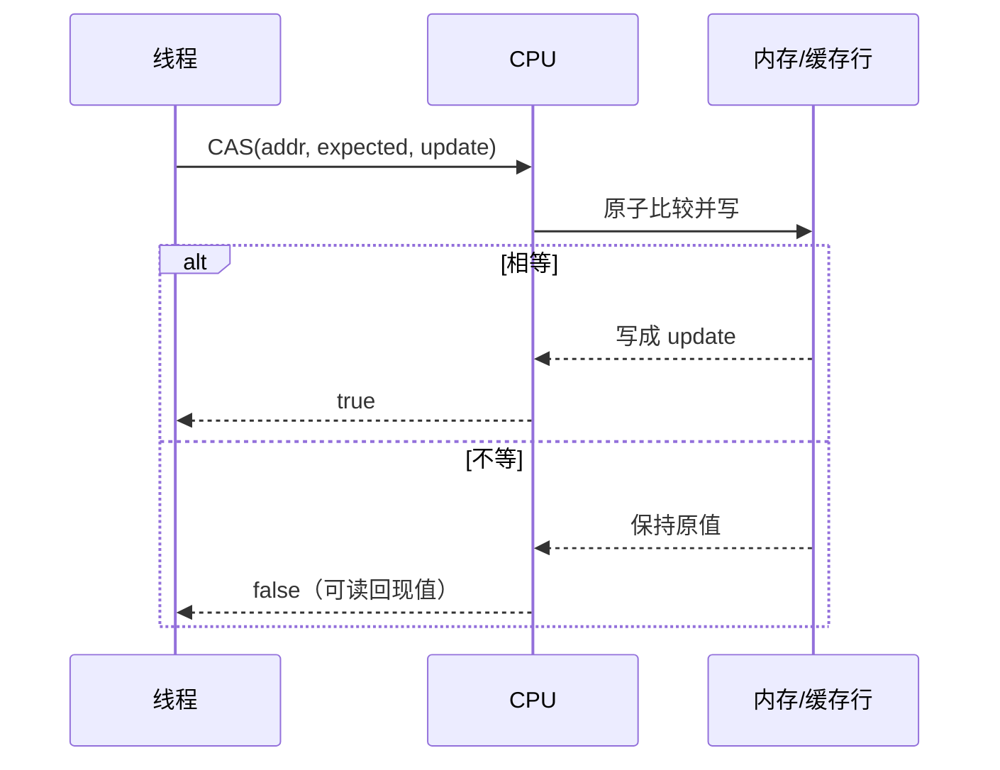
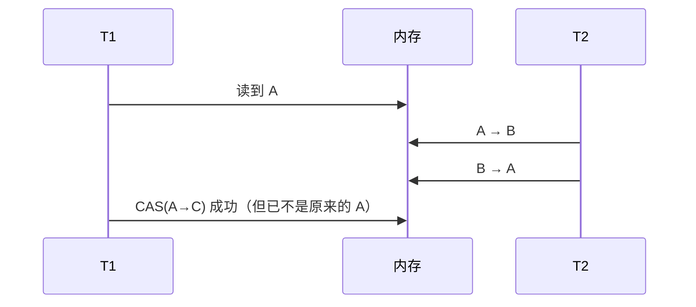
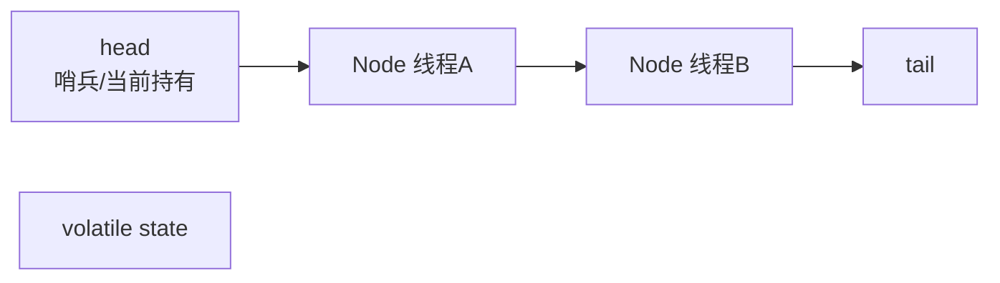
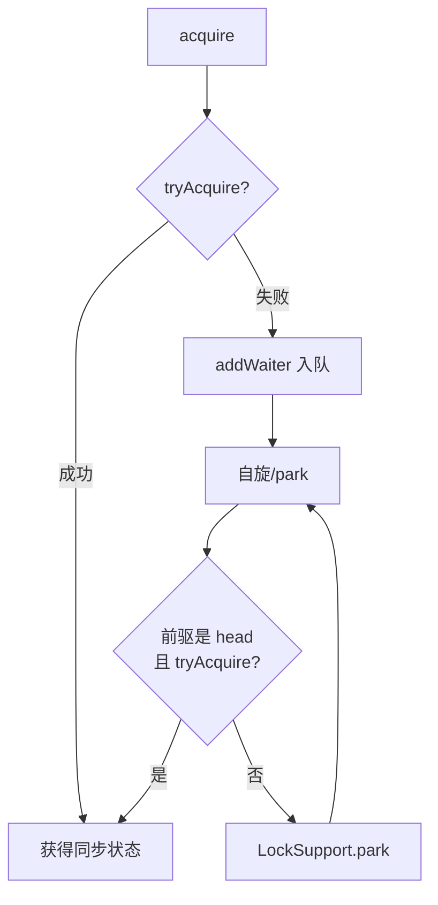
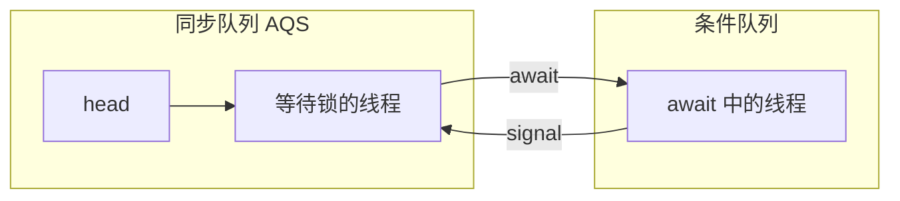
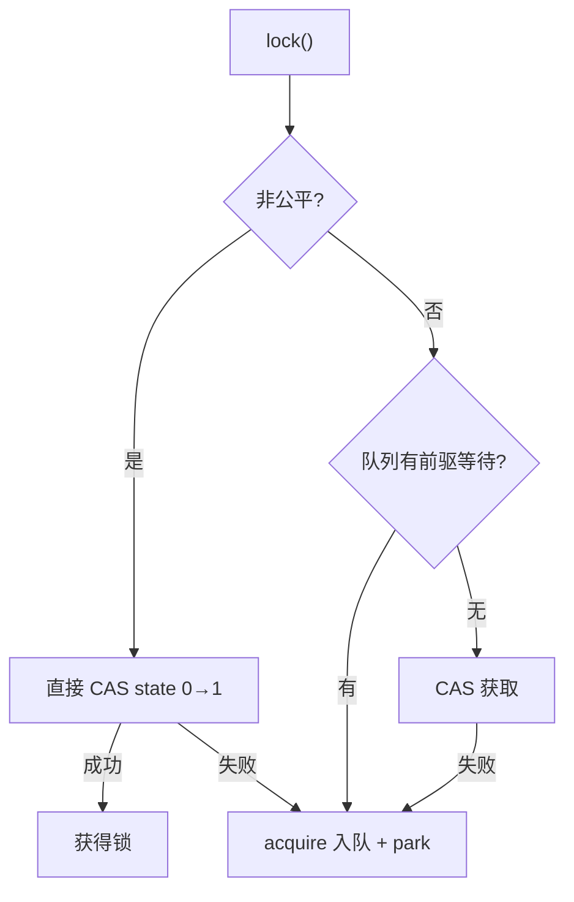
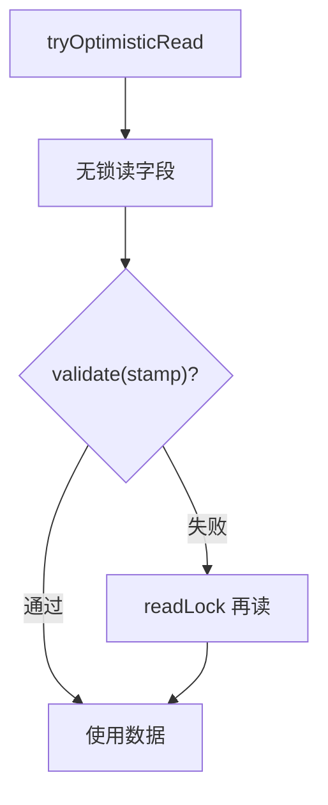
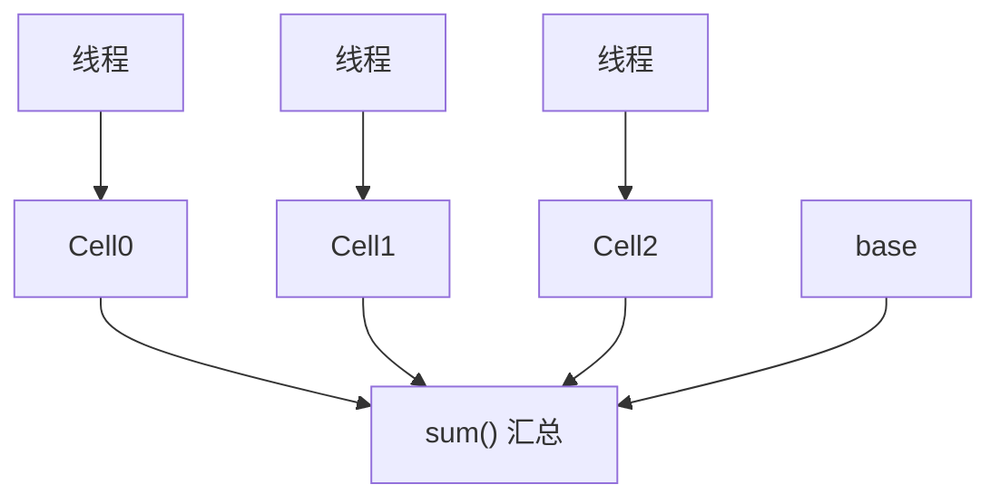
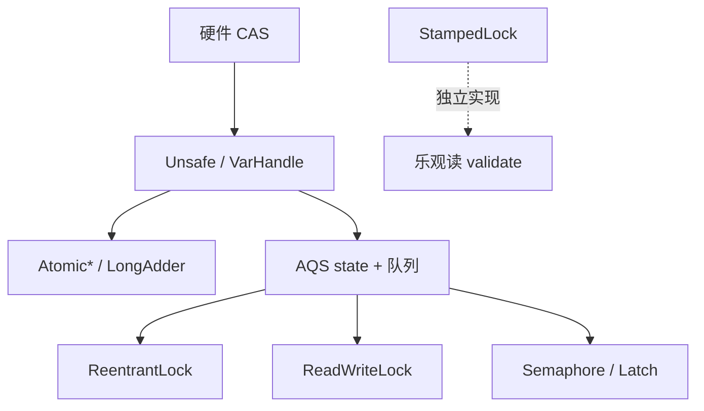

# 04 · AQS、CAS 与显式锁

> 显式锁与原子类的底座：CAS → ABA → AQS → ReentrantLock / StampedLock → LongAdder。  
> 读多写少还可对照上一章的 [[03-synchronized与锁升级#Q9. 你了解 Java 中的读写锁吗？|读写锁]]。

---

## 一、总览口述（1 分钟版）

> CAS 是 CPU 原子「比较并交换」，Java 经 Unsafe / VarHandle / 原子类暴露；失败常自旋重试，但有 ABA。  
> AQS 用 **volatile state + CLH 变体双向队列**，模板方法实现独占/共享；ReentrantLock、信号量、Latch 都建在其上。  
> ReentrantLock 默认非公平：来了先 CAS 抢；公平锁必须排队。  
> StampedLock 多乐观读 `validate`，吞吐好但不可重入、转换易错。  
> 高并发计数用 LongAdder 分段 Cell，别死磕 AtomicLong 单点 CAS。

---

## 面试题

### Q1. 什么是 Java 的 CAS（Compare-And-Swap）操作？

**CAS**：原子地「读当前值，若等于期望值则换成新值，否则失败」。对应硬件指令（如 x86 **`CMPXCHG`**，配合锁总线/缓存一致性协议保证原子），在 Java 里通过 **`Unsafe` / `VarHandle` / 原子类**暴露。

#### 1.1 硬件与语义

伪代码语义：

```text
原子执行:
  if (memory[addr] == expected)
      memory[addr] = update; return true;
  else
      return false;  // 通常带回实际值供重试
```

| 要素 | 含义 |
| --- | --- |
| 内存位置 | 要改的变量地址（字段、数组元素） |
| expected | 我认为现在应该是的值 |
| update | 想写成的新值 |



#### 1.2 Java 暴露路径

| 层 | 代表 | 说明 |
| --- | --- | --- |
| **硬件** | `CMPXCHG` 等 | 真正原子性来源 |
| **Unsafe** | `compareAndSwapInt/Object`… | JDK 内部大量使用；应用层不推荐直接用 |
| **VarHandle**（JDK9+） | `compareAndSet`、`getVolatile`… | 正规替代 Unsafe 的变量句柄 API |
| **原子类** | `AtomicInteger.compareAndSet` | 业务首选封装 |

```java
AtomicInteger n = new AtomicInteger(0);
// 内部：自旋 + CAS
n.incrementAndGet();

// 等价直觉
int prev;
do {
  prev = n.get();
} while (!n.compareAndSet(prev, prev + 1));
```

#### 1.3 自旋重试

CAS **失败不等于业务失败**——常见模式是 **循环重试**（乐观锁）：

| 场景 | 行为 |
| --- | --- |
| 低竞争 | 一两次 CAS 成功 |
| 高竞争 | 多次失败自旋，**空耗 CPU**、缓存行乒乓 |
| 缓解 | 分段（LongAdder）、退避、或改互斥锁 |

**典型用途：**

- `AtomicInteger.getAndIncrement` 内部循环  
- AQS 改 `state`、入队出队指针  
- `ConcurrentHashMap` 空桶插入、计数 Cell  

**特点小结：**

1. **乐观：** 不先加锁，冲突了再重试。  
2. **原子性：** 单次 CAS 整段不可分割。  
3. **ABA 风险：** 值变过又变回来，CAS 仍可能成功（见 Q2）。  
4. **自旋成本：** 高竞争下可能长时间空转。

**口述：**  
> CAS 就是 CPU 提供的原子比较并交换。Java 原子类和 AQS 都靠它改状态。适合冲突不高的更新；冲突高要考虑分段（LongAdder）或直接加锁。

**追问：** CAS 能保证可见性吗？→ 成功的 CAS 通常带 **volatile 语义的读写效果**（实现相关）；但复合业务不变式仍可能要锁。只 CAS 一个字段 ≠ 整图原子。

---

### Q2. 什么是 Java 中的 ABA 问题？

**ABA：** 线程 T1 读到值 A，准备 CAS 成 C；期间 T2 把 A→B→A；T1 的 CAS 仍成功，但中间状态已被破坏（例如栈顶节点被弹出又压回「同值不同身份」）。



经典场景：无锁栈、无锁链表——节点引用「看起来一样」，结构语义已变（节点可能已出栈复用，链表其它指针已乱）。

#### 对策：带戳记 / 标记

| 类 | 思路 | 典型 API |
| --- | --- | --- |
| **`AtomicStampedReference`** | 值 + **版本戳（stamp）**，CAS 同时比对引用和 stamp | `compareAndSet(expectRef, newRef, expectStamp, newStamp)` |
| **`AtomicMarkableReference`** | 值 + **一比特 mark**（常用于逻辑删除） | `compareAndSet` + mark 位 |
| 业务侧 | 禁止复用对象身份、加唯一 ID、或干脆加锁 | — |

```java
AtomicStampedReference<Node> top =
    new AtomicStampedReference<>(null, 0);

int[] stampHolder = new int[1];
Node head = top.get(stampHolder);
int stamp = stampHolder[0];
// 只有引用与 stamp 都匹配才成功
top.compareAndSet(head, newHead, stamp, stamp + 1);
```

| 方案 | 防什么 | 不够防什么 |
| --- | --- | --- |
| Stamped | 「同值不同代」 | stamp 溢出（理论，实际少见） |
| Markable | 「是否被标记过」 | 只有 1 bit，信息量少 |
| 加锁 | 整段临界区 | 吞吐可能下降 |

**口述：**  
> ABA 是 CAS 只看「值相等」不看「经历过什么」。解决办法是带版本号，用 AtomicStampedReference；只关心有没有变过可用 AtomicMarkableReference。

**追问：** LongAdder / AQS 用 CAS 改 state 怕 ABA 吗？→ 很多场景「值相同语义也相同」（纯计数 +1）ABA 无害；**指针摆链表**类结构才要命。

---

### Q3. 说说 AQS 吧？

**AQS（AbstractQueuedSynchronizer）** 是 `java.util.concurrent.locks` 的同步器框架：用一个 **`volatile int state`** + **CLH 变体的双向 FIFO 队列**，搭出锁、信号量、Latch 等。

#### 3.1 核心构件

| 构件 | 作用 |
| --- | --- |
| **`state`** | 同步状态：ReentrantLock 表示重入次数；Semaphore 表示许可数；CountDownLatch 表示剩余计数 |
| **CLH 变体队列** | 每个 Node 绑等待线程；FIFO；前驱释放时唤醒后继（相对经典 CLH 做了适合 JVM 的双向改造 + park） |
| **独占 exclusive** | 同一时刻一个线程（`acquire` / `release`） |
| **共享 shared** | 可被多个线程持有（`acquireShared` / `releaseShared`），如 Semaphore、CountDownLatch、读写锁读侧 |
| **Node.waitStatus** | `SIGNAL` / `CANCELLED` / `CONDITION` / `PROPAGATE` 等，控制唤醒与取消 |



经典 CLH 是自旋在前驱节点上；AQS 变体：**阻塞用 `LockSupport.park/unpark`**，节点双向，更适合 JVM。

#### 3.2 模板方法：子类只填「能不能抢」

| 需实现 / 重写 | 含义 |
| --- | --- |
| `tryAcquire` / `tryRelease` | 独占：能否拿到 / 释放后是否要唤醒 |
| `tryAcquireShared` / `tryReleaseShared` | 共享：返回 ≥0 表示成功等 |
| `isHeldExclusively` | 当前是否被当前线程独占（Condition 用） |

AQS 负责：**排队、阻塞、唤醒、超时、中断响应骨架**。

#### 3.3 独占 acquire 模板（重点口述）

```text
acquire(arg):
  if (tryAcquire(arg)) return;          // 快路径
  node = addWaiter(Exclusive);          // 入队
  for (;;) {
    if (前驱 == head && tryAcquire(arg)) {
      设置 head = node; return;
    }
    若需要则 park（前驱 waitStatus 设 SIGNAL）
    检查中断等
  }
```



释放：

```text
release(arg):
  if (tryRelease(arg)) {
    unparkSuccessor(head);  // 唤醒后继
    return true;
  }
```

#### 3.4 ConditionObject

- `newCondition()` → AQS 内部 **ConditionObject**。  
- `await`：释放独占锁 → 进入**条件队列** → park；`signal` 后节点**转移到同步队列** → 重新 `acquire`。  
- 可比 `Object.wait` 建**多个等待集**（有界队列 notEmpty / notFull）。



#### 3.5 基于 AQS 的常见类

| 类 | state 含义 | 模式 |
| --- | --- | --- |
| `ReentrantLock` | 重入次数 | 独占 |
| `ReentrantReadWriteLock` | 高位读计数 / 低位写 | 共享+独占 |
| `Semaphore` | 剩余许可 | 共享 |
| `CountDownLatch` | 剩余 count | 共享 |
| 线程池 Worker | 相关同步控制 | — |

**口述（约 2～3 分钟）：**  
> AQS 用一个 volatile state 表示同步状态，抢不到的线程进 CLH 变体 FIFO 双向队列，用 park 挂起。子类只要实现 tryAcquire/tryRelease（或共享版），独占还是共享由模板方法定。ReentrantLock、信号量、Latch 都是这么搭出来的。Condition 是等条件时挂到条件队列，signal 再转回同步队列抢锁。

**追问：**

- 为什么要双向队列？→ 取消节点、从尾向前找有效前驱等需要 `prev`。  
- head 为什么常是哨兵？→ 简化「谁持有 / 谁该被唤醒」的边界。

---

### Q4. Java 中 ReentrantLock 的实现原理是什么？

**本质：** 内部类 `Sync` 继承 AQS；`lock` → `acquire`，`unlock` → `release`；`state` 为 **重入计数**（0=空闲，>0=当前持有者重入次数）；`exclusiveOwnerThread` 记持有者。

#### 4.1 公平 vs 非公平（先 try CAS）

| | **非公平 NonfairSync（默认）** | **公平 FairSync** |
| --- | --- | --- |
| 加锁 | **先 CAS 抢 state 0→1**，成功直接拿锁；失败再入队 | 有等待者则**不插队**；仅当队列为空或自己是队头才 `tryAcquire` |
| 吞吐 | 通常更高（减少挂起/唤醒） | 更公平，调度与 CAS 失败更多 |
| 饥饿 | 新来的可能「插队」成功 | 基本按排队顺序 |



非公平伪代码直觉：

```java
// NonfairSync.lock 直觉
final void lock() {
  if (compareAndSetState(0, 1))
    setExclusiveOwnerThread(Thread.currentThread());
  else
    acquire(1); // 走 AQS 排队
}
```

公平则在 `tryAcquire` 里先 `hasQueuedPredecessors()`，有前驱直接失败去排队。

#### 4.2 可重入

```text
同线程再次 lock:
  state++
unlock:
  state--
  减到 0 → 清空 Owner，unpark 后继
```

非持有者 `unlock` → `IllegalMonitorStateException`。

#### 4.3 Condition

- `newCondition()` 得到 **AQS ConditionObject**。  
- `await`：释放锁、进条件队列、park；被 `signal` 后转到同步队列再重新抢锁。  
- 必须在**持锁**时 await/signal（与 wait/notify 纪律类似）。

```java
ReentrantLock lock = new ReentrantLock();
Condition notEmpty = lock.newCondition();
Condition notFull = lock.newCondition();

lock.lock();
try {
  while (count == 0)
    notEmpty.await();
  // 取元素
  notFull.signal();
} finally {
  lock.unlock();
}
```

#### 4.4 与 synchronized 对照（复习）

见 [[03-synchronized与锁升级#Q7. Synchronized 和 ReentrantLock 有什么区别？|上一章对比表]]：

| 能力 | ReentrantLock 优势 |
| --- | --- |
| `tryLock` / 限时 | 有 |
| `lockInterruptibly` | 有 |
| 公平锁 | 可选 |
| 多 Condition | 有 |
| 自动释放 | **无**，必须 finally unlock |

**口述：**  
> ReentrantLock 是 AQS 独占模式：state 记重入次数。默认非公平，来了先 CAS 插队；公平锁必须排队。unlock 要把重入减到 0 才唤醒后继。Condition 挂在同一把锁上，实现精准等待通知。

**追问：** 为什么默认非公平？→ 刚释放锁时，队头线程尚未真正调度起来，**插队 CAS** 往往能立刻让 CPU 上的线程跑进临界区，提高吞吐。

---

### Q5. 什么是 Java 的 StampedLock？

**`StampedLock`（JDK 8+）**：一种**戳记锁**——加锁成功返回 `long stamp`，解锁/验证都带上这个戳。提供三种模式，**读多写少**时往往比 `ReentrantReadWriteLock` 更猛。

| 模式 | API 印象 | 语义 |
| --- | --- | --- |
| **写锁** | `writeLock` / `tryWriteLock` | 独占，排斥一切读/写 |
| **悲观读锁** | `readLock` | 类似传统读锁，写会排斥 |
| **乐观读** | `tryOptimisticRead` + `validate(stamp)` | **不加锁**读；读后校验期间是否有写介入 |

#### 5.1 乐观读 + validate

```java
long stamp = lock.tryOptimisticRead();
// 读入局部变量（可能读到不一致中间态，先当草稿）
int x = sharedX, y = sharedY;
if (!lock.validate(stamp)) {
  // 期间有写 → 升级为悲观读，再读一遍
  stamp = lock.readLock();
  try {
    x = sharedX;
    y = sharedY;
  } finally {
    lock.unlockRead(stamp);
  }
}
// 使用 x, y
```



要点：`validate` 为 true 表示乐观读期间**没有写锁介入**；为 false 必须悲观重读，**不能**假装数据有效。

#### 5.2 优势与陷阱

| 点 | 说明 |
| --- | --- |
| 吞吐 | 乐观读无锁，读多写少时常优于 RW 锁 |
| **不可重入** | 同一线程重复加锁可能**自死锁**，别当 ReentrantLock 用 |
| **CPU 空转** | `tryXxx` 失败后自己循环重试，高竞争会空转；要有退避或改悲观 |
| **不能锁升级乱来** | 乐观读/读锁转写锁必须用 `tryConvertToWriteLock` 等；失败要按文档**释放再获取**，顺序错就死锁 |
| 无 Condition | 不支持条件队列 |
| 可维护性 | API 易用错；一般业务更稳的是 RW 锁 |

```java
// 转换写锁：失败要处理，不能假设一定成功
long stamp = lock.readLock();
try {
  while (needWrite) {
    long ws = lock.tryConvertToWriteLock(stamp);
    if (ws != 0L) {
      stamp = ws;
      // 写
      break;
    } else {
      lock.unlockRead(stamp);
      stamp = lock.writeLock(); // 重新获取
    }
  }
} finally {
  lock.unlock(stamp);
}
```

**口述：**  
> StampedLock 多了乐观读：先不加锁读，再用 stamp 校验有没有写过；失败再升级成悲观读。吞吐好，但不可重入，转换写锁容易写错，竞争高时自旋还费 CPU。缓存那种读多写少可以考虑，一般业务更稳的是 ReentrantReadWriteLock。

**追问：** 乐观读期间读到的字段能直接写回数据库吗？→ **不行**；未 `validate` 通过前只能当草稿，通过后仍要注意业务层一致性。

---

### Q6. 你使用过 Java 中的哪些原子类？

按家族答，体现「知道选型」：

#### 6.1 基本类型 / 引用

| 类 | 用途 |
| --- | --- |
| `AtomicInteger` / `AtomicLong` / `AtomicBoolean` | 单变量 CAS 更新、计数、旗标 |
| `AtomicReference<V>` | 原子换引用 |
| `AtomicStampedReference` / `AtomicMarkableReference` | 解决 ABA（见 Q2） |

常用方法：`get`、`set`、`compareAndSet`、`getAndIncrement`、`updateAndGet` / `accumulateAndGet`（JDK8+ 函数式更新）。

```java
AtomicInteger c = new AtomicInteger();
c.updateAndGet(x -> x * 2 + 1);
```

#### 6.2 数组

| 类 | 用途 |
| --- | --- |
| `AtomicIntegerArray` / `AtomicLongArray` / `AtomicReferenceArray` | 数组元素级 CAS，比「整数组一把锁」细 |

#### 6.3 字段更新器（少新建原子包装对象）

| 类 | 用途 |
| --- | --- |
| `AtomicIntegerFieldUpdater` 等 | 对 **volatile int/long/引用字段** 做原子更新，省对象头；字段必须 volatile |

```java
static final AtomicIntegerFieldUpdater<Node> F =
    AtomicIntegerFieldUpdater.newUpdater(Node.class, "status");
// Node.status 必须是 volatile int
```

#### 6.4 累加器（高并发计数优先）

| 类 | 用途 |
| --- | --- |
| `LongAdder` / `DoubleAdder` | 分散热点的累加，见 Q7 |
| `LongAccumulator` / `DoubleAccumulator` | 自定义二元累积函数的分段版 |

#### 6.5 选型表

| 需求 | 选型 |
| --- | --- |
| 低竞争计数 / 需要精确当前值 | `AtomicLong` |
| 高并发统计 QPS、调用次数 | **`LongAdder`** |
| ABA 安全换引用 | `AtomicStampedReference` |
| 对象内多字段省分配 | FieldUpdater |
| 复合不变式（多字段一起变） | 锁，或 `AtomicReference` 换整张不可变快照 |

**选型口述：**  
> 单计数器低竞争用 AtomicLong；高并发统计用 LongAdder。要 ABA 安全用 Stamped 版。对象里多个 int 想少分配可用 FieldUpdater。复合不变式仍要锁或原子引用换整图。

**追问：** `AtomicInteger` 能代替所有 `synchronized` 吗？→ **不能**。它只原子化**单个变量**的更新；多变量不变量、等待通知仍要锁或其它工具。

---

### Q7. 你使用过 Java 的累加器吗？

主要指 **`LongAdder` / `LongAccumulator`**（以及 Double 版本）。思想与 CHM 的 `CounterCell`、`Striped64` 同源。

#### 7.1 为什么需要？

`AtomicLong` 高并发 `increment` 时，所有线程 CAS **同一内存地址**，失败就自旋 → **热点缓存行争用（false sharing 加剧）** 严重。

#### 7.2 分段 Cell 思想



机制：

1. 内部维护 **`base` + 若干 Cell 分段**（`Striped64`）。  
2. **低竞争**时直接 CAS `base`。  
3. **高竞争**时线程按 probe 散列到不同 **Cell** 上 CAS，把热点打散。  
4. Cell 忙不过来可 **扩容 Cell 数组**。  
5. `sum()` / `longValue()`：**汇总** base + 各 Cell（并发下不是绝对瞬时精确的强一致快照，对统计通常可接受）。

```java
LongAdder adder = new LongAdder();
adder.increment();
adder.add(10);
long approx = adder.sum(); // 统计用
```

| | AtomicLong | LongAdder |
| --- | --- | --- |
| 竞争 | 单点 CAS | 分段 CAS（base + Cell） |
| 精确瞬时值 | 每次操作后全局立刻一致 | sum 适合统计；别当强一致余额 |
| 空间 | 一个 long | 多个 Cell，占更多内存 |
| 场景 | 序号、需要每次都准确的当前值 | **QPS、调用次数、直方图计数** |
| reset | `set(0)` 清晰 | `reset`/`sumThenReset` 并发下语义要谨慎 |

`LongAccumulator`：在分段基础上允许自定义 `(prev, next) ->` 累积函数（如 max、自定义合并），思想同 LongAdder。

```java
LongAccumulator max = new LongAccumulator(Long::max, Long.MIN_VALUE);
max.accumulate(x);
```

**口述：**  
> LongAdder 把累加拆到多个 Cell，线程打到不同段上 CAS，最后 sum 相加。高并发计数比 AtomicLong 香；要全局序号或强一致当前值仍用 AtomicLong。细节可以放到原子类专章展开。

**追问：** 为什么不用 LongAdder 做分布式 ID？→ 需要的是**全局唯一、单调**的当前值语义，分段 sum 不满足「下一个一定是 prev+1」的强序号。

---

## 二、原理串联专题（面试加分）

### 专题 A：CAS → AQS → 显式锁 一条链



### 专题 B：何时用什么锁 / 原子？（30 秒）

| 场景 | 选择 |
| --- | --- |
| 简单互斥 | synchronized |
| 试锁/中断/公平/多条件 | ReentrantLock |
| 读多写少、可接受 RW 模型 | ReentrantReadWriteLock |
| 读极多、愿承担 API 复杂度 | StampedLock 乐观读 |
| 单变量计数低竞争 | AtomicLong |
| 高并发统计 | LongAdder |
| 无锁链表怕 ABA | AtomicStampedReference |

### 专题 C：口述「AQS 和 synchronized 怎么选底座视角」

- synchronized：JVM Monitor，锁升级，自动释放。  
- AQS：Java 层队列 + state，功能富、可定制同步器。  
- 不是「AQS 一定更快」；是**能力模型不同**。

---

## 三、和本清单其它题的交叉

- vs synchronized 完整对比 → [[03-synchronized与锁升级#Q7. Synchronized 和 ReentrantLock 有什么区别？|03-Q7]]  
- 读写锁降级 / 写饥饿 → [[03-synchronized与锁升级#Q9. 你了解 Java 中的读写锁吗？|03-Q9]]  
- 可见性 HB → [[02-JMM可见性有序性]]  
- CHM 计数 Cell ↔ LongAdder → [[../Java集合/05-ConcurrentHashMap|ConcurrentHashMap]]、[[07-阻塞队列与原子类]]  
- Latch / Semaphore → [[06-并发工具与异步]]  

---

## 关联

- [[03-synchronized与锁升级]] · [[02-JMM可见性有序性]] · [[07-阻塞队列与原子类]]  
- 工具类里的 AQS 亲戚：[[06-并发工具与异步]]（Latch / Semaphore）
