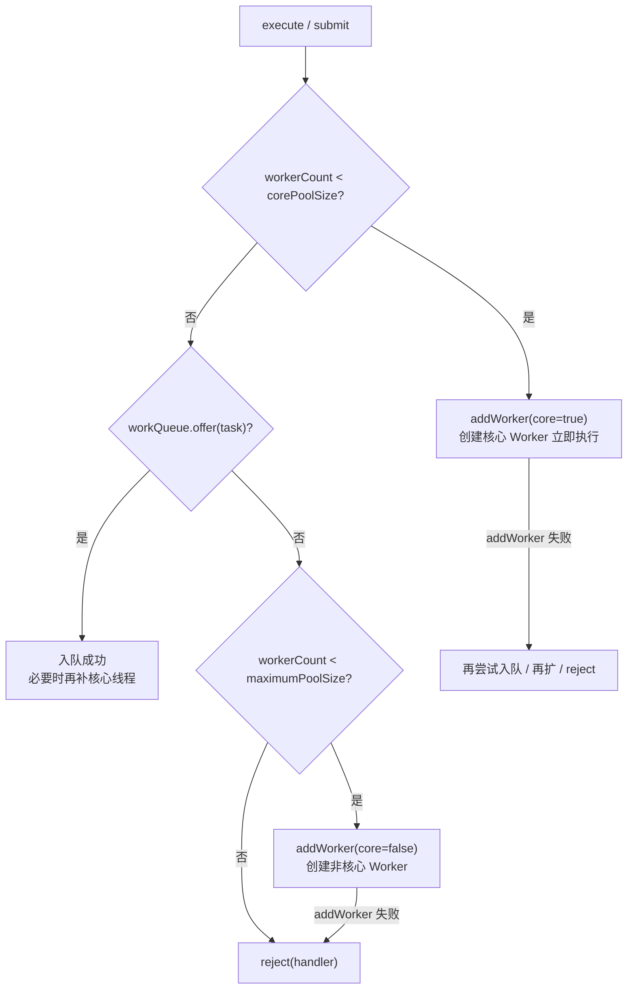
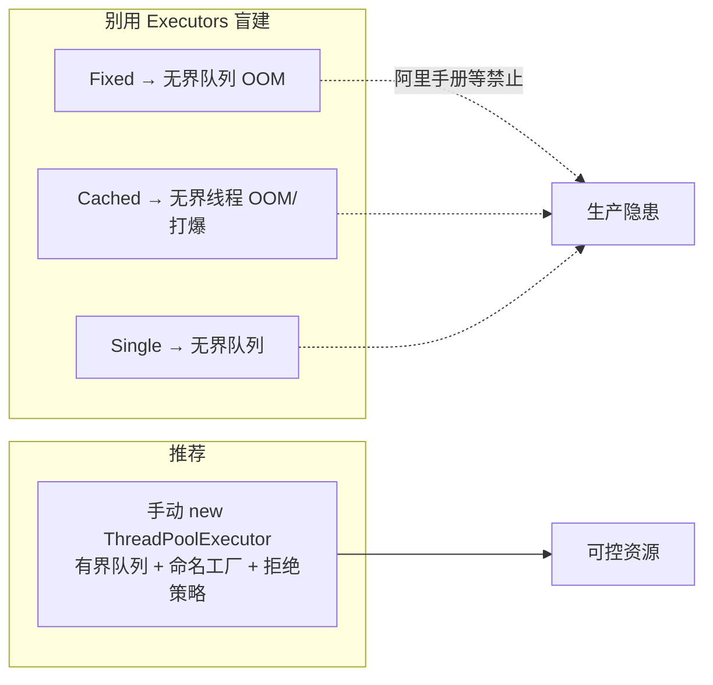
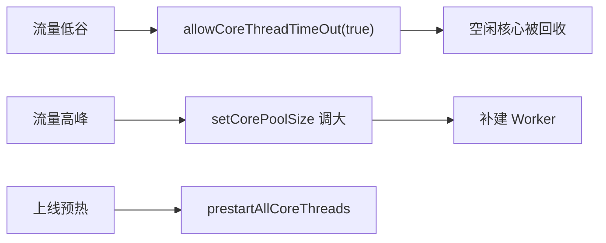
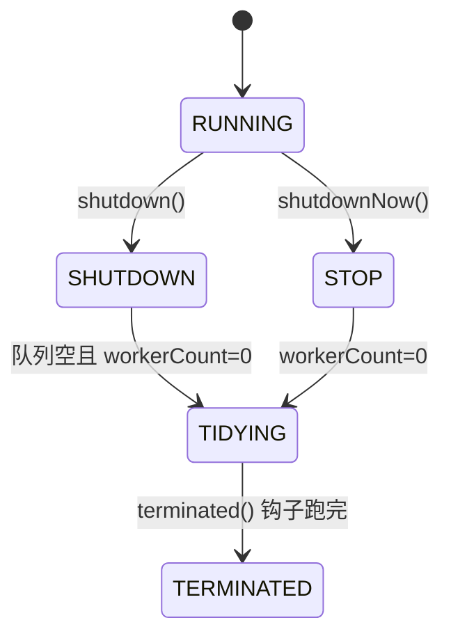
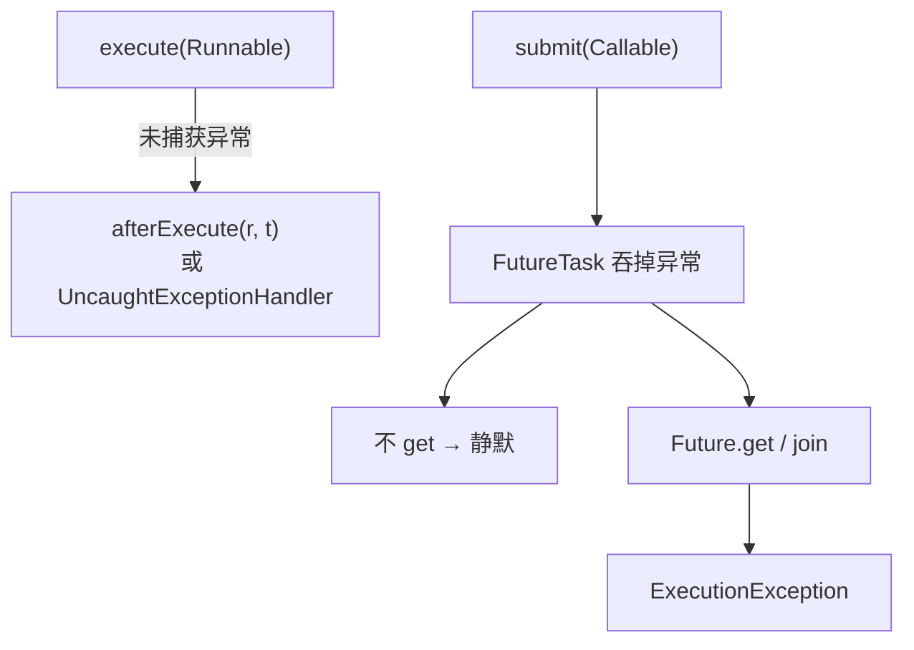
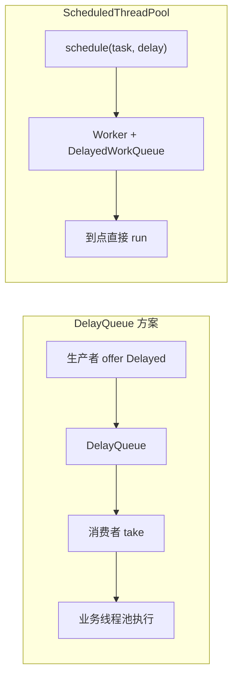
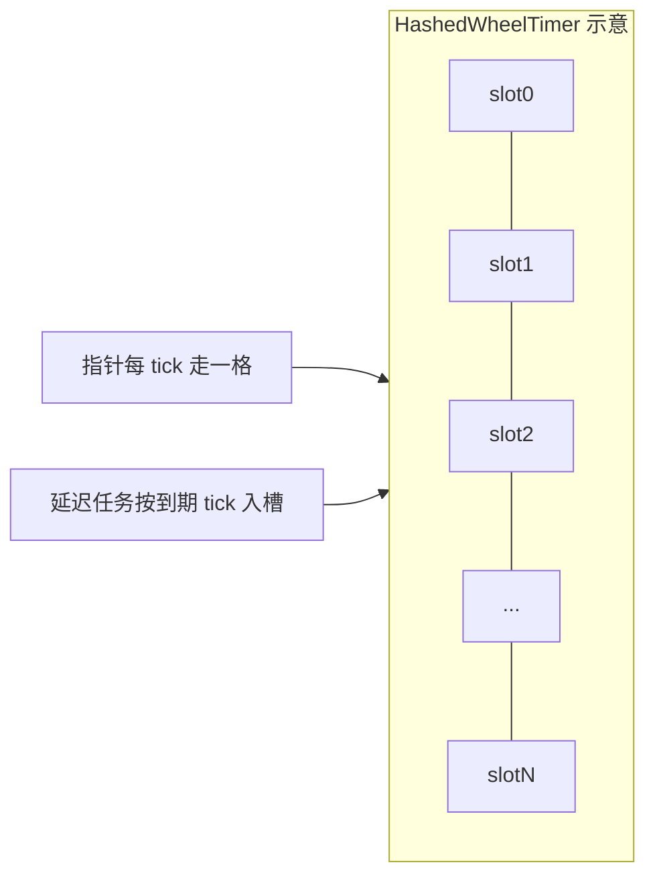
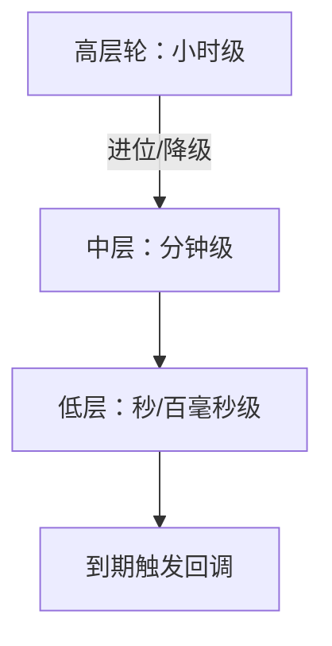

# 05 · 线程池与定时调度

> 业务必问：ThreadPoolExecutor 参数与流程、拒绝策略、Executors 大坑、shutdown、定时任务与时间轮。  
> 口诀：**先 core → 再 queue → 再扩到 max → 最后 reject**。

---

## 一、总览口述（1 分钟版）

> ThreadPoolExecutor 用「核心线程 + 工作队列 + 最大线程 + 拒绝策略」消化任务。  
> submit/execute 时：线程数不足 core 就建 Worker；已满 core 就入队；队列满再扩到 max；再满走 RejectedExecutionHandler。  
> 生产不要直接用 Executors：Fixed/Single 是无界队列易 OOM，Cached 是近乎无界线程易打爆。  
> 推荐：显式有界队列 + 命名 ThreadFactory + 明确拒绝 + 监控活跃数/队列深度/拒绝次数。  
> 定时：弃用 Timer，用 ScheduledThreadPoolExecutor；海量超时用时间轮（Netty/Kafka）。

---

## 面试题

### Q1. 你了解 Java 线程池的原理吗？

核心类是 **`ThreadPoolExecutor`**（`ScheduledThreadPoolExecutor`、`ForkJoinPool` 另说）。面试口述按「任务怎么被消化」讲。

#### 1.1 七大参数（构造器）

| 参数 | 含义 | 面试注意 |
| --- | --- | --- |
| `corePoolSize` | 核心线程数：即使空闲也常驻（除非 `allowCoreThreadTimeOut`） | 冷启动可用 `prestartAllCoreThreads` |
| `maximumPoolSize` | 最大线程数：队列满后可扩到此上限 | 无界队列时几乎到不了 max |
| `keepAliveTime` + `unit` | 非核心（或允许超时的核心）空闲存活时间 | 潮汐流量配合 allowCoreThreadTimeOut |
| `workQueue` | 任务等待队列 | **有界/无界决定扩容行为** |
| `threadFactory` | 如何创建线程 | 生产必命名，便于 dump/监控 |
| `handler` | 拒绝策略：线程与队列都满时怎么办 | shutdown 后再提交也会走这里 |

常用构造：

```java
new ThreadPoolExecutor(
    corePoolSize,
    maximumPoolSize,
    keepAliveTime,
    TimeUnit.SECONDS,
    new ArrayBlockingQueue<>(capacity),
    namedThreadFactory,
    new ThreadPoolExecutor.AbortPolicy()
);
```

#### 1.2 工作流程（必背，细化版）



口诀：**先 core → 再 queue → 再扩到 max → 最后 reject**。

#### 1.3 `addWorker` 在干什么？

`addWorker(Runnable firstTask, boolean core)` 是真正「建线程」的入口：

1. 自旋读 `ctl`，检查运行状态：SHUTDOWN 之后一般不允许再加 Worker（有例外：SHUTDOWN 且队列非空、firstTask==null 时可为了消化队列建线程）。  
2. 判断 `workerCount` 是否已达上限：`core==true` 用 `corePoolSize`，否则用 `maximumPoolSize`。  
3. CAS 把 `ctl` 低位 worker 数 +1。  
4. `new Worker(firstTask)`：Worker 继承 AQS，实现 Runnable；内部持有 `Thread t = threadFactory.newThread(this)`。  
5. 把 Worker 放进 `workers` 集合，`t.start()` → 进入 `runWorker` 循环。

```text
runWorker(w):
  task = firstTask 或 getTask() 从队列取
  while (task != null) {
      beforeExecute
      try { task.run() } catch { 记异常 }
      afterExecute
      task = getTask()   // 阻塞/超时取下一任务
  }
  processWorkerExit  // 减 worker 数、必要时补线程、尝试 terminate
```

#### 1.4 `ctl` 高低位（加分点）

`ctl` 是一个 **AtomicInteger**，把「运行状态」和「worker 数量」压在一个 int 里，方便一次 CAS：

| 部分 | 位数（直觉） | 含义 |
| --- | --- | --- |
| **高 3 位** | runState | RUNNING / SHUTDOWN / STOP / TIDYING / TERMINATED |
| **低 29 位** | workerCount | 当前 Worker 数量（上限约 5 亿，实际远用不完） |

状态大致：

| 状态 | 含义 |
| --- | --- |
| RUNNING | 接新任务、处理队列 |
| SHUTDOWN | 不接新任务，但处理队列 |
| STOP | 不接新、不处理队列，打断执行中 |
| TIDYING | 所有任务结束、workerCount=0，将调 `terminated()` |
| TERMINATED | `terminated()` 跑完 |

**加分细节：**

1. **不是「先填满队列再扩线程」**：线程数 ≥ core 时优先入队；只有入队失败（有界队列满）才扩到 max。无界队列几乎永远 offer 成功 → **永远到不了 max**（Executors Fixed 大坑）。  
2. **Worker** = 线程 + 循环取任务；真正执行在 `runWorker`：`beforeExecute` → `task.run()` → `afterExecute`。  
3. **submit** 把 Callable/Runnable 包成 `FutureTask` 再 `execute`，所以流程与 execute 同一条路径。

**口述：**  
> ThreadPoolExecutor 用 ctl 同时记运行状态和线程数。任务来了先保证有 core 个 Worker，再往队列塞，队列满才扩到 max，再满就 reject。Worker 是常驻循环从队列取活的线程；addWorker 负责 CAS 加计数、new 线程、start。

**追问：**

- Q：为什么用一个 int 同时存状态和数量？  
  A：一次 CAS 原子更新，避免「先改状态再改数量」的撕裂；读写也更便宜。  
- Q：core 已满、队列还有空位时，会不会直接开到 max？  
  A：不会。有空位就 offer，**扩 max 的前提是队列拒绝**（有界满或 SynchronousQueue 没人接手）。

---

### Q2. 如何合理地设置 Java 线程池的线程数？

没有万能公式，面试要讲「公式 + 压测 + 动态」。

#### 2.1 经验公式

| 场景 | 经验公式 | 直觉 |
| --- | --- | --- |
| **CPU 密集** | `Ncpu + 1` 或 `2N + 1`（N = CPU 核数） | 少切换；+1 可覆盖页缺失等偶发阻塞 |
| **IO 密集** | `Ncpu * (1 + W/C)`，W=等待时间，C=计算时间 | 等待多则可开更多线程「填空」 |
| **混合** | 拆成两类池，或按实测比例折中 | 不要一个池混跑 CPU 与长 IO |

例：8 核，IO 任务平均等待 90%、计算 10% → `8 * (1 + 9) = 80` 量级，再压测往下调。

#### 2.2 压测思路（生产口径）

1. **定目标**：P99 RT、错误率、拒绝次数、下游连接池上限。  
2. **扫参数**：固定有界队列，扫 `core/max`（如 8→16→32→64），看 CPU、上下文切换、队列深度。  
3. **看拐点**：CPU 已打满但 RT 变差 → 线程过多；队列持续堆积且拒绝上升 → 容量不够或下游慢，该限流/扩容下游，而不是无限加线程。  
4. **区分池**：网关接入池、业务计算池、RPC/DB 调用池分开，避免互相饿死。

#### 2.3 动态调整

| 手段 | 说明 |
| --- | --- |
| `setCorePoolSize` / `setMaximumPoolSize` | 运行时热调（见 Q6） |
| 监控指标 | activeCount、poolSize、queue.size、completed、reject 计数 |
| 自适应框架 | 部分中间件按负载伸缩；自研要防抖，避免抖动 |

补充实践：

1. **有界队列 + 明确拒绝** 比「随便开 200 线程」更重要；线程过多会把 CPU 打成上下文切换地狱。  
2. **虚拟线程（21+）**：纯 IO 阻塞型可考虑 `newVirtualThreadPerTaskExecutor`，线程数不再按公式卡死，但仍要限制下游资源（连接池、DB、Semaphore）。  
3. 队列深度也是容量的一部分：`有效缓冲 ≈ 队列容量 + (max - 当前活跃)` 的粗估。

**口述：**  
> CPU 密集约 核数+1；IO 密集用 N×(1+等待/计算)；生产以压测和监控为准，并配合有界队列，避免无脑放大线程数。动态用 setCore/setMax，但要有指标和防抖。

**追问：**

- Q：公式算出来 100，机器 8 核，敢开吗？  
  A：看任务是不是真在等 IO。若多数在算，100 线程会疯切；若卡在 DB，还要看连接池是不是只有 20——线程池再大也被连接池卡住。

---

### Q3. Java 线程池有哪些拒绝策略？

`RejectedExecutionHandler`：四个内置 + 自定义。触发时机：**线程数已达 max 且队列 offer 失败**，或池已 shutdown 仍提交。

| 策略 | 行为 | 适用 |
| --- | --- | --- |
| **AbortPolicy**（默认） | 抛 `RejectedExecutionException` | 希望调用方立刻感知过载 |
| **CallerRunsPolicy** | 由**提交任务的线程**同步执行 | 降速反压，避免任务丢失 |
| **DiscardPolicy** | 静默丢弃新任务 | 可丢的日志/打点等 |
| **DiscardOldestPolicy** | 丢弃队列头最老任务，再尝试一次 `execute` | 新任务更重要（仍可能丢） |

#### 3.1 自定义落地：打日志 + 入死信队列

```java
public class LoggingDeadLetterHandler implements RejectedExecutionHandler {
  private final BlockingQueue<Runnable> deadLetter;
  private final MeterRegistry metrics; // 或自建 Counter

  @Override
  public void rejectedExecution(Runnable r, ThreadPoolExecutor e) {
    metrics.counter("threadpool.reject").increment();
    log.error("reject pool={} active={} queue={} task={}",
        e, e.getActiveCount(), e.getQueue().size(), r);
    // 死信：落本地队列 / MQ / DB，由补偿任务重试
    if (!deadLetter.offer(wrapWithMeta(r))) {
      log.error("dead letter full, drop {}", r);
    }
  }
}
```

生产建议：

1. **指标**：拒绝次数、死信堆积、CallerRuns 触发时主线程耗时。  
2. **CallerRuns 副作用**：提交线程（可能是 Tomcat 线程）被占住 → 自然反压，但可能拖慢接入层。  
3. Discard 系列必须业务可接受，且最好仍打点，否则「静默丢」难排查。  
4. `shutdown` 之后再提交也会走拒绝策略——上线/下线窗口要区分「过载拒绝」和「关闭拒绝」。

**口述：**  
> 默认 Abort 抛异常；CallerRuns 用调用线程顶一下形成反压；Discard 系列会丢任务，必须业务可接受；生产常自定义：打日志、记指标、入死信队列再补偿。

**追问：**

- Q：DiscardOldest 一定会成功提交吗？  
  A：不一定。丢掉队头后再 `execute`，若池仍满/已关闭，仍可能再次拒绝（甚至递归风险，实现上要小心）。

---

### Q4. Java 并发库中提供了哪些线程池实现？它们有什么区别？

| 类型 | 获取方式 | 特征 | 风险/备注 |
| --- | --- | --- | --- |
| **Fixed** | `newFixedThreadPool(n)` | 固定 n 线程，**无界 LinkedBlockingQueue** | 任务堆积 → **OOM** |
| **Cached** | `newCachedThreadPool()` | core=0，max=`Integer.MAX_VALUE`，`SynchronousQueue`，60s 回收 | 突发 → **无界线程**打爆 |
| **Single** | `newSingleThreadExecutor()` | 单线程 + 无界队列 | 保证顺序，队列可堆积 OOM |
| **Scheduled** | `newScheduledThreadPool(n)` | 延迟/周期；内部 `DelayedWorkQueue` | 任务异常要自己兜；队列无界 |
| **WorkStealing** | `newWorkStealingPool()` | 底层 **ForkJoinPool**，任务窃取 | 适合可拆分/大量短任务 |
| **ForkJoinPool** | `commonPool()` / 自建 | 分治 `ForkJoinTask` | 别把阻塞 IO 塞进 commonPool |



**强调（高频考点）：**

- 《阿里 Java 开发手册》等：**禁止**直接用 `Executors` 创建，应显式 `ThreadPoolExecutor`。  
- Fixed/Single 的坑是 **无界队列**；Cached 的坑是 **max 近乎无限** + SynchronousQueue「来一个任务就可能新建一个线程」。

**口述：**  
> Fixed/Cached/Single/Scheduled 都是 Executors 工厂方法，底层还是 ThreadPoolExecutor 或 Scheduled；生产要自己设 core、max、有界队列和拒绝策略。WorkStealing/ForkJoin 适合分治并行。

**追问：**

- Q：Cached 为什么会创建海量线程？  
  A：`SynchronousQueue` 不存任务，offer 成功仅当有空闲线程在 take；没有空闲就 addWorker，而 max 是 Integer.MAX_VALUE。

---

### Q5. Java 创建线程池有哪些方式？生产怎么配？

| 方式 | 说明 |
| --- | --- |
| **直接 `new ThreadPoolExecutor(...)`** | **生产首选**：参数全透明 |
| **`Executors` 工厂** | 演示/原型可以，生产慎用（见上） |
| **Spring** | `@EnableAsync` + `ThreadPoolTaskExecutor`；注入自定义 `Executor` Bean |
| **虚拟线程执行器（21+）** | `newVirtualThreadPerTaskExecutor()` / `Thread.ofVirtual().factory()` |
| **ForkJoinPool** | 并行流默认 commonPool；也可自建 |

#### 5.1 生产推荐清单

| 项 | 推荐 |
| --- | --- |
| 队列 | **明确有界**（`ArrayBlockingQueue` / 有界 `LinkedBlockingQueue`） |
| 线程名 | 自定义 `ThreadFactory`：`biz-pool-%d` |
| 拒绝 | 明确策略 + 指标/死信，不要默默 Discard |
| 监控 | active、poolSize、queueSize、completed、reject、RT |
| 隔离 | 按业务拆池，避免慢任务拖垮公共池 |
| 关闭 | 容器 destroy 时 `shutdown` + `awaitTermination` |

```java
ThreadFactory factory = new ThreadFactoryBuilder()
    .setNameFormat("order-pool-%d")
    .setUncaughtExceptionHandler((t, e) -> log.error("uncaught {}", t.getName(), e))
    .build();

ExecutorService pool = new ThreadPoolExecutor(
    8, 32, 60, TimeUnit.SECONDS,
    new ArrayBlockingQueue<>(1000),
    factory,
    new LoggingDeadLetterHandler(deadLetterQueue, metrics)
);
```

Spring 补充：配置 `corePoolSize`、`maxPoolSize`、`queueCapacity`、`threadNamePrefix`、`rejectedExecutionHandler`；异步方法异常用 `AsyncUncaughtExceptionHandler`。默认的 `SimpleAsyncTaskExecutor` 每任务一线程，**不适合生产高峰**。

**口述：**  
> 创建方式很多，但生产只认显式 ThreadPoolExecutor：有界队列、命名工厂、拒绝可观测、按业务拆池。Spring 也要把 ThreadPoolTaskExecutor 配全。

---

### Q6. Java 线程池核心线程数在运行过程中能修改吗？如何修改？

**能。** 运行时 API：

| 方法 | 作用 |
| --- | --- |
| `setCorePoolSize(int)` | 调大：可触发补建核心线程；调小：多余核心在空闲后按策略回收 |
| `setMaximumPoolSize(int)` | 调整上限（需 ≥ core） |
| `allowCoreThreadTimeOut(true)` | 核心线程也可因空闲超时回收；适合潮汐流量 |
| `prestartCoreThread()` / `prestartAllCoreThreads()` | 预先启动核心线程，避免首批请求冷启动延迟 |
| `setKeepAliveTime` | 调整空闲回收时间 |

注意：

1. 改小 core **不会立刻杀**正在跑任务的线程；只是后续空闲可被回收。  
2. 队列里已堆积的任务不受「突然变小」直接影响——仍会被现有 Worker 消化。  
3. `allowCoreThreadTimeOut(true)` 后，`getTask` 对核心线程也走限时 poll，超时退出。  
4. 调大 core 时，若队列里已有任务，实现会尝试补 Worker 加快消化。



**口述：**  
> 可以 setCorePoolSize/setMaximumPoolSize 热调；想让核心也缩容就 allowCoreThreadTimeOut(true)；怕冷启动就 prestartAllCoreThreads。

**追问：**

- Q：只调 max、不调 core，队列又是无界的，有用吗？  
  A：几乎没用——无界队列 offer 总成功，扩不到 max。先把队列改有界。

---

### Q7. Java 线程池中 shutdown 与 shutdownNow 的区别是什么？

| 对比 | `shutdown()` | `shutdownNow()` |
| --- | --- | --- |
| 接受新任务 | 否（再提交 → 拒绝） | 否 |
| 已在跑的任务 | **继续跑完** | 尝试 **interrupt** 打断 |
| 队列中等待任务 | **会执行完** | **不会执行**，返回未执行的 `List<Runnable>` |
| 状态 | → SHUTDOWN | → STOP |
| 等待终止 | 常配合 `awaitTermination` | 同样建议 `awaitTermination` |



#### 优雅下线模板

```java
pool.shutdown(); // 温和：不接新活，做完手头+队列
try {
  if (!pool.awaitTermination(30, TimeUnit.SECONDS)) {
    List<Runnable> dropped = pool.shutdownNow(); // 超时再粗暴
    log.warn("force shutdown, dropped={}", dropped.size());
    pool.awaitTermination(10, TimeUnit.SECONDS);
  }
} catch (InterruptedException e) {
  pool.shutdownNow();
  Thread.currentThread().interrupt();
}
```

注意：`shutdownNow` 的 interrupt **能否真正停下**取决于任务是否响应中断（`sleep`/`wait`/`BlockingQueue.take` 等会抛 InterruptedException；纯算死循环不响应则停不了）。

**口述：**  
> shutdown 温和：不接新活，把手头和队列做完；shutdownNow 粗暴：打断正在跑的，队列里的直接掏出来返回。优雅下线一般 shutdown + awaitTermination，超时再 shutdownNow。状态机是 RUNNING → SHUTDOWN/STOP → TIDYING → TERMINATED。

**追问：**

- Q：awaitTermination 返回 false 说明什么？  
  A：超时时间内还没 TERMINATED，通常接着 shutdownNow 或继续等，并打日志告警。

---

### Q8. Java 线程池内部任务出异常后，如何知道是哪个线程出了异常？

关键差异：**`execute` 直接跑 Runnable，异常可能冒泡到 Worker；`submit` 把异常吞进 Future，不 `get` 就「静默」。**

| 手段 | 做法 |
| --- | --- |
| **重写 `afterExecute`** | 子类 `ThreadPoolExecutor`，在 `afterExecute(r, t)` 打日志；Future 任务常要 `Future.get()` 取异常 |
| **`UncaughtExceptionHandler`** | 自定义 `ThreadFactory`，`t.setUncaughtExceptionHandler(...)` |
| **`Future.get()` / `whenComplete`** | submit 后必须处理 `ExecutionException` |
| **装饰 Runnable/Callable** | 包装 try/catch，记录任务名、业务 ID、线程名 |

```java
// 装饰任务，保证异常可观测
Runnable wrap(Runnable task, String name) {
  return () -> {
    try {
      task.run();
    } catch (Throwable ex) {
      log.error("task={} thread={}", name, Thread.currentThread().getName(), ex);
      throw ex;
    }
  };
}

// afterExecute 处理 submit 的 Future 异常
protected void afterExecute(Runnable r, Throwable t) {
  super.afterExecute(r, t);
  if (t == null && r instanceof Future<?> f && f.isDone()) {
    try {
      f.get();
    } catch (CancellationException ce) {
      t = ce;
    } catch (ExecutionException ee) {
      t = ee.getCause();
    } catch (InterruptedException ie) {
      Thread.currentThread().interrupt();
    }
  }
  if (t != null) {
    log.error("worker error thread={}", Thread.currentThread().getName(), t);
  }
}
```



**口述：**  
> execute 的异常看 afterExecute 或线程 UncaughtExceptionHandler；submit 必须 Future.get 或回调；生产建议统一装饰任务 + 线程命名，才能定位是哪个业务任务、哪条线程。

**追问：**

- Q：为什么 submit 后 afterExecute 的 t 经常是 null？  
  A：异常被 FutureTask 接住了，所以要从 `Future.get()` 再掏出来。

---

### Q9. Java 中的 DelayQueue 和 ScheduledThreadPool 有什么区别？

| 维度 | `DelayQueue` | `ScheduledThreadPoolExecutor` |
| --- | --- | --- |
| 本质 | **无界阻塞队列**，元素实现 `Delayed` | **线程池**，负责任务调度与执行 |
| 职责 | 只解决「到点才能 take」 | 解决「到点由线程执行 Runnable」 |
| 执行者 | 需自己另起消费者线程/池去 `take` 再执行 | 内部 Worker + `DelayedWorkQueue` 一体化 |
| API | `offer`/`take` | `schedule` / `scheduleAtFixedRate` / `scheduleWithFixedDelay` |
| 场景 | 延迟队列组件、订单超时扫描的存储结构 | 直接做延迟/周期任务调度 |
| 异常 | 消费者自己处理 | 周期任务里异常可能导致后续调度中断，需捕获 |

关系：`ScheduledThreadPoolExecutor` 内部用堆式延迟队列；`DelayQueue` 是通用组件，可自己搭「DelayQueue + 消费者线程池」。



周期任务区别（常考）：

| API | 语义 |
| --- | --- |
| `scheduleAtFixedRate` | 按固定频率启动（不管上次是否跑完，可能「追赶」；重叠行为以实现为准，注意别假设可重入） |
| `scheduleWithFixedDelay` | 上次**结束**后再隔 fixedDelay |

**口述：**  
> DelayQueue 是「延迟的 BlockingQueue」；ScheduledThreadPool 是「带延迟调度的线程池」。前者管存放与到期取出，后者管到期执行。

**追问：**

- Q：海量「30 分钟后关单」用 Scheduled 一人一任务行吗？  
  A：任务量巨大时更吃内存/堆维护成本，可考虑时间轮或 DelayQueue + 少量消费者，或外部延迟消息（MQ）。

---

### Q10. 什么是 Java 的 Timer？

`java.util.Timer` / `TimerTask`：早期 JDK 定时器。

| 特点 | 问题 |
| --- | --- |
| **单线程**执行所有任务 | 一个任务卡死/耗时长 → 后续全延迟 |
| 任务抛未捕获异常 | **整个 Timer 线程终止**，后续任务全挂 |
| 绝对时间调度 | 系统时间回拨可能异常 |
| API 老旧 | 不如 `ScheduledExecutorService` 清晰 |

**现状：** 被 **`ScheduledExecutorService`（`ScheduledThreadPoolExecutor`）** 取代：可多线程、任务异常可隔离处理、API 更清晰（fixedRate / fixedDelay）。

```java
// 别用 Timer；改用：
ScheduledExecutorService ses = Executors.newScheduledThreadPool(2, namedFactory);
// 生产仍建议手动构造 ScheduledThreadPoolExecutor，并注意其内部队列无界
ses.scheduleAtFixedRate(this::heartbeat, 0, 5, TimeUnit.SECONDS);
```

**口述：**  
> Timer 单线程且异常会弄死调度线程，生产别用，改用 ScheduledExecutorService。

**追问：**

- Q：ScheduledThreadPool 任务里抛异常会怎样？  
  A：当前这次执行失败；对固定周期任务，未捕获异常可能导致后续调度停止（实现细节），所以任务体内必须 try/catch 并打日志。

---

### Q11. 你了解时间轮（Time Wheel）吗？有哪些应用场景？

**时间轮：** 用环形数组 + 指针（像钟表）做大量定时/延迟任务的高效调度结构。指针按固定 tick 推进，复杂度近似 **O(1)** 插入/触发（多层时间轮处理更大跨度）。

#### 11.1 哈希时间轮（Hashed Wheel）

单层：`tickDuration` × `wheelSize` = 一轮覆盖的时间；任务按到期时间哈希到 slot，同一 slot 用链表/set 挂多个任务。



#### 11.2 多层时间轮

类似水表：低层转完一圈，向高层进位。短延迟落在低层，长延迟先挂高层，降级到低层再触发。适合跨度大（秒～天）又要省空间的场景。



#### 11.3 应用场景

| 应用 | 说明 |
| --- | --- |
| **Netty `HashedWheelTimer`** | 连接空闲检测、写超时等；默认单线程跑回调，**回调勿阻塞** |
| **Kafka** | 请求超时、延迟操作等用时间轮思想 |
| **延迟任务 / 订单超时** | 海量「N 分钟后关闭」比一人一 `schedule` 更省 |
| **心跳 / 会话过期** | 大量连接的空闲超时检测 |
| **本地缓存过期**（部分实现） | 批量推进过期 |

对比选型：

| 方案 | 适合 |
| --- | --- |
| `ScheduledThreadPool` | 少量、要较精确的延迟/周期任务 |
| **时间轮** | **海量**、允许 tick 级精度误差 |
| MQ 延迟消息 / 分布式调度 | 跨进程、要可靠落盘与重试 |

**口述：**  
> 时间轮像钟表槽位，插入和触发近似 O(1)，适合海量延迟与超时；Netty HashedWheelTimer、Kafka 都有类似实现。任务很多时比一人一 ScheduledFuture 省。注意回调线程别阻塞，精度是 tick 粒度。

**追问：**

- Q：时间轮和 DelayQueue 堆比，优劣？  
  A：堆插入/删除 O(log n)，时间轮近似 O(1) 但有精度误差、实现更复杂；海量定时时间轮更香，少量精确任务堆/Scheduled 足够。

---

## 本节速记

| 点 | 一句话 |
| --- | --- |
| 流程 | core → queue → max → reject；靠 addWorker + ctl |
| ctl | 高位状态，低位 workerCount |
| 线程数 | CPU：~N+1；IO：N(1+W/C)；压测拍板 |
| 拒绝 | Abort / CallerRuns / Discard / DiscardOldest / 自定义死信 |
| Executors | Fixed 无界队列、Cached 无界线程 → 勿直接用 |
| 生产 | 有界队列 + 命名工厂 + 监控 |
| 热调 | setCore/setMax；prestart；allowCoreThreadTimeOut |
| 关闭 | shutdown 做完；shutdownNow 打断并掏队列；awaitTermination |
| 异常 | submit 吞进 Future；execute/afterExecute/装饰器可观测 |
| 定时 | Timer 弃用；DelayQueue vs Scheduled；海量用时间轮 |
