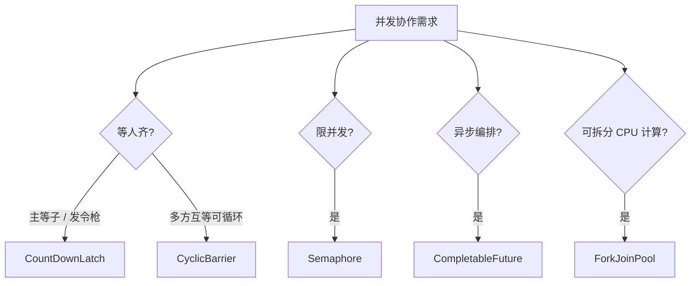
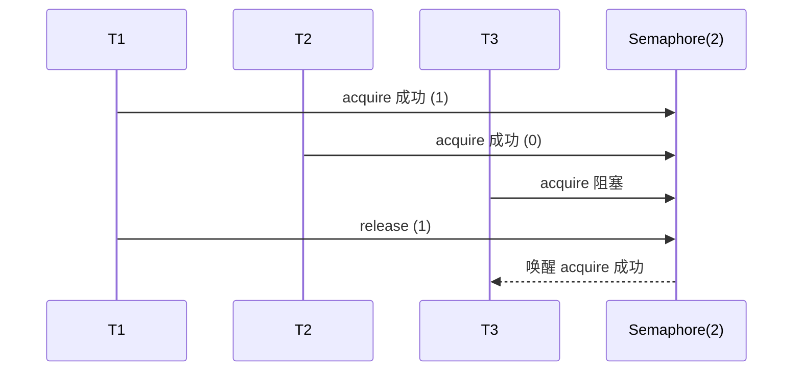
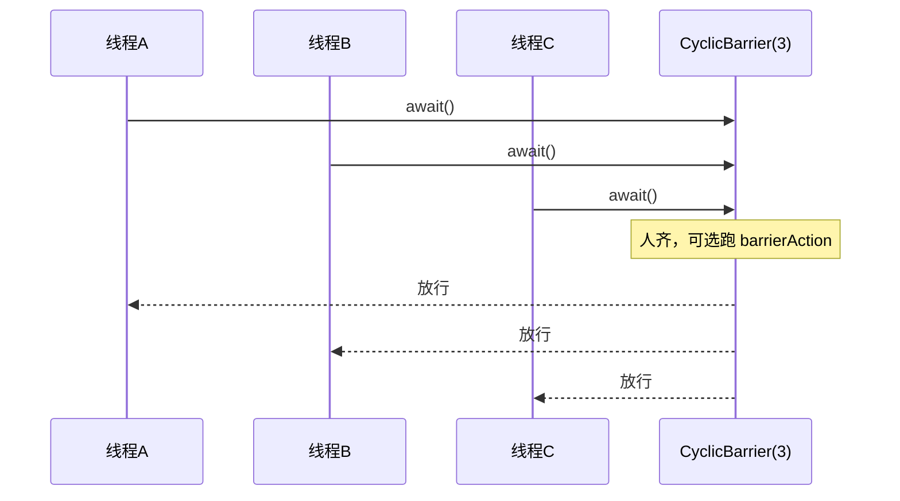
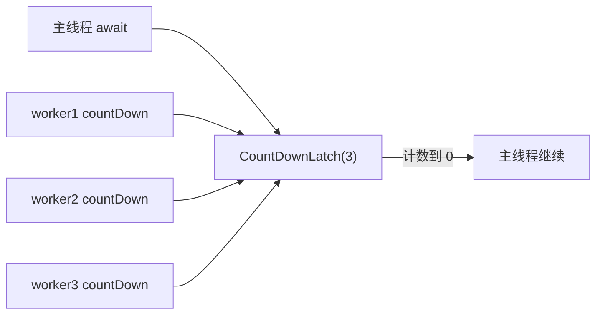
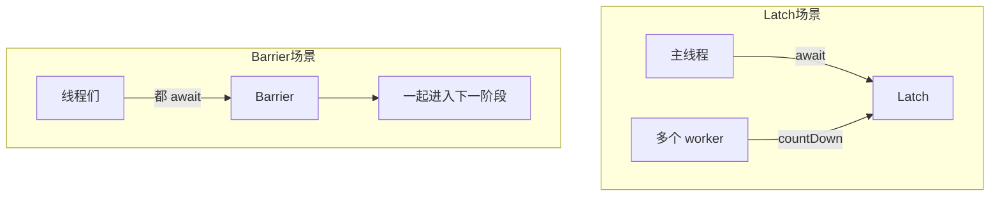
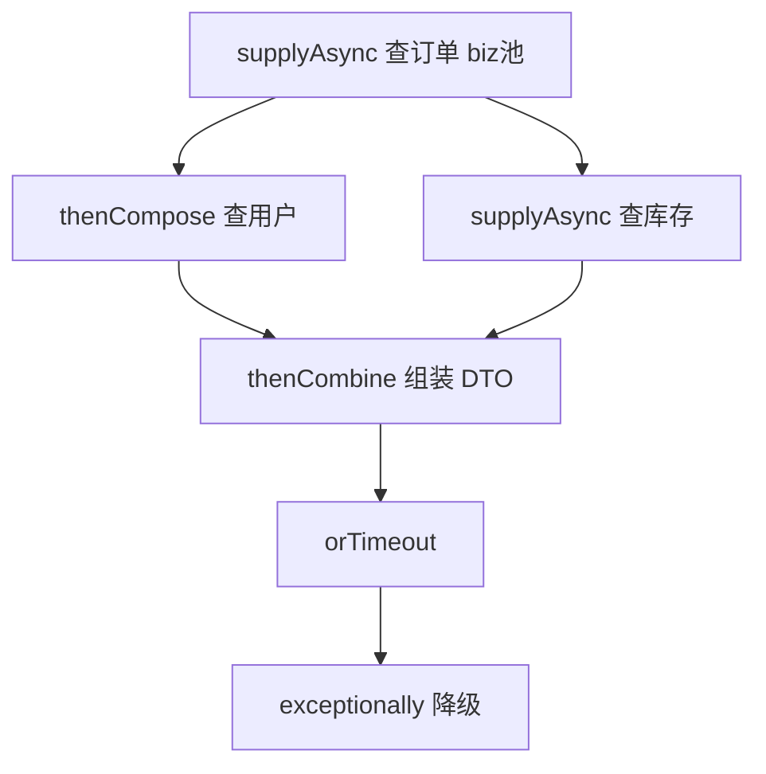
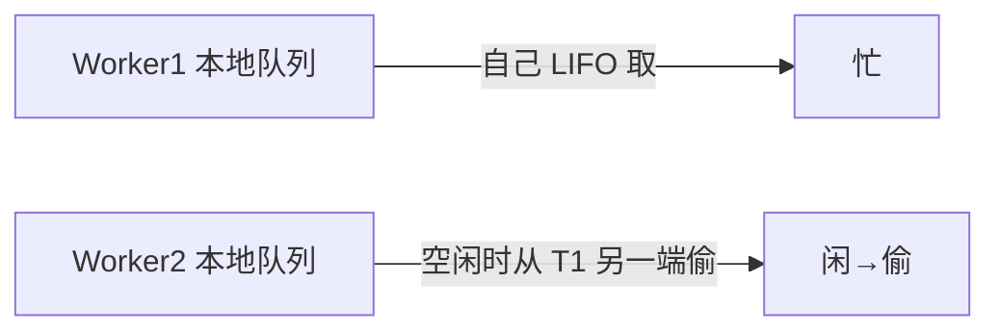
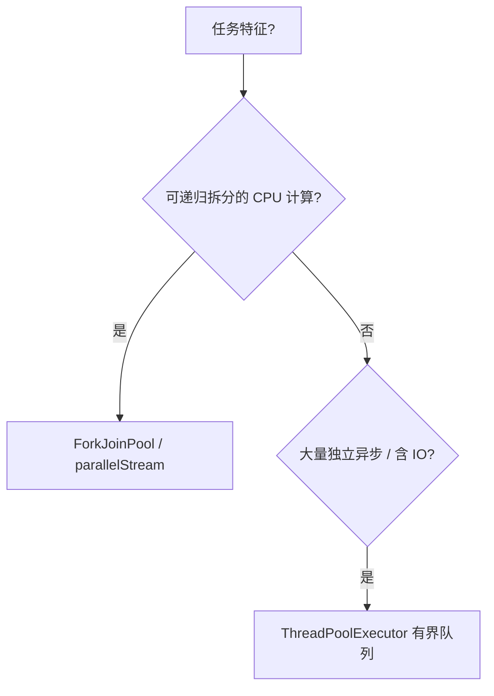
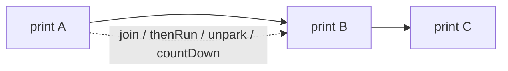

# 06 · 并发工具与异步

> Latch / Barrier / Semaphore 协作语义，CompletableFuture 编排，ForkJoin 分治，多线程顺序控制。  
> 选型口诀：「我等你们干完」→ Latch；「咱们到齐再走」→ Barrier；「最多 N 个同时干」→ Semaphore。

---

## 一、总览口述（1 分钟版）

> JUC 同步器里面试最高频是 CountDownLatch、CyclicBarrier、Semaphore。  
> Latch 一次性倒计时；Barrier 互相等齐且可循环；Semaphore 发许可证做限流。  
> 异步编排用 CompletableFuture：供给、变换、组合、异常、超时；生产必须自带 Executor，别堵死 commonPool。  
> CPU 分治用 ForkJoinPool + work-stealing；通用异步/IO 用 ThreadPoolExecutor。  
> 控顺序：join、Latch 链、CF thenCompose、单线程池、Condition、park/unpark 按场景选。

---

## 面试题

### Q1. 你使用过哪些 Java 并发工具类？

`java.util.concurrent` 里常考工具总览：

| 类别 | 代表 | 一句话场景 |
| --- | --- | --- |
| **同步器** | `CountDownLatch` | 主线程等 N 个子任务完成（一次性） |
| | `CyclicBarrier` | N 个线程互相等齐，可循环下一轮 |
| | `Semaphore` | 限流 / 资源许可（连接数、并发度） |
| | `Exchanger` | 两线程交换数据（较少问） |
| | `Phaser` | 可动态注册的多阶段屏障（进阶） |
| **锁 / 条件** | `ReentrantLock`、`ReadWriteLock`、`StampedLock` | 见 [[04-AQS-CAS与显式锁]] |
| **原子 / 累加** | `Atomic*`、`LongAdder` | 见 [[07-阻塞队列与原子类]] |
| **队列** | `BlockingQueue` 系列 | 生产者-消费者；见 [[07-阻塞队列与原子类]] |
| **执行器** | `ExecutorService`、`ForkJoinPool` | 线程池 / 分治；线程池见 [[05-线程池与定时调度]] |
| **异步编排** | `Future`、`CompletableFuture` | 异步结果与流水线 |
| **线程协作底层** | `LockSupport` | park/unpark |



**口述：**  
> 同步器用 Latch/Barrier/Semaphore；异步编排用 CompletableFuture；分治用 ForkJoin；限流用 Semaphore；队列解耦生产消费。

**追问：**

- Q：Phaser 和 CyclicBarrier 啥关系？  
  A：Phaser 更灵活，可动态 register/deregister，多 phase；Barrier 固定 parties。一般业务 Barrier/Latch 够用。

---

### Q2. 什么是 Java 的 Semaphore？

**Semaphore（信号量）：** 维护一组 **permits（许可）**。线程 `acquire` 拿到许可才能继续，`release` 归还。许可数为 N 时，最多 N 个线程同时进入临界区（或访问资源）。

| API | 含义 |
| --- | --- |
| `acquire()` / `acquire(n)` | 阻塞直到拿到许可 |
| `tryAcquire` / 超时版 | 非阻塞或限时 |
| `release()` / `release(n)` | 归还许可 |
| `availablePermits()` | 当前剩余（仅供监控，别当同步依据） |
| 公平构造 `new Semaphore(n, true)` | 按等待队列 FIFO 分配 |

#### 2.1 公平 vs 非公平

| | 非公平（默认） | 公平 |
| --- | --- | --- |
| 行为 | 来了先 CAS 抢许可，抢不到再入队 | 有排队者则新线程不能插队 |
| 吞吐 | 通常更高 | 更公平，可能更多调度开销 |
| 饥饿 | 极端情况下线程可能久等 | 基本按序拿到 |

底层：AQS **共享模式**，`state` = 剩余许可。

#### 2.2 限流场景

```java
Semaphore limiter = new Semaphore(20); // 最多 20 并发下载

void download(URL url) throws InterruptedException {
  limiter.acquire();
  try {
    doDownload(url);
  } finally {
    limiter.release(); // 必须在 finally，防泄漏
  }
}
```

典型场景：

1. **接口/线程池外的并发限流**（同时只允许 20 个下载、10 个大报表）  
2. **连接池、对象池**式资源管控（许可≈资源数）  
3. **与锁不同**：Semaphore 许可可被「非持有线程」release（约定好即可），更像计数器而非所有权锁——也因此更易误用，release 次数错会破坏不变量  



**口述：**  
> Semaphore 就是许可证；acquire 领证，release 还证，常用来限流和保护有限资源。默认非公平，要公平就构造时传 true。release 一定要放 finally。

**追问：**

- Q：Semaphore(1) 能当锁用吗？  
  A：能模拟互斥，但没有可重入、没有 Condition 那套，也没有「持有者」概念；真互斥还是用 Lock/synchronized。

---

### Q3. 什么是 Java 的 CyclicBarrier？

**CyclicBarrier（循环屏障）：** 让 **固定数量** 的线程在屏障点互相等待，全部到达后一起放行；可 **reset** 进入下一轮（cyclic）。



| 特点 | 说明 |
| --- | --- |
| 参与者 | 各方线程都 `await()`，是「互相等」 |
| 可循环 | 自然进入下一世代，或显式 `reset()` |
| `barrierAction` | 人齐后由**最后一个到达的线程**执行一次 Runnable（汇总阶段结果） |
| `getNumberWaiting` / `getParties` | 调试用：当前在等的人数 / 总人数 |
| 异常 | 一线程中断/超时 → 屏障 **broken**，其它 await 会 `BrokenBarrierException` |

#### 3.1 barrierAction 示例

```java
CyclicBarrier barrier = new CyclicBarrier(3, () -> {
  // 最后一个到达的线程执行：汇总本轮分片结果
  log.info("round done, merge partial results");
});

for (int i = 0; i < 3; i++) {
  workers.submit(() -> {
    computeShard();
    barrier.await(); // 齐点
    nextPhase();
  });
}
```

#### 3.2 BrokenBarrier 与 reset

| 情况 | 结果 |
| --- | --- |
| 某线程 `await` 时被中断 | 屏障破损，其它线程 `BrokenBarrierException` |
| `await(timeout)` 超时 | 同上，破损 |
| `reset()` | 破损或想强制新开一轮时调用；正在 await 的线程也会收到 BrokenBarrier |
| 破损后 | 必须 `reset()`（或新建 Barrier）才能继续用 |

场景：并行计算分片后对齐、多线程分阶段仿真、游戏开战前等人齐。

**口述：**  
> CyclicBarrier 是人齐了再一起走，还能下一局；常带一个齐点后的汇总动作。有人中断或超时会 BrokenBarrier，需要 reset 或重建。

**追问：**

- Q：barrierAction 抛异常会怎样？  
  A：屏障会破损，等待线程收到 BrokenBarrierException；action 里也要做好防护。

---

### Q4. 什么是 Java 的 CountDownLatch？

**CountDownLatch（倒计时门闩）：** 内部计数器 N；线程 `countDown()` 减一；其它线程 `await()` 直到计数到 0。**一次性**，不能 reset。

| API | 含义 |
| --- | --- |
| `new CountDownLatch(n)` | 初始计数 |
| `countDown()` | 计数 -1（减到 0 后继续 countDown 无害，但无意义） |
| `await()` / 超时 | 等到 0 或超时 |
| `getCount()` | 剩余计数（监控用） |

经典两用法：

1. **主线程等工人：** 主线程 `await`，每个 worker 结束 `countDown`  
2. **发令枪：** 工人先 `await`，主线程准备好后一次 `countDown`（初始为 1）放行  



```java
CountDownLatch done = new CountDownLatch(n);
for (int i = 0; i < n; i++) {
  pool.execute(() -> {
    try {
      work();
    } finally {
      done.countDown(); // 必须 finally，防止异常导致主线程永等
    }
  });
}
done.await(10, TimeUnit.SECONDS);
```

底层：AQS 共享；`state` 为剩余计数，到 0 时唤醒所有 await 者。

**口述：**  
> Latch 是一次性门闩，干完活 countDown，主线程 await 等人齐；不能循环用。countDown 放 finally。

**追问：**

- Q：能不能复用同一个 Latch 跑第二轮？  
  A：不能。计数到 0 就永久打开。下一轮 `new CountDownLatch(n)`，或改用 CyclicBarrier/Phaser。

---

### Q5. CountDownLatch 与 CyclicBarrier 怎么对比？

| 维度 | CountDownLatch | CyclicBarrier |
| --- | --- | --- |
| 等待关系 | **一个/一批**等 **事件计数**到 0 | **一组线程互相**等齐 |
| 可复用 | **否**（一次性） | **是**（cyclic / reset） |
| 计数方向 | 减到 0 | 到达线程数凑齐 |
| 谁调用等待 | 常是「旁观者」await，工人只 countDown | **每个参与者都 await** |
| 典型角色 | 主线程等子任务；发令枪 | 多工人分阶段同步 |
| 齐点动作 | 无内置 | 可有 `barrierAction` |
| 失败语义 | 某工人没 countDown → 永远等（用超时） | 中断/超时 → BrokenBarrier |
| 底层 | AQS 共享 | ReentrantLock + Condition（了解即可） |

**选型口诀：**

- 「我等你们干完」→ **Latch**  
- 「咱们都到齐再继续下一阶段」→ **Barrier**  



加深记忆：

1. Latch 的 count 可以和「线程数」无关（一个线程 countDown 多次，或事件数 ≠ 线程数）。  
2. Barrier 的 parties 就是「必须到齐的线程数」。  
3. 多阶段并行计算：Barrier；启动时等依赖服务就绪：Latch。

**口述：**  
> Latch 是一次性门闩，旁观者等人齐；Barrier 是参与者互等，且能开下一局。一个减计数，一个凑人数。

**追问：**

- Q：发令枪用 Barrier 行不行？  
  A：别扭。发令枪是「裁判放一枪大家跑」，Latch(1) 更直观；Barrier 适合「大家都到起跑线再开始」。

---

### Q6. 什么是 Java 的 CompletableFuture？

**CompletableFuture**：JDK8+ 的 **可完成异步阶段**（实现 `Future` + `CompletionStage`），支持声明式编排：变换、依赖、组合、异常处理，不必层层阻塞 `get`。

#### 6.1 完成与创建

| 方式 | 说明 |
| --- | --- |
| `completedFuture(v)` | 已完成 |
| `supplyAsync(Supplier)` | 异步有返回值 |
| `runAsync(Runnable)` | 异步无返回值 |
| `complete` / `completeExceptionally` | 手动完成（桥接回调） |
| `failedFuture`（9+） | 已异常完成 |

**默认线程池是 `ForkJoinPool.commonPool()`** —— **生产务必传入自定义 Executor**，避免阻塞 IO 占满公共池、拖垮并行流和其它 CF。

```java
Executor biz = orderExecutor; // 自建 ThreadPoolExecutor
CompletableFuture.supplyAsync(this::loadOrder, biz)
    .thenApplyAsync(this::enrich, biz)
    .orTimeout(2, TimeUnit.SECONDS); // JDK9+
```

#### 6.2 供给 / 变换 / 组合 / 异常 / 超时

| 方法 | 语义 |
| --- | --- |
| `thenApply` / `thenApplyAsync` | 变换 `T → U` |
| `thenCompose` / `Async` | 扁平嵌套：`T → CompletionStage<U>`（避免 Future\<Future\>） |
| `thenCombine` / `Async` | 两个 CF 都完成，BiFunction 合并 |
| `thenAccept` / `thenRun` | 消费结果 / 无参继续 |
| `allOf` / `anyOf` | 全部完成 / 任一完成 |
| `exceptionally` / `exceptionallyAsync` | 异常时恢复备用值 |
| `handle` / `whenComplete` | 同时拿到结果或异常 |
| `orTimeout` / `completeOnTimeout`（9+） | 超时异常 / 超时给默认值 |
| `get(timeout)` / `join` | 阻塞取结果；join 不抛受检异常 |



#### 6.3 易错清单

1. `thenApply` vs `thenCompose`：下一步还返回 CF 时用 **compose**。  
2. 链上未处理异常会在 `get`/`join` 时冒泡。  
3. **阻塞 IO 不要跑在 commonPool**；所有 `*Async` 最好显式传 Executor。  
4. `allOf` 返回的是 `CompletableFuture<Void>`，要结果需对各 CF 再 `join`。  
5. `anyOf` 返回 `CompletableFuture<Object>`，类型要自己转。  

```java
CompletableFuture<Order> order = supplyAsync(this::loadOrder, biz);
CompletableFuture<Stock> stock = supplyAsync(this::loadStock, biz);

CompletableFuture<DTO> dto = order.thenCombine(stock, this::toDto)
    .orTimeout(1, TimeUnit.SECONDS)
    .exceptionally(ex -> DTO.degraded());
```

**口述：**  
> CompletableFuture 把回调链成流水线：thenApply 变结果，thenCompose 接下一个异步，thenCombine 合并两路；异常用 exceptionally/handle；超时用 orTimeout；一定要自带业务线程池，别用 commonPool 跑阻塞。

**追问：**

- Q：thenApply 和 thenApplyAsync 区别？  
  A：前者可能在完成上一阶段的同一线程同步跑；后者提交到 Executor（或 commonPool）。有阻塞/想隔离线程就用 Async 并传池。

---

### Q7. 什么是 Java 的 ForkJoinPool？

**ForkJoinPool**：面向 **分治（Divide-and-Conquer）** 的并行框架。任务类型 `ForkJoinTask`（常用 `RecursiveTask`/`RecursiveAction`）：大任务 `fork` 拆小，`join` 汇总。

#### 7.1 Work-Stealing（工作窃取）

每个工作线程有双端队列：自己从一端取任务（倾向 LIFO，利于缓存）；空闲线程从别人队列 **另一端偷**（FIFO），降低竞争、提高吞吐。



#### 7.2 RecursiveTask 示例心智

```java
class SumTask extends RecursiveTask<Long> {
  final long[] arr; final int lo, hi;
  static final int THRESHOLD = 10_000;

  protected Long compute() {
    if (hi - lo <= THRESHOLD) {
      return sumRange(arr, lo, hi);
    }
    int mid = (lo + hi) >>> 1;
    SumTask left = new SumTask(arr, lo, mid);
    SumTask right = new SumTask(arr, mid, hi);
    left.fork();                 // 异步扔给池
    long r = right.compute();    // 当前线程直接算右边
    long l = left.join();        // 等左边
    return l + r;
  }
}
```

#### 7.3 与 ThreadPoolExecutor 选型

| 对比 | 普通 `ThreadPoolExecutor` | `ForkJoinPool` |
| --- | --- | --- |
| 任务形态 | 独立 Runnable/Callable | 可拆分的递归子任务 |
| 队列 | 共享工作队列为主 | **每线程一队列 + 窃取** |
| 适用 | 通用异步任务、IO（搭配有界队列） | CPU 密集分治：排序、搜索、并行流 |
| 阻塞 | 可跑阻塞，但要控线程数 | **忌在任务里阻塞 IO**，易饿死窃取线程 |
| 默认 | 自建参数 | 并行流用 `commonPool()`（并行度≈核数-1） |



**口述：**  
> ForkJoin 专治能拆开的计算：fork 拆、join 合，靠 work-stealing 吃满多核；别把重 IO 丢进 commonPool。普通业务异步还是 ThreadPoolExecutor。

**追问：**

- Q：并行流慢或卡住怎么查？  
  A：先看是不是在 commonPool 里阻塞 IO/锁；再看任务是否太碎（fork 开销）或太不均（无法有效窃取）。

---

### Q8. 如何在 Java 中控制多个线程的执行顺序？

按「场景选型」答，不要只背一种：

| 手段 | 做法 | 适合 |
| --- | --- | --- |
| **`Thread.join`** | B 里 `a.join()`，等 A 结束再往下 | 简单「A 完再 B」 |
| **CountDownLatch 链式** | A 结束 countDown，B await 后再干，再放开 C | 多阶段闸门 |
| **CompletableFuture** | `thenRun`/`thenCompose` 串阶段；`allOf` 后继续 | 异步流水线 |
| **单线程池** | `newSingleThreadExecutor` 提交顺序任务 | 要全局串行且排队 |
| **`synchronized` + wait/notify** | 共享状态机 + 条件 | 经典题「三线程打 ABC」 |
| **`Lock` + `Condition`** | 多条件精确唤醒 | 同上，更灵活 |
| **`LockSupport.park/unpark`** | 精确阻塞/唤醒指定线程 | 手写顺序、底层题 |
| **`Semaphore(1)` 令牌** | 按序传递许可 | 轮流执行 |
| **`CyclicBarrier`** | 多线程分阶段对齐 | 阶段同步，不是严格 A→B→C 总序 |

#### 8.1 多种写法对照（打印 A→B→C）

**写法一：join**

```java
Thread t1 = new Thread(() -> print("A"));
Thread t2 = new Thread(() -> { joinQuiet(t1); print("B"); });
Thread t3 = new Thread(() -> { joinQuiet(t2); print("C"); });
t1.start(); t2.start(); t3.start();
```

**写法二：CompletableFuture 串**

```java
CompletableFuture
  .runAsync(() -> print("A"), pool)
  .thenRunAsync(() -> print("B"), pool)
  .thenRunAsync(() -> print("C"), pool)
  .join();
```

**写法三：Lock + Condition 状态机（手撕题常用）**

```text
state = 0
线程A: while(state!=0) c.await(); print A; state=1; c.signalAll();
线程B: while(state!=1) c.await(); print B; state=2; c.signalAll();
线程C: while(state!=2) c.await(); print C; state=0; ...
```

**写法四：park/unpark**

```text
线程1 打印 A → unpark(线程2)
线程2 park → 打印 B → unpark(线程3)
线程3 park → 打印 C
```



**口述：**  
> 简单用 join；异步编排用 CompletableFuture；要排队串行丢单线程池；手撕打印题用 Lock+Condition 或 park/unpark；等人齐用 Latch/Barrier。

**追问：**

- Q：单线程池能保证「提交顺序 = 执行顺序」吗？  
  A：对同一个 SingleThreadExecutor，任务按队列 FIFO 执行；但若任务内部再异步提交到别的池，总序就破了。

---

## 本节速记

| 工具 | 一句话 |
| --- | --- |
| Semaphore | 许可限流；公平/非公平；release 放 finally |
| Latch | 一次性等人齐 / 发令枪 |
| Barrier | 互相等齐，可循环；注意 BrokenBarrier |
| 对比 | Latch 旁观减计数；Barrier 参与凑人数 |
| CompletableFuture | 编排流水线；自带 Executor；注意 compose/超时 |
| ForkJoin | 分治 + 工作窃取；忌阻塞 commonPool |
| 顺序控制 | join / Latch / CF / 单线程池 / Condition / park |
