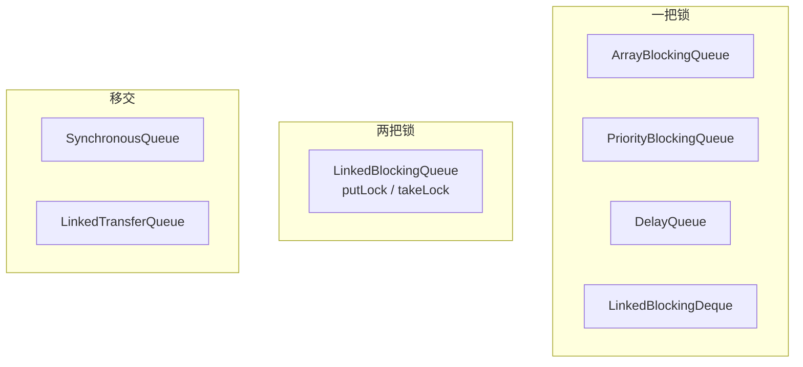
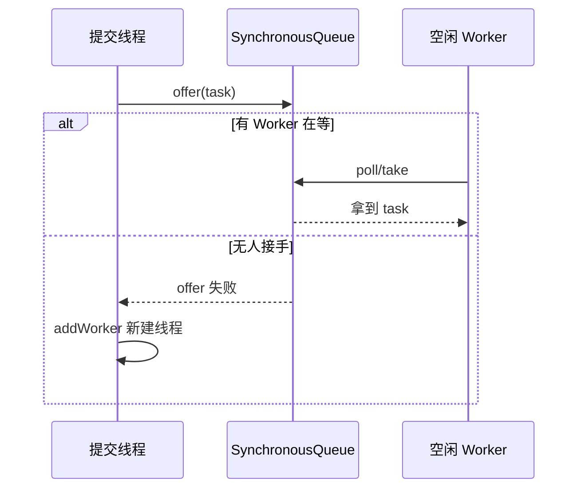
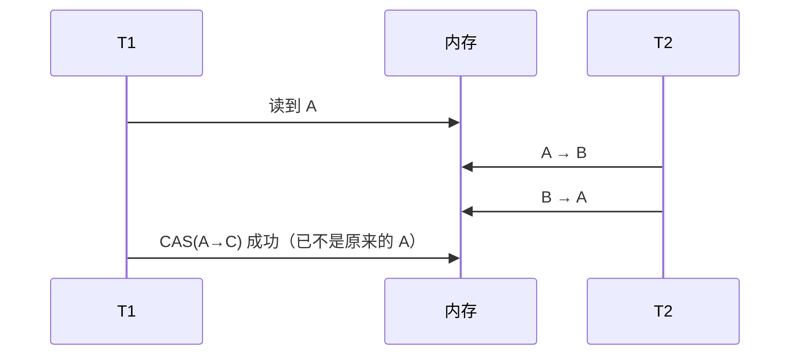
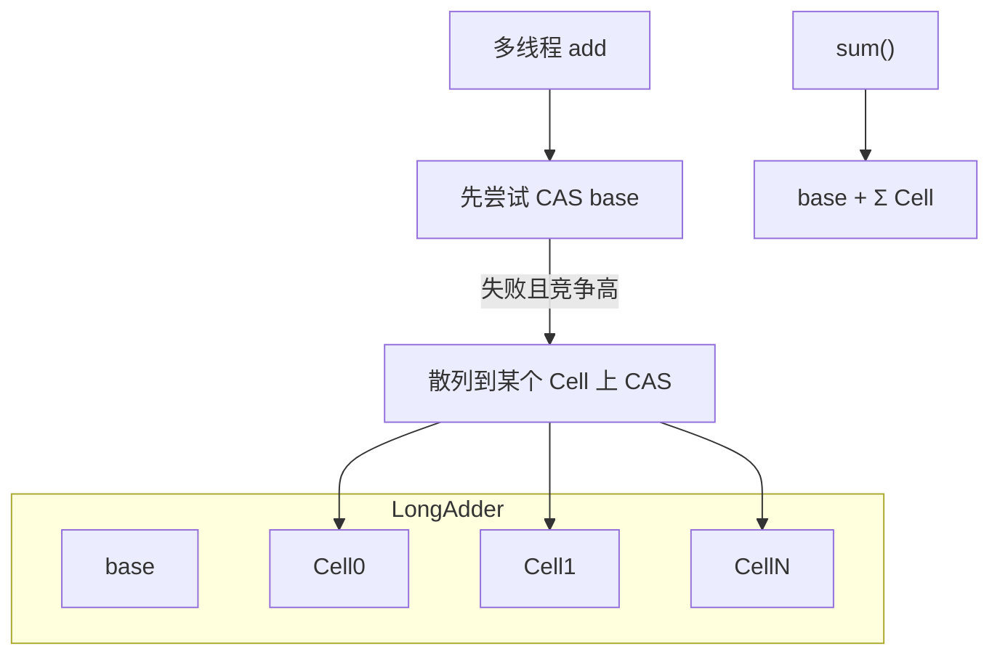
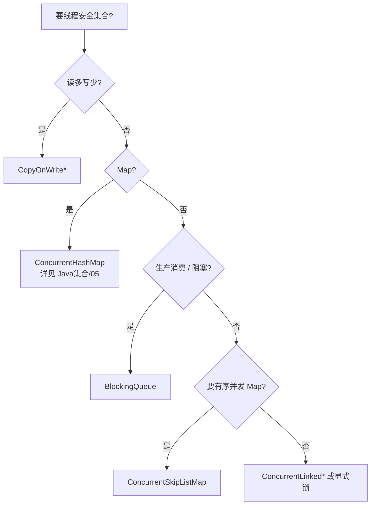

# 07 · 阻塞队列与原子类

> 生产者-消费者选队列、Atomic* 与 LongAdder、线程安全集合简表。  
> 可与 [[04-AQS-CAS与显式锁]] 的 CAS、[[05-线程池与定时调度]] 的队列选型、[[../Java集合/05-ConcurrentHashMap|ConcurrentHashMap]] 呼应。

---

## 一、总览口述（1 分钟版）

> BlockingQueue 在放不下/取不到时可阻塞，是线程池与生产者-消费者的核心。  
> 有界 Array/Linked 控内存；SynchronousQueue 零容量手递手（Cached 线程池）；Delay/Priority 看调度。  
> put/take 阻塞；offer/poll 立即或超时返回。  
> 原子类靠 CAS；注意 ABA 用 Stamped；高并发计数优先 LongAdder。  
> 安全集合：Map 用 CHM，读多写少用 COW，管道用 BlockingQueue。

---

## 面试题

### Q1. 你使用过 Java 中的哪些阻塞队列？

`BlockingQueue` 在「放不下 / 取不到」时可阻塞，是线程池、生产者-消费者的核心构件。

#### 1.1 对比总表（结构 / 有界 / 锁策略 / 场景）

| 队列 | 结构 | 有界？ | 锁策略 | 特点 | 典型场景 |
| --- | --- | --- | --- | --- | --- |
| **ArrayBlockingQueue** | 循环数组 | **有界**（构造必指定容量） | **一把锁** + 两个 Condition（notEmpty/notFull）；公平可选 | 生产消费互斥在同一把锁，实现简单 | 线程池有界队列、流量可控缓冲 |
| **LinkedBlockingQueue** | 单向链表 | 可选；默认 **Integer.MAX** 近乎无界 | **两把锁**：`putLock` + `takeLock` | 吞吐常高于 Array；**默认无界易 OOM** | FixedThreadPool 默认队列（坑） |
| **SynchronousQueue** | 无存储，直接移交 | 容量 **0** | 公平用 TransferQueue 队列；非公平用栈式交换 | put 必须等 take（或反之） | Cached 线程池；手递手传递 |
| **PriorityBlockingQueue** | 二叉堆 | **无界** | 一把锁 | 按优先级出队；Comparator 要一致 | 优先级任务调度 |
| **DelayQueue** | 堆 + `Delayed` | **无界** | 一把锁 | 到期才能 take | 延迟任务、超时订单（配合消费者） |
| **LinkedTransferQueue** | 链表 | **无界** | CAS 为主（TransferQueue） | `transfer`/`tryTransfer` 更强移交 | 高并发传递（细节相对少考） |
| **LinkedBlockingDeque** | 双端链表 | 可选有界 | 一把锁 | 两端进出 | 双端工作队列等 |

另：`BlockingDeque` 扩展双端；`PriorityBlockingQueue` / `DelayQueue` **不能放 null**；多数 BlockingQueue 也不允许 null。



#### 1.2 为何 Linked 常用两把锁？

`LinkedBlockingQueue` 入队改 tail、出队改 head，两条路径可并行：生产者们抢 `putLock`，消费者们抢 `takeLock`，用 `AtomicInteger count` 协调空/满。高并发下常比「单锁 Array」吞吐更好；但 **默认容量极大**，当线程池队列用时等于埋 OOM 雷。

Array 单锁：实现简单、容量固定、缓存局部性好；竞争高时锁成为瓶颈，但对「明确有界」更安全。

#### 1.3 放入 / 取出四套语义（常考）

| 方法族 | 队列满 / 空时 | 典型用途 |
| --- | --- | --- |
| `add` / `remove` / `element` | **抛异常** | 不期望阻塞、失败即 bug |
| `offer` / `poll` / `peek` | 返回 **false/null**；可带超时 | 线程池入队、可放弃的生产 |
| `put` / `take` | **一直阻塞** | 经典生产-消费，背压自然形成 |
| `offer(e, time)` / `poll(time)` | **超时**失败 | 既要阻塞又要有上限等待 |


对照记忆：

| 想要的行为 | 用 |
| --- | --- |
| 满了就等 | `put` |
| 满了立刻失败 | `offer` |
| 满了等一会儿 | `offer(e, timeout, unit)` |
| 空了就等 | `take` |
| 空了立刻拿不到 | `poll` |

线程池内部入队用的是 **`offer`**（非阻塞）：offer 失败才触发扩到 max / reject。所以 **无界 Linked 的 offer 几乎永不失败** → 扩不到 max。

#### 1.4 SynchronousQueue 与 Cached 线程池

```text
newCachedThreadPool:
  core=0, max=Integer.MAX_VALUE
  workQueue = new SynchronousQueue<>()
  keepAlive=60s
```

语义：

1. 队列**不存**任务；`offer` 成功 ⟺ 正好有空闲 Worker 在 `poll/take` 接手。  
2. 没有空闲线程 → offer 失败 → `addWorker` 新建线程（max 极大）。  
3. 突发流量 → 瞬间创建大量线程 → CPU/内存打爆。  

适用：任务执行很快、希望「有人就立刻移交、没人就开新线程」，且调用方能接受线程暴涨风险。生产更稳妥：有界队列 + 明确 max + 拒绝策略。



#### 1.5 选型口述

- 要控内存、线程池排队 → **有界 Array/Linked**  
- 任务直接交给空闲线程 → **SynchronousQueue**（清楚风险）  
- 延迟执行 → **DelayQueue**（或 Scheduled 线程池）  
- 优先级 → **PriorityBlockingQueue**  
- **切忌**业务缓冲用默认可无限增长的 Linked  

**口述：**  
> 阻塞队列用 put/take 做生产消费；线程池里我偏好有界 ArrayBlockingQueue。Linked 默认无界是 Fixed 池的坑。Cached 用 SynchronousQueue 手递手，可能无界建线程。Delay/Priority 看调度需求。锁策略上 Array 一把锁，Linked 两把锁吞吐更好。

**追问：**

- Q：有界 LinkedBlockingQueue(1000) 和 ArrayBlockingQueue(1000) 怎么选？  
  A：都要有界防 OOM。高并发生产消费可倾向 Linked（两锁）；要公平、预分配数组、简单可控选 Array。多数业务差距不如「是否有界 + 拒绝策略」重要。

---

### Q2. 你使用过 Java 中的哪些原子类？

基于 **CAS**（`Unsafe` / `VarHandle`）的 `java.util.concurrent.atomic`，与 [[04-AQS-CAS与显式锁]] 同一套无锁思路。本章按「清单 + ABA + 注意」背。

#### 2.1 分类清单

| 类别 | 类 | 用途 |
| --- | --- | --- |
| **基本类型** | `AtomicInteger`、`AtomicLong`、`AtomicBoolean`、`AtomicInteger`… | 单变量原子增减、CAS |
| **引用** | `AtomicReference` | 对象引用 CAS |
| | `AtomicStampedReference` | 引用 + **版本戳**，解决 ABA |
| | `AtomicMarkableReference` | 引用 + **一比特 mark** |
| **数组** | `AtomicIntegerArray`、`AtomicLongArray`、`AtomicReferenceArray` | 数组元素原子更新 |
| **字段更新器** | `AtomicIntegerFieldUpdater` 等 | 对 **volatile 字段** 原子更新，省对象头 |
| **累加器** | `LongAdder`、`LongAccumulator`、`DoubleAdder`… | 高并发统计，见 Q3 |
| **JDK9+** | `VarHandle` | 更通用的原子/屏障操作 |

#### 2.2 常用 API（以 AtomicInteger 为例）

| 方法 | 含义 |
| --- | --- |
| `get` / `set` | 读 / 写 |
| `getAndIncrement` / `incrementAndGet` | i++ / ++i |
| `compareAndSet(expect, update)` | CAS |
| `weakCompareAndSet*` | 允许伪失败（某些平台），用于自旋重试场景 |
| `getAndUpdate` / `updateAndGet` | 函数式更新 |
| `accumulateAndGet` | 二元累计 |

```java
AtomicInteger online = new AtomicInteger();
online.incrementAndGet();
online.compareAndSet(1, 2);

AtomicStampedReference<Node> top = new AtomicStampedReference<>(head, 0);
int[] stamp = new int[1];
Node cur = top.get(stamp);
top.compareAndSet(cur, next, stamp[0], stamp[0] + 1);
```

#### 2.3 ABA 问题（必问）

**ABA：** T1 读到 A，准备 CAS 成 C；期间 T2 把 A→B→A；T1 的 CAS 仍成功，但中间状态已被破坏（无锁栈顶弹出又压回「同引用不同语义」）。



| 对策 | 思路 |
| --- | --- |
| **`AtomicStampedReference`** | 值 + 版本戳，CAS 同时比对 |
| **`AtomicMarkableReference`** | 值 + mark 比特（逻辑删除等） |
| 业务侧 | 禁止复用对象身份、加唯一 ID、或加锁 |

#### 2.4 使用注意（面试加分）

1. **只保证单变量原子**；`check-then-act` 跨两个原子变量仍要锁或合并状态。  
2. **自旋成本**：CAS 失败会重试，高竞争下 `AtomicLong` 不如 `LongAdder`。  
3. **不要用原子类替代业务锁**：复杂不变量仍用 `synchronized` / `ReentrantLock`。  
4. FieldUpdater 要求字段 **volatile**，更新器通常 **static final** 缓存；可见性/约束易踩坑，优先普通 Atomic 字段。  
5. `set` 是直接写，不带 CAS；要「仅当某值才改」用 `compareAndSet`。

**口述：**  
> AtomicInteger/Long 做计数和旗标；引用类做无锁结构；有 ABA 上 stamped；纯热点统计优先 LongAdder。记住原子类不解复合业务不变量。

**追问：**

- Q：AtomicInteger 能代替 synchronized 做「先读后写」的余额扣减吗？  
  A：单字段可用 `compareAndSet` 或 `updateAndGet` 做乐观扣减；一旦涉及两个账户或余额+流水，必须锁或事务。

---

### Q3. 你使用过 Java 的累加器吗？（LongAdder 详解）

**LongAdder**（JDK8，`java.util.concurrent.atomic`）：为 **高并发累加** 设计。思路是 **空间换时间**——把竞争分散到多个 **Cell**（条带），写时尽量打到不同 Cell，读时再求和。

#### 3.1 结构与流程



要点（口述级）：

1. 低竞争时直接 CAS 改 `base`，和 AtomicLong 类似。  
2. 竞争上来后扩容 `Cell[]`（类 LongAdder / Striped64），线程按探测值落到不同 Cell。  
3. `sum()` 遍历 base+cells **相加**——期间若有并发 `add`，结果是**近似快照**，不是强一致瞬时值。  
4. `increment`/`add`/`reset`/`sumThenReset` 是常用 API。

#### 3.2 LongAdder vs AtomicLong

| 对比 | `AtomicLong` | `LongAdder` |
| --- | --- | --- |
| 原理 | 单点 CAS 热变量 | base + 动态 Cell 分散 CAS |
| 低竞争 | 足够好，甚至更简单 | 稍有额外路径开销 |
| **高竞争写** | CAS 自旋严重，吞吐差 | **吞吐明显更好** |
| 读当前值 | `get()` 精确（相对自身） | `sum()` **近似** |
| 做 CAS 决策 | 擅长（期望值比较） | **不适合**当「精确状态机」 |
| 适用 | 需要精确当前值、CAS 期望值 | **统计、打点、QPS、成功次数** |
| 空间 | 一个 long | 可能多个 Cell，占更多内存 |

相关类：

- `LongAccumulator`：自定义聚合函数的 Long 版（如 max、自定义合并）  
- `DoubleAdder` / `DoubleAccumulator`：浮点版  
- ConcurrentHashMap 的 `CounterCell`、Striped64 家族同一思想  

```java
LongAdder qps = new LongAdder();
void onRequest() { qps.increment(); }
long last = 0;
void report() {
  long now = qps.sum();
  log.info("approx total={}, delta~={}", now, now - last);
  last = now;
}
```

注意：需要「每次读都绝对精确且基于旧值 CAS 决策」时仍用 `AtomicLong`；要序列化精确快照可先停写再 `sum`，或接受近似。

**口述：**  
> LongAdder 把计数摊到多个 Cell，适合高并发统计；AtomicLong 适合要精确 CAS 的场景。写用 add，读用 sum，并承认 sum 是近似快照。

**追问：**

- Q：ConcurrentHashMap.size 为啥也像 LongAdder？  
  A：JDK8 CHM 用 baseCount + CounterCell 分散计数，避免所有 put 打同一 size 字段——和 LongAdder 同构。

---

### Q4. 线程安全集合有哪些？（简表）

完整集合体系见 **Java 集合** 章节（尤其 [[../Java集合/05-ConcurrentHashMap|ConcurrentHashMap]]、[[../Java集合/07-Queue与Deque|Queue 与 Deque]]）。此处面试够用的简表：

| 类型 | 代表 | 要点 |
| --- | --- | --- |
| **并发 Map** | `ConcurrentHashMap` | 桶级 CAS + synchronized；复合操作慎用（用 `compute`/`putIfAbsent`） |
| | `ConcurrentSkipListMap` | 有序、并发跳表 |
| **CopyOnWrite** | `CopyOnWriteArrayList` / `Set` | 写时复制，适合 **读多写极少**；写贵、迭代弱一致 |
| **阻塞队列** | `BlockingQueue` 实现们 | 生产消费；见本题 Q1 |
| **并发队列（非阻塞）** | `ConcurrentLinkedQueue` / `Deque` | CAS 无界；不阻塞；无界注意内存 |
| **同步包装** | `Collections.synchronizedList/Map/...` | 整集合一把锁；迭代需手动 sync；偏老式 |
| **Hashtable / Vector** | 遗留 | 方法级 synchronized；一般用 CHM / 并发集合替代 |



#### 选型速判

| 需求 | 优先 |
| --- | --- |
| 高并发缓存 Map | `ConcurrentHashMap` |
| 监听器列表极少变 | `CopyOnWriteArrayList` |
| 线程池任务队列 | **有界** `ArrayBlockingQueue` / `LinkedBlockingQueue` |
| 非阻塞消息管道 | `ConcurrentLinkedQueue`（注意无界） |
| 全局排序的并发 Map | `ConcurrentSkipListMap` |

**口述：**  
> Map 用 ConcurrentHashMap；读多写少用 CopyOnWrite；管道用 BlockingQueue；synchronizedXxx 能跑但不推荐做热点路径。细节放到集合专题讲 CHM。

**追问：**

- Q：ConcurrentHashMap 能用 size 做精确限流吗？  
  A：size 在并发下是估算/遍历累加语义，不适合强一致限额；限额用 Semaphore 或外部计数器更稳。

---

## 本节速记

| 点 | 一句话 |
| --- | --- |
| 有界队列 | 线程池与缓冲首选，防 OOM |
| Linked 两锁 | putLock/takeLock，吞吐好但默认无界坑 |
| Array 单锁 | 有界清晰，公平可选 |
| SynchronousQueue | 零容量手递手；Cached 可能无界线程 |
| put/take vs offer/poll | 阻塞 vs 立即/超时 |
| Atomic* | CAS 单变量；注意 ABA 与复合操作 |
| LongAdder | 高并发计数摊 Cell，sum 近似快照 |
| 安全集合 | CHM / COW / BlockingQueue / ConcurrentLinked* → 链到 Java集合 |
