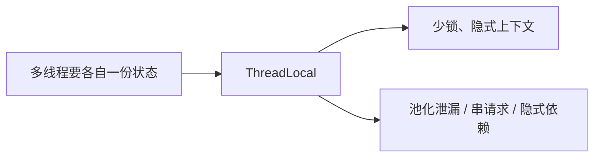
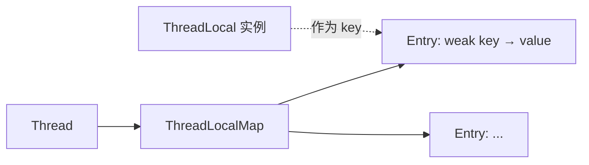
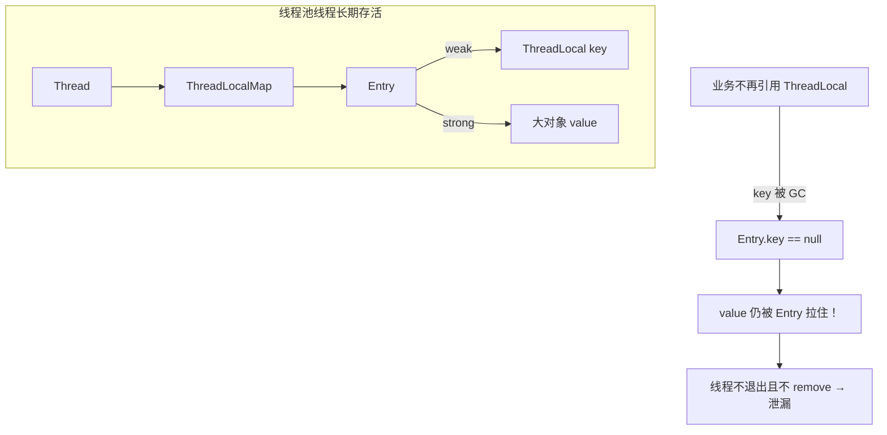
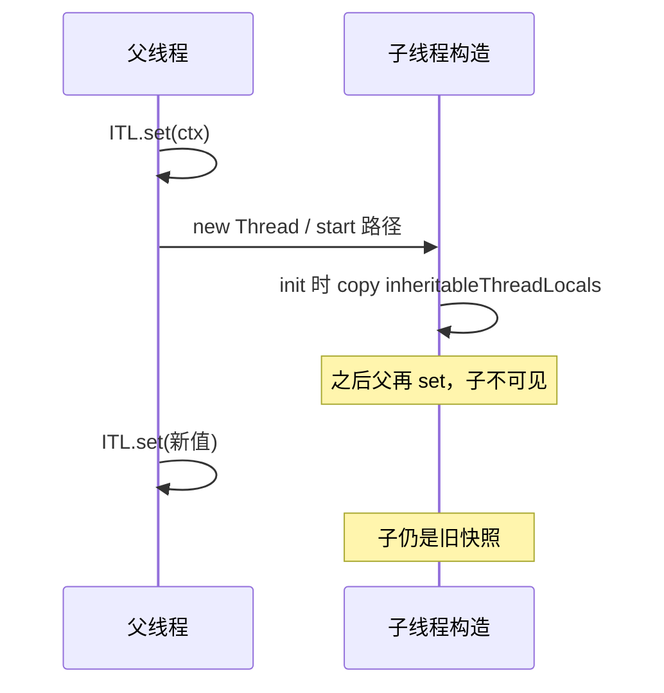
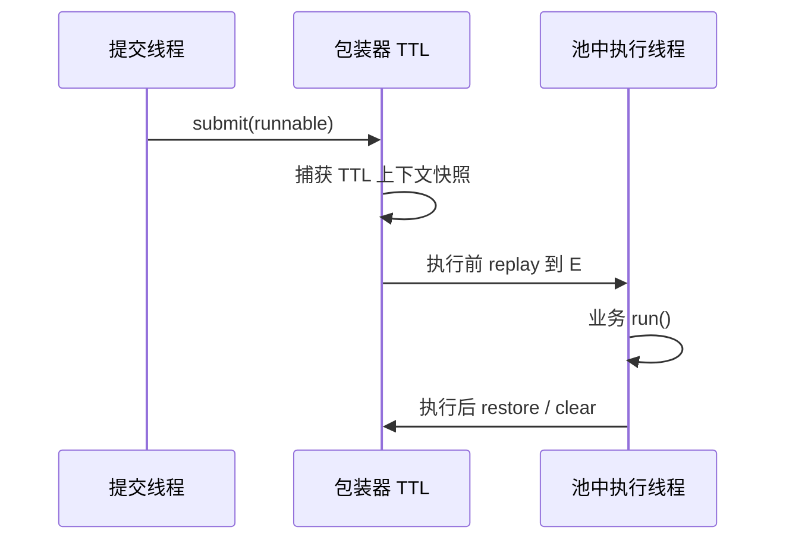
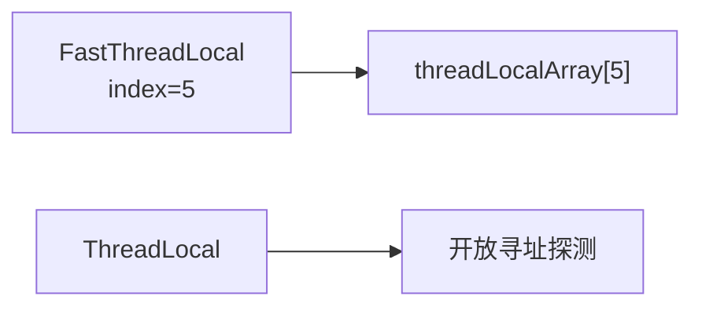

# 08 · ThreadLocal 专题

> 高频坑：原理、弱引用、内存泄漏、父子线程、TTL、Netty FastThreadLocal、MDC。  
> 答法：**隔离模型 → Map 结构 → 泄漏图 → 池化传递 → 最佳实践清单**。

---

## 一分钟口述

> ThreadLocal 让每个线程有一份自己的变量副本，数据挂在 `Thread.threadLocals` 这张 **ThreadLocalMap** 上。  
> Map 用开放寻址，key 是 **弱引用** 的 ThreadLocal；**value 仍是强引用** → 线程池不 `remove` 会泄漏、还会**串请求**。  
> 父子传递：`InheritableThreadLocal` 只在**创建子线程时拷贝一次**；池化场景用阿里 **TTL**（提交捕获、执行恢复）。  
> Netty **FastThreadLocal** 用 index 数组换探测；日志 **MDC** 底层也是 ThreadLocal，同样要清理。

---

## 面试题

### Q1. 为什么在 Java 中需要使用 ThreadLocal？

**定义：**  
ThreadLocal 提供**线程封闭（Thread Confinement）**：每个线程访问同一个 `ThreadLocal` 对象时，拿到的是**各自独立的值副本**，从而在许多场景下避免对共享可变状态加锁。

#### 典型场景

| 场景 | 例子 |
| --- | --- |
| 上下文传递 | 用户 ID、traceId、租户、登录态 |
| 非线程安全工具复用 | 旧版 `SimpleDateFormat`；现多用 `DateTimeFormatter` / `ThreadLocalRandom` |
| 连接/会话绑定 | 某些 ORM 把 Connection/Session 绑当前线程 |
| 降低锁竞争 | 思路上「每线程一份再汇总」；高并发计数更常用 `LongAdder` |

#### 它解决什么、不解决什么



**易错点：** 把 ThreadLocal 当「全局变量便利贴」→ 调试困难；能参数传递就别藏上下文。

**口述收束：**  
> 需要线程封闭时用 ThreadLocal；线程池场景必须成对 `set/remove`，否则串线+泄漏。

---

### Q2. Java 中的 ThreadLocal 是如何实现线程资源隔离的？

**定义：**  
隔离不靠静态 Map 按线程 ID 查（那会有全局锁/泄漏问题），而是：**每个 Thread 对象内嵌一张 ThreadLocalMap**，以 ThreadLocal 实例为 key。

#### 结构分层

| 组件 | 作用 |
| --- | --- |
| `Thread.threadLocals` | 当前线程的 `ThreadLocalMap` |
| `ThreadLocal` | 作为 key 的「句柄」，本身几乎不存业务值 |
| `ThreadLocalMap.Entry` | `WeakReference<ThreadLocal<?>>` + 强引用 value |
| 开放寻址 | 线性探测解决 hash 冲突（不是拉链） |



#### hash 魔数与探测（原理加分）

- 每个 ThreadLocal 有 `threadLocalHashCode`，通过 `HASH_INCREMENT = 0x61c88647`（黄金分割相关魔数）递增，使下标在 2 次幂表长上分布更均匀。  
- `set/get`：`i = key.threadLocalHashCode & (table.length - 1)`，冲突则 `i = nextIndex(i)` **线性探测**。  
- 探测过程中遇到 `key == null` 的陈旧 Entry，会尝试**启发式清理**（但不是实时 GC，不能替代 `remove`）。

```java
// 语义伪代码
void set(T value) {
  Thread t = Thread.currentThread();
  ThreadLocalMap map = t.threadLocals;
  if (map != null) map.set(this, value);
  else createMap(t, value);
}

T get() {
  ThreadLocalMap map = Thread.currentThread().threadLocals;
  // 只查当前线程的 map → 自然隔离
}
```

**隔离本质：** 数据挂在 Thread 上；别的线程没有你的 Map 条目（除非你把 value 引用又共享出去）。

**易错点：** 以为 ThreadLocal 存在「静态全局表」→ 说错结构；面试要明确 **Thread → Map → Entry**。

**口述收束：**  
> 每个线程自带 ThreadLocalMap；开放寻址 + 魔数散列；get/set 只碰当前线程，从而实现隔离。

---

### Q3. 为什么 Java 中的 ThreadLocal 对 key 的引用为弱引用？

**定义：**  
`Entry extends WeakReference<ThreadLocal<?>>`，即 **key 弱、value 强**。这是在「线程很长寿」前提下减轻泄漏的设计，**不是**免 `remove` 许可证。

#### 对比：若 key 也是强引用

| key 类型 | ThreadLocal 对象已无业务引用时 | 结果 |
| --- | --- | --- |
| 强引用 | Entry 仍强握住 TL | TL + value **都难回收** → 更惨 |
| 弱引用 | TL 可被 GC，key 变 null | TL 可回收；**value 仍被 Entry 强引用** |



#### 清理时机（源码直觉）

- 后续 `get/set/remove`、扩容、`expungeStaleEntry` 等路径会清理 `key==null` 的槽。  
- 若线程从池中取出后**既不访问该 TL、也不 remove**，陈旧 value 可能长期留存。

**口述收束：**  
> 弱 key 让 ThreadLocal 对象可被回收；value 仍强引用，所以线程池必须 finally remove。

---

### Q4. ThreadLocal 的缺点？

**定义：** 便利的反面是隐式状态与生命周期难控。

| 缺点 | 表现 | 后果 |
| --- | --- | --- |
| 泄漏风险 | 池化线程 + 不 remove | 堆占用涨、Full GC、OOM |
| 脏数据 / 串请求 | 线程复用，上个请求上下文还在 | 用户 A 看到 B 的数据（严重事故） |
| 父子不自动传递 | 普通 TL 子线程读不到 | 异步丢 traceId |
| ITL 不适合池 | 只在创建时拷贝 | 误用导致「偶发错乱」 |
| 调试/测试难 | 隐式依赖 | 难复现、难单测 |
| 滥用架构 | 到处 get 上下文 | 耦合、难重构 |

```java
// 串请求经典事故
try {
  USER.set(currentUser);   // 请求进来
  handle();
} // 忘了 finally remove
// 同一线程处理下一请求 → USER.get() 仍是上一个用户
```

**追问：和「参数显式传递」比？**  
显式传参更清晰；TL 适合框架级横切（事务、追踪），但要有统一拦截器清理。

**口述收束：**  
> 最大两个坑：泄漏与串请求；根因都是线程复用 + 生命周期没闭环。

---

### Q5. Java 中使用 ThreadLocal 的最佳实践是什么？

**定义：** 把 ThreadLocal 当「必须配对归还的资源」，像文件句柄一样管理。

#### 完整最佳实践清单

1. **用完必 `remove()`**，一律 `try/finally`（或 Filter/Interceptor 统一出口）。  
2. **`private static final ThreadLocal<...>`**，避免随处 `new ThreadLocal` 造成多余 Entry。  
3. **线程池 / Web 容器线程当作必考场景**：入口 set，出口 remove；异步线程另议 TTL。  
4. value 优先**不可变**或小对象；避免 value 里挂庞大对象图、连接未关。  
5. 能用 JDK 线程安全 API 就替代（`DateTimeFormatter` 代替 TL 包 SDF）。  
6. 日志上下文用 **MDC**，但要清楚 MDC 也是 TL，**同样要 clear**。  
7. 不要在线程间传递「写了 TL 的 Runnable」却不清理。  
8. 代码评审检查：每个 `set` 是否有对称 `remove`。  
9. 监控：堆直方图看业务上下文对象是否只增不减。  
10. 文档化：该 TL 的含义、作用域、清理点写进团队规范。

```java
private static final ThreadLocal<String> CTX = new ThreadLocal<>();

public void doFilter(Req req, Chain chain) {
  try {
    CTX.set(req.userId());
    chain.doFilter(req);
  } finally {
    CTX.remove();          // 不是 set(null)
  }
}
```

**易错点：** `set(null)` ≠ `remove()`：`set(null)` 仍可能保留槽位语义差异；规范做法是 **`remove()`** 删除 Entry。

**口述收束：**  
> static + try/finally remove + 拦截器统一清理；能不用 TL 就不用。

---

### Q6. Java 中的 InheritableThreadLocal 是什么？

**定义：**  
`InheritableThreadLocal` 在**父线程创建子线程时**，把父线程的 inheritable 映射**拷贝**到子线程（默认浅拷贝 value 引用）。

#### 源码级「创建时拷贝」



要点：

1. 拷贝发生在 **Thread 初始化**（`init`），不是每次任务。  
2. 默认 **浅拷贝**：value 引用相同；可变对象两边互相影响。  
3. 可重写 `childValue` 做深拷贝或变换。

#### 线程池为何几乎不能用 ITL 做请求上下文

| 步骤 | 发生了什么 |
| --- | --- |
| 池创建 | worker 线程早已 `new` 好，那时父上下文可能是空/错误 |
| 提交任务 | **不会**再跑一遍 inheritable 拷贝 |
| 任务执行 | worker 上的 ITL 仍是旧值或空 → **传不过去 / 传错** |

**口述收束：**  
> ITL = 创建子线程时拷贝一次；线程池复用 worker，要用 TTL 而不是 ITL。

---

### Q7. 什么是 Java 的 TransmittableThreadLocal？

**定义：**  
阿里开源 **TransmittableThreadLocal（TTL）**：在任务**提交到线程池的那一刻捕获**提交线程的上下文，在**执行线程上恢复**，执行结束再**还原/清理**，解决池化下 ITL 失效。

#### 提交通捕获 / 执行恢复



#### 用法要点

- 装饰执行器：`TtlExecutors.getTtlExecutorService(executor)`  
- 或包装任务：`TtlRunnable.get(runnable)` / `TtlCallable`  
- 业务侧用 `TransmittableThreadLocal` 替代普通 TL（需要传递的那些）

| 对比 | ThreadLocal | ITL | TTL |
| --- | --- | --- | --- |
| 同线程 | ✓ | ✓ | ✓ |
| new 子线程 | ✗ | ✓ 创建时 | ✓ |
| 线程池任务 | ✗（易脏） | ✗ | ✓（需装饰） |

**易错点：** 只换了 TTL 类型、忘了装饰 Executor → 仍不传递；或执行后未还原导致池线程脏上下文。

**口述收束：**  
> TTL 在 submit 时捕获、run 前后恢复还原；池化传递上下文的标准面试答法。

---

### Q8. 为什么 Netty 不使用 ThreadLocal 而是自定义了一个 FastThreadLocal？

**定义：**  
`FastThreadLocal` 是 Netty 为**热点、长寿命 EventLoop 线程**定制的快速线程局部变量：用**常量下标数组**替代 JDK 的弱引用开放寻址 Map。

#### 原理对比

| 维度 | JDK ThreadLocal | FastThreadLocal |
| --- | --- | --- |
| 存储 | `ThreadLocalMap` 开放寻址 | `FastThreadLocalThread` 上 **Object[]** |
| 定位 | hash + 线性探测 | 注册时分配 **index**，直接数组访问 |
| 弱引用 | Entry 弱 key，要扫陈旧 | 不走那套探测/弱引用清理 |
| 清理 | get/set/remove 启发式 | 生命周期与线程绑定，`onRemoval` 等更可控 |
| 前提 | 任意 Thread | **FastThreadLocalThread** 上才最快；否则慢路径 |



```java
// 伪意：index 一次分配，之后 O(1)
fastThreadLocal.set(value);  // array[index] = value
V v = fastThreadLocal.get(); // return array[index]
```

**动机总结：** EventLoop 线程几乎固定、get/set 极热 → 值得用专用结构换吞吐，并降低弱引用扫描成本。

**口述收束：**  
> Netty 用 index 数组避开 JDK Map 探测与弱引用复杂度；跑在 FastThreadLocalThread 上收益最大。

---

## 专题：MDC 与 ThreadLocal 的关系

**MDC（Mapped Diagnostic Context）** 常见于 Log4j/Logback：把 `traceId` 等放入日志上下文，底层通常是 **ThreadLocal&lt;Map&gt;**。

| 注意点 | 说明 |
| --- | --- |
| 本质 | 仍是 TL，泄漏/串请求规则完全适用 |
| Web | Filter 入口 `MDC.put`，出口 `MDC.clear` |
| 异步 | 普通 MDC 不跨线程；需手动拷贝或 TTL/框架支持 |
| 与业务 TL | 别叠两套又不清理 |

---

## 最佳实践收束清单（面试可直接念）

1. static final 声明  
2. try/finally `remove`  
3. 拦截器统一清理  
4. 池化传上下文用 TTL + 装饰 Executor  
5. 新子线程可用 ITL，但知浅拷贝  
6. 日志用 MDC 且 clear  
7. 极热固定线程可考虑 FTL 思路  
8. 能参数传递 / 安全 API 替代则替代  

---

## 关联

- [[01-线程基础与通信]] · [[05-线程池与定时调度]] · [[09-死锁协作与场景题]] · [[00-知识总览]]
