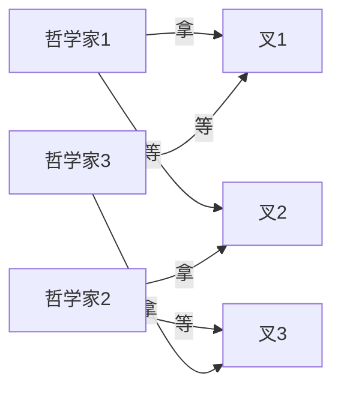
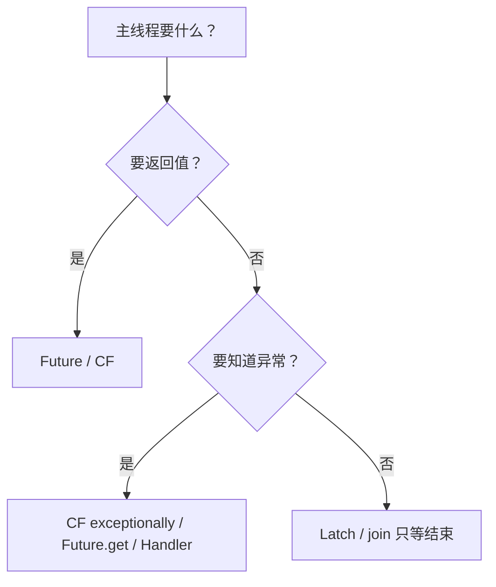
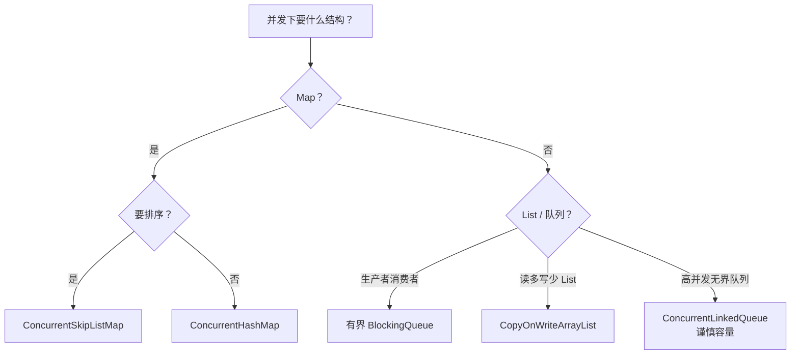
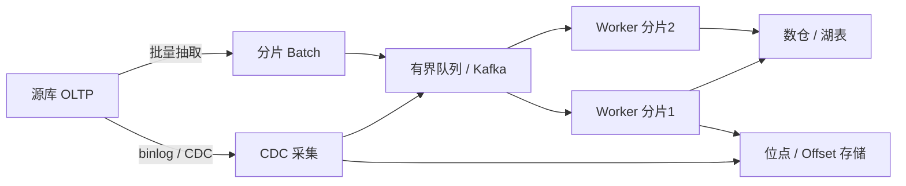
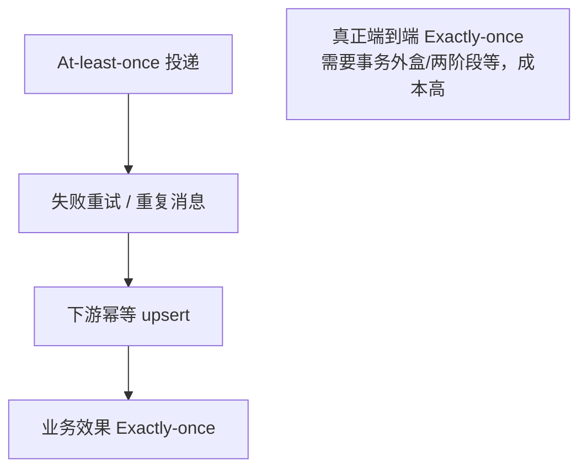

# 09 · 死锁、协作与场景题

> 综合题：死锁与活锁饥饿、主线程感知子线程、安全集合选型、数仓/CDC 同步。  
> 答法：**条件定义 → 排查手段 → 代码/架构 → 决策表 → 口述收束**。

---

## 一分钟口述

> 死锁要同时满足互斥、占有且等待、不可抢占、循环等待；用 **固定加锁顺序** 或 `tryLock` 破循环等待。  
> `jstack` 找 `Found one Java-level deadlock`。活锁是一直重试不推进，饥饿是一直抢不到资源。  
> 主线程感知子线程：优先 **Future/CF**；等齐用 Latch；别把 `isAlive` 当成功。  
> 集合选型按读写与有界背压；数仓同步核心是 **位点 + 幂等 + 背压**，Exactly-once 要说实话。

---

## 面试题

### Q1. Java 中什么情况会导致死锁？如何避免？

**定义：**  
**死锁（Deadlock）**：两个或多个线程，每个都持有对方需要的锁（或资源），并永远等待对方释放，以致**永久阻塞**。

#### 四人条件（缺一不可）

| 条件 | 含义 | 如何打破 |
| --- | --- | --- |
| **互斥** | 资源不能共享占用 | 无锁结构、读写锁、复制 |
| **占有且等待** | 持锁 A 再申请 B | 一次性申请、失败释放已持有 |
| **不可抢占** | 不能强行夺锁 | 设计超时放弃（应用层） |
| **循环等待** | 等待图成环 | **统一加锁顺序**（最常用） |

#### 典型代码形态

```text
T1: lock(A) → lock(B)
T2: lock(B) → lock(A)    // 环
```

```java
// 固定顺序：按系统 identityHashCode 排序，破循环等待
void transfer(Object a, Object b) {
  Object first = System.identityHashCode(a) < System.identityHashCode(b) ? a : b;
  Object second = first == a ? b : a;
  synchronized (first) {
    synchronized (second) {
      // ...
    }
  }
}
```

#### 死锁 vs 活锁 vs 饥饿

| | 死锁 | 活锁（Livelock） | 饥饿（Starvation） |
| --- | --- | --- | --- |
| 状态 | 永久阻塞 | 在跑，但**无进展** | 长期抢不到资源 |
| 例子 | 互相拿锁 | 两人都礼貌让路，一直重试失败 | 低优先级/非公平锁一直输 |
| CPU | 常睡眠等待 | 可能空转烧 CPU | 其它线程在跑 |

#### 哲学家就餐（经典建模）



常见解法：

1. **最多允许 N-1 人同时拿叉**（Semaphore）。  
2. **奇数/偶数学者不同拿叉顺序**（全局顺序）。  
3. `tryLock` 超时放下重试（注意活锁：加重试退避）。

#### jstack 怎么看

```bash
jps                          # 找 pid
jstack <pid>                 # 或 jcmd <pid> Thread.print
```

关注：

1. 文末是否出现 **`Found one Java-level deadlock`**。  
2. 死锁线程栈：`waiting to lock <0x…>` / `locked <0x…>`。  
3. 对照锁地址，画出「谁持有谁等待」。  
4. Arthas：`thread -b` 等可辅助。

```text
"t1":
  waiting to lock monitor 0xB (owned by "t2")
  locked monitor 0xA
"t2":
  waiting to lock monitor 0xA (owned by "t1")
  locked monitor 0xB
```

#### 避免 / 缓解清单

1. **固定加锁顺序**（按 id / hash 排序）  
2. `tryLock(timeout)`，失败回退、释放已持锁  
3. 缩小锁粒度、减少嵌套  
4. 能无锁则无（并发容器、CAS、单线程 Actor）  
5. 死锁检测 + 告警（库级/中间件）；应用层少依赖「抢占解锁」  
6. 银行家算法等（了解即可）

**易错点：** 只在测试环境「很难复现」→ 用压力+随机调度；数据库锁死锁也要查 SQL 顺序与索引。

**口述收束：**  
> 死锁四条件，工程上优先破循环等待；jstack 看 deadlock 段；区分活锁与饥饿。

---

### Q2. 在 Java 中主线程如何知晓创建的子线程是否执行成功？

**定义：**  
「成功」= **正常完成并得到预期结果**；不等于「线程还活着」或「没有立刻崩」。要**显式回传结果或异常**。

#### 方案对比（代码级）

| 手段 | 做法 | 适合 |
| --- | --- | --- |
| **Future** | `submit(callable)` → `get()` | 单任务要返回值 |
| **CompletableFuture** | `whenComplete` / `exceptionally` / `join` | 异步编排 |
| **join + 共享状态** | 子线程写 `volatile`/原子引用，主 `join` 后读 | 简单场景 |
| **CountDownLatch** | 子 `countDown`，主 `await` | 多任务「都结束」 |
| **回调 / 队列** | 完成事件入队 | 解耦 |
| **UncaughtExceptionHandler** | 未捕获异常 | 无返回值 Runnable |
| **afterExecute** | 线程池统一观测 | 池化任务 |

```java
// 1) Future：成功拿值，失败看 ExecutionException
ExecutorService es = Executors.newFixedThreadPool(4);
Future<Integer> f = es.submit(() -> {
  if (fail) throw new IllegalStateException("boom");
  return 42;
});
try {
  Integer ok = f.get(3, TimeUnit.SECONDS);
} catch (ExecutionException e) {
  Throwable cause = e.getCause(); // 真正业务异常
} catch (TimeoutException e) {
  f.cancel(true);
}

// 2) CompletableFuture
CompletableFuture.supplyAsync(() -> compute(), es)
  .whenComplete((r, ex) -> {
    if (ex != null) log.error("fail", ex);
    else log.info("ok {}", r);
  });

// 3) Latch：只关心「都跑完」，成功与否另存
CountDownLatch latch = new CountDownLatch(n);
AtomicReference<Exception> firstErr = new AtomicReference<>();
for (int i = 0; i < n; i++) {
  es.execute(() -> {
    try { work(); }
    catch (Exception e) { firstErr.compareAndSet(null, e); }
    finally { latch.countDown(); }
  });
}
latch.await();
if (firstErr.get() != null) throw firstErr.get();

// 4) join + volatile 结果
class Box { volatile boolean success; volatile Throwable err; }
Box box = new Box();
Thread t = new Thread(() -> {
  try { doJob(); box.success = true; }
  catch (Throwable e) { box.err = e; }
});
t.start();
t.join();
if (!box.success) throw new RuntimeException(box.err);
```



**易错点：**

- `isAlive()==false` ≠ 成功（可能异常退出）。  
- `Runnable` 异常默认只打到 UncaughtExceptionHandler，主线程无感知。  
- `get()` 不设超时可能跟子线程一起死锁式等待。

**口述收束：**  
> 有结果用 Future/CF；只等齐用 Latch；成功必须显式传递，别轮询 isAlive。

---

### Q3. Java 线程安全的集合有哪些？

**定义：**  
「线程安全集合」通常保证**单次 API 调用**在并发下的安全性；**复合操作**仍可能需要原子 API 或外部同步。

#### 选型总表

| 类型 | 代表 | 特点 | 何时用 |
| --- | --- | --- | --- |
| 并发 Map | `ConcurrentHashMap` | 桶级锁/CAS，读多无锁 | 高并发 Map **首选** |
| Copy-On-Write | `CopyOnWriteArrayList/Set` | 写时复制，读无锁 | **读多写极少** |
| 阻塞队列 | `ArrayBlockingQueue` 等 | 有界可背压 | 生产者消费者 |
| 并发队列 | `ConcurrentLinkedQueue` | 无界非阻塞 | 注意 OOM，慎当缓冲 |
| SkipList | `ConcurrentSkipListMap/Set` | 并发有序 | 要排序的并发 Map/Set |
| 遗留 | `Hashtable` / `Vector` | 整表锁 | **基本不用** |
| 包装 | `Collections.synchronizedXxx` | 粗粒度 | 遗留迁移，迭代仍要同步 |

#### 安全集合选型决策



```java
// 复合操作：不要 check-then-act
map.putIfAbsent(k, v);
map.computeIfAbsent(k, key -> new ArrayList<>()).add(item); // 注意：List 本身未必并发安全
```

**易错点：**

- `synchronizedList` 迭代必须手动 `synchronized(list)`。  
- COW 写很贵，写多会打爆 GC。  
- CHM 禁 null；单操作安全 ≠ 业务事务。

**口述收束：**  
> Map 用 CHM；协作缓冲用有界阻塞队列；读多写少才 COW；复合操作用原子 API。

---

### Q4. 多线程并发同步数据时（数据库的数据同步到数仓中）需要注意什么问题？

**定义：**  
DB → 数仓 / 湖的同步是**分布式数据管道**问题：多线程只是加速手段，正确性取决于 **位点、幂等、顺序、背压与资源匹配**。

#### 架构总览



#### 正确性

| # | 点 | 做法 |
| --- | --- | --- |
| 1 | **幂等** | 主键/唯一键 upsert、版本号、去重键；重试不产生重复累计 |
| 2 | **顺序** | 同实体变更顺序；按主键哈希到**单线程/单分区**保序 |
| 3 | **漏数 / 脏读** | 跑批时源库仍在写 → 用 **CDC 位点**、快照隔离、或业务时间+延迟窗口 |
| 4 | **水位** | binlog offset / GTID / 事务提交时间；慎用无索引扫 `updated_at` |
| 5 | **并发写目标** | 分片内串行或按 key 路由，避免更新丢失 |

#### 性能与资源

| # | 点 | 做法 |
| --- | --- | --- |
| 6 | **线程池 ↔ 连接池** | 同步并发度 ≤ 源/目标可承受连接；防打爆 OLTP |
| 7 | **批量 + 限流** | batch upsert、令牌桶；高峰降速 |
| 8 | **分片并行** | 主键 range / hash；盯热点分片 |
| 9 | **背压** | **有界**队列；满则阻塞/拒绝，防 OOM |

#### 运维与语义实话

| # | 点 | 实话 |
| --- | --- | --- |
| 10 | 可观测 | 任务级、分片级状态；死信与补偿 |
| 11 | **Exactly-once** | 端到端精确一次极难；多数是 **至少一次 + 下游幂等**（或事务+幂等表） |
| 12 | DDL / 字符集 / 时区 | schema 变更要进管道；统一时区 |

```java
// 分片 + 有界队列背压 + 幂等写（示意）
BlockingQueue<Batch> q = new ArrayBlockingQueue<>(256);
ExecutorService workers = Executors.newFixedThreadPool(8); // ≤ 连接池

// 生产：CDC/抽取
q.put(batch); // 满则阻塞 → 背压到上游

// 消费：按 pk 哈希保证同 key 有序（可用多队列）
workers.execute(() -> {
  while (running) {
    Batch b = q.take();
    try (Connection c = pool.getConnection()) {
      upsertIdempotent(c, b);      // INSERT ... ON CONFLICT / MERGE
      commitOffset(b.endOffset()); // 位点在成功后提交（至少一次语义）
    }
  }
});
```



**易错点：**

- 「开 100 线程同步就快」→ 源库连接、锁、redo 先崩。  
- 位点先提交再写仓 → 失败丢数据；写成功再提交位点 → 重复，靠幂等。  
- 无界缓冲「先堆内存里」→ OOM。

**口述收束：**  
> 多线程只是加速；同步本质是位点管理 + 幂等 + 背压；Exactly-once 多靠至少一次加下游幂等。

---

## 场景速查

| 面试官问 | 跳到 |
| --- | --- |
| 死锁四条件 / jstack | Q1 |
| 哲学家 / 活锁饥饿 | Q1 |
| 主线程如何知道子线程成功 | Q2 |
| CHM vs COW vs 阻塞队列 | Q3 |
| 数仓 CDC 同步注意点 | Q4 |

---

## 关联

- [[01-线程基础与通信]] · [[05-线程池与定时调度]] · [[07-阻塞队列与原子类]] · [[../Java集合/05-ConcurrentHashMap]] · [[00-知识总览]]
