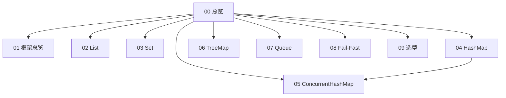

# Java 集合 · 知识总览

按知识节点复习。  
**核心三连：[[04-HashMap]] → [[05-ConcurrentHashMap]]（含无锁 get）→ [[02-List]]。**

## 知识地图

## 你这份题单对照索引

| 题目 | 位置 |
| --- | --- |
| HashMap 原理 | [[04-HashMap#Q15 说说 Java 中 HashMap 的原理？（综合口述题）]] |
| Hash 碰撞与解决 | [[04-HashMap#Q16 什么是 Hash 碰撞？怎么解决哈希碰撞？]] |
| HashMap 性能技巧 | [[04-HashMap#Q17 使用 HashMap 时，有哪些提升性能的技巧？]] |
| COW vs synchronizedList | [[02-List#Q16 CopyOnWriteArrayList 和 Collections.synchronizedList 有什么区别？优缺点？]] |
| 有哪些集合类 | [[01-集合框架总览#Q10 Java 中有哪些集合类？请简单介绍]] |
| 数组和链表区别 | [[02-List#Q13 数组和链表在 Java 中的区别是什么？（结合 List）]] |
| List 实现类 | [[02-List#Q14 List 接口有哪些常见实现类？]] |
| ArrayList vs LinkedList | [[02-List#Q1 ArrayList 和 LinkedList 有什么区别？怎么选？]] |
| ArrayList 扩容 | [[02-List#Q2 ArrayList 的默认容量、扩容机制具体是怎样的？]] |
| HashMap vs Hashtable | [[04-HashMap#Q9 HashMap 和 Hashtable 有什么区别？]] |
| CHM vs Hashtable | [[05-ConcurrentHashMap#Q1 ConcurrentHashMap 和 Hashtable 的区别是什么？]] |
| HashSet vs HashMap | [[03-Set#Q8 HashSet 和 HashMap 有什么区别？]] |
| HashMap 扩容 | [[04-HashMap#Q6 扩容 resize 具体怎么做？元素会搬到哪里？]] |
| 为何 2 的 n 次方扩容 | [[04-HashMap#Q18 为什么 HashMap 扩容时采用 2 的 n 次方倍？]] |
| 为何负载因子 0.75 | [[04-HashMap#Q5 负载因子为什么默认 0.75？阈值是什么？]] |
| 为何引入红黑树 | [[04-HashMap#Q19 为什么 JDK 1.8 对 HashMap 做了红黑树改动？]] |
| JDK8 其它改动 | [[04-HashMap#Q20 JDK 1.8 对 HashMap 除了红黑树还做了哪些改动？]] |
| LinkedHashMap | [[04-HashMap#Q21 LinkedHashMap 是什么？（展开）]] |
| TreeMap | [[06-TreeMap与排序#Q8 Java 中的 TreeMap 是什么？（综合题）]] |
| IdentityHashMap | [[04-HashMap#Q22 IdentityHashMap 是什么？]] |
| WeakHashMap | [[04-HashMap#Q23 WeakHashMap 是什么？]] |
| CHM 1.7 vs 1.8 | [[05-ConcurrentHashMap#Q2 ConcurrentHashMap 1.7 和 1.8 有哪些区别？（高频）]] |
| CHM get 是否加锁 | [[05-ConcurrentHashMap#Q4 ConcurrentHashMap 的 get 方法是否需要加锁？（重点）]] |
| CHM 为何禁 null | [[05-ConcurrentHashMap#Q5 为什么 ConcurrentHashMap 不支持 key 或 value 为 null？]] |
| CopyOnWriteArrayList | [[02-List#Q15 CopyOnWriteArrayList 是什么？完整原理与场景？]] |
| ConcurrentModificationException | [[08-遍历与Fail-Fast#Q8 你遇到过 ConcurrentModificationException 吗？它是如何产生的？]] |
| **CHM 底层 + 无锁机制** | [[05-ConcurrentHashMap]] 全文，尤其「二、无锁机制专题」 |

## 建议顺序

1. [[01-集合框架总览]]  
2. [[04-HashMap]] → **[[05-ConcurrentHashMap]]**（无锁 get / CAS / 桶锁）  
3. [[02-List]] → [[03-Set]] → [[06-TreeMap与排序]]  
4. [[08-遍历与Fail-Fast]] → [[09-对比选型与场景题]]  
