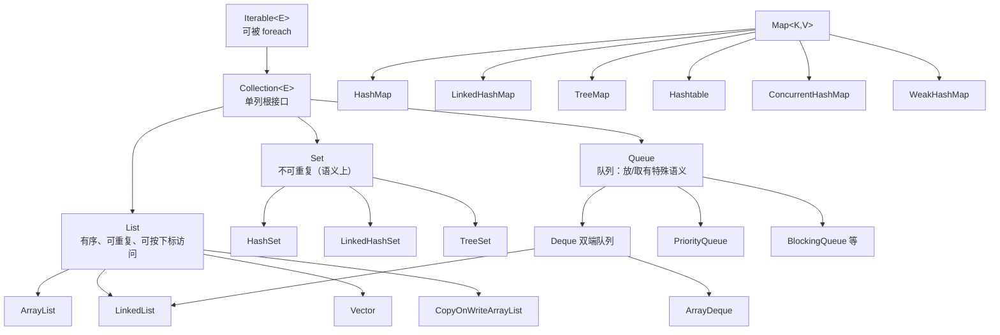
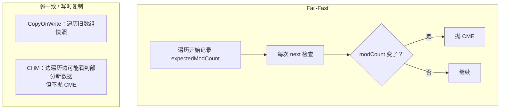

# 01 · 集合框架总览

> 节点目标：建立完整体系，能口述「有哪些接口、各自干什么、和数组差在哪」。

---

## 面试题

### Q1. 说说 Java 集合框架的体系结构？

Java 集合框架（Java Collections Framework）主要解决「如何存一组对象」的问题，相对数组提供了：动态扩容、丰富操作（增删查改、排序、查找）、统一接口。

整体分成两大体系：

1. **Collection**：单列集合，存一个个元素  
2. **Map**：双列集合，存键值对（**不继承** Collection）



另外还有工具类：

- `java.util.Collections`：排序、二分、同步包装、不可变包装等  
- `java.util.Arrays`：数组工具，和集合经常互转  

**口述模板：**  
> 集合分 Collection 和 Map。Collection 下 List 有序可重复，Set 去重，Queue 管排队。Map 管键值对。常用实现里 ArrayList、HashMap、ConcurrentHashMap 最常考。

---

### Q2. Collection 和 Collections 有什么区别？为什么初学者容易混？

| | Collection | Collections |
| --- | --- | --- |
| 本质 | **接口** | **工具类**（全是静态方法） |
| 作用 | 定义「一堆元素」的抽象能力：add/remove/size/iterator… | 对集合做算法或包装：`sort`、`binarySearch`、`synchronizedList`、`unmodifiableList`… |
| 包 | `java.util.Collection` | `java.util.Collections` |

常见用法举例：

```text
List<String> list = new ArrayList<>();
Collections.sort(list);                 // 排序
List<String> sync = Collections.synchronizedList(list); // 同步包装
List<String> frozen = Collections.unmodifiableList(list); // 只读视图
```

注意：`synchronizedList` 只是把每个方法加上同步，**迭代时仍要自己手动同步**，否则可能 CME；高并发更推荐 `ConcurrentHashMap`、`CopyOnWriteArrayList` 等真正的并发集合。

---

### Q3. List、Set、Map 的区别？各自典型场景？

| 维度 | List | Set | Map |
| --- | --- | --- | --- |
| 结构 | 有序序列 | 数学集合感：不重复 | 键 → 值 映射 |
| 重复 | 允许 | 不允许（按 equals/hash 或比较器） | key 唯一；value 可重复 |
| 访问 | 可按下标 `get(i)` | 通常只能按元素本身查是否存在 | 按 key 查 |
| null | 多数实现允许多个 null | HashSet 允许一个 null；TreeSet 一般不行 | HashMap 允许一个 null key；CHM/Hashtable 不允许 |
| 典型场景 | 排行结果、分页列表、有序流水 | 去重标签、已访问 URL | 字典、缓存、词频统计、配置 |

**选型一句话：**

- 要「按顺序、可重复、要下标」→ List（默认 ArrayList）  
- 要「去重」→ Set（默认 HashSet；要插入顺序 LinkedHashSet；要排序 TreeSet）  
- 要「根据 id 找对象」→ Map（默认 HashMap；并发 ConcurrentHashMap）  

---

### Q4. 集合和数组有什么区别？什么时候还用数组？

| | 数组 | 集合 |
| --- | --- | --- |
| 长度 | 创建后固定 | 多数可动态扩容 |
| 类型 | 可存基本类型 | 只能存引用类型（基本类型靠装箱） |
| API | 少 | 丰富（查找、批量、流式） |
| 性能 | 更底层、无装箱时更快 | 有对象头、扩容、装箱开销 |

仍适合数组的情况：长度固定、极度追求性能/内存、JNI/底层缓冲、矩阵运算等。日常业务列表几乎都用集合。

---

### Q5. 什么是 Fail-Fast？什么是 Fail-Safe？能举例吗？

**Fail-Fast（快速失败）**

- 迭代过程中如果检测到集合结构被「别人」改了，立刻抛 `ConcurrentModificationException`  
- 实现靠 `modCount` / `expectedModCount`  
- 典型：`ArrayList`、`HashMap`、`HashSet` 的迭代器  

注意：单线程在增强 for 里直接 `list.remove(obj)` 也会触发，因为不是通过 `Iterator.remove()` 改的。

**Fail-Safe（安全失败 / 弱一致，叫法不严谨但面试常用）**

- 迭代时不抛 CME，或迭代的是副本/弱一致视图  
- 典型：`CopyOnWriteArrayList`（快照）、`ConcurrentHashMap` 迭代器（弱一致，不保证强快照）  



更深细节见 [[08-遍历与Fail-Fast]]。

---

### Q6. 泛型在集合里有什么用？类型擦除是什么？对集合有什么影响？

**作用（编译期）：**

- `List<String>` 放入 Integer 会编译报错  
- 取出时少写强制转换，减少 `ClassCastException`  

**类型擦除（运行期）：**

- 泛型信息在字节码里大部分被擦掉，运行时集合差不多是「原料类型」  
- 所以不能：`new T()`、`new T[]`、`List<int>`（要用 `Integer`）  
- 可以有桥接方法等细节，面试抓「编译期检查、运行期擦除」即可  

```text
List<String> list = new ArrayList<>();
list.add("a");
String s = list.get(0); // 编译器插入检查/转换
// 运行时大致相当于 List 里拿 Object 再转 String
```

---

### Q7. 为什么集合不能直接存 int/long 等基本类型？

集合接口基于 `Object` 引用。基本类型不是对象，必须装箱成包装类：

- `int` → `Integer`  
- `long` → `Long`  

自动装箱/拆箱方便，但大量循环里会产生：

- 额外对象、更多 GC  
- 缓存范围外的装箱开销（如 `Integer` 默认缓存 -128～127）  

高性能场景可考虑原始类型专用集合库（如 fastutil、Eclipse Collections），或数组。

---

### Q8. Iterable、Iterator、Enumeration 什么关系？

- `Iterable`：能返回 `Iterator`，才能用增强 for  
- `Iterator`：`hasNext` / `next` / `remove`  
- `Enumeration`：老接口（`hasMoreElements`/`nextElement`），Vector、Hashtable 遗留，新代码用 Iterator  

List 还有 `ListIterator`：支持双向、可 `set`、可从指定下标开始。

---

### Q9. 接口里的 default 方法对集合有什么影响？（JDK8+）

`Collection` 增加了 `removeIf`、`stream`、`parallelStream`、`forEach` 等 default 方法，实现类自动拥有，减少样板代码。例如安全删除：

```text
list.removeIf(x -> x == null);
```

比自己写 Iterator 更不容易出错。

---

### Q10. Java 中有哪些集合类？请简单介绍

按体系介绍即可（不要背全部类名）：

**1. List（有序可重复）**

- `ArrayList`：动态数组，最常用  
- `LinkedList`：链表，兼作 Deque  
- `Vector` / `Stack`：遗留同步  
- `CopyOnWriteArrayList`：写时复制  

**2. Set（不重复）**

- `HashSet` / `LinkedHashSet` / `TreeSet`  
- `CopyOnWriteArraySet`、`ConcurrentSkipListSet`  

**3. Queue / Deque**

- `ArrayDeque`、`PriorityQueue`  
- `ArrayBlockingQueue`、`LinkedBlockingQueue`、`SynchronousQueue` 等  

**4. Map（键值对）**

- `HashMap`、`LinkedHashMap`、`TreeMap`  
- `Hashtable`（遗留）  
- `ConcurrentHashMap`、`ConcurrentSkipListMap`  
- `WeakHashMap`、`IdentityHashMap`（特殊）  

**5. 工具**

- `Collections`、`Arrays`  

画图见上文 Q1。

---

## 关联

- [[02-List]] · [[03-Set]] · [[04-HashMap]] · [[00-知识总览]]
