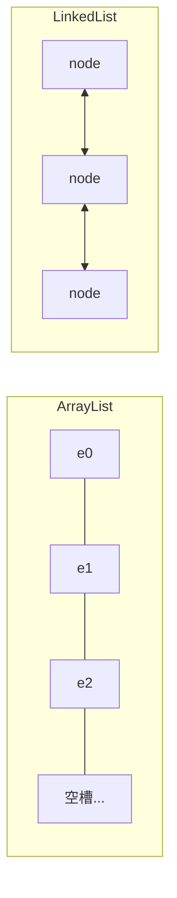
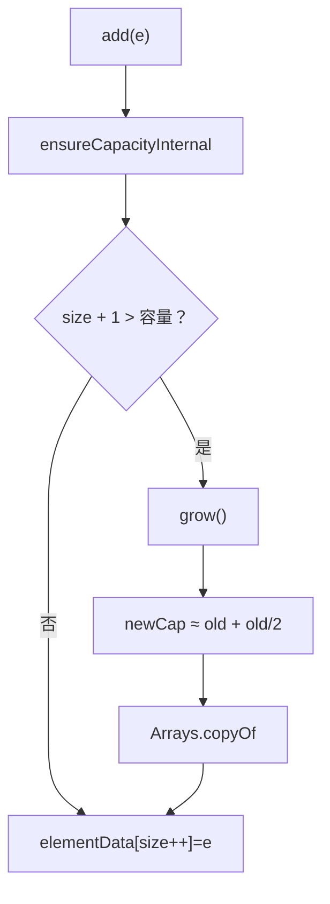
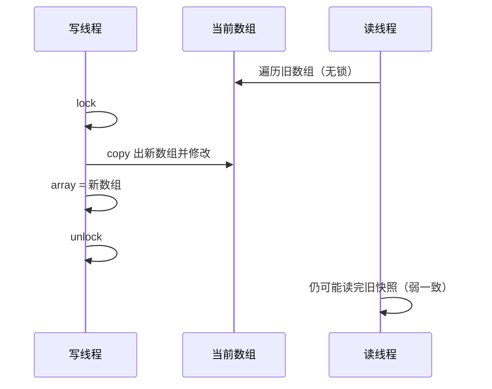
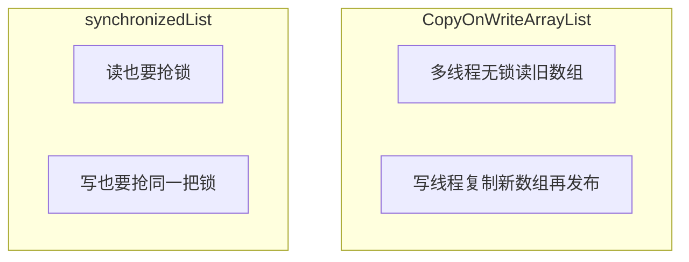

# 02 · List

> 节点目标：把 ArrayList 扩容、随机访问、删除代价讲透；能说明为什么多数场景不选 LinkedList；线程安全变体怎么选。

---

## 面试题

### Q1. ArrayList 和 LinkedList 有什么区别？怎么选？

| 维度 | ArrayList | LinkedList |
| --- | --- | --- |
| 底层 | `Object[] elementData` 动态数组 | 双向链表（每个节点 prev/item/next） |
| 随机访问 get(i) | **O(1)** | O(n) 从头或尾走近的一端 |
| 尾部 add | 均摊 **O(1)**（偶发扩容 O(n)） | O(1) |
| 头部插入 | O(n) 要搬移 | O(1) |
| 中间插入/删除 | O(n) 搬移 | O(n) 先找到节点 + O(1) 改指针 |
| 内存 | 连续，缓存友好；可能有空余容量 | 每节点对象头+指针，开销大、不连续 |
| 实现接口 | List, RandomAccess | List, Deque |

**怎么选（面试高分说法）：**

1. **默认用 ArrayList**——业务里最多的是遍历和按下标访问  
2. 需要队列/栈语义时，优先 **ArrayDeque**，而不是习惯性 LinkedList  
3. LinkedList 只在「大量头尾插入且几乎不随机访问」且确认基准测试更优时才考虑；现代 JVM 上 ArrayList 往往仍更快  



---

### Q2. ArrayList 的默认容量、扩容机制具体是怎样的？

以常见 JDK8+ 实现为准：

**1. 无参构造**

- `elementData` 先指向空数组共享实例  
- **容量看起来是 0**，第一次 `add` 才扩到默认 **10**  

**2. 有参构造 `new ArrayList<>(n)`**

- 直接分配容量 n，减少后续扩容（知道大概规模时强烈建议）

**3. 扩容 grow**

- 新容量大致：`oldCapacity + (oldCapacity >> 1)`，即 **约 1.5 倍**  
- 若还不够装下需求，取 `minCapacity`  
- 接近 `Integer.MAX_VALUE` 有溢出保护逻辑  
- 使用 `Arrays.copyOf` 把旧元素拷到新数组  



**扩容代价：** 申请新数组 + 拷贝，偶发卡顿。大批量导入应预设容量或 `ensureCapacity`。

**口述：**  
> ArrayList 空构造先是空数组，第一次 add 到 10；不够就按大约 1.5 倍扩，copyOf 搬迁。所以预估大小很重要。

---

### Q3. ArrayList 删除元素为什么可能很慢？按索引删和按对象删有何不同？

数组要保持紧凑：删除下标 `i` 后，`i+1…size-1` 整体左移一位，`System.arraycopy`，复杂度 **O(n)**。

| 方法 | 过程 |
| --- | --- |
| `remove(int index)` | 校验下标 → 搬移 → size-- → modCount++ |
| `remove(Object o)` | 先从头 **扫描** 找第一个 equals 的下标，再走上面的删除 |

所以按对象删最坏是「扫一遍 + 搬一段」；删中间比删末尾更贵（末尾几乎只 size--）。

---

### Q4. ArrayList 是线程安全的吗？有哪些保证安全的方式？各有什么代价？

**不是线程安全的。** 多线程同时 add/remove 可能：数组越界、丢元素、脏数据、CME。

常见方案：

| 方案 | 做法 | 优点 | 缺点 |
| --- | --- | --- | --- |
| `Collections.synchronizedList` | 每个方法锁 list | 简单 | 锁粗；迭代要手动 sync |
| `Vector` | 方法 synchronized | 老代码兼容 | 性能差，不推荐新项目 |
| `CopyOnWriteArrayList` | 写时复制 | 读多写少时读很快 | 写极贵、占内存、弱一致 |
| 外部锁 / 业务串行 | 自己控制 | 灵活 | 易漏 |
| 换结构 | 如并发队列 | 语义更清晰 | 看场景 |

---

### Q5. Vector 和 ArrayList 详细对比？为什么现在几乎不用 Vector？

| | Vector | ArrayList |
| --- | --- | --- |
| 同步 | 几乎每个 public 方法都 `synchronized` | 无 |
| 扩容 | 可指定增量；默认常 **翻倍** | 约 **1.5 倍** |
| 历史 | JDK1.0 遗留 | JDK1.2 集合框架主力 |
| 迭代 | 有 Enumeration | Iterator / fail-fast |

不用 Vector 的原因：锁太粗、扩展性差；要同步用更好的并发集合或更细粒度控制。

---

### Q6. CopyOnWriteArrayList 原理是什么？适用/不适用场景？

**原理：**

1. 内部 `volatile Object[] array`  
2. **读**：直接读当前数组，一般不加锁  
3. **写**（add/set/remove）：加锁 → **复制** 整个数组 → 在新数组修改 → 再把 volatile 引用指向新数组  



**适合：** 读远多于写，如监听器列表、配置白名单。  
**不适合：** 写频繁（每次复制 O(n)）、需要强一致读到最新写、内存紧张。

---

### Q7. 遍历 List 时删除元素，正确姿势有哪些？错误姿势会怎样？

**错误示例（易 CME）：**

```text
for (String s : list) {
    if (条件) list.remove(s); // 增强 for 底层 Iterator，但 remove 没走 iterator.remove
}
```

**正确做法：**

1. **Iterator**  
   ```text
   Iterator<String> it = list.iterator();
   while (it.hasNext()) {
       if (条件) it.remove();
   }
   ```  
2. **倒序下标删除**（避免删前面导致后面下标错乱）  
3. **`removeIf(Predicate)`**（JDK8+，推荐）  
4. 先收集待删集合再 `removeAll`  

并发列表用对应 API（如 COW 自己的迭代语义）。

---

### Q8. `Arrays.asList` 有哪些坑？

```text
List<String> list = Arrays.asList("a", "b");
list.add("c"); // 运行时 UnsupportedOperationException
```

原因：返回的是 `Arrays` 的 **内部固定大小 List**，背后是原数组的视图：

- 不能 add/remove（长度固定）  
- `set` 可以，且会改底层数组  
- 基本类型数组要注意：`Arrays.asList(new int[]{1,2})` 得到的是 **一个元素**（int[] 整体），不是 1、2 两个 Integer  

可变副本：

```text
List<String> mutable = new ArrayList<>(Arrays.asList("a", "b"));
```

---

### Q9. `subList` 要注意什么？

`list.subList(from, to)` 返回的是 **原列表的视图**，不是深拷贝：

- 改 subList 会改原 list  
- 原 list **结构改变**（非通过 subList）后，再操作 subList 可能抛 `ConcurrentModificationException`  
- 需要独立列表：`new ArrayList<>(list.subList(from, to))`  

---

### Q10. 什么是 RandomAccess？有什么用？

标记接口：表示支持 **快速随机访问**。ArrayList 实现了它，LinkedList 没有。

`Collections` 一些算法会判断：若是 RandomAccess 用下标循环，否则用迭代器，避免 LinkedList 下标遍历 O(n²)。

---

### Q11. ArrayList 的 `trimToSize`、`ensureCapacity` 干什么？

- `ensureCapacity(n)`：提前扩容，减少多次 grow  
- `trimToSize()`：把容量收到 = size，省内存（可能触发一次拷贝）  

内存敏感且列表基本不再增长时可用 trim。

---

### Q12. LinkedList 作为队列/栈时方法怎么对应？为什么还是更推 ArrayDeque？

LinkedList 实现了 Deque：

- 队列：`offer`/`poll`  
- 栈：`push`/`pop`  

但节点对象多、指针 chase 对 CPU 缓存不友好。**ArrayDeque** 用环形数组，通常更快、更省，单线程队列/栈首选。

---

### Q13. 数组和链表在 Java 中的区别是什么？（结合 List）

| 维度 | 数组 / ArrayList 背后 | 链表 / LinkedList 背后 |
| --- | --- | --- |
| 内存布局 | 连续（ArrayList 的 Object[]） | 节点分散，靠引用相连 |
| 随机访问 | O(1) | O(n) |
| 任意位置插入删除 | 需搬移 O(n) | 找到节点后改指针 O(1)，但查找仍 O(n) |
| 缓存 | 友好 | 不友好 |
| 空间 | ArrayList 可能有空余容量 | 每节点额外指针开销 |

Java 里「数组」还包括原始类型数组（无装箱）；ArrayList 只能存对象引用。

---

### Q14. List 接口有哪些常见实现类？

| 实现 | 说明 |
| --- | --- |
| ArrayList | 最常用，动态数组 |
| LinkedList | 双向链表，同时实现 Deque |
| Vector | 同步动态数组，遗留 |
| CopyOnWriteArrayList | 写时复制，读多写少并发 |
| Stack | 继承 Vector，遗留；栈请用 ArrayDeque |
| Arrays.ArrayList | `asList` 返回的固定大小内部类 |

---

### Q15. CopyOnWriteArrayList 是什么？完整原理与场景？

**定义：** 线程安全的 List；写操作复制底层数组，读通常无锁。

**原理：**

1. 内部 `volatile Object[] array`  
2. 写（add/set/remove）：加可重入锁 → `Arrays.copyOf` → 改新数组 → 再发布给 volatile  
3. 读 / 迭代：读当前数组快照，不加锁  

**优点：** 读极多写极少时读性能好、迭代不 CME。  
**缺点：** 写很贵（每次拷贝）；内存占用高；弱一致（读到的不一定是最新写）。  

适用：监听器列表、配置白名单。不适用：写频繁的队列。

---

### Q16. CopyOnWriteArrayList 和 Collections.synchronizedList 有什么区别？优缺点？

| 维度 | CopyOnWriteArrayList | Collections.synchronizedList |
| --- | --- | --- |
| 原理 | 写时复制整数组 | 在包装的 List 每个方法上加 `synchronized` |
| 读 | 一般无锁 | 每次读也要抢同一把锁 |
| 写 | 极贵（拷贝） | 相对便宜，但和所有访问互斥 |
| 迭代 | 快照，不需额外同步，不 CME | **必须手动 synchronized(list)** 再迭代，否则可能 CME |
| 一致性 | 弱一致 | 每个方法原子，但复合操作仍要自己同步 |
| 适合 | 读远多于写 | 读写都有、竞争不极端、实现简单 |



**选型一句话：** 读多写少 → COW；普通同步列表且读写均衡、逻辑简单 → synchronizedList；高并发写 → 考虑别的结构或分段，而不是 COW。

---

## 关联

- [[07-Queue与Deque]] · [[08-遍历与Fail-Fast]] · [[09-对比选型与场景题]]
