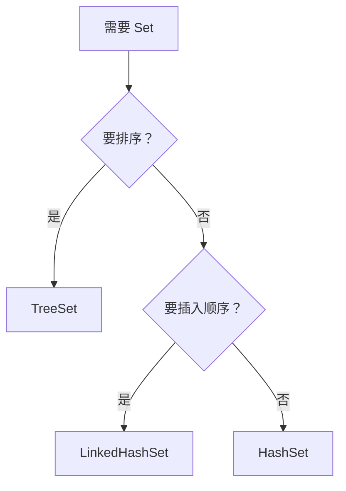
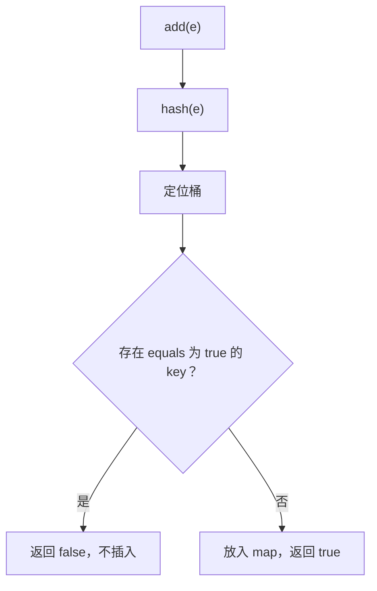

# 03 · Set

> 节点目标：讲清「去重到底比的是什么」；HashSet 与 HashMap 关系；有序 Set 怎么比。

---

## 面试题

### Q1. HashSet、LinkedHashSet、TreeSet 有什么区别？如何选型？

| 维度 | HashSet | LinkedHashSet | TreeSet |
| --- | --- | --- | --- |
| 底层 | HashMap | LinkedHashMap | TreeMap（红黑树） |
| 顺序 | 不保证 | **插入顺序**（可理解） | **排序顺序** |
| 时间复杂度 | 均摊 O(1) | 均摊 O(1) | O(log n) |
| 比较依据 | hashCode + equals | 同左 | Comparable / Comparator |
| null | 允许 **一个** null | 允许一个 null | 比较器未处理则 **不能** null |
| 线程安全 | 否 | 否 | 否 |

**选型：**

- 只要去重 → HashSet  
- 去重 + 保持插入顺序 → LinkedHashSet  
- 去重 + 始终有序 / 要子集范围操作（`subSet`）→ TreeSet  

---

### Q2. HashSet 如何保证元素不重复？add 返回 false 代表什么？

HashSet 内部就是一个 **HashMap**：

- 元素作为 **key**  
- value 是共享的哑对象 `PRESENT`（静态 final Object）  

`add(e)` 本质：`map.put(e, PRESENT) == null`  
- put 返回 null → 以前没有这个 key → add 成功返回 true  
- put 返回旧 value → key 已存在 → add 失败返回 false  

**判断「同一个」的流程：**

1. 算 `hash(key)` 定位桶  
2. 桶内用 `equals`（树节点还有比较）确认是否已存在  

---

### Q3. 为什么自定义对象放进 HashSet/HashMap 必须正确重写 hashCode 和 equals？只重写一个会怎样？

**约定（必须遵守）：**

1. `equals` 相等 ⇒ `hashCode` 必须相等  
2. `hashCode` 相等 ⇒ `equals` 不一定相等（只是可能冲突）  

**只重写 equals、不重写 hashCode：**

- 两个逻辑相等对象 hash 可能不同 → 落到不同桶 → Set 认为是两个元素 → **去重失败**  

**只重写 hashCode、不重写 equals：**

- 可能进同一桶，但 equals 仍用 Object 的引用相等 → 逻辑相同对象去不掉  

**正确示例思路：** 用业务唯一字段（如 id）生成 equals/hashCode，可用 IDE/`Objects.hash`/`Objects.equals`，字段变更策略要一致。

---

### Q4. TreeSet 如何排序？能不能存 null？compareTo 返回 0 意味着什么？

**排序来源（二选一）：**

1. 元素实现 `Comparable`，用 `compareTo`  
2. 创建 TreeSet 时传入 `Comparator`  

**null：**

- 自然排序下 `compareTo` 会对 null NPE  
- 除非自定义 Comparator 明确支持 null（很少这么干）  

**compare 返回 0：**

- TreeSet/TreeMap 视为 **同一个元素/key**，后放入的会覆盖/加不进去  
- 因此必须保证：**compare 为 0 与 equals 为 true 一致**，否则破坏 Set 契约，出现「明明 equals 不同却存不下」的诡异 bug  

---

### Q5. HashSet 是线程安全的吗？并发下去重用什么？

不安全。并发场景：

- `ConcurrentHashMap.newKeySet()`（推荐，JDK8+）  
- `Collections.synchronizedSet`  
- 自己加锁  

---

### Q6. Set 如何用于「交集、并集、差集」？

基于可变 Set 的原地操作（会改调用者）：

- 并集：`a.addAll(b)`  
- 交集：`a.retainAll(b)`  
- 差集：`a.removeAll(b)`  

注意先拷贝再操作，避免毁掉原集合：`new HashSet<>(a)`。

---

### Q7. EnumSet 了解吗？

专门存枚举的超高效 Set，底层用 bit 向量。枚举常量少时极省内存、极快。要求元素是同一枚举类型。

---

### Q8. HashSet 和 HashMap 有什么区别？

| 维度 | HashSet | HashMap |
| --- | --- | --- |
| 定位 | 单列去重集合 | 键值映射 |
| 底层 | **内部就是一个 HashMap** | 自身实现 |
| 存储 | 元素当 key，value 为固定 PRESENT | key → value |
| 接口方法 | add/contains/remove | put/get/containsKey |
| 允许 null | 一个 null 元素 | 一个 null key，多个 null value |
| 线程安全 | 否 | 否 |

**关系：** `HashSet.add(e)` ≈ `map.put(e, PRESENT)==null`。  
会 HashMap 的碰撞、扩容、树化，就等于会 HashSet 的底层。

---

## 关联

- [[04-HashMap]] · [[06-TreeMap与排序]] · [[09-对比选型与场景题]]
