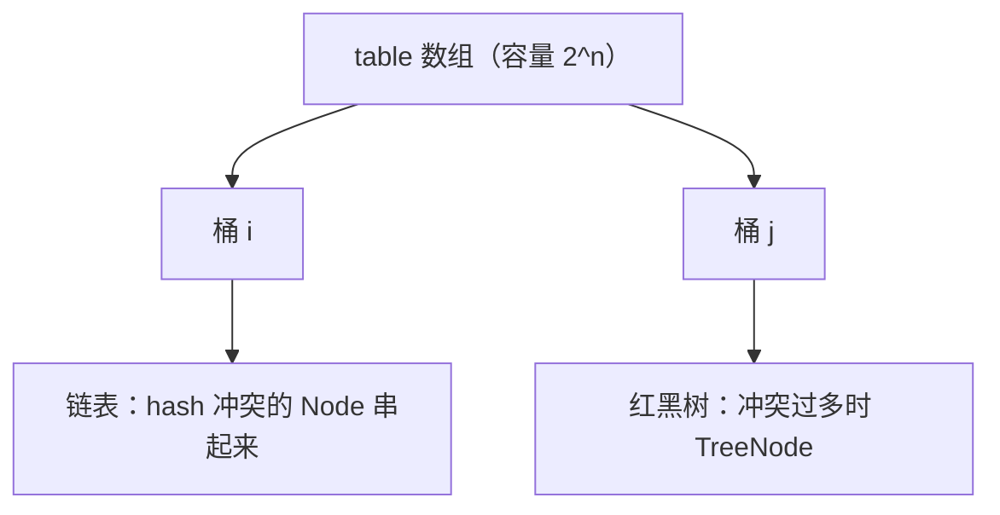
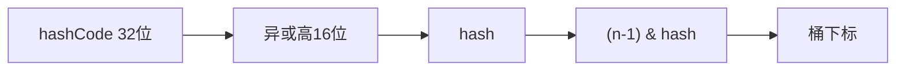
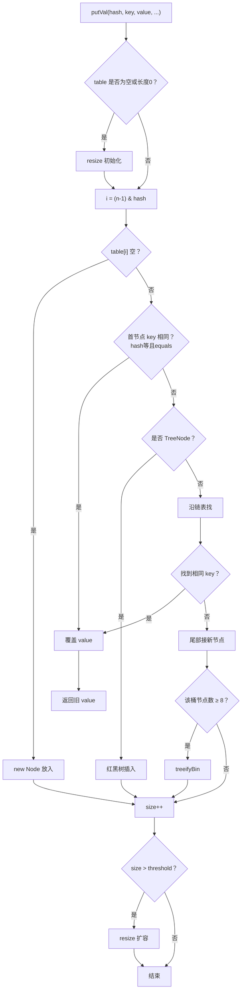
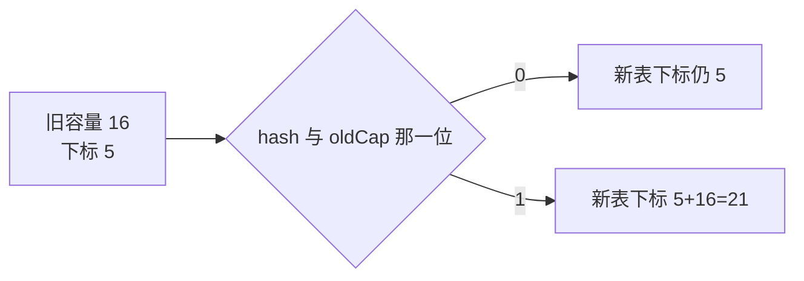
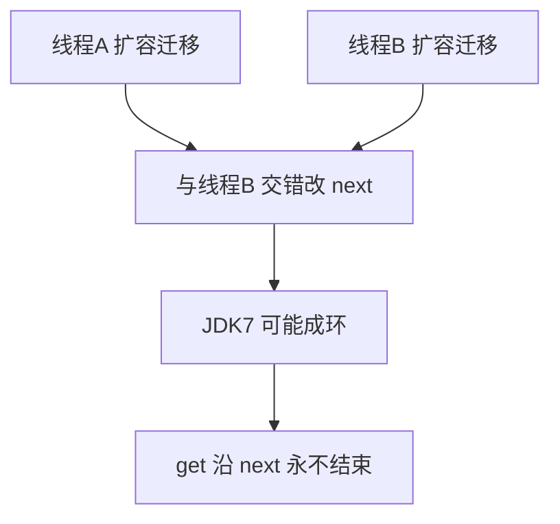
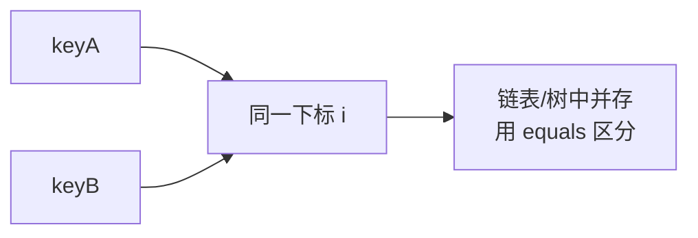
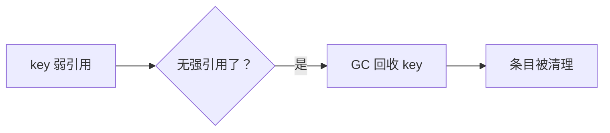

# 04 · HashMap（重点）

> 面试权重最高。默认按 **JDK 8+** 讲，必要时对比 JDK 7。目标：结构、寻址、put/get、扩容、树化、线程安全问题都能展开。

---

## 面试题

### Q1. HashMap 底层数据结构是什么？JDK7 和 JDK8 有何不同？

**JDK 8+：** `Node<K,V>[] table` + **链表** + **红黑树**（冲突严重时）

**JDK 7：** 数组 + 链表（头插），无红黑树

| | JDK7 | JDK8 |
| --- | --- | --- |
| 冲突结构 | 仅链表 | 链表 / 红黑树 |
| 插入 | 头插 | **尾插** |
| 扩容迁移 | 容易在并发下形成环 | 尾插 + 更清晰迁移；仍非线程安全 |
| hash | 一层扰动 | 高低 16 位异或扰动 |



每个 Node 大致有：`hash`、`key`、`value`、`next`。

---

### Q2. 下标怎么算？为什么要 hash 扰动？为什么容量是 2 的幂？

**完整步骤：**

1. 若 key == null → 放在桶 0（HashMap 允许一个 null key）  
2. 否则取 `key.hashCode()`，再做扰动：  
   `h ^ (h >>> 16)`  
   把高 16 位的信息混到低 16 位  
3. 下标：`(table.length - 1) & hash`  

**为什么扰动？**  
若只用低位，高位变化的 hashCode 容易撞车（尤其小表）。异或扰动让高位也影响落桶。

**为什么 2 的幂？**

- `(n - 1) & hash` 在 n=2^k 时等价于 `hash % n`，且位运算更快  
- 扩容为 2 倍后，每个元素新位置要么不变，要么是 **旧下标 + oldCap**，迁移简单  



---

### Q3. 详细说说 put 的流程？



要点展开：

1. **只覆盖不新增**时 size 不变，也不因这次 put 扩容  
2. JDK8 **尾插**：新冲突节点挂到链表末尾  
3. `treeifyBin`：若数组长度 < 64，优先 **扩容** 打散；≥64 才真正树化  
4. `modCount++` 用于 fail-fast  

---

### Q4. get 的流程？

1. 算 hash，定位桶  
2. 看首节点是否命中（先比 hash，再 equals）  
3. 若是树，走红黑树查找  
4. 若是链表，一路 next + equals  
5. 找不到返回 null（注意：也可能 value 本来就是 null，单线程下无法区分「没有 key」和「值就是 null」，可用 `containsKey`）

---

### Q5. 负载因子为什么默认 0.75？阈值是什么？

- `threshold = capacity * loadFactor`  
- 默认容量 16 → 阈值 12；第 13 个元素 put 可能触发扩容（实际还看是否真的超了）  
- **0.75**：空间浪费与哈希冲突的折中  
  - 更小：冲突少、查更快，但数组更稀、费内存、扩容更勤  
  - 更大：更省数组空间，但链表/树更深、更慢  

一般不要乱改；除非非常清楚内存与探测成本。

---

### Q6. 扩容 resize 具体怎么做？元素会搬到哪里？

1. 新容量 = 旧容量 × 2（初始则从 0→16 等）  
2. 新阈值相应 × 2  
3. 创建新数组，把旧桶里节点迁移过去  

JDK8 优化：对每个旧桶链表，拆成两条：

- **低位链**：新下标 = 原下标  
- **高位链**：新下标 = 原下标 + oldCap  

判断依据：hash 在 oldCap 对应那一位是 0 还是 1（`(e.hash & oldCap) == 0`）。



这样不用重新算「完整取模」，一次遍历完成拆分。

---

### Q7. 链表何时变红黑树？何时退回链表？为什么要树化？

**树化条件（同时相关）：**

- 某桶上节点数达到 **TREEIFY_THRESHOLD（8）**  
- 且数组长度 ≥ **MIN_TREEIFY_CAPACITY（64）**  
- 否则先扩容，用更散的桶消化冲突  

**退化：**

- 树节点过少（如 ≤ **6**）在扩容或移除后可能 `untreeify` 回链表  

**为什么要树化？**  
哈希极差或攻击导致大量冲突时，链表查找退化成 O(n)；红黑树最坏 O(log n)，避免性能雪崩（也有哈希碰撞 DoS 的历史背景）。

---

### Q8. HashMap 为什么线程不安全？JDK7 死循环是怎么回事？

**不安全表现：**

1. 并发 put 导致元素丢失  
2. size 等不准确  
3. 扩容迁移竞态  
4. JDK7 头插 + 并发扩容 → 链表成环 → **get 死循环**，CPU 100%  

**JDK7 死循环直觉（面试够用）：**  
两线程同时扩容，头插倒序迁移时，指针互相指，形成环。  

**JDK8** 改尾插并改进迁移，**显著缓解成环问题**，但仍然：

- 不是线程安全集合  
- 并发下仍会丢数据、脏读  

并发场景请用 **ConcurrentHashMap**，或外部正确同步（通常不如 CHM）。



---

### Q9. HashMap 和 Hashtable 有什么区别？

| | HashMap | Hashtable |
| --- | --- | --- |
| 线程安全 | 否 | 是（方法 synchronized，粗锁） |
| null | 允许一个 null key、多个 null value | key/value 都 **禁止 null** |
| 继承 | AbstractMap | 老的 Dictionary |
| 迭代 | Iterator，fail-fast | Enumerator + Iterator |
| 性能 | 单线程更好 | 锁竞争差 |
| 现状 | 主力 | **遗留**，新代码别用 |

要并发 → `ConcurrentHashMap`，不要 Hashtable。

---

### Q10. LinkedHashMap 是什么？怎么实现 LRU？

在 HashMap 基础上用双向链表维护顺序：

- 默认 **插入顺序**  
- `accessOrder=true` 时为 **访问顺序**（get/put 会把节点移到链表末尾）  

**简易 LRU：**

```text
new LinkedHashMap<K,V>(cap, 0.75f, true) {
  @Override
  protected boolean removeEldestEntry(Map.Entry<K,V> eldest) {
    return size() > MAX;
  }
};
```

访问最新的在链表尾，最久未用在头，超出容量删 eldest。  
生产级缓存更常用 Caffeine 等（淘汰策略、统计、并发更完整）。

---

### Q11. 自定义对象当 key 要注意什么？

1. 正确重写 **hashCode 和 equals**，且一致  
2. 作为 key 后，**不要再改**参与 hash/equals 的字段，否则找不到、幽灵条目  
3. 优先用不可变类型：`String`、`Integer`、自己的不可变 key 类  

---

### Q12. hashCode 一样但 equals 不同会发生什么？

只是哈希冲突：进同一桶，链表或树里并排存；查找靠 equals 区分。  
冲突越多，该桶越长/树越高，性能越差——所以好的 hashCode 分布很重要。

---

### Q13. HashMap 初始容量怎么设更合理？

若预计存放 N 个映射，希望减少扩容：

- 容量要到 **≥ N / loadFactor**，再向上取最近 2 的幂（构造器内部会 `tableSizeFor`）  
- 经验：`new HashMap<>(expectedSize * 4 / 3 + 1)` 一类写法，或直接按文档给 expectedSize  

设太小会多次扩容；设超级大浪费内存。

---

### Q14. keySet、values、entrySet 是什么关系？遍历哪种更好？

都是 **视图**（backed by map），改视图可能改 map。  
需要同时用 key 和 value 时，遍历 **`entrySet`** 最合适，避免先遍历 key 再 `get` 二次查找。

---

### Q15. 说说 Java 中 HashMap 的原理？（综合口述题）

按下面结构答，约 2～3 分钟：

1. **定位**：KV 哈希表，非线程安全，允许一个 null key  
2. **结构（JDK8）**：`Node[]` + 链表 + 红黑树  
3. **寻址**：`hash = h ^ (h>>>16)`，下标 `(n-1)&hash`，容量 2 的幂  
4. **put**：空桶直接放；冲突尾插；链长≥8 且容量≥64 树化；超过阈值扩容  
5. **扩容**：容量×2；节点分裂到「原下标 / 原下标+oldCap」  
6. **不安全**：并发会丢数据；JDK7 头插扩容可能死循环 → 并发用 CHM  

配合流程图见上文 Q3、Q6。

---

### Q16. 什么是 Hash 碰撞？怎么解决哈希碰撞？

**Hash 碰撞（冲突）：** 两个不同 key 经过哈希后落到 **同一个桶下标**。

原因：hash 空间映射到有限桶；hashCode 质量差；恶意构造碰撞等。

**HashMap 的解决方式（链地址法 / 拉链法）：**

1. 同一桶用 **链表** 串起多个 Node  
2. 冲突过多 → **红黑树**，避免 O(n)  
3. 扩容增加桶数，降低冲突率  
4. hash 扰动让高位参与，减少「低位相同」造成的聚集  

其它数据结构常见办法（了解即可）：开放寻址（线性探测等，如线程本地随机）、再哈希、公共溢出区等。Java HashMap 用的是 **拉链 + 树化**。



---

### Q17. 使用 HashMap 时，有哪些提升性能的技巧？

1. **预设容量**：大概知道 N，构造时给足 `N/0.75`，减少扩容拷贝  
2. **负载因子**：默认 0.75 一般别乱改；内存极紧或探查极多再评估  
3. **好的 hashCode/equals**：分布均匀、计算快；关键字段稳定  
4. **key 尽量不可变**：String 等；避免可变 key 改字段  
5. **遍历用 entrySet / forEach**：少一次 get  
6. **别把 HashMap 当并发容器**：并发用 ConcurrentHashMap  
7. **减少自动装箱**：大量 int key 可考虑专用库或包装策略  
8. **避免错误的初始容量公式导致反复扩容**；注意 `new HashMap<>(100)` 是容量不是「可放 100 元素就不扩」——阈值是 capacity×loadFactor  

---

### Q18. 为什么 HashMap 扩容时采用 2 的 n 次方倍？

1. **取下标可用位运算**：`hash & (n-1)` 代替 `%`，更快且均匀（在 2 次幂前提下）  
2. **扩容迁移简单**：新位置要么不变，要么是 `index + oldCap`，一次拆成高低两链  
3. 若容量不是 2 次幂，`& (n-1)` 不能正确映射，冲突分布会变差  

构造时传入任意容量，内部也会 `tableSizeFor` **向上取整到 2 的幂**。

---

### Q19. 为什么 JDK 1.8 对 HashMap 做了红黑树改动？

- 防哈希冲突恶化：链表过长查找从 O(n) → 树 O(log n)  
- 缓解哈希碰撞攻击导致 CPU 飙高  
- 条件克制：≥8 且表长≥64 才树化，避免小表动不动树化更慢  

---

### Q20. JDK 1.8 对 HashMap 除了红黑树还做了哪些改动？

| 改动 | 说明 |
| --- | --- |
| 尾插 | 代替 JDK7 头插，降低并发扩容成环概率（仍非线程安全） |
| hash 扰动 | `^ (h>>>16)` 简化并保留高低位混合 |
| 扩容优化 | 高低位拆链，不必「全部重新算桶」那种朴素方式 |
| Node 红黑树节点 | TreeNode 继承 Node |
| 关键常量 | TREEIFY 8 / UNTREEIFY 6 / MIN_TREEIFY_CAPACITY 64 |
| 部分 API | 如更多 Map 默认方法配合使用（compute 等在 Map 接口） |

---

### Q21. LinkedHashMap 是什么？（展开）

HashMap 子类，在入口之间维护 **双向链表**，从而：

- 默认记录 **插入顺序**  
- `accessOrder=true` 记录 **访问顺序**（可做 LRU）  

仍非线程安全；允许 null（同 HashMap）。  
遍历按链表顺序，而不是哈希桶乱序。

详见上文 Q10 LRU 示例。

---

### Q22. IdentityHashMap 是什么？

- 用 **`==` 比较 key**，不用 `equals`  
- hash 也更偏向 `System.identityHashCode`  
- 用途特殊：序列化对象图、框架里按「对象身份」去重；**不是**日常业务 Map  
- 违反常规 Map 契约（文档已说明），慎用  

---

### Q23. WeakHashMap 是什么？

- key 为 **弱引用**：key 没有其它强引用时，可被 GC 回收，条目随后被清理  
- 适合「可丢的缓存」；**非线程安全**  
- 注意：若 value 又强引用了 key，会导致回收失效（常见坑）  
- 生产缓存更常用 Caffeine 等；WeakHashMap 了解原理即可  



---

## 关联

- [[05-ConcurrentHashMap]] · [[03-Set]] · [[08-遍历与Fail-Fast]] · [[09-对比选型与场景题]]
