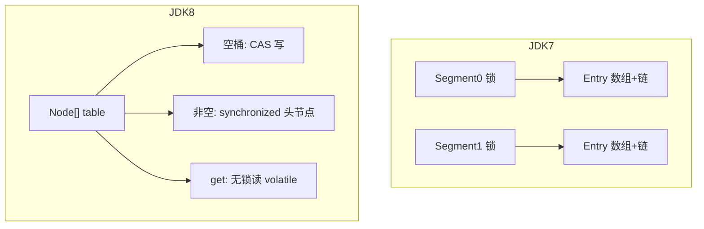
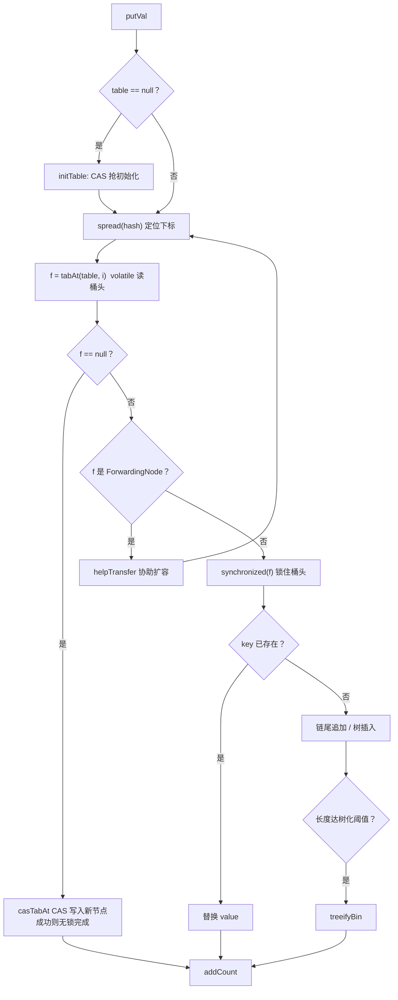
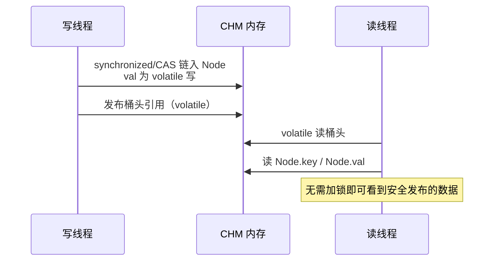
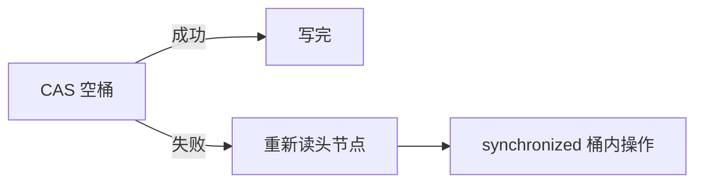

# 05 · ConcurrentHashMap（含无锁读详解）

> 并发 Map 必考。本章把 **JDK7 分段锁 / JDK8 CAS+synchronized**、**get 为何无锁**、**可见性靠什么**讲透。

---

## 一、总览口述（1 分钟版）

> ConcurrentHashMap 用来在多线程下安全地存键值对。  
> **JDK7** 用 Segment **分段锁**，不同段可并行写。  
> **JDK8** 取消 Segment，结构接近 HashMap（数组+链表+红黑树）：空桶用 **CAS** 插入；非空桶用 **synchronized 锁桶头**；**get 全程不加锁**，靠 `volatile` 和有序性保证读到有效数据。  
> 不允许 null key/value。迭代是弱一致，不抛 CME。

---

## 面试题

### Q1. ConcurrentHashMap 和 Hashtable 的区别是什么？

| 维度 | Hashtable | ConcurrentHashMap |
| --- | --- | --- |
| 锁粒度 | 整表一把锁，所有方法互斥 | JDK7 段锁；JDK8 桶级锁 + CAS |
| 并发度 | 极低：同时只能一个线程进表 | 高：不同桶可并行写，读大多无锁 |
| null | key/value 都禁止 | 同样都禁止 |
| 迭代 | Enumerator/Iterator，易受同步影响 | 弱一致，不抛 ConcurrentModificationException |
| 性能 | 高并发下很差 | 高并发首选 |
| 定位 | 遗留类 | `java.util.concurrent` 主力 |

**一句话：** 都线程安全、都禁 null；CHM 锁更细、读基本无锁，Hashtable 整表锁该淘汰。

---

### Q2. ConcurrentHashMap 1.7 和 1.8 有哪些区别？（高频）

| 维度 | JDK 1.7 | JDK 1.8 |
| --- | --- | --- |
| 数据结构 | `Segment[]` + 每个 Segment 内 `HashEntry[]` + 链表 | 与 HashMap 类似：`Node[]` + 链表 + **红黑树** |
| 锁 | 分段 `ReentrantLock`（Segment 继承锁） | **CAS**（初始化、空桶插入）+ **synchronized(桶头)** |
| 并发度 | 默认 16 段，最多约 16 写并行（段数定） | 理论上按桶并行，粒度更细 |
| 查询 | 多数不加锁，走 volatile | **get 不加锁**（见下题） |
| 扩容 | 段内扩容 | 全局扩容，多线程 **协助迁移** `helpTransfer` |
| hash/树化 | 无树化 | 冲突严重时树化，类似 HashMap |
| 计数 | 较简单 | `baseCount` + `CounterCell`（类 LongAdder） |



**口述对比句：**  
> 7 是分段加锁；8 是更细的桶级同步 + CAS 快路径，结构和 HashMap 对齐，并引入红黑树和协同扩容。

---

### Q3. JDK8 ConcurrentHashMap 底层原理完整讲一遍？

#### 3.1 主结构

- `transient volatile Node<K,V>[] table`：桶数组，**volatile 引用**，扩容切换新表时其它线程可见  
- 桶里：`Node` 链表，或 `TreeBin`（红黑树容器）  
- 扩容中：桶上可能挂 `ForwardingNode`，表示「已搬到新表，去新表找/继续搬」  

#### 3.2 put 写入路径（有锁 + 无锁混合）



要点：

1. **空桶 CAS**：无竞争时完全无 `synchronized`，这是高吞吐关键  
2. **非空才锁头节点**：只串行化同一桶的写，不同桶仍并行  
3. **扩容协助**：写线程遇到 ForwardingNode 不干等，帮忙搬桶  
4. **计数**：`addCount` 分散到 CounterCell，避免所有线程打同一个 size 字段  

#### 3.3 「无锁」到底无的是什么？

面试要说清楚：**不是所有操作都无锁**。

| 操作 | 同步手段 |
| --- | --- |
| 初始化 table | CAS 竞争一个标志/槽位 |
| 空桶首次 put | **CAS**（无 synchronized） |
| 桶内追加/覆盖/删 | **synchronized(头节点)** |
| 树化、扩容迁移写 | 锁 + CAS/协同 |
| **get** | **不加锁**（见 Q4） |
| size 近似累加 | CAS 打 baseCount / CounterCell |

所以准确说法是：

> **读路径无锁；写路径尽量 CAS，冲突再锁桶；绝不是整表锁。**

---

### Q4. ConcurrentHashMap 的 get 方法是否需要加锁？（重点）

**答案：不需要加锁。**

#### 为什么能无锁还正确？

靠三件事：

**（1）volatile 保证可见性**

- `table` 数组引用是 volatile：扩容换新表后，读线程能看到新数组  
- JDK8 用 `tabAt` / `Node.val` 等通过 **volatile 语义**（对数组元素用 `Unsafe`/`getObjectVolatile` 一类）读取桶头，保证读到的是较新的头节点引用  
- `Node.val` 本身也是 volatile：写入线程改完 value，读线程能看见新值  

**（2）发生-先于（happens-before）直觉**

写线程：构造 Node → CAS/`synchronized` 内把节点链入 → 写 volatile value/发布头引用。  
读线程：volatile 读到头/节点 → 再读 key/val，能看到写入侧在发布前的初始化结果（不会看到「半初始化 Node」的典型问题）。

**（3）查找逻辑本身只读**

```text
get(key):
  算 hash，定位 i
  若 table 空 → return null
  读桶头 f = tabAt(table, i)   // volatile 读
  若头节点就命中 → return f.val
  若头是 ForwardingNode → 在新表上 find
  若是树 → 树中查找
  否则沿 next 链表比较 hash+equals
  找不到 → null
```

全程没有 `synchronized`，也没有加 ReentrantLock。



#### 和 Hashtable 对比

Hashtable 的 `get` 也是 `synchronized`，读也要抢整表锁 → 读多时性能差。  
CHM 读多写少场景优势巨大。

#### 注意边界

- 无锁 **不等于** 读到「全局某一瞬间的完整快照」；与弱一致迭代类似，并发下可能看到「刚插入」或「尚未看见刚删除」的竞态窗口，但单次 get 对单个 key 的读写安全性由 JMM + 实现保证  
- 若业务要「读多个 key 的原子一致视图」，CHM 本身不够，要额外同步或拷贝  

---

### Q5. 为什么 ConcurrentHashMap 不支持 key 或 value 为 null？

**核心：歧义。**

`get(key)` 返回 `null` 在允许 null value 时无法区分：

1. 这个 key 不存在  
2. 这个 key 存在，但值就是 null  

单线程 HashMap 可用 `containsKey` 再判断；但在并发下：

```text
if (!map.containsKey(k)) { ... }  // 检查时没有
// 中间别的线程 put(k, null) 或 remove
map.get(k);  // 更难解释
```

为避免并发语义混乱，Doug Lea 直接规定：**key、value 都不能为 null**（Hashtable 同样禁止）。  
需要「空值」语义时：用可选对象、哨兵对象，或根本不要存 null。

---

### Q6. 空桶 CAS 失败了怎么办？和锁怎么配合？

`casTabAt` 失败说明别人已经抢先放了头节点：

- 当前线程不会死等 CAS  
- 进入后面分支：再读头节点，走 `synchronized(头)` 路径做追加或覆盖  



这就是「乐观 CAS + 失败退化到锁」的经典组合。

---

### Q7. 扩容时多线程如何协作？ForwardingNode 是什么？

1. 某次 `addCount` 发现要扩容 → 创建 `nextTable`（通常 2 倍）  
2. 搬迁某个旧桶后，在旧表该位置放上 **ForwardingNode**（指向新表）  
3. 其它线程 put/get：  
   - get 见 ForwardingNode → 去新表找  
   - put 见 ForwardingNode → `helpTransfer` 帮忙搬其它桶  
4. 全部搬完 → `table = nextTable`  

好处：扩容窗口缩短，不会只有一个线程傻搬、其它全堵死（相对而言）。

---

### Q8. size() 准确吗？底层怎么计数？

高并发精确 size 要全局一致，太贵。  
JDK8：`baseCount` + 多个 `CounterCell`（线程分散 CAS 累加，思想类似 LongAdder）。  

- `size()` / `mappingCount()` 可能是 **近似值**  
- 业务要精确计数 → 自己用 AtomicLong/LongAdder，别死磕 map.size()  

---

### Q9. computeIfAbsent / merge 在并发下为什么重要？

「先 get 再 put」两步非原子，会丢更新或重复创建。  
这些方法在桶锁保护下做复合操作，适合：

- 缓存加载  
- 词频 `merge`  
- 分组列表 `computeIfAbsent(k, x -> new ArrayList<>()).add(...)`  

---

### Q10. 迭代器会抛 ConcurrentModificationException 吗？

一般 **不会**。弱一致：遍历期间的修改不一定全看见，但保证能走完、不 CME。  
要强一致快照：自己 `new HashMap<>(chm)`（注意拷贝瞬间仍非全局原子，只是常用折中）。

---

## 二、无锁机制专题（面试加分答法）

### 专题 A：CHM 里和「无锁」相关的技术分别干什么？

| 技术 | 作用 |
| --- | --- |
| **volatile** | 保证 table、val、桶头读取的可见性与有序性，支撑无锁 get |
| **CAS（Unsafe/VarHandle）** | 无锁争用下的原子更新：初始化、空桶插入、计数单元格 |
| **synchronized(桶头)** | 同一桶结构修改的互斥；锁对象是头 Node，粒度细 |
| **协助扩容** | 降低扩容成为瓶颈的概率 |

### 专题 B：口述「为什么读不枷锁也不会脏到崩溃」

1. 写入通过 CAS 或 synchronized **安全发布** 节点  
2. 读侧用 volatile 读看到发布后的引用  
3. 节点字段在发布前已初始化完成  
4. 因此 get 只需跟随指针查找，不必再加锁  

### 专题 C：和「完全无锁结构」（纯 CAS 链表）的区别

CHM **不是**整表纯无锁：桶内多节点写入仍用 synchronized。  
原因：链/树结构修改用纯 CAS 实现极其复杂（ABA、动态长度树化等）。  
工程选择：**读无锁 + 写细粒度锁 + 空桶 CAS**，实用且快。

---

## 三、和本清单其它题的交叉

- 与 Hashtable 对比 → Q1  
- 1.7 vs 1.8 → Q2  
- get 是否加锁 → Q4  
- 为何禁 null → Q5  
- 原理总述 → Q3 + 专题  

HashMap 单线程原理、碰撞、扩容等见 [[04-HashMap]]。

---

## 关联

- [[04-HashMap]] · [[08-遍历与Fail-Fast]] · [[09-对比选型与场景题]] · [[00-知识总览]]
