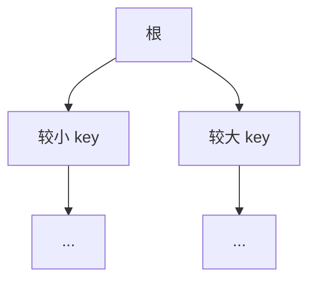

# 06 · TreeMap 与排序

> 节点目标：讲清「有序 Map」靠比较而非哈希；Comparable/Comparator；与 HashMap 选型。

---

## 面试题

### Q1. TreeMap 底层是什么？和 HashMap、LinkedHashMap 怎么选？

TreeMap 基于 **红黑树（Red-Black Tree）** 实现 `NavigableMap`。

| | HashMap | LinkedHashMap | TreeMap |
| --- | --- | --- | --- |
| 结构 | 哈希表(+链/树) | 哈希 + 链表顺序 | 红黑树 |
| 顺序 | 无 | 插入/访问顺序 | **键的排序顺序** |
| 复杂度 | 均摊 O(1) | 均摊 O(1) | O(log n) |
| null key | 允许一个 | 允许一个 | 一般 **不允许**（比较需要） |
| 典型用途 | 通用字典 | 保序、简易 LRU | 范围查询、始终有序 |

**选型：**

- 要最快的存取、不关心顺序 → HashMap  
- 要插入顺序或 LRU → LinkedHashMap  
- 要按 key 排序、`subMap`/`ceilingKey` 等 → TreeMap  



---

### Q2. 红黑树是什么？为什么 TreeMap 用它而不是普通 BST 或 AVL？

红黑树是一种 **自平衡二叉查找树**，通过颜色与旋转规则，保证从根到叶的最长路径不会超过最短路径的两倍，从而：

- 查找 / 插入 / 删除最坏 **O(log n)**  
- 不会像普通 BST 在有序插入时退化成链表 O(n)  

相对 AVL：红黑树平衡条件更松，**插入删除旋转通常更少**，更适合频繁更新的 Map。  
面试一般不要求手写旋转，但要能说：**平衡 + 对数时间 + 适合频繁改**。

---

### Q3. TreeMap 的排序规则怎么定？Comparable 和 Comparator 区别？

**两种方式：**

1. **自然顺序**：key 实现 `Comparable`，用 `compareTo`  
2. **定制顺序**：构造 `new TreeMap<>(comparator)`  

| | Comparable | Comparator |
| --- | --- | --- |
| 定义位置 | 元素类内部 | 独立比较器类/Lambda |
| 方法 | `compareTo(T o)` | `compare(T a, T b)` |
| 包 | `java.lang` | `java.util` |
| 灵活度 | 一种「默认」顺序 | 可多种策略切换 |
| 优先级 | 若 TreeMap 带 Comparator | **用 Comparator，忽略自然顺序** |

```text
// 按字符串长度排序示例思路
new TreeMap<String,V>((a,b) -> Integer.compare(a.length(), b.length()));
```

注意：比较器必须是 **一致性** 的（传递性等），否则树结构会乱。

---

### Q4. 为什么说 compare 与 equals 必须一致？不一致会出什么问题？

Set/Map 契约期望：两个对象在集合语义下「相等」的判定应一致。

TreeMap 用 **compare == 0** 判定「同一 key」，**几乎不用 equals 决定是否同一节点**。

若：

- `compare(a,b)==0` 但 `!a.equals(b)` → 只能存一个，另一个加不进去或覆盖，**逻辑上不同的 key 丢了**  
- `a.equals(b)` 但 `compare != 0` → 可能并存两个「equals 相等」的 key，**破坏 Map 唯一性直觉**  

**正确做法：** `compare` 返回 0 ⇔ `equals` 为 true（在业务意义上对齐）。

---

### Q5. TreeMap 支持哪些「有序才有的」操作？

作为 `NavigableMap` 常见：

| 方法 | 含义 |
| --- | --- |
| `firstKey` / `lastKey` | 最小/最大 key |
| `ceilingKey` / `floorKey` | ≥ / ≤ 某 key 的最近 |
| `higherKey` / `lowerKey` | 严格 > / < |
| `subMap` / `headMap` / `tailMap` | 范围视图 |
| `descendingMap` | 逆序视图 |

这些是 HashMap 做不到（除非全量排序）的能力。

---

### Q6. TreeMap 是线程安全的吗？

不是。并发有序映射可考虑：

- `ConcurrentSkipListMap`（跳表，并发、有序）  
- 外部同步包装（粗）  

---

### Q7. TreeSet 和 TreeMap 什么关系？

TreeSet 底层是 TreeMap：元素当 key，value 为占位对象。排序、比较器、null、线程安全结论与 TreeMap 一致。

---

### Q8. Java 中的 TreeMap 是什么？（综合题）

**定义：** 基于红黑树的有序 Map，实现 `NavigableMap`。

**要点：**

1. key 必须可比较（Comparable 或 Comparator）  
2. 增删查 O(log n)，按 key 排序遍历  
3. 支持 `subMap`、`ceilingKey` 等范围操作  
4. 非线程安全；一般不允许 null key  
5. 与 HashMap：要顺序/范围选 TreeMap，要速度选 HashMap  

详见上文 Q1～Q5。

---

## 关联

- [[03-Set]] · [[04-HashMap]] · [[09-对比选型与场景题]]
