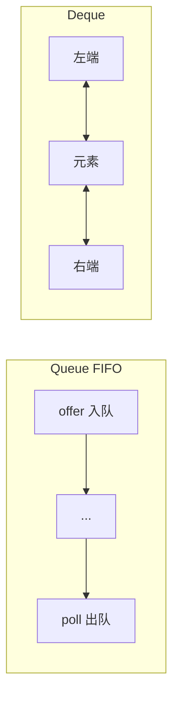
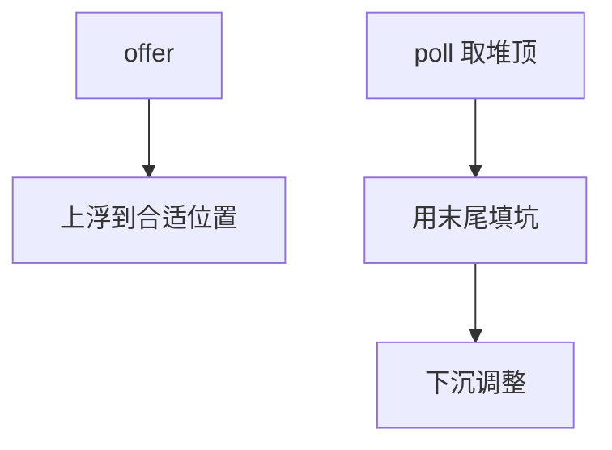
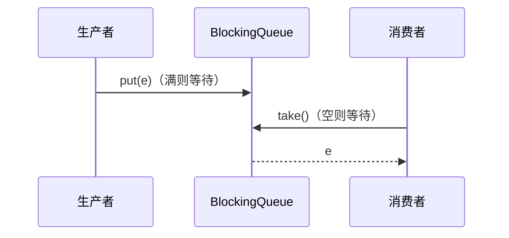

# 07 · Queue 与 Deque

> 节点目标：分清 Queue/Deque/优先队列/阻塞队列；能讲线程池场景里队列怎么选。

---

## 面试题

### Q1. Queue 和 Deque 是什么？常用实现有哪些？

**Queue（队列）：** 典型 FIFO——一端进、一端出。核心方法有两套风格（失败抛异常 vs 返回特殊值）。

**Deque（double ended queue）：** 两端都能进出入，可当：

- 队列（一端进一端出）  
- 栈（同一端进出入）  

| 实现 | 特点 | 线程安全 |
| --- | --- | --- |
| ArrayDeque | 环形数组，快、常用 | 否 |
| LinkedList | 链表实现 Deque | 否 |
| PriorityQueue | 堆，按优先级 | 否 |
| 各种 BlockingQueue | 阻塞生产消费 | 是 |

---

### Q2. 为什么推荐用 ArrayDeque 代替 Stack 和（多数情况下）LinkedList 做栈/队列？

**相对 Stack：**

- `Stack` 继承 `Vector`，方法同步，性能差、设计过时  
- `ArrayDeque` 的 `push`/`pop` 更合适（文档也推荐）  

**相对 LinkedList：**

- ArrayDeque：连续内存（环形）、无每节点对象头  
- LinkedList：指针 chase，缓存不友好，内存更高  

**注意：** ArrayDeque **非线程安全**、**不允许 null**（null 被当作「空」的特殊返回值语义占用）。

---

### Q3. Queue 的 add/offer、remove/poll、element/peek 有什么区别？

这是高频细节题：

| 操作 | 失败抛异常 | 失败返回特殊值 |
| --- | --- | --- |
| 插入 | `add` | `offer` → false |
| 删除队头 | `remove` | `poll` → null |
| 查看队头 | `element` | `peek` → null |

有界队列（如 `ArrayBlockingQueue`）满时：`add` 抛 `IllegalStateException`，`offer` 返回 false；阻塞版还有 `put`（一直堵到有空位）。

---

### Q4. PriorityQueue 原理是什么？默认顺序？能存 null 吗？

- 底层 **二叉堆**（默认 **小顶堆**：队头是最小元素）  
- `offer`/`poll` 伴随上浮/下沉，复杂度 O(log n)  
- `peek` O(1)  
- **不允许 null**  
- 元素必须可比较（Comparable 或 Comparator）  
- **非线程安全**；并发用 `PriorityBlockingQueue`  

要大顶堆：传入反向 Comparator，如 `(a,b) -> b.compareTo(a)`。

**注意：** PriorityQueue **不保证**除堆顶外的遍历顺序是完全排序序列；只保证堆性质。

---

### Q5. BlockingQueue 是什么？常见实现怎么选？

阻塞队列：线程安全；**空时 take 阻塞**，**满时 put 阻塞**（有界时），用于生产者-消费者。

| 实现 | 结构 | 有界？ | 特点 |
| --- | --- | --- | --- |
| ArrayBlockingQueue | 数组 | 有界（创建时定） | 一把锁 + 两个条件队列 |
| LinkedBlockingQueue | 链表 | 可选有界（默认巨大） | 可更高吞吐；注意默认「几乎无界」易 OOM |
| SynchronousQueue | 无缓冲 | 容量 0 | 手把手交接；`CachedThreadPool` 用它 |
| PriorityBlockingQueue | 堆 | 无界 | 按优先级 |
| DelayQueue | 堆 | 无界 | 元素到期才能 take |
| LinkedTransferQueue | 链表 | 无界 | 更高性能转移语义 |

**线程池关联（加分）：**

- `FixedThreadPool` / `SingleThreadExecutor`：`LinkedBlockingQueue`（无界）→ 任务堆积风险  
- `CachedThreadPool`：`SynchronousQueue`  
- `ScheduledThreadPool`：延迟工作队列  
- 自建线程池应 **有界队列 + 拒绝策略**，防止 OOM  

---

### Q6. put/take 和 offer/poll 在阻塞队列里有何不同？

| | 阻塞 | 限时 | 非阻塞 |
| --- | --- | --- | --- |
| 插入 | `put` | `offer(e, time, unit)` | `offer(e)` |
| 获取 | `take` | `poll(time, unit)` | `poll()` |

线程池提交任务用 `offer`，满了走拒绝策略，而不是无限 `put` 堵调用线程（除非你故意这么设计）。

---

### Q7. 什么是双端队列的栈用法？和 Queue 方法如何对应？

Deque 作栈：

- `push` ≈ `addFirst`  
- `pop` ≈ `removeFirst`  
- `peek` ≈ `peekFirst`  

作 FIFO 队列：

- `offerLast` / `pollFirst`  

---

### Q8. DelayQueue 有什么应用场景？

元素实现 `Delayed`，`getDelay` 到期后才能被取出。场景：

- 延迟任务、超时订单取消  
- 缓存到期清理（也可用调度框架）  

注意：无界问题、时间精度、集群下通常还要分布式延迟组件。

---

## 关联

- [[02-List]] · [[09-对比选型与场景题]] · [[05-ConcurrentHashMap]]
