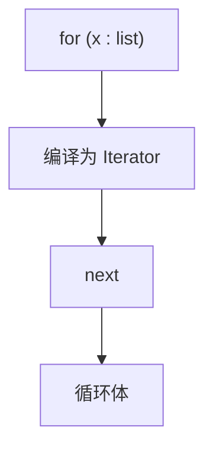
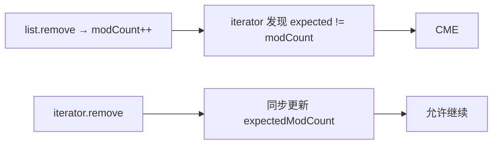

# 08 · 遍历与 Fail-Fast

> 节点目标：讲透 CME 从哪来、怎么安全删、并发集合迭代语义。

---

## 面试题

### Q1. 遍历集合有哪些方式？各自注意点？

| 方式 | 说明 | 注意 |
| --- | --- | --- |
| 增强 for | 语法糖，Collection 用 Iterator | 不要直接结构修改 |
| Iterator | 显式 `hasNext/next/remove` | 删除用它的 remove |
| ListIterator | 双向，可 set/add | 仅 List |
| 下标 for | `get(i)` | RandomAccess 友好；LinkedList 很慢 |
| forEach(Consumer) | JDK8 | 同样避免错误删除 |
| Stream | 函数式 | 普通流非线程安全源；并行流另说 |



---

### Q2. Fail-Fast 原理详细说明？为什么单线程也会 CME？

以 ArrayList 为例：

1. 结构性修改（add/remove/确保扩容等）会 `modCount++`  
2. 创建 Iterator 时记下 `expectedModCount = modCount`  
3. 每次 `next`/`remove` 前检查二者是否相等  
4. 不等 → `ConcurrentModificationException`  

**单线程 CME 经典原因：**

```text
for (String s : list) {
    list.remove(s); // 改了 modCount，但不是 iterator.remove，expected 没同步更新
}
```

`iterator.remove()` 会在删除后同步更新 `expectedModCount`，所以允许。



**注意：** fail-fast **不保证**并发下一定能检测到所有问题，它是尽力而为的错误探测机制，不是并发正确性保证。

---

### Q3. 安全删除元素的正确姿势有哪些？

1. **Iterator.remove()**  
2. **倒序下标删除**（删 i 不影响未遍历的 0…i-1）  
3. **`removeIf(predicate)`**（推荐，JDK8+）  
4. **收集待删再 removeAll**  
5. 使用支持并发的集合及 API  

错误：增强 for / forEach 里直接 `list.remove`。

---

### Q4. Fail-Safe 常见实现是怎样做到「不抛 CME」的？

**CopyOnWriteArrayList：**

- 迭代时拿的是创建迭代器那一刻的数组快照  
- 之后的写会复制新数组，不影响正在进行的遍历  
- 代价：看不到遍历开始后的新写入（弱一致/快照一致）  

**ConcurrentHashMap：**

- 迭代弱一致，不基于 modCount 甩 CME  
- 可能看到部分新数据，也可能看不到全部  

「Fail-Safe」是面试口语，JDK 文档更常说 **weakly consistent**。

---

### Q5. 遍历 HashMap 的最佳方式？

优先：

```text
for (Map.Entry<K,V> e : map.entrySet()) {
    // 同时用 e.getKey() e.getValue()
}
```

避免：

```text
for (K k : map.keySet()) {
    V v = map.get(k); // 多一次查找
}
```

JDK8+ 也可用 `map.forEach((k,v) -> ...)`。

---

### Q6. 增强 for 能遍历数组吗？和集合有何不同？

可以。数组的增强 for 编译成下标循环，不是 Iterator，因此不存在集合那种 fail-fast 机制；但数组长度固定，一般也不会在「遍历中缩容」这类问题上同构。

---

### Q7. Stream 的 forEach 里删除源集合安全吗？

不安全，属于对源的并发修改/结构修改，结果未定义或异常。应：

- 用 `filter` 收集成新集合  
- 或在流之外 `removeIf`  

---

### Q8. 你遇到过 ConcurrentModificationException 吗？它是如何产生的？

**遇到过（面试就按场景答）：** 比如遍历 ArrayList/HashMap 时直接 `remove`，或多线程一人遍历一人改非并发集合。

**如何产生：**

1. 集合结构修改 → `modCount++`  
2. Iterator 创建时记录 `expectedModCount`  
3. `next` 时发现两者不等 → 抛 **ConcurrentModificationException**  

**常见触发：**

| 场景 | 例子 |
| --- | --- |
| 单线程错误删除 | foreach 里 `list.remove(x)` |
| 多线程 | 一线程 for 遍历 HashMap，另一线程 put |
| 子列表 | 原 list 结构变后还操作 subList |

**如何避免：**

- `iterator.remove()` / `removeIf`  
- 并发用 `ConcurrentHashMap`、`CopyOnWriteArrayList`  
- `synchronizedList` 迭代时手动锁住整表  
- 不要假设 fail-fast 能发现所有并发 bug——它是辅助检测  

详见上文 Q2、Q3。

---

## 关联

- [[02-List]] · [[04-HashMap]] · [[05-ConcurrentHashMap]] · [[09-对比选型与场景题]]
