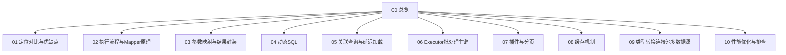

# MyBatis · 知识总览

MyBatis 面试专题（详细口述版）。查题见 [[11-题单总索引]]。  
可与 [[../MySQL/00-知识总览|MySQL]] 互补（分页/SQL 优化常一起问）。

## 知识地图

## 建议精读顺序

1. **[[02-执行流程与Mapper原理]] → [[03-参数映射与结果封装]] → [[08-缓存机制]]**  
2. [[04-动态SQL]] → [[05-关联查询与延迟加载]] → [[07-插件与分页]]  
3. [[06-Executor批处理主键]] → [[01-定位对比与优缺点]] → [[09-类型转换连接池多数据源]] → [[10-性能优化与排查]]  

## 节点一览

| 节点 | 你会讲到 |
| --- | --- |
| [[01-定位对比与优缺点]] | 半自动 ORM、JDBC 痛点、Hibernate/JPA、Plus |
| [[02-执行流程与Mapper原理]] | 执行流程、代理、接口方法要求 |
| [[03-参数映射与结果封装]] | `#{}` `${}`、resultMap、sql/include、Enum |
| [[04-动态SQL]] | 标签、解析执行、性能、动态表名 |
| [[05-关联查询与延迟加载]] | 一对一/多、嵌套、N+1、懒加载 |
| [[06-Executor批处理主键]] | 三种 Executor、批处理、主键回填 |
| [[07-插件与分页]] | Interceptor 链、分页插件原理 |
| [[08-缓存机制]] | 一级/二级、分布式二缓 |
| [[09-类型转换连接池多数据源]] | TypeHandler、池、日志、读写分离 |
| [[10-性能优化与排查]] | 大数据、线程安全、调试 |
| [[11-题单总索引]] | 全量对照 |
