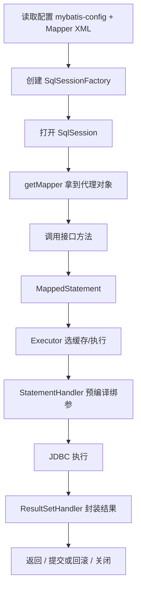

# 02 · 执行流程与 Mapper / Dao 原理

---

## 面试题

### Q1. 能详细说说 MyBatis 的执行流程吗？

**口述加细：**

1. **启动期：** `XMLConfigBuilder` 等解析全局配置、环境、类型别名、插件、Mapper；每个 SQL 节点变成 `MappedStatement` 注册进 `Configuration`  
2. **SqlSessionFactory：** 重量级，应用级单例  
3. **SqlSession：** 一次会话（非线程安全），封装 Executor  
4. **方法调用：** Mapper 代理根据 **全限定接口名 + 方法名** 找到 `statementId`，构造 `MapperMethod` 执行  
5. **Executor：** 先查缓存，未命中则建 `StatementHandler` → `ParameterHandler` 设参 → 执行 → `ResultSetHandler` 映射  
6. **插件：** 可在上述关键对象外包拦截链  

---

### Q2. 只写 XML + Dao 接口就能跑，原理是什么？Dao 工作原理？

**JDK 动态代理：**

- 启动时扫描 Mapper 接口，注册到 `MapperRegistry`  
- `getMapper(UserMapper.class)` 返回 **代理对象**，不是你手写的实现类  
- 调用 `userMapper.selectById(1)` → `InvocationHandler`（`MapperProxy`）  
  - 用 `接口全名.方法名` 当 key 找 `MappedStatement`  
  - 通过 `SqlSession` 执行  

**参数不同方法能否重载？**

- MyBatis 用 **方法名**（同一 namespace 下）定位 SQL，**不靠 Java 重载签名区分**  
- 同一 Mapper 里 **同名方法多个重载会冲突**（只保留一个 MappedStatement 风险）  
- 实践：**不要在 Mapper 接口重载同名方法**；不同 SQL 用不同方法名  

---

### Q3. 使用 Mapper 接口调用时有哪些要求？

1. 接口方法名 = XML 中 `<select id="...">` 等 id  
2. namespace = 接口全限定名  
3. 参数与 `#{}` / `@Param` 对应；多参数建议 `@Param`  
4. 返回类型与 `resultType`/`resultMap` 兼容  
5. XML 要被正确扫描进 Configuration  
6. 避免同名方法重载  

---

### Q4. MyBatis 是线程安全的吗？

| 对象 | 线程安全？ |
| --- | --- |
| `SqlSessionFactory` | **是**，全局共享 |
| `SqlSession` | **否**，线程独占或用完关闭 |
| Mapper 代理 | 依赖底层 SqlSession，**不能跨线程共享同一 Session** |

Spring 集成下通常 **每个事务/请求** 绑定 SqlSession（`SqlSessionTemplate` 做线程安全封装），业务注入的 Mapper 可单例，内部做会话管理。

---

## 关联

- [[06-Executor批处理主键]] · [[07-插件与分页]] · [[03-参数映射与结果封装]]
