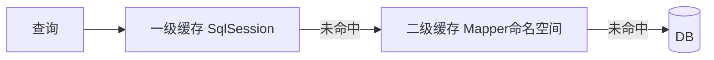

# 08 · 缓存机制

---

## 面试题

### Q1. 说说缓存机制？一级和二级区别？二级如何工作？

| | 一级缓存 | 二级缓存 |
| --- | --- | --- |
| 范围 | **同一个 SqlSession** | **同一个 namespace**（跨 Session） |
| 默认 | 开启 | 需配置开启 |
| 生命周期 | Session 关闭/提交/回滚等清空 | 应用级，可被写操作刷新 |
| 实现 | `BaseExecutor.localCache`（PerpetualCache） | `CachingExecutor` + `Cache` 装饰（可 LRU 等） |

**二级工作流程：**

1. 开 `cacheEnabled`，Mapper XML 配 `<cache/>`  
2. 查询：CachingExecutor 先查二缓 → 再一级 → DB  
3. 命中二缓需：两次 Session、同一 namespace、相同 key（statementId+参数+分页等）、且中间无该 namespace 的写（默认写会清缓存）  
4. 返回对象注意：**二缓存的是序列化或对象拷贝语义**，配置不当易脏读/同引用被改  

**坑：** 多表关联跨 namespace 时，一表更新不会自动清另一 namespace 缓存 → 脏数据。可用 `cache-ref` 或干脆不用二缓，改 Redis。

---

### Q2. 如何实现分布式环境下的二级缓存？

默认二缓是 **单机 JVM 内存**，多实例不共享。

**做法：**

1. 自定义 `Cache` 接口实现，底层 **Redis/Memcached**，在 `<cache type="xxx.RedisCache"/>` 挂上  
2. 或放弃 MyBatis 二缓，用业务/Spring Cache + Redis  
3. 注意序列化、过期、更新失效（按 key/namespace 删）、穿透击穿  

生产更常见：**一级靠 Session 生命周期；跨机用 Redis，而不是强开默认二缓。**

---

### Q3. 一级、二级用过吗？二级缓存场景？

模板：用过一级（同 Session 重复查自动命中）；二缓在只读字典表可开；订单等常变更、多表关联 **慎用或不用**，改集中式缓存。

---

## 关联

- [[02-执行流程与Mapper原理]] · [[06-Executor批处理主键]] · [[10-性能优化与排查]]
