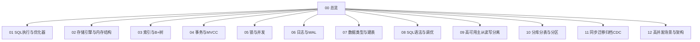

# MySQL · 知识总览

MySQL / InnoDB 面试专题（详细口述版）。查题见 [[13-题单总索引]]。

## 知识地图

## 建议精读顺序（面试权重）

1. **[[03-索引与B+树]] → [[04-事务与MVCC]] → [[06-日志与WAL]]**（区分度最高）  
2. [[01-SQL执行与优化器]] → [[05-锁与并发]] → [[02-存储引擎与内存结构]]  
3. [[08-SQL语法与调优]] → [[09-高可用主从读写分离]] → [[10-分库分表与分区]]  
4. [[07-数据类型与建表]] → [[11-同步迁移归档CDC]] → [[12-高并发场景与架构]]  

## 节点一览

| 节点 | 你会讲到 |
| --- | --- |
| [[01-SQL执行与优化器]] | 一条 SQL 全过程、排序、优化器、EXPLAIN、执行顺序、慢查询 |
| [[02-存储引擎与内存结构]] | InnoDB/MyISAM、Buffer Pool、Change/Doublewrite/Log Buffer、行格式 |
| [[03-索引与B+树]] | 类型、聚簇、回表、最左、覆盖、ICP、失效、容量估算 |
| [[04-事务与MVCC]] | ACID、隔离级别、MVCC、长事务、二阶段提交 |
| [[05-锁与并发]] | 锁类型、乐观悲观、死锁、锁竞争 |
| [[06-日志与WAL]] | redo/undo/binlog、WAL、崩溃恢复 |
| [[07-数据类型与建表]] | 范式、类型选型、金额、大字段、建表注意 |
| [[08-SQL语法与调优]] | JOIN/分页/count/EXISTS、调优经验 |
| [[09-高可用主从读写分离]] | 复制、延迟、GTID、多主、HA |
| [[10-分库分表与分区]] | 策略、实施、问题、分区表对比 |
| [[11-同步迁移归档CDC]] | 全量增量、CDC、不停服、批量、归档 |
| [[12-高并发场景与架构]] | 写入、倾斜、大表、一致性、监控 |
| [[13-题单总索引]] | 全量题对照 |
