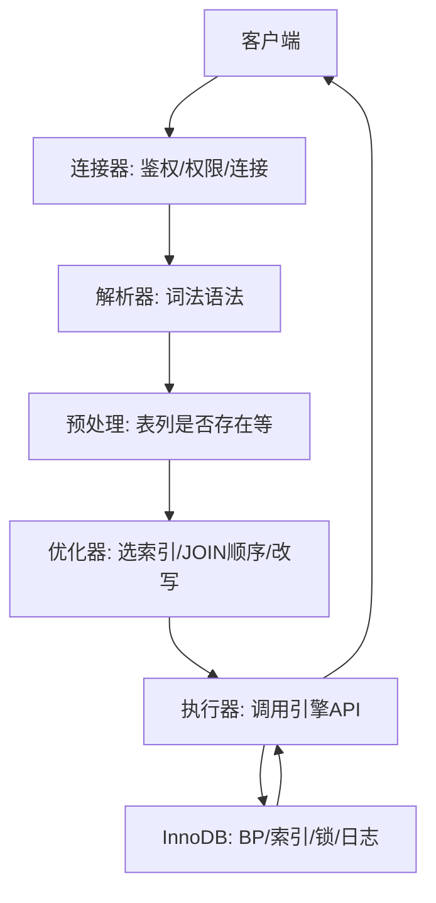

# 01 · SQL 执行与优化器（详解）

一条 SQL 从连接到返回，要按 **Server 层 → 优化器 → 执行器 → 引擎** 讲清楚，并挂上排序与慢查询排查。

---

## 面试题

### Q1. 详细描述一条 SQL 在 MySQL 中的执行过程



**分步口述：**

1. **连接器：** 账号密码、权限；连接断开策略；长连接注意会话内存  
2. **解析器：** 语法错在此暴露；生成 AST  
3. **预处理器 / 绑定：** 名字解析、打开表、权限再校验（阶段划分随版本略有出入）  
4. **优化器：** 代价模型选执行计划——是否用某索引、多表谁驱动、是否临时表/filesort、ICP/覆盖等  
5. **执行器：** 按计划循环调用存储引擎取行，处理 where/投影  
6. **存储引擎：** Buffer Pool 命中与否、索引定位、加锁、返回记录  

**写操作额外：** undo → 改页 → redo → 提交时 binlog 与 redo 两阶段。见 [[04-事务与MVCC]]、[[06-日志与WAL]]。

**注意：** MySQL 8.0 **已移除查询缓存**；老版本答「中间可能有 query cache」即可，并说明为何被弃用。

---

### Q2. SELECT 各子句逻辑执行顺序？

**书写顺序：**

```sql
SELECT … FROM … JOIN … ON … WHERE … GROUP BY … HAVING … ORDER BY … LIMIT …
```

**逻辑执行顺序（面试口径）：**

```text
FROM → ON → JOIN → WHERE → GROUP BY → HAVING → SELECT → DISTINCT → ORDER BY → LIMIT
```

含义：先确定行集并过滤，再聚合，再选列与去重，最后排序分页。  
因此 `WHERE` 不能引用 `SELECT` 别名；`HAVING` 可以过滤聚合结果。

---

### Q3. MySQL 中数据排序是怎么实现的？

`ORDER BY` / `GROUP BY` 可能触发排序：

1. **利用索引有序性：** 访问路径本身有序，可避免额外排序（`EXPLAIN` 无 `Using filesort`）  
2. **filesort：**  
   - 结果较小：在 `sort_buffer` 内存排  
   - 较大：分块排再归并，可能落 `tmpdir`  
3. **优先队列优化：** `ORDER BY … LIMIT n` 且 n 较小时，可用堆只保留前 n，减少全量排序成本  

**优化方向：** 让排序字段走索引；减小排序行宽度（避免选大 TEXT）；控制返回量。

---

### Q4. 查询优化器如何选择执行计划？

**代价优化（CBO）：** 估算扫描行数 × 访问代价 + CPU/临时表/排序代价，取较小者。

**输入信息：**

- 表统计、索引区分度、直方图（8.0）  
- 谓词选择性、是否可覆盖、JOIN 算法（主要 Nested Loop）  

**常见改写/策略：** 条件下推、子查询物化/转 JOIN、ICP、MRR、常量折叠等。

验证：`EXPLAIN`、`EXPLAIN ANALYZE`、`optimizer_trace`。

---

### Q5. 如何用 EXPLAIN 做查询分析？

**核心列：**

| 列 | 怎么读 |
| --- | --- |
| `id` | 越大越先执行（同 id 从上到下） |
| `select_type` | SIMPLE / SUBQUERY / DERIVED… |
| `type` | 从优到劣：`system > const > eq_ref > ref > range > index > ALL` |
| `possible_keys` / `key` | 候选 vs 实际 |
| `key_len` | 用了多长索引（联合索引用了几列可估） |
| `rows` | 估计扫描行 |
| `filtered` | 过滤后剩余比例 |
| `Extra` | `Using index` 覆盖；`Using filesort`；`Using temporary`；`Using index condition`；`Using where` |

**坏味道：** 大表 `ALL`、巨大 `rows`、`Using temporary`+`filesort` 叠加、明显该用的 `key` 为 NULL。

---

### Q6. 如何定位慢查询？这条 SQL 很慢你怎么分析？

**定位来源：**

- `slow_query_log` + `long_query_time`  
- `performance_schema` / `sys` schema  
- APM、云 DAS、中间件 SQL 审计  

**分析套路（场景题按序说）：**

1. 拿完整 SQL 与执行计划：`EXPLAIN ANALYZE`  
2. 是不是索引没命中/选错？最左、隐式转换、函数？  
3. 是不是回表过多、深分页 OFFSET、JOIN 放大？  
4. 是不是锁等待、磁盘 IO、BP 命中差、实例打满？  
5. 改写 / 加索引 / 归档 / 缓存 / 读写分离 —— 改完用慢日志与计划验证  

---

### Q7. 什么是索引？（引入）

帮助快速定位数据的结构；InnoDB 以 B+ 树为主。详细见 [[03-索引与B+树]]。

---

## 关联

- [[03-索引与B+树]] · [[08-SQL语法与调优]] · [[02-存储引擎与内存结构]]
