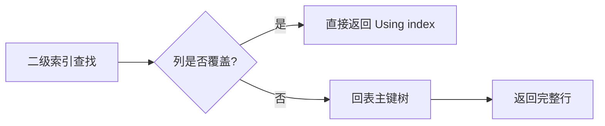

# 03 · 索引与 B+ 树（详解）

索引是 MySQL 面试区分度最高的一块：不只背名词，要能串 **「结构 → 回表/覆盖/ICP → 最左 → 失效 → EXPLAIN」**。

---

## 面试题

### Q1. MySQL 索引类型有哪些？什么是索引？

**索引：** 帮助快速定位行的数据结构，本质用空间和写成本换读性能。InnoDB 主结构是 **B+ 树**。

**按数据结构：**

| 类型 | 说明 |
| --- | --- |
| B+Tree | InnoDB 默认；等值、范围、排序、分组都友好 |
| Hash | Memory 引擎；InnoDB **自适应哈希**（内部，不能手工建）只适合等值 |
| Fulltext | 全文；InnoDB 5.6+ 支持 |
| RTree / Spatial | 空间索引 |

**按逻辑用途：**

- 主键索引（聚簇）、二级/辅助索引（非聚簇）  
- 唯一 / 普通 / 联合 / 前缀索引  
- **覆盖索引**：查询效果，不是单独文件格式  

口述补一句：**一张 InnoDB 表 = 一棵主键 B+ 树（叶子是行）+ 若干二级 B+ 树（叶子是「索引列+主键」）。**

---

### Q2. 聚簇索引 vs 非聚簇？为何聚簇快？没有主键怎么办？

| | 聚簇索引 | 非聚簇（二级）索引 |
| --- | --- | --- |
| 叶子存什么 | **整行数据** | 索引列值 + **主键值** |
| 一次查找 | 主键条件可直接定位行 | 常需再回主键树（回表） |
| 顺序 | 按主键物理/逻辑有序 | 按索引列有序 |

**为什么聚簇查询往往更快：**

1. 点查主键：树高次 IO 后叶子就是行，**少一次随机回表**  
2. 主键范围扫描：叶子页近似连续，顺序读友好  
3. 二级索引先找到一堆主键，再回表可能变成「随机 IO 风暴」  

**没有显式主键时 InnoDB：**

1. 选第一个 **NOT NULL UNIQUE** 索引当聚簇  
2. 都没有 → 生成隐藏 **DB_ROW_ID（6 字节）** 聚簇  

建议：业务表用短、稳、单调的主键（常见 `BIGINT` 自增或号段）；避免长 UUID 当主键导致页分裂与二级索引膨胀（二级叶子要存主键）。

---

### Q3. 回表是什么？覆盖索引是什么？二者如何配合优化？

**回表：** 在二级索引上定位到主键后，再拿主键去聚簇索引取完整行（或取二级索引没有的列）。

**覆盖索引：** `SELECT` 需要的列 **全部** 能从某个二级索引拿到，无需回表。`EXPLAIN Extra` 常见 `Using index`。

**优化口述：**

- 少写 `SELECT *`，按查询建联合索引让其覆盖  
- 例：常查 `WHERE user_id=?` 只要 `id,status` → 索引 `(user_id, status)` 或 `(user_id, status, id)`（主键本就会带）  
- 覆盖适合读多写少、列不太宽的场景；索引不能无限加列  

---

### Q4. 最左前缀匹配原则是什么？范围查询后为什么后面列用不上？

联合索引 `(a, b, c)` 排序规则等价于 `ORDER BY a, b, c`。

**能较好使用索引的条件形态：**

- `a = ?`  
- `a = ? AND b = ?`  
- `a = ? AND b = ? AND c = ?`  
- `a = ? AND b > ?`（a、b 可用；**c 通常无法用于索引查找**）  

**容易「只用到部分」：**

- `a = ? AND c = ?` → 一般只用 `a`（中间断了）  
- 只写 `b = ?` → 通常走不了该联合索引（无最左）  

**范围列之后：** B+ 树在 `b > 10` 之后对 `c` 不再有序（在满足 `b>10` 的区间内 `c` 乱序），所以优化器通常不再用 `c` 做索引条件（ICP 仍可能在索引元组上过滤 `c`，但是「过滤」不是「定位」）。

口误纠正：「最左」不是「只能用最左一列」，而是 **必须从左连续匹配**。

---

### Q5. 索引下推（ICP）是什么？和覆盖索引有何不同？

**Index Condition Pushdown（5.6+）：**  
把本来在 Server 层判断的、**与索引列相关的 WHERE 条件**，下推到引擎层，在 **二级索引记录** 上先过滤，通过后再回表。

`EXPLAIN Extra`: `Using index condition`。

| | 覆盖索引 | ICP |
| --- | --- | --- |
| 是否回表 | 不回表 | **仍可能回表**，但次数更少 |
| 核心收益 | 避免回表 IO | 减少「无效回表」 |
| Extra | Using index | Using index condition |

例子：索引 `(zipcode, age, name)`，条件 `zipcode=? AND age=? AND name LIKE '%xx%'`：  
先用 zip+age 定位范围，再在索引里用 name 过滤（ICP），最后才回表。

---

### Q6. 建索引要注意什么？何时不建？会失效吗？越多越好吗？

**创建原则（可当 checklist）：**

1. 区分度高（基数大）的列优先；联合索引把等值、高区分、常出现在 WHERE 的放左  
2. 覆盖高频查询；控制单表索引数量（经验常说别滥到十几根）  
3. 杜绝重复/冗余索引（如已有 `(a,b)` 再单独 `(a)` 要评估）  
4. 长 VARCHAR 用前缀索引或哈希方案，注意前缀区分度  
5. 最左匹配、避免索引列上函数与隐式转换  

**不建议建：**

- 读极少、写极多  
- 区分度极低（如性别）单独建索引收益差  
- 表极小，全表更快  
- 频繁更新的列上堆很多索引  

**常见失效/用不上：**

- `WHERE YEAR(col)=2024`、列上函数  
- 字符集/类型不一致导致隐式转换  
- `LIKE '%abc'` 前导模糊  
- 违反最左前缀  
- `OR` 一侧无索引，可能整体放弃  
- 优化器认为回表成本 > 全表（选择性差、统计不准）  

**不是越多越好：** 每条写都要维护所有索引；空间涨；优化器可选路径变多反而选错。

---

### Q7. 使用索引一定有效吗？如何排查效果？

**不一定。** 索引存在 ≠ 被选用 ≠ 一定更快。

**排查步骤：**

1. `EXPLAIN` / `EXPLAIN ANALYZE`：看 `type`、`key`、`rows`、`filtered`、`Extra`  
2. `SHOW INDEX` / 统计信息：`ANALYZE TABLE`；8.0 直方图  
3. 对比：去掉索引 / `FORCE INDEX` 看耗时与扫描行  
4. 慢日志确认真实执行，而不是只看「感觉」  
5. 看是否锁等待、是否主从延迟导致「慢」被误判  

---

### Q8. 为什么用 B+ 树？为什么不是红黑树？B+ 和 B 树区别？

**磁盘友好是第一原则：** 一次 IO 读一页（默认 16KB），希望 **树更矮、扇出更大**。

**B+ 优势：**

1. 非叶子只存键+子页指针 → 同样页能放下更多路 → **更矮**  
2. 叶子存行或（二级）主键，并用 **双向链表** 串起来 → 范围查询顺序扫叶子  
3. 查询路径稳定：总是走到叶子  

**为什么不是红黑树：** 红黑是二叉，百万数据高度约 20+，最坏接近一次一行随机 IO；适合内存结构，不适合磁盘索引主结构。

**B 树 vs B+：**

| | B 树 | B+ 树 |
| --- | --- | --- |
| 数据位置 | 非叶也可存 | **只在叶子** |
| 扇出 | 相对小 | 更大、更矮 |
| 范围查 | 中序在树里跳 | 叶子链表扫 |

---

### Q9. 请详细描述 B+ 树查询全过程；三层大约能存多少？

**主键点查：**

1. 从根页（常驻 Buffer Pool）开始  
2. 页内二分找到子页号，读下一层（未命中则磁盘 → BP）  
3. 重复直到叶子页，页内找到记录返回  

**二级索引点查非覆盖列：**

1. 二级 B+ 同样走到叶子，得到主键  
2. **回表** 再走一遍主键 B+  

**范围查询：** 找到叶子起点，沿叶子链表向后扫，直到不满足条件；二级范围可能带来大量回表 → 更要想覆盖或主键扫描。

**三层容量估算（面试标准算法）：**

设页 = 16KB。

- 非叶：主键 8B + 页指针约 6B ≈ 14B → 约 `16384/14 ≈ 1170` 扇出  
- 叶子：若平均行 1KB → 约 16 行/页  

则三层大约：

\[
1170 \times 1170 \times 16 \approx 2\times10^7
\]

约 **两千万行量级**；行更短（如 200B）可上亿。  
结论：高度通常不是瓶颈，**回表、过滤率、BP 命中、锁** 才是。

---

### Q10. 如何提升查询效率？（综合口述）

1. 合适索引 + 覆盖 + 避免失效  
2. 改写 SQL：深分页 seek、减少 `SELECT *`、控制 JOIN  
3. 表设计：类型、主键、冷热拆分、归档  
4. 实例：BP、IO、慢日志  
5. 架构：缓存、读写分离、分库分表  

细节见 [[08-SQL语法与调优]]、[[01-SQL执行与优化器]]。

---

## 关联

- [[01-SQL执行与优化器]] · [[02-存储引擎与内存结构]] · [[08-SQL语法与调优]]
