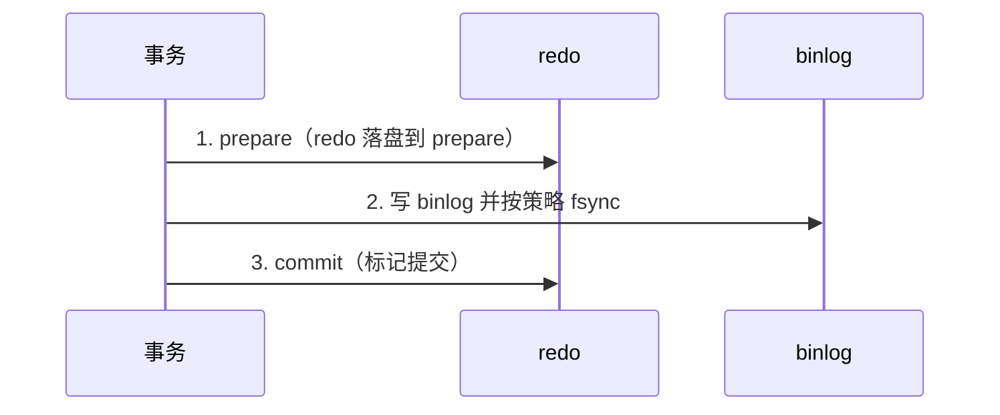

# 04 · 事务与 MVCC（详解）

事务题要把 **ACID ↔ undo/redo/锁/MVCC ↔ 隔离级别 ↔ 快照读/当前读** 串成一条链。

---

## 面试题

### Q1. MySQL 如何实现事务？ACID 各自靠什么？

InnoDB 事务不是「一个开关」，而是多组件协作：

| 特性 | 含义 | 主要实现 |
| --- | --- | --- |
| **Atomicity** | 全成或全撤 | **undo log** 回滚 |
| **Consistency** | 约束与业务不变量 | 原子+隔离+约束+应用正确性 |
| **Isolation** | 并发互不干扰到约定程度 | **锁 + MVCC** |
| **Durability** | 提交后掉电不丢 | **redo log**（+ doublewrite 等） |

提交还要保证 **redo 与 binlog 一致** → 内部 XA 式 **两阶段提交**。见 [[06-日志与WAL]]。

**一次更新的微观路径（口述）：**

1. 开事务，记 undo（旧值），方便回滚与 MVCC  
2. 改 Buffer Pool 中的数据页，写 redo（可先在 log buffer）  
3. 提交：redo prepare → 写 binlog → redo commit  
4. 脏页稍后刷盘；崩溃靠 redo 恢复  

---

### Q2. 隔离级别？脏读/不可重复读/幻读？默认？为什么？

**级别（弱→强）：**

1. **READ UNCOMMITTED**：可脏读  
2. **READ COMMITTED（RC）**：每次语句新快照；不可脏读，可不可重复读  
3. **REPEATABLE READ（RR）**：InnoDB **默认**；事务内快照读可重复；配合 Next-Key 抑制幻读  
4. **SERIALIZABLE**：更多锁，近似串行  

| 现象 | 定义 | 典型 |
| --- | --- | --- |
| 脏读 | 读到别的事务未提交修改 | RU |
| 不可重复读 | 同一行两次读到不同已提交值 | RC 下他事务 UPDATE |
| 幻读 | 范围结果集「多出行/少出行」 | 他事务 INSERT |

**InnoDB 对 RR 的加强：**

- **快照读**（普通 SELECT）：Read View，主要靠 MVCC，解决不可重复读；幻读在快照语义下也不见新插行  
- **当前读**（`FOR UPDATE` / UPDATE / DELETE）：加 **记录锁 + 间隙锁（Next-Key）**，阻止间隙插入，从而在当前读路径抑制幻读  

**默认 RR 的原因：** 对多数业务提供更强一致性体验，且快照读并发好。  
**有人改 RC：** 间隙锁更少，死锁率可能下降；接受「语句间可见性变化」。面试说清你们业务取舍即可。

---

### Q3. MVCC 是什么？Read View 怎么判可见？二级索引有快照吗？没有 MVCC 会怎样？

**MVCC = Multi-Version Concurrency Control：** 一行保留多个版本（当前页 + undo 链），读不加锁也能拿到「对自己可见」的版本。

**行隐藏列关键：**

- `DB_TRX_ID`：最后修改该行的事务 ID  
- `DB_ROLL_PTR`：指向 undo 中上一个版本  
- （无主键时还有 `DB_ROW_ID`）

**快照读 vs 当前读：**

| | 快照读 | 当前读 |
| --- | --- | --- |
| 语句 | 普通 SELECT | SELECT…FOR UPDATE / 锁读 / 改删 |
| 机制 | MVCC + Read View | 读最新版本并加锁 |
| 目的 | 读写并发 | 要最新并互斥 |

**Read View 可见性（口述版，不背源码细节）：**

创建视图时记录「活跃事务列表」等；判断某版本的 `trx_id`：

- 比自己还早且已提交 → 可见  
- 自己未开始就活跃、或未提交 → 不可见，沿 `roll_ptr` 找更旧版本  
- RC：每个 SELECT 新建 Read View；RR：事务中第一个快照读创建，后续复用（简化口径）

**二级索引有没有「MVCC 快照」？**

- 二级索引记录同样有删除标记/事务信息，可见性判断也会做  
- **不是**另建一套完整「二级快照库」；版本链主体仍在聚簇记录 + undo  
- 覆盖索引的快照读可以只扫二级；需要完整行仍回表，回表时再按可见性取版本  

**如果没有 MVCC：**

- 要隔离就只能靠锁：读阻塞写或写阻塞读，OLTP 并发崩  
- 或者牺牲隔离出现脏读  
→ MVCC 是 InnoDB 「读多写多」能扛住的核心。

---

### Q4. 长事务会导致哪些问题？如何治理？

1. **undo 不能 purge** → 历史版本膨胀，查询变慢、磁盘涨  
2. **锁持有时间长** → 阻塞、死锁概率升  
3. **binlog / 复制**：大事务导致主从延迟、切换风险  
4. **闪回、备份恢复** 变重；连接占用久  

**治理：** 业务拆短事务；禁止用户交互夹在事务中间；批量改分批提交；监控 `information_schema.innodb_trx` / `sys`；设置告警阈值。

---

### Q5. 事务的二阶段提交是什么？为什么需要？

目标：避免 **redo 与 binlog 不一致**（例如崩溃后引擎认为提交了但 binlog 没有 → 主从丢数；或反过来）。

崩溃恢复：

- 有完整 binlog 且 redo prepare → **提交**  
- 否则 **回滚**  

参数：`innodb_flush_log_at_trx_commit`、`sync_binlog` 影响「每次提交刷盘强度」与性能权衡（双 1 最安全）。

---

### Q6. 你们生产用什么隔离级别？为什么？

**模板答法：**

- 默认跟随 InnoDB：**RR**，业务要「同一事务多次读同一结果稳定」  
- 若观测到大量间隙锁死锁，且业务可接受语句间看见新提交，评估 **RC**，并保证关键更新靠 `WHERE` 版本号/主键精确命中  
- 无论哪级：短事务 + 合适索引 + 避免长间隙扫描更新  

---

## 关联

- [[05-锁与并发]] · [[06-日志与WAL]] · [[02-存储引擎与内存结构]]
