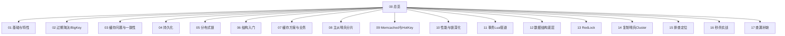

# Redis · 知识总览

按知识节点拆分复习。

## 知识地图

## 节点列表

| 节点 | 文件 | 主要内容 |
| --- | --- | --- |
| 01 | [[01-基础与特性]] | 是什么、单线程、为什么快、类型 |
| 02 | [[02-过期淘汰内存与BigKey]] | 过期、淘汰、BigKey |
| 03 | [[03-缓存问题与双写一致性]] | 穿透击穿雪崩、双写 |
| 04 | [[04-持久化]] | RDB/AOF |
| 05 | [[05-分布式锁]] | setnx、Redisson |
| 06 | [[06-持久化选型与底层结构入门]] | 选型、跳表压缩列表入门 |
| 07 | [[07-缓存方案与业务应用]] | 多级缓存、订单号、Caffeine |
| 08 | [[08-主从哨兵与分片集群]] | 主从、哨兵、分片、脑裂 |
| 09 | [[09-Memcached对比与HotKey]] | 对比、HotKey |
| 10 | [[10-性能碎片与锁深化]] | 性能、碎片、看门狗 |
| 11 | [[11-事务Lua管道与发布订阅]] | 事务、Lua、Pipeline、Pub/Sub |
| 12 | [[12-数据结构底层详解]] | SDS、ZSet、HLL、排行榜等 |
| 13 | [[13-RedLock与锁问题全集]] | 红锁、锁问题 |
| 14 | [[14-复制哨兵Cluster原理]] | 复制/哨兵/Cluster 原理 |
| 15 | [[15-内存排查与故障定位]] | 内存、QPS、分片 CPU、全量复制 |
| 16 | [[16-秒杀系统设计]] | 秒杀架构与防超卖（已重写） |
| 17 | [[17-查漏补缺]] | **缺口补充题**（RESP/Stream/MOVED/限流等） |

## 建议复习顺序

1. [[01-基础与特性]] → [[02-过期淘汰内存与BigKey]] → [[03-缓存问题与双写一致性]]  
2. [[04-持久化]] → [[17-查漏补缺]]（AOF 重写/COW）→ [[12-数据结构底层详解]]  
3. [[05-分布式锁]] → [[13-RedLock与锁问题全集]]  
4. [[08-主从哨兵与分片集群]] → [[14-复制哨兵Cluster原理]] → [[17-查漏补缺]]（MOVED/ASK）  
5. [[11-事务Lua管道与发布订阅]] → [[07-缓存方案与业务应用]] → [[16-秒杀系统设计]]  
6. [[09-Memcached对比与HotKey]] → [[15-内存排查与故障定位]]  

## 原有内容 vs 本轮补缺

| 已有较扎实 | 原缺口（已在 17 / 16 补） |
| --- | --- |
| 缓存三大问题、锁、哨兵集群、BigKey/HotKey、底层 ZSet/SDS | RESP、IO 多线程表述、渐进式 rehash |
| 事务/Lua/Pipeline | Stream vs Pub/Sub、Bitmap/GEO 场景 |
| 排查题较多 | AOF 重写、MOVED/ASK、跨槽限制 |
| 秒杀原文过碎 | 秒杀完整口述结构、限流/延迟队列/幂等 |
| | 安全 ACL、SCAN、慢查询、Jedis/Lettuce、键设计 |
